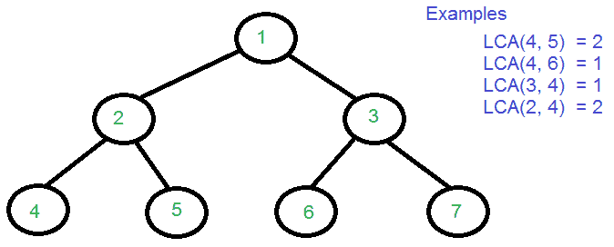

# 二叉树中最低的共同祖先|集合 3(使用 RMQ)

> 原文:[https://www . geeksforgeeks . org/最低-二叉树中的共同祖先-集合-3-使用-rmq/](https://www.geeksforgeeks.org/lowest-common-ancestor-in-a-binary-tree-set-3-using-rmq/)

给定一棵有根的树和树中的两个节点，找到这两个节点的最低公共祖先。两个节点 u 和 v 的 LCA 被定义为从根到 u 和 v 的祖先的最远节点。
先决条件: [LCA | SET 1](https://www.geeksforgeeks.org/lowest-common-ancestor-binary-tree-set-1/)



**上图示例:**

```
Input : 4 5
Output : 2

Input : 4 7
Output : 1
```

**将 LCA 转换为 RMQ(范围最小查询):**
取一个名为 E[]的数组，该数组存储 dfs 遍历的顺序，即 dfs 遍历过程中节点被覆盖的顺序。例如


上面给出的树的 dfs 遍历顺序是:1-2-4-2-5-2-1-3。
取另一个数组 L[]，其中 L[i]为节点 E[i]的级别。
和数组 H[]，它存储数组 E[]中第一个出现的第 I 个节点的索引。
所以，对于上面的树，
E[] = {1，2，4，2，5，2，1，3}
L[] = {1，2，3，2，3，2，1，2}
H[] = {0，1，7，2，4}
注意，数组 E 和 L 是基于一的索引，而数组 H 是基于零的索引。
现在，要找到 LCA(4，3)，首先，使用数组 H 并找到在 E 中找到 4 和 3 的索引，即 H[4]和 H[3]。所以，指数是 2 和 7。现在看子阵 L[2 : 7]，求这个子阵中的最小值为 1(在第 6 个索引处)，数组 E 中对应的元素即 E[6]就是 LCA(4，3)。
要理解这为什么管用，再拿 LCA(4，3)来说。从节点 4 到达节点 3 的路径是子阵列 E[2 : 7]。并且，如果在这条路径中有一个最低级别的节点，那么它可以简单地被称为 LCA(4，3)。
现在的问题是找到子阵 E 中的最小值[H[u]…。H[v]](假设 H[u] > = H[v])。并且，这可以使用段树或稀疏表来完成。下面是使用段树的代码。

## C++

```
// CPP code to find LCA of given
// two nodes in a tree
#include <bits/stdc++.h>

#define sz(x) x.size()
#define pb push_back
#define left 2 * i + 1
#define right 2 * i + 2
using namespace std;

const int maxn = 100005;

// the graph
vector<vector<int>> g(maxn);

// level of each node
int level[maxn];

vector<int> e;
vector<int> l;
int h[maxn];

// the segment tree
int st[5 * maxn];

// adding edges to the graph(tree)
void add_edge(int u, int v) {
  g[u].pb(v);
  g[v].pb(u);
}

// assigning level to nodes
void leveling(int src) {
  for (int i = 0; i < sz(g[src]); i++) {
    int des = g[src][i];
    if (!level[des]) {
      level[des] = level[src] + 1;
      leveling(des);
    }
  }
}

bool visited[maxn];

// storing the dfs traversal
// in the array e
void dfs(int src) {
  e.pb(src);
  visited[src] = 1;
  for (int i = 0; i < sz(g[src]); i++) {
    int des = g[src][i];
    if (!visited[des]) {
      dfs(des);
      e.pb(src);
    }
  }
}

// making the array l
void setting_l(int n) {
  for (int i = 0; i < sz(e); i++)
    l.pb(level[e[i]]);
}

// making the array h
void setting_h(int n) {
  for (int i = 0; i <= n; i++)
    h[i] = -1;
  for (int i = 0; i < sz(e); i++) {
    // if is already stored
    if (h[e[i]] == -1)
      h[e[i]] = i;
  }
}

// Range minimum query to return the index
// of minimum in the subarray L[qs:qe]
int RMQ(int ss, int se, int qs, int qe, int i) {
  if (ss > se)
    return -1;

  // out of range
  if (se < qs || qe < ss)
    return -1;

  // in the range
  if (qs <= ss && se <= qe)
    return st[i];

  int mid = (ss + se) >> 1;
  int st = RMQ(ss, mid, qs, qe, left);
  int en = RMQ(mid + 1, se, qs, qe, right);

  if (st != -1 && en != -1) {
    if (l[st] < l[en])
      return st;
    return en;
  } else if (st != -1)
    return st;
  else if (en != -1)
    return en;
}

// constructs the segment tree
void SegmentTreeConstruction(int ss, int se, int i) {
  if (ss > se)
    return;
  if (ss == se) // leaf
  {
    st[i] = ss;
    return;
  }
  int mid = (ss + se) >> 1;

  SegmentTreeConstruction(ss, mid, left);
  SegmentTreeConstruction(mid + 1, se, right);

  if (l[st[left]] < l[st[right]])
    st[i] = st[left];
  else
    st[i] = st[right];
}

// Function to get LCA
int LCA(int x, int y) {
  if (h[x] > h[y])
    swap(x, y);
  return e[RMQ(0, sz(l) - 1, h[x], h[y], 0)];
}

// Driver code
int main() {
  ios::sync_with_stdio(0);

  // n=number of nodes in the tree
  // q=number of queries to answer
  int n = 15, q = 5;

  // making the tree
  /*
                   1
                 / | \
                2  3  4
                   |   \
                   5    6
                 / |  \
               8   7    9 (right of 5)
                 / | \   | \
               10 11 12 13 14
                      |
                      15
  */
  add_edge(1, 2);
  add_edge(1, 3);
  add_edge(1, 4);
  add_edge(3, 5);
  add_edge(4, 6);
  add_edge(5, 7);
  add_edge(5, 8);
  add_edge(5, 9);
  add_edge(7, 10);
  add_edge(7, 11);
  add_edge(7, 12);
  add_edge(9, 13);
  add_edge(9, 14);
  add_edge(12, 15);

  level[1] = 1;
  leveling(1);

  dfs(1);

  setting_l(n);

  setting_h(n);

  SegmentTreeConstruction(0, sz(l) - 1, 0);

  cout << LCA(10, 15) << endl;
  cout << LCA(11, 14) << endl;

  return 0;
}
```

## Java 语言(一种计算机语言，尤用于创建网站)

```
// JAVA code to find LCA of given
// two nodes in a tree
import java.util.*;
public class GFG
{

  static int maxn = 100005;
  static  int left(int i)
  {
    return  (2 * i + 1);
  }
  static  int right(int i) { return 2 * i + 2;}

  // the graph
  static Vector<Integer> []g = new Vector[maxn];

  // level of each node
  static int []level = new int[maxn];
  static Vector<Integer> e = new Vector<>();
  static Vector<Integer> l= new Vector<>();
  static int []h = new int[maxn];

  // the segment tree
  static int []st = new int[5 * maxn];

  // adding edges to the graph(tree)
  static void add_edge(int u, int v)
  {
    g[u].add(v);
    g[v].add(u);
  }

  // assigning level to nodes
  static void levelling(int src)
  {
    for (int i = 0; i < (g[src].size()); i++)
    {
      int des = g[src].get(i);
      if (level[des] != 0)
      {
        level[des] = level[src] + 1;
        leveling(des);
      }
    }
  }

  static boolean []visited = new boolean[maxn];

  // storing the dfs traversal
  // in the array e
  static void dfs(int src)
  {
    e.add(src);
    visited[src] = true;
    for (int i = 0; i < (g[src]).size(); i++)
    {
      int des = g[src].get(i);
      if (!visited[des])
      {
        dfs(des);
        e.add(src);
      }
    }
  }

  // making the array l
  static void setting_l(int n)
  {
    for (int i = 0; i < e.size(); i++)
      l.add(level[e.get(i)]);
  }

  // making the array h
  static void setting_h(int n)
  {
    for (int i = 0; i <= n; i++)
      h[i] = -1;
    for (int i = 0; i < e.size(); i++)
    {

      // if is already stored
      if (h[e.get(i)] == -1)
        h[e.get(i)] = i;
    }
  }

  // Range minimum query to return the index
  // of minimum in the subarray L[qs:qe]
  static int RMQ(int ss, int se, int qs, int qe, int i)
  {
    if (ss > se)
      return -1;

    // out of range
    if (se < qs || qe < ss)
      return -1;

    // in the range
    if (qs <= ss && se <= qe)
      return st[i];

    int mid = (ss + se)/2 ;
    int st = RMQ(ss, mid, qs, qe, left(i));
    int en = RMQ(mid + 1, se, qs, qe, right(i));

    if (st != -1 && en != -1)
    {
      if (l.get(st) < l.get(en))
        return st;
      return en;
    } else if (st != -1)
      return st-2;
    else if (en != -1)
      return en-1;
    return 0;
  }

  // constructs the segment tree
  static void SegmentTreeConstruction(int ss,
                                      int se, int i)
  {
    if (ss > se)
      return;
    if (ss == se) // leaf
    {
      st[i] = ss;
      return;
    }
    int mid = (ss + se) /2;

    SegmentTreeConstruction(ss, mid, left(i));
    SegmentTreeConstruction(mid + 1, se, right(i));
    if (l.get(st[left(i)]) < l.get(st[right(i)]))
      st[i] = st[left(i)];
    else
      st[i] = st[right(i)];
  }

  // Function to get LCA
  static int LCA(int x, int y)
  {
    if (h[x] > h[y])
    {
      int t = x;
      x = y;
      y = t;
    }
    return e.get(RMQ(0, l.size() - 1, h[x], h[y], 0));
  }

  // Driver code
  public static void main(String[] args)
  {

    // n=number of nodes in the tree
    // q=number of queries to answer
    int n = 15, q = 5;
    for (int i = 0; i < g.length; i++)
      g[i] = new Vector<Integer>();

    // making the tree
    /*
                   1
                 / | \
                2  3  4
                   |   \
                   5    6
                 / |  \
               8   7    9 (right of 5)
                 / | \   | \
               10 11 12 13 14
                      |
                      15
  */
    add_edge(1, 2);
    add_edge(1, 3);
    add_edge(1, 4);
    add_edge(3, 5);
    add_edge(4, 6);
    add_edge(5, 7);
    add_edge(5, 8);
    add_edge(5, 9);
    add_edge(7, 10);
    add_edge(7, 11);
    add_edge(7, 12);
    add_edge(9, 13);
    add_edge(9, 14);
    add_edge(12, 15);
    level[1] = 1;
    leveling(1);
    dfs(1);
    setting_l(n);
    setting_h(n);
    SegmentTreeConstruction(0, l.size() - 1, 0);
    System.out.print(LCA(10, 15) +"\n");
    System.out.print(LCA(11, 14) +"\n");
  }
}

// This code is contributed by Rajput-Ji
```

## 蟒蛇 3

```
# Python code to find LCA of given
# two nodes in a tree

maxn = 100005

# the graph
g = [[] for i in range(maxn)]

# level of each node
level = [0] * maxn

e = []
l = []
h = [0] * maxn

# the segment tree
st = [0] * (5 * maxn)

# adding edges to the graph(tree)
def add_edge(u: int, v: int):
    g[u].append(v)
    g[v].append(u)

# assigning level to nodes
def levelling(src: int):
    for i in range(len(g[src])):
        des = g[src][i]
        if not level[des]:
            level[des] = level[src] + 1
            leveling(des)

visited = [False] * maxn

# storing the dfs traversal
# in the array e
def dfs(src: int):
    e.append(src)
    visited[src] = True
    for i in range(len(g[src])):
        des = g[src][i]
        if not visited[des]:
            dfs(des)
            e.append(src)

# making the array l
def setting_l(n: int):
    for i in range(len(e)):
        l.append(level[e[i]])

# making the array h
def setting_h(n: int):
    for i in range(n + 1):
        h[i] = -1
    for i in range(len(e)):

        # if is already stored
        if h[e[i]] == -1:
            h[e[i]] = i

# Range minimum query to return the index
# of minimum in the subarray L[qs:qe]
def RMQ(ss: int, se: int, qs: int, qe: int, i: int) -> int:
    global st
    if ss > se:
        return -1

    # out of range
    if se < qs or qe < ss:
        return -1

    # in the range
    if qs <= ss and se <= qe:
        return st[i]

    mid = (se + ss) >> 1
    stt = RMQ(ss, mid, qs, qe, 2 * i + 1)
    en = RMQ(mid + 1, se, qs, qe, 2 * i + 2)

    if stt != -1 and en != -1:
        if l[stt] < l[en]:
            return stt
        return en
    elif stt != -1:
        return stt
    elif en != -1:
        return en

# constructs the segment tree
def segmentTreeConstruction(ss: int, se: int, i: int):
    if ss > se:
        return
    if ss == se: # leaf
        st[i] = ss
        return

    mid = (ss + se) >> 1
    segmentTreeConstruction(ss, mid, 2 * i + 1)
    segmentTreeConstruction(mid + 1, se, 2 * i + 2)

    if l[st[2 * i + 1]] < l[st[2 * i + 2]]:
        st[i] = st[2 * i + 1]
    else:
        st[i] = st[2 * i + 2]

# Function to get LCA
def LCA(x: int, y: int) -> int:
    if h[x] > h[y]:
        x, y = y, x
    return e[RMQ(0, len(l) - 1, h[x], h[y], 0)]

# Driver Code
if __name__ == "__main__":

    # n=number of nodes in the tree
    # q=number of queries to answer
    n = 15
    q = 5

    # making the tree
    # /*
    #         1
    #     / | \
    #     2 3 4
    #         | \
    #         5 6
    #     / | \
    #     8 7 9 (right of 5)
    #     / | \ | \
    #     10 11 12 13 14
    #             |
    #             15
    # */
    add_edge(1, 2)
    add_edge(1, 3)
    add_edge(1, 4)
    add_edge(3, 5)
    add_edge(4, 6)
    add_edge(5, 7)
    add_edge(5, 8)
    add_edge(5, 9)
    add_edge(7, 10)
    add_edge(7, 11)
    add_edge(7, 12)
    add_edge(9, 13)
    add_edge(9, 14)
    add_edge(12, 15)

    level[1] = 1
    leveling(1)
    dfs(1)
    setting_l(n)
    setting_h(n)

    segmentTreeConstruction(0, len(l) - 1, 0)

    print(LCA(10, 15))
    print(LCA(11, 14))

# This code is contributed by
# sanjeev2552
```

## C#

```
// C# code to find LCA of given
// two nodes in a tree
using System;
using System.Collections.Generic;
public class GFG
{
  static int maxn = 100005;
  static  int left(int i)
  {
    return  (2 * i + 1);
  }
  static  int right(int i) { return 2 * i + 2;}

  // the graph
  static List<int> []g = new List<int>[maxn];

  // level of each node
  static int []level = new int[maxn];
  static List<int> e = new List<int>();
  static List<int> l= new List<int>();
  static int []h = new int[maxn];

  // the segment tree
  static int []st;

  // adding edges to the graph(tree)
  static void add_edge(int u, int v)
  {
    g[u].Add(v);
    g[v].Add(u);
  }

  // assigning level to nodes
  static void leveling(int src)
  {
    for (int i = 0; i < (g[src].Count); i++)
    {
      int des = g[src][i];
      if (level[des] != 0)
      {
        level[des] = level[src] + 1;
        leveling(des);
      }
    }
  }
  static bool []visited = new bool[maxn];

  // storing the dfs traversal
  // in the array e
  static void dfs(int src)
  {
    e.Add(src);
    visited[src] = true;
    for (int i = 0; i < (g[src]).Count; i++)
    {
      int des = g[src][i];
      if (!visited[des])
      {
        dfs(des);
        e.Add(src);
      }
    }
  }

  // making the array l
  static void setting_l(int n)
  {
    for (int i = 0; i < e.Count; i++)
      l.Add(level[e[i]]);
  }

  // making the array h
  static void setting_h(int n)
  {
    for (int i = 0; i <= n; i++)
      h[i] = -1;
    for (int i = 0; i < e.Count; i++)
    {

      // if is already stored
      if (h[e[i]] == -1)
        h[e[i]] = i;
    }
  }

  // Range minimum query to return the index
  // of minimum in the subarray L[qs:qe]
  static int RMQ(int ss, int se, int qs, int qe, int i)
  {
    if (ss > se)
      return -1;

    // out of range
    if (se < qs || qe < ss)
      return -1;

    // in the range
    if (qs <= ss && se <= qe)
      return st[i];

    int mid = (ss + se)/2 ;
    int sti = RMQ(ss, mid, qs, qe, left(i));
    int en = RMQ(mid + 1, se, qs, qe, right(i));

    if (sti != -1 && en != -1)
    {
      if (l[sti] < l[en])
        return sti;
      return en;
    } else if (sti != -1)
      return sti-2;
    else if (en != -1)
      return en-1;
    return 0;
  }

  // constructs the segment tree
  static void SegmentTreeConstruction(int ss,
                                      int se, int i)
  {
    if (ss > se)
      return;
    if (ss == se) // leaf
    {
      st[i] = ss;
      return;
    }
    int mid = (ss + se) /2;

    SegmentTreeConstruction(ss, mid, left(i));
    SegmentTreeConstruction(mid + 1, se, right(i));
    if (l[st[left(i)]] < l[st[right(i)]])
      st[i] = st[left(i)];
    else
      st[i] = st[right(i)];
  }

  // Function to get LCA
  static int LCA(int x, int y)
  {
    if (h[x] > h[y])
    {
      int t = x;
      x = y;
      y = t;
    }
    return e[RMQ(0, l.Count - 1, h[x], h[y], 0)];
  }

  // Driver code
  public static void Main(String[] args)
  {
    st = new int[5 * maxn];

    // n=number of nodes in the tree
    // q=number of queries to answer
    int n = 15;
    for (int i = 0; i < g.Length; i++)
      g[i] = new List<int>();

    // making the tree
    /*
                   1
                 / | \
                2  3  4
                   |   \
                   5    6
                 / |  \
               8   7    9 (right of 5)
                 / | \   | \
               10 11 12 13 14
                      |
                      15
  */
    add_edge(1, 2);
    add_edge(1, 3);
    add_edge(1, 4);
    add_edge(3, 5);
    add_edge(4, 6);
    add_edge(5, 7);
    add_edge(5, 8);
    add_edge(5, 9);
    add_edge(7, 10);
    add_edge(7, 11);
    add_edge(7, 12);
    add_edge(9, 13);
    add_edge(9, 14);
    add_edge(12, 15);
    level[1] = 1;
    leveling(1);
    dfs(1);
    setting_l(n);
    setting_h(n);
    SegmentTreeConstruction(0, l.Count - 1, 0);
    Console.Write(LCA(10, 15) +"\n");
    Console.Write(LCA(11, 14) +"\n");
  }
}

// This code is contributed by gauravrajput1
```

## java 描述语言

```
<script>

    // JavaScript code to find LCA of given
    // two nodes in a tree

    let maxn = 100005;
    function left(i)
    {
      return  (2 * i + 1);
    }
    function right(i) { return 2 * i + 2;}

    // the graph
    let g = new Array(maxn);

    // level of each node
    let level = new Array(maxn);
    level.fill(0);
    let e = [];
    let l= [];
    let h = new Array(maxn);
    h.fill(0);

    // the segment tree
    let st = new Array(5 * maxn);
    st.fill(0);

    // adding edges to the graph(tree)
    function add_edge(u, v)
    {
      g[u].push(v);
      g[v].push(u);
    }

    // assigning level to nodes
    function levelling(src)
    {
      for (let i = 0; i < (g[src].length); i++)
      {
        let des = g[src][i];
        if (level[des] != 0)
        {
          level[des] = level[src] + 1;
          levelling(des);
        }
      }
    }

    let visited = new Array(maxn);
    visited.fill(false);

    // storing the dfs traversal
    // in the array e
    function dfs(src)
    {
      e.push(src);
      visited[src] = true;
      for (let i = 0; i < (g[src]).length; i++)
      {
        let des = g[src][i];
        if (!visited[des])
        {
          dfs(des);
          e.push(src);
        }
      }
    }

    // making the array l
    function setting_l(n)
    {
      for (let i = 0; i < e.length; i++)
        l.push(level[e[i]]);
    }

    // making the array h
    function setting_h(n)
    {
      for (let i = 0; i <= n; i++)
        h[i] = -1;
      for (let i = 0; i < e.length; i++)
      {

        // if is already stored
        if (h[e[i]] == -1)
          h[e[i]] = i;
      }
    }

    // Range minimum query to return the index
    // of minimum in the subarray L[qs:qe]
    function RMQ(ss, se, qs, qe, i)
    {
      if (ss > se)
        return -1;

      // out of range
      if (se < qs || qe < ss)
        return -1;

      // in the range
      if (qs <= ss && se <= qe)
        return st[i];

      let mid = parseInt((ss + se)/2 , 10);
      let St = RMQ(ss, mid, qs, qe, left(i));
      let en = RMQ(mid + 1, se, qs, qe, right(i));

      if (St != -1 && en != -1)
      {
        if (l[St] < l[en])
          return St;
        return en;
      } else if (St != -1)
        return St-2;
      else if (en != -1)
        return en-1;
      return 0;
    }

    // constructs the segment tree
    function SegmentTreeConstruction(ss, se, i)
    {
      if (ss > se)
        return;
      if (ss == se) // leaf
      {
        st[i] = ss;
        return;
      }
      let mid = parseInt((ss + se) /2, 10);

      SegmentTreeConstruction(ss, mid, left(i));
      SegmentTreeConstruction(mid + 1, se, right(i));
      if (l[st[left(i)]] < l[st[right(i)]])
        st[i] = st[left(i)];
      else
        st[i] = st[right(i)];
    }

    // Function to get LCA
    function LCA(x, y)
    {
      if (h[x] > h[y])
      {
        let t = x;
        x = y;
        y = t;
      }
      return e[RMQ(0, l.length - 1, h[x], h[y], 0)];
    }

    // n=number of nodes in the tree
    // q=number of queries to answer
    let n = 15, q = 5;
    for (let i = 0; i < g.length; i++)
      g[i] = [];

    // making the tree
    /*
                   1
                 / | \
                2  3  4
                   |   \
                   5    6
                 / |  \
               8   7    9 (right of 5)
                 / | \   | \
               10 11 12 13 14
                      |
                      15
  */
    add_edge(1, 2);
    add_edge(1, 3);
    add_edge(1, 4);
    add_edge(3, 5);
    add_edge(4, 6);
    add_edge(5, 7);
    add_edge(5, 8);
    add_edge(5, 9);
    add_edge(7, 10);
    add_edge(7, 11);
    add_edge(7, 12);
    add_edge(9, 13);
    add_edge(9, 14);
    add_edge(12, 15);
    level[1] = 1;
    levelling(1);
    dfs(1);
    setting_l(n);
    setting_h(n);
    SegmentTreeConstruction(0, l.length - 1, 0);
    document.write(LCA(10, 15) +"</br>");
    document.write(LCA(11, 14) +"</br>");

</script>
```

**Output:** 

```
7
5
```

**时间复杂度:**
定义的数组存储在 O(n)中。段树的构建也需要 O(n)个时间。LCA 函数调用 RMQ 函数，该函数对每个查询取 0(logn)(因为它使用了段树)。所以整体时间复杂度是 **O(n + q * logn)** 。