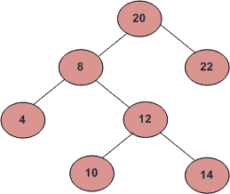

# 父数组表示中最低的公共祖先

> 原文:[https://www . geeksforgeeks . org/最低共同祖先在父数组中的表示/](https://www.geeksforgeeks.org/lowest-common-ancestor-in-parent-array-representation/)

给定一个表示为父数组的二叉树，找到两个节点“m”和“n”之间的最低公共祖先。



在上图中，10 和 14 的 LCA 是 12，10 和 12 的 LCA 是 12。

(1)制作一个父数组，并将第一个节点的父存储在其中。根节点的父节点应为-1。
(2)现在，访问从所需节点“m”到根节点的所有节点，并将它们标记为已访问。
(3)最后，从期望节点‘n’访问所有节点，直到第一个被访问节点到来。
(4)该节点为最低共同祖先

## C++

```
// CPP program to find LCA in a tree represented
// as parent array.
#include <bits/stdc++.h>
using namespace std;

// Maximum value in a node
const int MAX = 1000;

// Function to find the Lowest common ancestor
int findLCA(int n1, int n2, int parent[])
{
    // Create a visited vector and mark
    // all nodes as not visited.
    vector<bool> visited(MAX, false);

    visited[n1] = true;

    // Moving from n1 node till root and
    // mark every accessed node as visited
    while (parent[n1] != -1) {
        visited[n1] = true;

        // Move to the parent of node n1
        n1 = parent[n1];
    }

    visited[n1] = true;

    // For second node finding the first
    // node common
    while (!visited[n2])
        n2 = parent[n2];

    return n2;
}

// Insert function for Binary tree
void insertAdj(int parent[], int i, int j)
{
    parent[i] = j;
}

// Driver Function
int main()
{
    // Maximum capacity of binary tree
    int parent[MAX];

    // Root marked
    parent[20] = -1;
    insertAdj(parent, 8, 20);
    insertAdj(parent, 22, 20);
    insertAdj(parent, 4, 8);
    insertAdj(parent, 12, 8);
    insertAdj(parent, 10, 12);
    insertAdj(parent, 14, 12);

    cout << findLCA(10, 14, parent);

    return 0;
}
```

## Java 语言(一种计算机语言，尤用于创建网站)

```
// Java program to find LCA in a tree represented
// as parent array.
import java.util.*;

class GFG
{

// Maximum value in a node
static int MAX = 1000;

// Function to find the Lowest common ancestor
static int findLCA(int n1, int n2, int parent[])
{
    // Create a visited vector and mark
    // all nodes as not visited.
    boolean []visited = new boolean[MAX];

    visited[n1] = true;

    // Moving from n1 node till root and
    // mark every accessed node as visited
    while (parent[n1] != -1)
    {
        visited[n1] = true;

        // Move to the parent of node n1
        n1 = parent[n1];
    }

    visited[n1] = true;

    // For second node finding the first
    // node common
    while (!visited[n2])
        n2 = parent[n2];

    return n2;
}

// Insert function for Binary tree
static void insertAdj(int parent[], int i, int j)
{
    parent[i] = j;
}

// Driver Function
public static void main(String[] args)
{
    // Maximum capacity of binary tree
    int []parent = new int[MAX];

    // Root marked
    parent[20] = -1;
    insertAdj(parent, 8, 20);
    insertAdj(parent, 22, 20);
    insertAdj(parent, 4, 8);
    insertAdj(parent, 12, 8);
    insertAdj(parent, 10, 12);
    insertAdj(parent, 14, 12);

    System.out.println(findLCA(10, 14, parent));
}
}

// This code is contributed by 29AjayKumar
```

## 蟒蛇 3

```
# Python 3 program to find LCA in a
# tree represented as parent array.

# Maximum value in a node
MAX = 1000

# Function to find the Lowest
# common ancestor
def findLCA(n1, n2, parent):

    # Create a visited vector and mark
    # all nodes as not visited.
    visited = [False for i in range(MAX)]

    visited[n1] = True

    # Moving from n1 node till root and
    # mark every accessed node as visited
    while (parent[n1] != -1):
        visited[n1] = True

        # Move to the parent of node n1
        n1 = parent[n1]

    visited[n1] = True

    # For second node finding the
    # first node common
    while (visited[n2] == False):
        n2 = parent[n2]

    return n2

# Insert function for Binary tree
def insertAdj(parent, i, j):
    parent[i] = j

# Driver Code
if __name__ =='__main__':

    # Maximum capacity of binary tree
    parent = [0 for i in range(MAX)]

    # Root marked
    parent[20] = -1
    insertAdj(parent, 8, 20)
    insertAdj(parent, 22, 20)
    insertAdj(parent, 4, 8)
    insertAdj(parent, 12, 8)
    insertAdj(parent, 10, 12)
    insertAdj(parent, 14, 12)

    print(findLCA(10, 14, parent))

# This code is contributed by
# Surendra_Gangwar
```

## C#

```
// C# program to find LCA in a tree represented
// as parent array.
using System;

class GFG
{

// Maximum value in a node
static int MAX = 1000;

// Function to find the Lowest common ancestor
static int findLCA(int n1, int n2, int []parent)
{
    // Create a visited vector and mark
    // all nodes as not visited.
    Boolean []visited = new Boolean[MAX];

    visited[n1] = true;

    // Moving from n1 node till root and
    // mark every accessed node as visited
    while (parent[n1] != -1)
    {
        visited[n1] = true;

        // Move to the parent of node n1
        n1 = parent[n1];
    }

    visited[n1] = true;

    // For second node finding the first
    // node common
    while (!visited[n2])
        n2 = parent[n2];

    return n2;
}

// Insert function for Binary tree
static void insertAdj(int []parent, int i, int j)
{
    parent[i] = j;
}

// Driver Code
public static void Main(String[] args)
{
    // Maximum capacity of binary tree
    int []parent = new int[MAX];

    // Root marked
    parent[20] = -1;
    insertAdj(parent, 8, 20);
    insertAdj(parent, 22, 20);
    insertAdj(parent, 4, 8);
    insertAdj(parent, 12, 8);
    insertAdj(parent, 10, 12);
    insertAdj(parent, 14, 12);

    Console.WriteLine(findLCA(10, 14, parent));
}
}

// This code is contributed by 29AjayKumar
```

## java 描述语言

```
<script>
// Javascript program to find LCA in a tree represented
// as parent array.

// Maximum value in a node
const MAX = 1000;

// Function to find the Lowest common ancestor
function findLCA(n1, n2, parent) {
    // Create a visited vector and mark
    // all nodes as not visited.
    let visited = new Array(MAX).fill(false);

    visited[n1] = true;

    // Moving from n1 node till root and
    // mark every accessed node as visited
    while (parent[n1] != -1) {
        visited[n1] = true;

        // Move to the parent of node n1
        n1 = parent[n1];
    }

    visited[n1] = true;

    // For second node finding the first
    // node common
    while (!visited[n2])
        n2 = parent[n2];

    return n2;
}

// Insert function for Binary tree
function insertAdj(parent, i, j) {
    parent[i] = j;
}

// Driver Function

// Maximum capacity of binary tree
let parent = new Array(MAX);

// Root marked
parent[20] = -1;
insertAdj(parent, 8, 20);
insertAdj(parent, 22, 20);
insertAdj(parent, 4, 8);
insertAdj(parent, 12, 8);
insertAdj(parent, 10, 12);
insertAdj(parent, 14, 12);

document.write(findLCA(10, 14, parent));

// This code is contributed by _saurabh_jaiswal.
</script>
```

**时间复杂度**–上述算法的时间复杂度为 O(log n)，因为它在搜索时需要 O(log n)的时间。