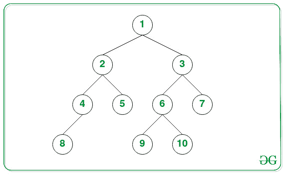
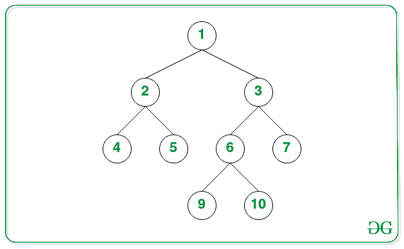

# 二叉树最深叶的最低共同祖先

> 原文:[https://www . geesforgeks . org/二叉树最深叶的最低共同祖先/](https://www.geeksforgeeks.org/lowest-common-ancestor-of-the-deepest-leaves-of-a-binary-tree/)

给定由具有不同于范围**【1，N】**的值的 **N** 节点组成的[二叉树](https://www.geeksforgeeks.org/binary-tree-data-structure/)，任务是找到二叉树的**最深叶**的[最低共同祖先](https://www.geeksforgeeks.org/lowest-common-ancestor-binary-tree-set-1/)。

**示例:**

> **输入:**
> 
> 
> 
> **输出:** 1
> **说明:**树最深的叶节点是{8，9，10}。这些节点的最低公共祖先是 1。
> 
> **输入:**
> 
> 
> 
> **输出:** 6

**方法:**给定的问题可以通过[找到树的最大深度](https://www.geeksforgeeks.org/write-a-c-program-to-find-the-maximum-depth-or-height-of-a-tree/)然后执行 [DFS 遍历](https://www.geeksforgeeks.org/depth-first-search-or-dfs-for-a-graph/)到[找到最低的共同祖先](https://www.geeksforgeeks.org/lowest-common-ancestor-in-a-binary-search-tree/)来解决。按照以下步骤解决问题:

*   [找到二叉树的最大深度](https://www.geeksforgeeks.org/write-a-c-program-to-find-the-maximum-depth-or-height-of-a-tree/)并将其存储在变量中，比如**深度**。
*   声明一个[函数](https://www.geeksforgeeks.org/functions-in-c/)说 **DFS(根，curr)** 在**深度**级找到节点的 [LCS](https://www.geeksforgeeks.org/printing-longest-common-subsequence/) :
    *   如果**根**为**空**，则返回**空**。
    *   如果 **curr** 的值等于**深度**，则返回当前节点。
    *   递归调用左边的子树作为 **DFS(root⇾left，curr + 1)** ，并将返回值存储在一个变量中，比如**左边的**。
    *   递归调用右边的子树作为 **DFS(root⇾right，curr + 1)** ，并将返回值存储在一个变量中，比如**右边的**。
    *   如果**左边**和**右边**的值都是**不为空**，那么返回当前节点，因为当前节点是最低的共同祖先。
    *   如果**左侧**为**非空**，则返回**左侧**。否则，返回**右侧**。
*   完成上述步骤后，打印函数调用 **DFS(root，0)** 返回的值。

下面是上述方法的实现:

## C++

```
// C++ program for the above approach

#include <bits/stdc++.h>
using namespace std;

// Node of a Binary Tree
struct Node {
    struct Node* left;
    struct Node* right;
    int data;
};

// Function to create
// a new tree Node
Node* newNode(int key)
{
    Node* temp = new Node;
    temp->data = key;
    temp->left = temp->right = NULL;
    return temp;
}

// Function to find the depth
// of the Binary Tree
int finddepth(Node* root)
{
    // If root is not null
    if (!root)
        return 0;

    // Left recursive subtree
    int left = finddepth(root->left);

    // Right recursive subtree
    int right = finddepth(root->right);

    // Returns the maximum depth
    return 1 + max(left, right);
}

// Function to perform the depth
// first search on the binary tree
Node* dfs(Node* root, int curr,
          int depth)
{
    // If root is null
    if (!root)
        return NULL;

    // If curr is equal to depth
    if (curr == depth)
        return root;

    // Left recursive subtree
    Node* left = dfs(root->left,
                     curr + 1, depth);

    // Right recursive subtree
    Node* right = dfs(root->right,
                      curr + 1, depth);

    // If left and right are not null
    if (left != NULL && right != NULL)
        return root;

    // Return left, if left is not null
    // Otherwise return right
    return left ? left : right;
}

// Function to find the LCA of the
// deepest nodes of the binary tree
Node* lcaOfDeepestLeaves(Node* root)
{
    // If root is null
    if (!root)
        return NULL;

    // Stores the deepest depth
    // of the binary tree
    int depth = finddepth(root) - 1;

    // Return the LCA of the
    // nodes at level depth
    return dfs(root, 0, depth);
}

// Driver Code
int main()
{
    // Given Binary Tree
    Node* root = newNode(1);
    root->left = newNode(2);
    root->right = newNode(3);
    root->left->left = newNode(4);
    root->left->right = newNode(5);
    root->right->left = newNode(6);
    root->right->right = newNode(7);
    root->right->left->left = newNode(8);
    root->right->left->right = newNode(9);

    cout << lcaOfDeepestLeaves(root)->data;

    return 0;
}
```

## Java 语言(一种计算机语言，尤用于创建网站)

```
// Java program for the above approach

// Node of a Binary Tree
class Node
{
    Node left = null;
    Node right = null;
    int data;

    Node(int data)
    {
        this.data = data;
    }
}

class GFG{

// Function to find the depth
// of the Binary Tree
public static int findDepth(Node root)
{

    // If root is not null
    if (root == null)
        return 0;

    // Left recursive subtree
    int left = findDepth(root.left);

    // Right recursive subtree
    int right = findDepth(root.right);

    // Returns the maximum depth
    return 1 + Math.max(left, right);
}

// Function to perform the depth
// first search on the binary tree
public static Node DFS(Node root, int curr,
                                  int depth)
{

    // If root is null
    if (root == null)
        return null;

    // If curr is equal to depth
    if (curr == depth)
        return root;

    // Left recursive subtree
    Node left = DFS(root.left, curr + 1, depth);

    // Right recursive subtree
    Node right = DFS(root.right, curr + 1, depth);

    // If left and right are not null
    if (left != null && right != null)
        return root;

    // Return left, if left is not null
    // Otherwise return right
    return (left != null) ? left : right;
}

// Function to find the LCA of the
// deepest nodes of the binary tree
public static Node lcaOfDeepestLeaves(Node root)
{

    // If root is null
    if (root == null)
        return null;

    // Stores the deepest depth
    // of the binary tree
    int depth = findDepth(root) - 1;

    // Return the LCA of the
    // nodes at level depth
    return DFS(root, 0, depth);
}

// Driver code
public static void main(String[] args)
{

    // Given Binary Tree
    Node root = new Node(1);
    root.left = new Node(2);
    root.right = new Node(3);
    root.left.left = new Node(4);
    root.left.right = new Node(5);
    root.right.left = new Node(6);
    root.right.right = new Node(7);
    root.right.left.left = new Node(8);
    root.right.left.right = new Node(9);

    System.out.println(lcaOfDeepestLeaves(root).data);
}
}

// This code is contributed by girishthatte
```

## 蟒蛇 3

```
# Python3 program for the above approach

# Node of a Binary Tree
class Node:
    def __init__(self, d):
        self.data = d
        self.left = None
        self.right = None

# Function to find the depth
# of the Binary Tree
def finddepth(root):
    # If root is not null
    if (not root):
        return 0

    # Left recursive subtree
    left = finddepth(root.left)

    # Right recursive subtree
    right = finddepth(root.right)

    # Returns the maximum depth
    return 1 + max(left, right)

# Function to perform the depth
# first search on the binary tree
def dfs(root, curr, depth):
    # If root is null
    if (not root):
        return None

    # If curr is equal to depth
    if (curr == depth):
        return root

    # Left recursive subtree
    left = dfs(root.left, curr + 1, depth)

    # Right recursive subtree
    right = dfs(root.right, curr + 1, depth)

    # If left and right are not null
    if (left != None and right != None):
        return root

    # Return left, if left is not null
    # Otherwise return right
    return left if left else right

# Function to find the LCA of the
# deepest nodes of the binary tree
def lcaOfDeepestLeaves(root):

    # If root is null
    if (not root):
        return None

    # Stores the deepest depth
    # of the binary tree
    depth = finddepth(root) - 1

    # Return the LCA of the
    # nodes at level depth
    return dfs(root, 0, depth)

# Driver Code
if __name__ == '__main__':

    # Given Binary Tree
    root = Node(1)
    root.left = Node(2)
    root.right = Node(3)
    root.left.left = Node(4)
    root.left.right = Node(5)
    root.right.left = Node(6)
    root.right.right = Node(7)
    root.right.left.left = Node(8)
    root.right.left.right = Node(9)

    print(lcaOfDeepestLeaves(root).data)

# This code is contributed by mohit kumar 29.
```

## C#

```
// C# program for the above approach
using System;

// Node of a Binary Tree
class Node
{
    public Node left = null;
    public Node right = null;
    public int data;

    public Node(int data)
    {
        this.data = data;
    }
}

public class GFG{

// Function to find the depth
// of the Binary Tree
static int findDepth(Node root)
{

    // If root is not null
    if (root == null)
        return 0;

    // Left recursive subtree
    int left = findDepth(root.left);

    // Right recursive subtree
    int right = findDepth(root.right);

    // Returns the maximum depth
    return 1 + Math.Max(left, right);
}

// Function to perform the depth
// first search on the binary tree
static Node DFS(Node root, int curr,
                           int depth)
{

    // If root is null
    if (root == null)
        return null;

    // If curr is equal to depth
    if (curr == depth)
        return root;

    // Left recursive subtree
    Node left = DFS(root.left, curr + 1, depth);

    // Right recursive subtree
    Node right = DFS(root.right, curr + 1, depth);

    // If left and right are not null
    if (left != null && right != null)
        return root;

    // Return left, if left is not null
    // Otherwise return right
    return (left != null) ? left : right;
}

// Function to find the LCA of the
// deepest nodes of the binary tree
static Node lcaOfDeepestLeaves(Node root)
{

    // If root is null
    if (root == null)
        return null;

    // Stores the deepest depth
    // of the binary tree
    int depth = findDepth(root) - 1;

    // Return the LCA of the
    // nodes at level depth
    return DFS(root, 0, depth);
}

// Driver code
public static void Main(String[] args)
{

    // Given Binary Tree
    Node root = new Node(1);
    root.left = new Node(2);
    root.right = new Node(3);
    root.left.left = new Node(4);
    root.left.right = new Node(5);
    root.right.left = new Node(6);
    root.right.right = new Node(7);
    root.right.left.left = new Node(8);
    root.right.left.right = new Node(9);

    Console.WriteLine(lcaOfDeepestLeaves(root).data);
}
}

// This code is contributed by 29AjayKumar
```

## java 描述语言

```
<script>
    // Javascript program for the above approach

    // Node of a Binary Tree
    class Node
    {
        constructor(data) {
           this.left = null;
           this.right = null;
           this.data = data;
        }
    }

    // Function to find the depth
    // of the Binary Tree
    function findDepth(root)
    {

        // If root is not null
        if (root == null)
            return 0;

        // Left recursive subtree
        let left = findDepth(root.left);

        // Right recursive subtree
        let right = findDepth(root.right);

        // Returns the maximum depth
        return 1 + Math.max(left, right);
    }

    // Function to perform the depth
    // first search on the binary tree
    function DFS(root, curr, depth)
    {

        // If root is null
        if (root == null)
            return null;

        // If curr is equal to depth
        if (curr == depth)
            return root;

        // Left recursive subtree
        let left = DFS(root.left, curr + 1, depth);

        // Right recursive subtree
        let right = DFS(root.right, curr + 1, depth);

        // If left and right are not null
        if (left != null && right != null)
            return root;

        // Return left, if left is not null
        // Otherwise return right
        return (left != null) ? left : right;
    }

    // Function to find the LCA of the
    // deepest nodes of the binary tree
    function lcaOfDeepestLeaves(root)
    {

        // If root is null
        if (root == null)
            return null;

        // Stores the deepest depth
        // of the binary tree
        let depth = findDepth(root) - 1;

        // Return the LCA of the
        // nodes at level depth
        return DFS(root, 0, depth);
    }

    // Given Binary Tree
    let root = new Node(1);
    root.left = new Node(2);
    root.right = new Node(3);
    root.left.left = new Node(4);
    root.left.right = new Node(5);
    root.right.left = new Node(6);
    root.right.right = new Node(7);
    root.right.left.left = new Node(8);
    root.right.left.right = new Node(9);

    document.write(lcaOfDeepestLeaves(root).data);

// This code is contributed by suresh07.
</script>
```

**Output:** 

```
6
```

***时间复杂度:** O(N)，其中 N 是二叉树中的节点总数。*
***辅助空间:** O(N)*