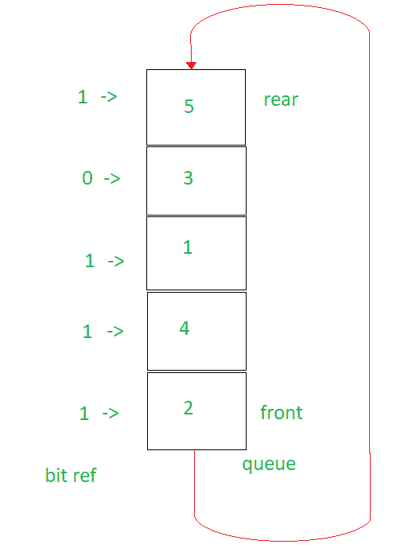

# LRU 近似(二次机会算法)

> 原文:[https://www . geesforgeks . org/LRU-近似值-第二次机会-算法/](https://www.geeksforgeeks.org/lru-approximation-second-chance-algorithm/)

如果您不熟悉最近最少使用的算法，请检查[最近最少使用的算法(页面替换)](https://www.geeksforgeeks.org/program-page-replacement-algorithms-set-1-lru/)

该算法结合使用队列，类似于先进先出([先进先出(页面替换)](https://www.geeksforgeeks.org/program-page-replacement-algorithms-set-2-fifo/))以及使用数组来跟踪用于给排队页面“第二次机会”的位。

**算法如何工作:**

> 1.  Set all values of bitref to False (let it be the size of the maximum capacity of the queue).
> 2.  Set an empty queue to have the maximum capacity.
> 3.  Check whether the queue is full:
>     *   If the element is in the queue, set its corresponding bitref to 1.
>     *   If the element is not in the queue, it is pushed into the queue.
> 4.  If the queue is full:
>     *   Find the first element with bitref = 0 in the queue, and set it to 0 if there is any element with bitref = 1 in front of it. Rotate the queue until the element with bitref = 0 is found.
>     *   Remove the element from the queue.
>     *   Push the current element from the input array to the queue.

**解释:**
在这种情况下，位 ref 中的索引位通常被设置为 1，直到队列满为止。
一旦队列变满，根据 FIFO 页面替换算法，我们应该去掉队列的前面(如果元素是故障/未命中)。但在这里我们不这样做。

相反，我们首先检查它的参考位(又名比特参考)是 0 还是 1(假或真)。如果它是 0 (false)，我们将它从队列中弹出，并将等待元素推入队列。但是如果它是 1(真)，我们就把它的引用位(bitref)设置为 0，并把它移到队列的后面。我们继续这样做，直到我们遇到队列的前端，使其前端值的参考位(bitref)为 0 (false)。

然后我们遵循通常的方法，将它从队列中移除，并将等待元素推入队列。

如果等待元素已经在队列中了呢？我们只是将其参考位(bitref)设置为 1(真)。


我们现在将所有像 2、4、1 这样的值移到后面，直到遇到 3，它的 bitref 为 0。将 2、4、1 移到后面时，我们将它们的 bitref 值设置为 0。
T3】

所以现在的问题是，这怎么能算是 LRU 的近似呢，明明是实行[先进先出](https://www.geeksforgeeks.org/program-page-replacement-algorithms-set-2-fifo/)而不是 [LRU](https://www.geeksforgeeks.org/program-page-replacement-algorithms-set-1-lru/) 。嗯，这是通过给队列前面第二次机会来实现的(在[先进先出](https://www.geeksforgeeks.org/program-page-replacement-algorithms-set-2-fifo/)的情况下，这个机会会被弹出并替换)。这里，第二个机会是基于这样的事实，即如果元素是“最近”看到的，则它的参考位(bitref)被设置为 1(真)。如果最近没有看到它，我们就不会将它的参考位(bitref)设置为 1(真)，从而将其移除。因此，这就是为什么，它是一个近似值，而不是 [LRU](https://www.geeksforgeeks.org/program-page-replacement-algorithms-set-1-lru/) 也不是[先进先出](https://www.geeksforgeeks.org/program-page-replacement-algorithms-set-2-fifo/)。

下面是上述方法的实现:

```
// C++ implementation of the approach
#include <bits/stdc++.h>
using namespace std;

// Function to find an element in the queue as
// std::find does not work for a queue
bool findQueue(queue<int> q, int x)
{
    while (!q.empty()) {
        if (x == q.front())
            return true;
        q.pop();
    }

    // Element not found
    return false;
}

// Function to implement LRU Approximation
void LRU_Approximation(vector<int> t, int capacity)
{
    int n = t.size();
    queue<int> q;

    // Capacity is the size of the queue
    // hits is number of times page was
    // found in cache and faults is the number
    // of times the page was not found in the cache
    int hits = 0, faults = 0;

    // Array to keep track of bits set when a
    // certain value is already in the queue
    // Set bit --> 1, if its a hit
    // find the index and set bitref[index] = 1
    // Set bit --> 0, if its a fault, and the front
    // of the queue has bitref[front] = 1, send front
    // to back and set bitref[front] = 0
    bool bitref[capacity] = { false };

    // To find the first element that does not
    // have the bitref set to true
    int ptr = 0;

    // To check if the queue is filled up or not
    int count = 0;
    for (int i = 0; i < t.size(); i++) {
        if (!findQueue(q, t[i])) {

            // Queue is not filled up to capacity
            if (count < capacity) {
                q.push(t[i]);
                count++;
            }

            // Queue is filled up to capacity
            else {
                ptr = 0;

                // Find the first value that has its
                // bit set to 0
                while (!q.empty()) {

                    // If the value has bit set to 1
                    // Set it to 0
                    if (bitref[ptr % capacity])
                        bitref[ptr % capacity] = !bitref[ptr % capacity];

                    // Found the bit value 0
                    else
                        break;
                    ptr++;
                }

                // If the queue was empty
                if (q.empty()) {
                    q.pop();
                    q.push(t[i]);
                }

                // If queue was not empty
                else {
                    int j = 0;

                    // Rotate the queue and set the front's
                    // bit value to 0 until the value where
                    // the bitref = 0
                    while (j < (ptr % capacity)) {
                        int t1 = q.front();
                        q.pop();
                        q.push(t1);
                        bool temp = bitref[0];

                        // Rotate the bitref array
                        for (int counter = 0; counter < capacity - 1; counter++)
                            bitref[counter] = bitref[counter + 1];
                        bitref[capacity - 1] = temp;
                        j++;
                    }

                    // Remove front element
                    // (the element with the bitref = 0)
                    q.pop();

                    // Push the element from the
                    // page array (next input)
                    q.push(t[i]);
                }
            }
            faults++;
        }

        // If the input for the iteration was a hit
        else {
            queue<int> temp = q;
            int counter = 0;
            while (!q.empty()) {
                if (q.front() == t[i])
                    bitref[counter] = true;
                counter++;
                q.pop();
            }
            q = temp;
            hits++;
        }
    }
    cout << "Hits: " << hits << "\nFaults: " << faults << '\n';
}

// Driver code
int main()
{
    vector<int> t = { 2, 3, 2, 1, 5, 2, 4, 5, 3, 2, 5, 2 };
    int capacity = 4;
    LRU_Approximation(t, capacity);

    return 0;
}
```

**Output:**

```
Hits: 6
Faults: 6

```