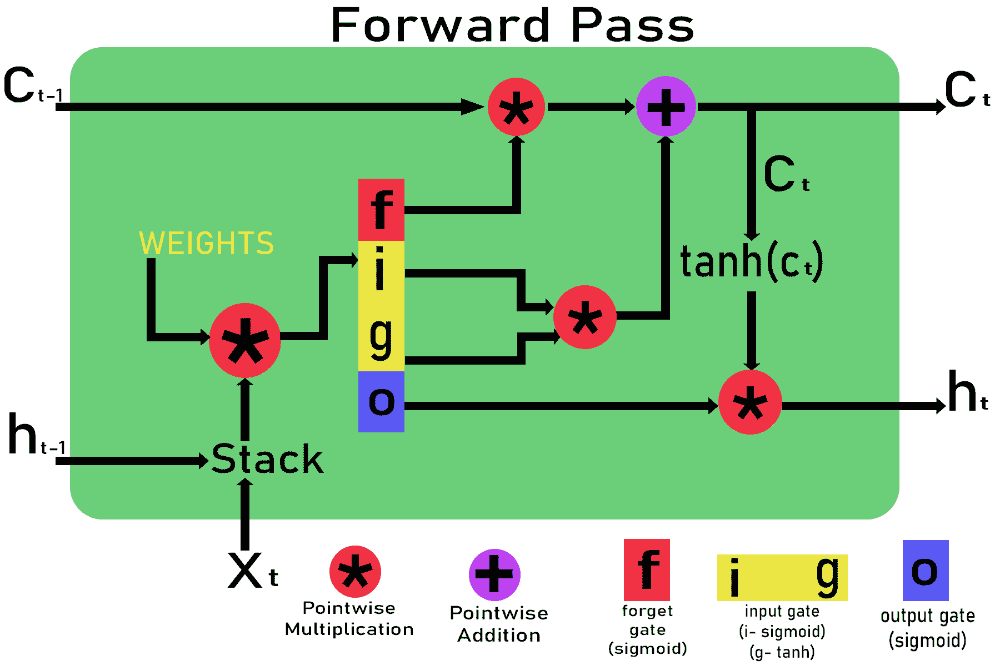
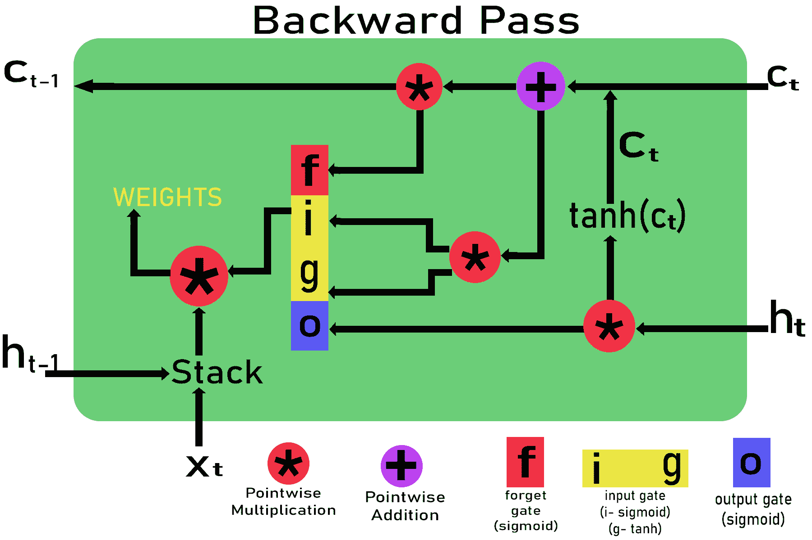
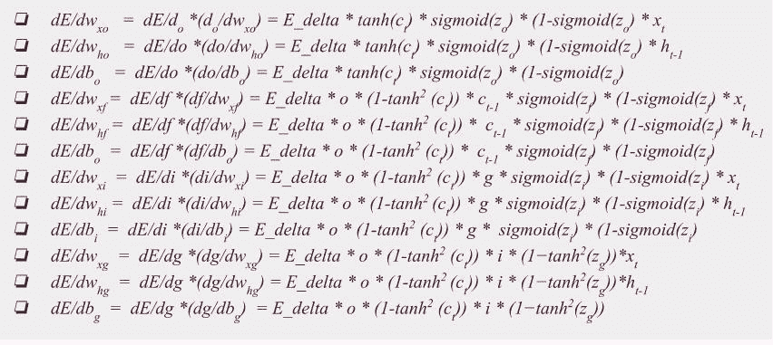

# LSTM–通过时间推导反向传播

> 原文:[https://www . geesforgeks . org/lstm-反向传播通过时间的推导/](https://www.geeksforgeeks.org/lstm-derivation-of-back-propagation-through-time/)

**LSTM(长短期记忆)**是 RNN(递归神经网络)的一种，它是一种著名的深度学习算法，非常适合于做出具有时代气息的预测和分类。在本文中，我们将推导出算法随时间的反向传播，并找到特定时间戳下所有权重的梯度值。
顾名思义，通过时间的反向传播类似于 DNN 的反向传播(深度神经网络)，但是由于 RNN 和 LSTM 的时间依赖性，我们将不得不应用具有时间依赖性的链式规则。



让 LSTM 单元中时间 t 的输入为 x <sub>t</sub> ，时间 t-1 和 t 的单元状态为 c <sub>t-1</sub> 和 c <sub>t</sub> ，时间 t-1 和 t 的输出为 h <sub>t-1</sub> 和 h <sub>t</sub> 。c <sub>t</sub> 和 h <sub>t</sub> 在 t = 0 时的初始值为零。

**步骤 1 :** 权重的初始化。

```
Weights for different gates are : 
Input gate : wxi, wxg, bi, whj, wg , bg

Forget gate : wxf, bf, whf 

Output gate : wxo, bo, who
```

**第二步:**通过不同的门。

```

Inputs: xt and ht-i , ct-1  are given to the LSTM cell 
      Passing through input gate: 

          Zg = wxg *x + whg * ht-1 + bg 
          g = tanh(Zg)
          Zj = wxi * x + whi * ht-1 + bi 
          i =  sigmoid(Zi) 

          Input_gate_out = g*i 

      Passing through forget gate:  

          Zf = wxf * x + whf *ht-1 + bf 
          f = sigmoid(Zf) 

      Forget_gate_out = f 

      Passing through the output gate:  

      Zo  = wxo*x +  who * ht-1 + bo 
      o = sigmoid(zO) 

      Out_gate_out = o
```

**步骤 3 :** 计算输出 h <sub>t</sub> 和当前电池状态 c<sub>t</sub>

```
  Calculating the current cell state ct :
          ct = (ct-1 * forget_gate_out) + input_gate_out 

Calculating the output gate ht:
          ht=out_gate_out * tanh(ct)
```

**第 4 步:**使用链式法则计算通过时间戳 t 的时间反向传播的梯度。



```
  Let the gradient pass down by the above cell be: 
      E_delta = dE/dht   

      If we are using MSE (mean square error)for error then,
      E_delta=(y-h(x))
      Here y is the original value and h(x) is the predicted value.    

  Gradient with respect to output gate 

             dE/do = (dE/dht ) * (dht /do) = E_delta * ( dht / do) 
                dE/do =  E_delta * tanh(ct) 

  Gradient with respect to c<sub>t</sub>         
      dE/dct = (dE / dht )*(dht /dct)= E_delta *(dht /dct) 
                dE/dct  =   E_delta   * o * (1-tanh2 (ct))        

  Gradient with respect to input gate dE/di, dE/dg 

      dE/di = (dE/di ) * (dct / di)  
             dE/di =  E_delta   * o * (1-tanh2 (ct)) * g 
      Similarly,  
      dE/dg =  E_delta   * o * (1-tanh2 (ct)) * i 

  Gradient with respect to forget gate  

          dE/df =  E_delta   * (dE/dct ) * (dct / dt) t
          dE/df =  E_delta   * o * (1-tanh2 (ct)) *  ct-1  

  Gradient with respect to c<sub>t-1</sub>  

          dE/dct =  E_delta   * (dE/dct ) * (dct / dct-1) 
          dE/dct =  E_delta   * o * (1-tanh2 (ct)) * f  

  Gradient with respect to output gate weights:

    dE/dwxo   =  dE/do *(do/dwxo) = E_delta * tanh(ct) * sigmoid(zo) * (1-sigmoid(zo) * xt
    dE/dwho   =  dE/do *(do/dwho) = E_delta * tanh(ct) * sigmoid(zo) * (1-sigmoid(zo) * ht-1
    dE/dbo   =  dE/do *(do/dbo) = E_delta * tanh(ct) * sigmoid(zo) * (1-sigmoid(zo)

   Gradient with respect to forget gate weights:

    dE/dwxf  =  dE/df *(df/dwxf) = E_delta * o * (1-tanh2 (ct)) * ct-1 * sigmoid(zf) * (1-sigmoid(zf) * xt
    dE/dwhf =  dE/df *(df/dwhf) = E_delta * o * (1-tanh2 (ct)) *  ct-1 * sigmoid(zf) * (1-sigmoid(zf) * ht-1
    dE/dbo  =  dE/df *(df/dbo) = E_delta * o * (1-tanh2 (ct)) *  ct-1 * sigmoid(zf) * (1-sigmoid(zf) 

   Gradient with respect to input gate weights:

    dE/dwxi  =  dE/di *(di/dwxi) = E_delta * o * (1-tanh2 (ct)) * g * sigmoid(zi) * (1-sigmoid(zi) * xt
    dE/dwhi =  dE/di *(di/dwhi) = E_delta * o * (1-tanh2 (ct)) * g * sigmoid(zi) * (1-sigmoid(zi) * ht-1
    dE/dbi  =  dE/di *(di/dbi) = E_delta * o * (1-tanh2 (ct)) * g *  sigmoid(zi) * (1-sigmoid(zi)

    dE/dwxg  =  dE/dg *(dg/dwxg) = E_delta * o * (1-tanh2 (ct)) * i * (1?tanh2(zg))*xt
    dE/dwhg  =  dE/dg *(dg/dwhg) = E_delta * o * (1-tanh2 (ct)) * i * (1?tanh2(zg))*ht-1
    dE/dbg  =  dE/dg *(dg/dbg)  = E_delta * o * (1-tanh2 (ct)) * i * (1?tanh2(zg))
```

最后，与权重相关联的梯度是，



使用所有梯度，我们可以很容易地更新与输入门、输出门和遗忘门相关的权重