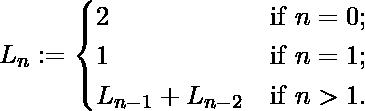

# 卢卡斯数字

> 原文:[https://www.geeksforgeeks.org/lucas-numbers/](https://www.geeksforgeeks.org/lucas-numbers/)

卢卡斯数与斐波那契数相似。卢卡斯数也被定义为它的前两项之和。但是这里前两项是 2 和 1，而在斐波那契数列中前两项分别是 0 和 1。
数学上，卢卡斯数可以定义为:

卢卡斯数的整数序列如下:
2，1，3，4，7，11，18，29，47，76，123 ……..
写一个函数 *int lucas(int n)* n 作为自变量，返回第 n 个 lucas 数。
**举例:**

```
Input : 3
Output : 4

Input : 7
Output : 29
```

**方法 1(递归求解)**
下面是基于简单递归公式的递归实现。

## C++

```
// Recursive C/C++ program
// to find n'th Lucas number
#include <stdio.h>

// recursive function
int lucas(int n)
{
    // Base cases
    if (n == 0)
        return 2;
    if (n == 1)
        return 1;

    // recurrence relation
    return lucas(n - 1) +
        lucas(n - 2);
}

// Driver Code
int main()
{
    int n = 9;
    printf("%d", lucas(n));
    return 0;
}
```

## Java 语言(一种计算机语言，尤用于创建网站)

```
// Recursive Java program to
// find n'th Lucas number

class GFG
{

    // recursive function
    public static int lucas(int n)
    {

        // Base cases
        if (n == 0)
            return 2;
        if (n == 1)
            return 1;

        // recurrence relation
        return lucas(n - 1) +
               lucas(n - 2);
    }

    // Driver Code
    public static void main(String args[])
    {
        int n = 9;
        System.out.println(lucas(n));
    }
}
// This code is contributed
// by Nikita Tiwari.
```

蟒蛇 3

```
 # Recursive Python 3 program 
# to find n'th Lucas number

# recursive function
def lucas(n) :

    # Base cases 
    if (n == 0) :
        return 2
    if (n == 1) :
        return 1

    # recurrence relation 
    return lucas(n - 1) + lucas(n - 2) 

# Driver code
n = 9
print(lucas(n))

# This code is contributed by Nikita Tiwari. 
```

## C#

```
// Recursive C# program to
// find n'th Lucas number
using System;

class GFG {

    // recursive function
    public static int lucas(int n)
    {

        // Base cases
        if (n == 0)
            return 2;
        if (n == 1)
            return 1;

        // recurrence relation
        return lucas(n - 1) + lucas(n - 2);
    }

    // Driver program
    public static void Main()
    {

        int n = 9;

        Console.WriteLine(lucas(n));
    }
}

// This code is contributed by vt_m.
```

## 服务器端编程语言（Professional Hypertext Preprocessor 的缩写）

```
<?php
// Recursive php program to
// find n'th Lucas number

// recursive function
function lucas($n)
{

// Base cases
if ($n == 0)
    return 2;
if ($n == 1)
    return 1;

// recurrence relation
return lucas($n - 1) +
       lucas($n - 2);
}

// Driver Code
$n = 9;
echo lucas($n);

// This code is contributed by ajit.
?>
```

## java 描述语言

```
<script>

// Javascript program to
// find n'th Lucas number

    // recursive function
    function lucas(n)
    {

        // Base cases
        if (n == 0)
            return 2;
        if (n == 1)
            return 1;

        // recurrence relation
        return lucas(n - 1) +
               lucas(n - 2);
    }

// Driver code to test above methods

        let n = 9;
        document.write(lucas(n));

 // This code is contributed by avijitmondal1998.
</script>
```

**输出:**

```
76
```

**方法 2(迭代求解)**
上述实现的时间复杂度是指数级的。我们可以使用迭代优化它以在 O(n)时间内工作。

## C++

```
// Iterative C/C++ program
// to find n'th Lucas Number
#include <stdio.h>

// Iterative function
int lucas(int n)
{
    // declaring base values
    // for positions 0 and 1
    int a = 2, b = 1, c, i;

    if (n == 0)
        return a;

    // generating number
    for (i = 2; i <= n; i++)
    {
        c = a + b;
        a = b;
        b = c;
    }
    return b;
}

// Driver Code
int main()
{
    int n = 9;
    printf("%d", lucas(n));
    return 0;
}
```

## Java 语言(一种计算机语言，尤用于创建网站)

```
// Iterative Java program to
// find n'th Lucas Number
class GFG
{
    // Iterative function
    static int lucas(int n)
    {
        // declaring base values
        // for positions 0 and 1
        int a = 2, b = 1, c, i;

        if (n == 0)
            return a;

        // generating number
        for (i = 2; i <= n; i++)
        {
            c = a + b;
            a = b;
            b = c;
        }
        return b;
    }

    // Driver Code
    public static void main(String args[])
    {
        int n = 9;
        System.out.println(lucas(n));
    }
}

// This code is contributed
// by Nikita tiwari.
```

## 蟒蛇 3

```
# Iterative Python 3 program
# to find n'th Lucas Number

# Iterative function
def lucas(n) :

    # declaring base values
    # for positions 0 and 1
    a = 2
    b = 1

    if (n == 0) :
        return a

    # generating number
    for i in range(2, n + 1) :
        c = a + b
        a = b
        b = c

    return b

# Driver Code
n = 9
print(lucas(n))

# This code is contributed
# by Nikita tiwari.
```

## C#

```
// Iterative C# program to
// find n'th Lucas Number
using System;

class GFG {

    // Iterative function
    static int lucas(int n)
    {

        // declaring base values
        // for positions 0 and 1
        int a = 2, b = 1, c, i;

        if (n == 0)
            return a;

        // generating number
        for (i = 2; i <= n; i++) {
            c = a + b;
            a = b;
            b = c;
        }

        return b;
    }

    // Driver Code
    public static void Main()
    {
        int n = 9;

        Console.WriteLine(lucas(n));
    }
}

// This code is contributed by vt_m.
```

## 服务器端编程语言（Professional Hypertext Preprocessor 的缩写）

```
<?php
// Iterative php program
// to find n'th Lucas Number

function lucas($n)
{
    // declaring base values
    // for positions 0 and 1
    $a = 2; $b = 1; $c; $i;

    if ($n == 0)
        return $a;

    // generating number
    for ($i = 2; $i <= $n; $i++)
    {
        $c = $a + $b;
        $a = $b;
        $b = $c;
    }
    return $b;
}

// Driver Code
$n = 9;
echo lucas($n);

// This code is contributed by ajit
?>
```

## java 描述语言

```
<script>
    // Iterative Javascript program to find n'th Lucas Number

    // Iterative function
    function lucas(n)
    {

        // declaring base values
        // for positions 0 and 1
        let a = 2, b = 1, c, i;

        if (n == 0)
            return a;

        // generating number
        for (i = 2; i <= n; i++) {
            c = a + b;
            a = b;
            b = c;
        }

        return b;
    }

    let n = 9;

      document.write(lucas(n));

</script>
```

**输出:**

```
76
```

**参考文献:**
[【https://en.wikipedia.org/wiki/Lucas_number】](https://en.wikipedia.org/wiki/Lucas_number)
本文由 [**Harsh Agarwal**](https://www.facebook.com/harsh.agarwal.16752) 供稿。如果你喜欢 GeeksforGeeks 并想投稿，你也可以使用[contribute.geeksforgeeks.org](http://www.contribute.geeksforgeeks.org)写一篇文章或者把你的文章邮寄到 contribute@geeksforgeeks.org。看到你的文章出现在极客博客主页上，帮助其他极客。
如果发现有不正确的地方，或者想分享更多关于上述话题的信息，请写评论。