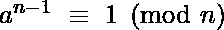
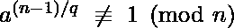

# 卢卡斯素性检验

> 原文:[https://www.geeksforgeeks.org/lucas-primality-test/](https://www.geeksforgeeks.org/lucas-primality-test/)

大于 1 的数 **p** 是素数当且仅当 **p** 的除数是 1 和 **p** 。前几个素数是 2，3，5，7，11，13，…
卢卡斯检验是自然数 n 的素性检验，它可以检验任何一种数的素性。
根据费马小定理:如果 **p** 是素数而 **a** 是整数，那么 **a^p** 与 **a (mod p )** 全等

**卢卡斯检验**:正数**n**T4【如果存在整数 **a** (1 < a < n)则为素数，这样:



对于(n-1)的每个质因数 q，



**示例**:

```
Input :  n = 7
Output : 7 is Prime
Explanation : let's take a = 3, 
then 3^6 % 7 = 729 % 7 = 1 (1st 
condition satisfied). Prime factors 
of 6 are 2 and 3,
3^(6/2) % 7 = 3^3 % 7 = 27 % 7 = 6
3^(6/3) % 7 = 3^2 % 7 = 9 % 7 = 2
Hence, 7 is Prime  

Input :  n = 9
Output : 9 is composite
Explanation : Let's take a = 2,
then 2^8 % 9 = 256 % 9 = 4
Hence 9 is composite 

```

```
lucasTest(n):
If n is even
    return composite
Else
   Find all prime factors of n-1
   for i=2 to n-1
      pick 'a' randomly in range [2, n-1]
      if a^(n-1) % n not equal 1:
          return composite
      else 
          // for all q, prime factors of (n-1)
          if a^(n-1)/q % n not equal 1 
             return prime
   Return probably prime

```

**与卢卡斯测试相关的问题有**:

*   知道 **n-1** 的所有质因数
*   为 **a** 找到合适的选择

## C++

```
// C++ Program for Lucas Primality Test
#include <bits/stdc++.h>
using namespace std;

// function to generate prime factors of n
void primeFactors(int n, vector<int>& factors)
{
    // if 2 is a factor
    if (n % 2 == 0)
        factors.push_back(2);
    while (n % 2 == 0)
        n = n / 2;

    // if prime > 2 is factor
    for (int i = 3; i <= sqrt(n); i += 2) {
        if (n % i == 0)
            factors.push_back(i);
        while (n % i == 0)
            n = n / i;
    }
    if (n > 2)
    factors.push_back(n);
}

// this function produces power modulo
// some number. It can be optimized to
// using
int power(int n, int r, int q)
{
    int total = n;
    for (int i = 1; i < r; i++)
        total = (total * n) % q;
    return total;
}

string lucasTest(int n)
{
    // Base cases
    if (n == 1)
        return "neither prime nor composite";
    if (n == 2)
        return "prime";
    if (n % 2 == 0)
        return "composite1";

    // Generating and storing factors
    // of n-1
    vector<int> factors;
    primeFactors(n - 1, factors);

    // Array for random generator. This array
    // is to ensure one number is generated
    // only once
    int random[n - 3];
    for (int i = 0; i < n - 2; i++)
        random[i] = i + 2;

    // shuffle random array to produce randomness
    shuffle(random, random + n - 3,
            default_random_engine(time(0)));

    // Now one by one perform Lucas Primality
    // Test on random numbers generated.
    for (int i = 0; i < n - 2; i++) {
        int a = random[i];
        if (power(a, n - 1, n) != 1)
            return "composite";

        // this is to check if every factor
        // of n-1 satisfy the condition
        bool flag = true;
        for (int k = 0; k < factors.size(); k++) {
            // if a^((n-1)/q) equal 1
            if (power(a, (n - 1) / factors[k], n) == 1) {
                flag = false;
                break;
            }
        }

        // if all condition satisfy
        if (flag)
            return "prime";
    }
    return "probably composite";
}

// Driver code
int main()
{
    cout << 7 << " is " << lucasTest(7) << endl;
    cout << 9 << " is " << lucasTest(9) << endl;
    cout << 37 << " is " << lucasTest(37) << endl;
    return 0;
}
```

## 蟒蛇 3

```
# Python3 program for Lucas Primality Test
import random
import math

# Function to generate prime factors of n
def primeFactors(n, factors):

    # If 2 is a factor
    if (n % 2 == 0):
        factors.append(2)

    while (n % 2 == 0):
        n = n // 2

    # If prime > 2 is factor
    for i in range(3, int(math.sqrt(n)) + 1, 2):
        if (n % i == 0):
            factors.append(i)

        while (n % i == 0):
            n = n // i

    if (n > 2):
        factors.append(n)

    return factors

# This function produces power modulo
# some number. It can be optimized to
# using
def power(n, r, q):

    total = n

    for i in range(1, r):
        total = (total * n) % q

    return total

def lucasTest(n):

    # Base cases
    if (n == 1):
        return "neither prime nor composite"
    if (n == 2):
        return "prime"
    if (n % 2 == 0):
        return "composite1"

    # Generating and storing factors
    # of n-1
    factors = []

    factors = primeFactors(n - 1, factors)

    # Array for random generator. This array
    # is to ensure one number is generated
    # only once
    rand = [i + 2 for i in range(n - 3)]

    # Shuffle random array to produce randomness
    random.shuffle(rand)

    # Now one by one perform Lucas Primality
    # Test on random numbers generated.
    for i in range(n - 2):
        a = rand[i]

        if (power(a, n - 1, n) != 1):
            return "composite"

        # This is to check if every factor
        # of n-1 satisfy the condition
        flag = True

        for k in range(len(factors)):

            # If a^((n-1)/q) equal 1
            if (power(a, (n - 1) // factors[k], n) == 1):
                flag = False
                break

        # If all condition satisfy
        if (flag):
            return "prime"

    return "probably composite"

# Driver code
if __name__=="__main__":

    print(str(7) + " is " + lucasTest(7))
    print(str(9) + " is " + lucasTest(9))
    print(str(37) + " is " + lucasTest(37))

# This code is contributed by rutvik_56
```

**输出:**

```
7 is prime
9 is composite
37 is prime

```

与其他素性检验相比，该方法相当复杂且效率低下。主要问题是“n-1”因素和选择合适的“a”因素。

**其他素性测试:**

*   [素性测验|第一套(入门和学校方法)](https://www.geeksforgeeks.org/primality-test-set-1-introduction-and-school-method/)
*   [素性检验|集合 2(费马方法)](https://www.geeksforgeeks.org/primality-test-set-2-fermet-method/)
*   [素性检验|集合 3(米勒-拉宾)](https://www.geeksforgeeks.org/primality-test-set-3-miller-rabin/)
*   [素性检验|集合 4(索洛维-斯特拉森)](https://www.geeksforgeeks.org/primality-test-set-4-solovay-strassen/)