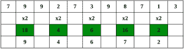
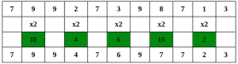
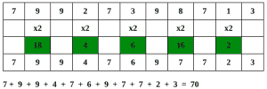

# Luhn 算法

> 原文:[https://www.geeksforgeeks.org/luhn-algorithm/](https://www.geeksforgeeks.org/luhn-algorithm/)

Luhn 算法，也称为**模数 10** 或 **mod 10** 算法，是一个简单的校验和公式，用于验证各种身份号码，如信用卡号、IMEI 号、加拿大社会保险号。卢恩公式是由一群数学家在 20 世纪 60 年代末创建的。此后不久，信用卡公司采用了它。因为算法在公共领域，所以任何人都可以使用。大多数信用卡和许多政府识别号码使用该算法作为一种简单的方法来区分有效数字和输入错误或其他不正确的数字。它旨在防止意外错误，而不是恶意攻击。

#### *鲁恩算法中涉及的步骤*

我们用一个例子来理解算法:
考虑一个账号“ **79927398713** 的例子。
**第一步**–从最右边的数字开始，每隔一个数字加倍数值，


**第二步**–如果一个数的加倍得到一个两位数，即大于 9(如 6 × 2 = 12)，那么将乘积的位数相加(如 12: 1 + 2 = 3，15: 1 + 5 = 6)，得到一个一位数。



**第 3 步**–现在取所有数字的总和。



**第 4 步**–如果模 10 的总和等于 0(如果总和以零结尾)，则根据 Luhn 公式，该数字有效；否则无效。



**由于和是 10 的倍数 70，账号可能有效。**

想法很简单；我们从终点穿越。对于每一秒钟的数字，我们会在相加之前加倍。我们把加倍后得到的数字加两位数。

## C++

```
// C++ program to implement Luhn algorithm
#include <bits/stdc++.h>
using namespace std;

// Returns true if given card number is valid
bool checkLuhn(const string& cardNo)
{
    int nDigits = cardNo.length();

    int nSum = 0, isSecond = false;
    for (int i = nDigits - 1; i >= 0; i--) {

        int d = cardNo[i] - '0';

        if (isSecond == true)
            d = d * 2;

        // We add two digits to handle
        // cases that make two digits after
        // doubling
        nSum += d / 10;
        nSum += d % 10;

        isSecond = !isSecond;
    }
    return (nSum % 10 == 0);
}

// Driver code
int main()
{
    string cardNo = "79927398713";
    if (checkLuhn(cardNo))
        printf("This is a valid card");
    else
        printf("This is not a valid card");
    return 0;
}
```

## Java 语言(一种计算机语言，尤用于创建网站)

```
// Java program to implement
// Luhn algorithm
import java.io.*;

class GFG {

// Returns true if given
// card number is valid
static boolean checkLuhn(String cardNo)
{
    int nDigits = cardNo.length();

    int nSum = 0;
    boolean isSecond = false;
    for (int i = nDigits - 1; i >= 0; i--)
    {

        int d = cardNo.charAt(i) - '0';

        if (isSecond == true)
            d = d * 2;

        // We add two digits to handle
        // cases that make two digits
        // after doubling
        nSum += d / 10;
        nSum += d % 10;

        isSecond = !isSecond;
    }
    return (nSum % 10 == 0);
}

    // Driver code
    static public void main (String[] args)
    {
        String cardNo = "79927398713";
        if (checkLuhn(cardNo))
            System.out.println("This is a valid card");
        else
            System.out.println("This is not a valid card");

    }
}

// This Code is contributed by vt_m.
```

## 蟒蛇 3

```
# Python3 program to implement
# Luhn algorithm

# Returns true if given card
# number is valid
def checkLuhn(cardNo):

    nDigits = len(cardNo)
    nSum = 0
    isSecond = False

    for i in range(nDigits - 1, -1, -1):
        d = ord(cardNo[i]) - ord('0')

        if (isSecond == True):
            d = d * 2

        # We add two digits to handle
        # cases that make two digits after
        # doubling
        nSum += d // 10
        nSum += d % 10

        isSecond = not isSecond

    if (nSum % 10 == 0):
        return True
    else:
        return False

# Driver code  
if __name__=="__main__":

    cardNo = "79927398713"

    if (checkLuhn(cardNo)):
        print("This is a valid card")
    else:
        print("This is not a valid card")

# This code is contributed by rutvik_56
```

## C#

```
// C# program to implement
// Luhn algorithm
using System;

class GFG {

// Returns true if given
// card number is valid
static bool checkLuhn(String cardNo)
{
    int nDigits = cardNo.Length;

    int nSum = 0;
    bool isSecond = false;
    for (int i = nDigits - 1; i >= 0; i--)
    {

         int d = cardNo[i] - '0';

        if (isSecond == true)
            d = d * 2;

        // We add two digits to handle
        // cases that make two digits
        // after doubling
        nSum += d / 10;
        nSum += d % 10;

        isSecond = !isSecond;
    }
    return (nSum % 10 == 0);
}

    // Driver code
    static public void Main()
    {
        String cardNo = "79927398713";
        if (checkLuhn(cardNo))
            Console.WriteLine("This is a valid card");
        else
            Console.WriteLine("This is not a valid card");

    }
}

// This Code is contributed by vt_m.
```

## java 描述语言

```
<script>
    // Javascript program to implement Luhn algorithm

    // Returns true if given
    // card number is valid
    function checkLuhn(cardNo)
    {
        let nDigits = cardNo.length;

        let nSum = 0;
        let isSecond = false;
        for (let i = nDigits - 1; i >= 0; i--)
        {

            let d = cardNo[i].charCodeAt() - '0'.charCodeAt();

            if (isSecond == true)
                d = d * 2;

            // We add two digits to handle
            // cases that make two digits
            // after doubling
            nSum += parseInt(d / 10, 10);
            nSum += d % 10;

            isSecond = !isSecond;
        }
        return (nSum % 10 == 0);
    }

    let cardNo = "79927398713";
    if (checkLuhn(cardNo))
      document.write("This is a valid card");
    else
      document.write("This is not a valid card");

</script>
```

**输出:**

```
This is a valid card
```

Luhn 算法检测任何一位数的错误，以及几乎所有相邻数字的调换。

本文由**维沙尔·库马尔·古普塔**供稿。如果你喜欢 GeeksforGeeks 并想投稿，你也可以使用[write.geeksforgeeks.org](https://write.geeksforgeeks.org)写一篇文章或者把你的文章邮寄到 contribute@geeksforgeeks.org。看到你的文章出现在极客博客主页上，帮助其他极客。
如果你发现任何不正确的地方，或者你想分享更多关于上面讨论的话题的信息，请写评论。