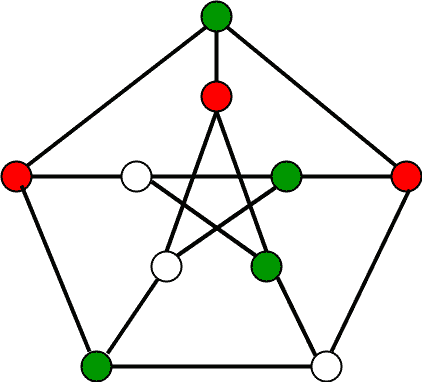

# m 着色问题|回溯-5

> 原文:[https://www . geesforgeks . org/m-着色-问题-回溯-5/](https://www.geeksforgeeks.org/m-coloring-problem-backtracking-5/)

给定一个无向图和一个数 m，确定该图是否最多可以用 m 种颜色着色，使得该图的两个相邻顶点都不能用相同的颜色着色。这里，图的着色意味着给所有顶点分配颜色。

**输入输出格式:**

***输入:***

1.  2D 阵列图[V][V]其中 V 是图中的顶点数，图[V][V]是图的邻接矩阵表示。如果有从 I 到 j 的直接边，则值图[i][j]为 1，否则图[i][j]为 0。
2.  整数 m 是可以使用的最大颜色数。

***输出:***
一个数组颜色【V】应该有 1 到 m 的数字，颜色【I】应该代表分配给第 I 个顶点的颜色。如果图形不能用 m 种颜色着色，代码也应该返回 false。

**示例:**

```
Input:  
graph = {0, 1, 1, 1},
        {1, 0, 1, 0},
        {1, 1, 0, 1},
        {1, 0, 1, 0}
Output: 
Solution Exists: 
Following are the assigned colors
 1  2  3  2
Explanation: By coloring the vertices 
with following colors, adjacent 
vertices does not have same colors

Input: 
graph = {1, 1, 1, 1},
        {1, 1, 1, 1},
        {1, 1, 1, 1},
        {1, 1, 1, 1}
Output: Solution does not exist.
Explanation: No solution exits.
```

**下面是一个可以用 3 种不同颜色着色的图形示例。**



## [我们强烈建议您点击此处进行练习，然后再进入解决方案。](https://practice.geeksforgeeks.org/problems/m-coloring-problem-1587115620/1)

**<u>方法一:</u>** 天真。

**天真方法:**生成所有可能的颜色配置。由于每个节点可以使用 m 种可用颜色中的任何一种进行着色，因此可能的颜色配置总数为 m^V.
。在生成颜色配置后，检查相邻顶点是否具有相同的颜色。如果条件满足，打印组合并断开循环。

**算法:**

1.  创建一个递归函数，获取当前索引、顶点数和输出颜色数组。
2.  如果当前索引等于顶点数。检查输出颜色配置是否安全，即检查相邻顶点的颜色是否不同。如果满足条件，打印配置并中断。
3.  为顶点指定颜色(1 到 m)。
4.  对于每个指定的颜色，递归调用带有下一个索引和顶点数的函数
5.  如果任何递归函数返回真，则中断循环并返回真。

下面是上述想法的实现:

## C++

```
#include<bits/stdc++.h>
using namespace std;

// Number of vertices in the graph
#define V 4

void printSolution(int color[]);

// check if the colored
// graph is safe or not
bool isSafe(bool graph[V][V], int color[])
{
    // check for every edge
    for (int i = 0; i < V; i++)
        for (int j = i + 1; j < V; j++)
            if (graph[i][j] && color[j] == color[i])
                return false;
    return true;
}

/* This function solves the m Coloring
problem using recursion. It returns
false if the m colours cannot be assigned,
otherwise, return true and prints
assignments of colours to all vertices.
Please note that there may be more than
one solutions, this function prints one
of the feasible solutions.*/
bool graphColoring(bool graph[V][V], int m, int i,
                int color[V])
{
    // if current index reached end
    if (i == V) {

        // if coloring is safe
        if (isSafe(graph, color)) {

            // Print the solution
            printSolution(color);
            return true;
        }
        return false;
    }

    // Assign each color from 1 to m
    for (int j = 1; j <= m; j++) {
        color[i] = j;

        // Recur of the rest vertices
        if (graphColoring(graph, m, i + 1, color))
            return true;

        color[i] = 0;
    }

    return false;
}

/* A utility function to print solution */
void printSolution(int color[])
{
    cout << "Solution Exists:" " Following are the assigned colors \n";
    for (int i = 0; i < V; i++)
        cout << "  " << color[i];
    cout << "\n";
}

// Driver code
int main()
{
    /* Create following graph and
    test whether it is 3 colorable
    (3)---(2)
    | / |
    | / |
    | / |
    (0)---(1)
    */
    bool graph[V][V] = {
        { 0, 1, 1, 1 },
        { 1, 0, 1, 0 },
        { 1, 1, 0, 1 },
        { 1, 0, 1, 0 },
    };
    int m = 3; // Number of colors

    // Initialize all color values as 0.
    // This initialization is needed
    // correct functioning of isSafe()
    int color[V];
    for (int i = 0; i < V; i++)
        color[i] = 0;

    if (!graphColoring(graph, m, 0, color))
        cout << "Solution does not exist";

    return 0;
}

// This code is contributed by shivanisinghss2110
```

## C

```
#include <stdbool.h>
#include <stdio.h>

// Number of vertices in the graph
#define V 4

void printSolution(int color[]);

// check if the colored
// graph is safe or not
bool isSafe(bool graph[V][V], int color[])
{
    // check for every edge
    for (int i = 0; i < V; i++)
        for (int j = i + 1; j < V; j++)
            if (graph[i][j] && color[j] == color[i])
                return false;
    return true;
}

/* This function solves the m Coloring
   problem using recursion. It returns
  false if the m colours cannot be assigned,
  otherwise, return true and prints
  assignments of colours to all vertices.
  Please note that there may be more than
  one solutions, this function prints one
  of the feasible solutions.*/
bool graphColoring(bool graph[V][V], int m, int i,
                   int color[V])
{
    // if current index reached end
    if (i == V) {
        // if coloring is safe
        if (isSafe(graph, color)) {
            // Print the solution
            printSolution(color);
            return true;
        }
        return false;
    }

    // Assign each color from 1 to m
    for (int j = 1; j <= m; j++) {
        color[i] = j;

        // Recur of the rest vertices
        if (graphColoring(graph, m, i + 1, color))
            return true;

        color[i] = 0;
    }

    return false;
}

/* A utility function to print solution */
void printSolution(int color[])
{
    printf("Solution Exists:"
           " Following are the assigned colors \n");
    for (int i = 0; i < V; i++)
        printf(" %d ", color[i]);
    printf("\n");
}

// Driver program to test above function
int main()
{
    /* Create following graph and
       test whether it is 3 colorable
      (3)---(2)
       |   / |
       |  /  |
       | /   |
      (0)---(1)
    */
    bool graph[V][V] = {
        { 0, 1, 1, 1 },
        { 1, 0, 1, 0 },
        { 1, 1, 0, 1 },
        { 1, 0, 1, 0 },
    };
    int m = 3; // Number of colors

    // Initialize all color values as 0.
    // This initialization is needed
    // correct functioning of isSafe()
    int color[V];
    for (int i = 0; i < V; i++)
        color[i] = 0;

    if (!graphColoring(graph, m, 0, color))
        printf("Solution does not exist");

    return 0;
}
```

## Java 语言(一种计算机语言，尤用于创建网站)

```
public class GFG
{

  // Number of vertices in the graph
  static int V = 4;

  /* A utility function to print solution */
  static void printSolution(int[] color)
  {
    System.out.println("Solution Exists:"  + 
                       " Following are the assigned colors ");
    for (int i = 0; i < V; i++)
      System.out.print("  " + color[i]);
    System.out.println();
  }

  // check if the colored
  // graph is safe or not
  static boolean isSafe(boolean[][] graph, int[] color)
  {
    // check for every edge
    for (int i = 0; i < V; i++)
      for (int j = i + 1; j < V; j++)
        if (graph[i][j] && color[j] == color[i])
          return false;
    return true;
  }

  /* This function solves the m Coloring
    problem using recursion. It returns
    false if the m colours cannot be assigned,
    otherwise, return true and prints
    assignments of colours to all vertices.
    Please note that there may be more than
    one solutions, this function prints one
    of the feasible solutions.*/
  static boolean graphColoring(boolean[][] graph, int m, 
                               int i, int[] color)
  {
    // if current index reached end
    if (i == V) {

      // if coloring is safe
      if (isSafe(graph, color))
      {

        // Print the solution
        printSolution(color);
        return true;
      }
      return false;
    }

    // Assign each color from 1 to m
    for (int j = 1; j <= m; j++)
    {
      color[i] = j;

      // Recur of the rest vertices
      if (graphColoring(graph, m, i + 1, color))
        return true;
      color[i] = 0;
    }
    return false;
  }

  // Driver code
  public static void main(String[] args) 
  {

    /* Create following graph and
        test whether it is 3 colorable
        (3)---(2)
        | / |
        | / |
        | / |
        (0)---(1)
        */
    boolean[][] graph = {
      { false, true, true, true },
      { true, false, true, false },
      { true, true, false, true },
      { true, false, true, false },
    };
    int m = 3; // Number of colors

    // Initialize all color values as 0.
    // This initialization is needed
    // correct functioning of isSafe()
    int[] color = new int[V];
    for (int i = 0; i < V; i++)
      color[i] = 0;
    if (!graphColoring(graph, m, 0, color))
      System.out.println("Solution does not exist");
  }
}

// This code is contributed by divyeh072019.
```

## 蟒蛇 3

```
# Number of vertices in the graph
# define 4 4

# check if the colored
# graph is safe or not
def isSafe(graph, color):

    # check for every edge
    for i in range(4):
        for j in range(i + 1, 4):
            if (graph[i][j] and color[j] == color[i]):
                return False
    return True

# /* This function solves the m Coloring
# problem using recursion. It returns
# false if the m colours cannot be assigned,
# otherwise, return true and prints
# assignments of colours to all vertices.
# Please note that there may be more than
# one solutions, this function prints one
# of the feasible solutions.*/
def graphColoring(graph, m, i, color):

    # if current index reached end
    if (i == 4):

        # if coloring is safe
        if (isSafe(graph, color)):

            # Print the solution
            printSolution(color)
            return True
        return False

    # Assign each color from 1 to m
    for j in range(1, m + 1):
        color[i] = j

        # Recur of the rest vertices
        if (graphColoring(graph, m, i + 1, color)):
            return True
        color[i] = 0
    return False

# /* A utility function to prsolution */
def printSolution(color):
    print("Solution Exists:" " Following are the assigned colors ")
    for i in range(4):
        print(color[i],end=" ")

# Driver code
if __name__ == '__main__':

    # /* Create following graph and
    # test whether it is 3 colorable
    # (3)---(2)
    # | / |
    # | / |
    # | / |
    # (0)---(1)
    # */
    graph = [
        [ 0, 1, 1, 1 ],
        [ 1, 0, 1, 0 ],
        [ 1, 1, 0, 1 ],
        [ 1, 0, 1, 0 ],
    ]
    m = 3 # Number of colors

    # Initialize all color values as 0.
    # This initialization is needed
    # correct functioning of isSafe()
    color = [0 for i in range(4)]

    if (not graphColoring(graph, m, 0, color)):
        print ("Solution does not exist")

# This code is contributed by mohit kumar 29
```

## C#

```
using System;
class GFG {

    // Number of vertices in the graph
    static int V = 4;

    /* A utility function to print solution */
    static void printSolution(int[] color)
    {
        Console.WriteLine("Solution Exists:"  + 
                          " Following are the assigned colors ");
        for (int i = 0; i < V; i++)
            Console.Write("  " + color[i]);
        Console.WriteLine();
    }

    // check if the colored
    // graph is safe or not
    static bool isSafe(bool[,] graph, int[] color)
    {
        // check for every edge
        for (int i = 0; i < V; i++)
            for (int j = i + 1; j < V; j++)
                if (graph[i, j] && color[j] == color[i])
                    return false;
        return true;
    }

    /* This function solves the m Coloring
    problem using recursion. It returns
    false if the m colours cannot be assigned,
    otherwise, return true and prints
    assignments of colours to all vertices.
    Please note that there may be more than
    one solutions, this function prints one
    of the feasible solutions.*/
    static bool graphColoring(bool[,] graph, int m, 
                              int i, int[] color)
    {
        // if current index reached end
        if (i == V) {

            // if coloring is safe
            if (isSafe(graph, color)) {

                // Print the solution
                printSolution(color);
                return true;
            }
            return false;
        }

        // Assign each color from 1 to m
        for (int j = 1; j <= m; j++) {
            color[i] = j;

            // Recur of the rest vertices
            if (graphColoring(graph, m, i + 1, color))
                return true;

            color[i] = 0;
        }

        return false;
    }

  // Driver code  
  static void Main() {
    /* Create following graph and
    test whether it is 3 colorable
    (3)---(2)
    | / |
    | / |
    | / |
    (0)---(1)
    */
    bool[,] graph = {
        { false, true, true, true },
        { true, false, true, false },
        { true, true, false, true },
        { true, false, true, false },
    };
    int m = 3; // Number of colors

    // Initialize all color values as 0.
    // This initialization is needed
    // correct functioning of isSafe()
    int[] color = new int[V];
    for (int i = 0; i < V; i++)
        color[i] = 0;

    if (!graphColoring(graph, m, 0, color))
        Console.WriteLine("Solution does not exist");
  }
}

// this code is contributed by divyeshrabadiya07.
```

## java 描述语言

```
<script>

    // Number of vertices in the graph
    let V = 4;

    /* A utility function to print solution */
    function printSolution(color)
    {
        document.write("Solution Exists:"  +
       " Following are the assigned colors <br>");
        for (let i = 0; i < V; i++)
              document.write("   " + color[i]);
        document.write(" ");
    }

    // check if the colored
  // graph is safe or not
    function isSafe(graph,color)
    {
        // check for every edge
    for (let i = 0; i < V; i++)
      for (let j = i + 1; j < V; j++)
        if (graph[i][j] && color[j] == color[i])
          return false;
    return true;
    }

  /* This function solves the m Coloring
    problem using recursion. It returns
    false if the m colours cannot be assigned,
    otherwise, return true and prints
    assignments of colours to all vertices.
    Please note that there may be more than
    one solutions, this function prints one
    of the feasible solutions.*/
    function graphColoring(graph,m,i,color)
    {
        // if current index reached end
    if (i == V) {

      // if coloring is safe
      if (isSafe(graph, color))
      {

        // Print the solution
        printSolution(color);
        return true;
      }
      return false;
      }

    // Assign each color from 1 to m
    for (let j = 1; j <= m; j++)
    {
      color[i] = j;

      // Recur of the rest vertices
      if (graphColoring(graph, m, i + 1, color))
        return true;
      color[i] = 0;
    }
    return false;
    }

    // Driver code

    /* Create following graph and
        test whether it is 3 colorable
        (3)---(2)
        | / |
        | / |
        | / |
        (0)---(1)
        */
    let graph=[[ false, true, true, true],
               [ true, false, true, false ],
               [ true, true, false, true ],
               [true, false, true, false]];

    let m = 3; // Number of colors

    // Initialize all color values as 0.
    // This initialization is needed
    // correct functioning of isSafe()
    let color = new Array(V);
    for (let i = 0; i < V; i++)
      color[i] = 0;

    if (!graphColoring(graph, m, 0, color))
      document.write("Solution does not exist");

    // This code is contributed by unknown2108

</script>
```

**Output**

```
Solution Exists: Following are the assigned colors 
  1  2  3  2
```

**复杂度分析:**

*   **时间复杂度:** O(m^V).
    有一个全 O(m^V)的颜色组合。所以时间复杂度是 O(m^V).
*   **空间复杂度:** O(V)。
    递归堆栈图着色(…)函数将需要 O(V)空间。

**<u>方法二</u> :** [回溯](https://www.geeksforgeeks.org/backtracking-algorithms/)。

**方法:**思路是从顶点 0 开始，给不同的顶点一个个分配颜色。在分配颜色之前，通过考虑已经分配给相邻顶点的颜色来检查安全性，即检查相邻顶点是否具有相同的颜色。如果有任何不违反条件的颜色分配，请将颜色分配标记为解决方案的一部分。如果无法分配颜色，则回溯并返回 false。

**算法:**

1.  创建一个递归函数，该函数接受图形、当前索引、顶点数和输出颜色数组。
2.  如果当前索引等于顶点数。在输出数组中打印颜色配置。
3.  为顶点指定颜色(1 到 m)。
4.  对于每个指定的颜色，检查配置是否安全(即检查相邻顶点是否有相同的颜色)递归调用带有下一个索引和顶点数的函数
5.  如果任何递归函数返回真，则中断循环并返回真。
6.  如果没有递归函数返回真，则返回假。

下面是上述想法的实现:

## C++

```
// C++ program for solution of M 
// Coloring problem using backtracking 
#include <iostream>
using namespace std;

// Number of vertices in the graph
#define V 4

void printSolution(int color[]);

/* A utility function to check if 
   the current color assignment
   is safe for vertex v i.e. checks 
   whether the edge exists or not
   (i.e, graph[v][i]==1). If exist 
   then checks whether the color to 
   be filled in the new vertex(c is
   sent in the parameter) is already
   used by its adjacent 
   vertices(i-->adj vertices) or 
   not (i.e, color[i]==c) */
bool isSafe(int v, bool graph[V][V],
            int color[], int c)
{
    for(int i = 0; i < V; i++)
        if (graph[v][i] && c == color[i])
            return false;

    return true;
}

/* A recursive utility function 
to solve m coloring problem */
bool graphColoringUtil(bool graph[V][V], int m,
                       int color[], int v)
{

    /* base case: If all vertices are 
       assigned a color then return true */
    if (v == V)
        return true;

    /* Consider this vertex v and 
       try different colors */
    for(int c = 1; c <= m; c++)
    {

        /* Check if assignment of color 
           c to v is fine*/
        if (isSafe(v, graph, color, c)) 
        {
            color[v] = c;

            /* recur to assign colors to 
               rest of the vertices */
            if (graphColoringUtil(
                graph, m, color, v + 1) == true)
                return true;

            /* If assigning color c doesn't
               lead to a solution then remove it */
            color[v] = 0;
        }
    }

    /* If no color can be assigned to 
       this vertex then return false */
    return false;
}

/* This function solves the m Coloring 
   problem using Backtracking. It mainly 
   uses graphColoringUtil() to solve the 
   problem. It returns false if the m 
   colors cannot be assigned, otherwise 
   return true and prints assignments of 
   colors to all vertices. Please note 
   that there may be more than one solutions,
   this function prints one of the
   feasible solutions.*/
bool graphColoring(bool graph[V][V], int m)
{

    // Initialize all color values as 0.
    // This initialization is needed
    // correct functioning of isSafe()
    int color[V];
    for(int i = 0; i < V; i++)
        color[i] = 0;

    // Call graphColoringUtil() for vertex 0
    if (graphColoringUtil(graph, m, color, 0) == false)
    {
        cout << "Solution does not exist";
        return false;
    }

    // Print the solution
    printSolution(color);
    return true;
}

/* A utility function to print solution */
void printSolution(int color[])
{
    cout << "Solution Exists:" 
         << " Following are the assigned colors" 
         << "\n";
    for(int i = 0; i < V; i++)
        cout << " " << color[i] << " ";

    cout << "\n";
}

// Driver code
int main()
{

    /* Create following graph and test 
       whether it is 3 colorable
      (3)---(2)
       |   / |
       |  /  |
       | /   |
      (0)---(1)
    */
    bool graph[V][V] = { { 0, 1, 1, 1 },
                         { 1, 0, 1, 0 },
                         { 1, 1, 0, 1 },
                         { 1, 0, 1, 0 }, };

    // Number of colors
    int m = 3; 
    graphColoring(graph, m);
    return 0;
}

// This code is contributed by Shivani
```

## C

```
#include <stdbool.h>
#include <stdio.h>

// Number of vertices in the graph
#define V 4

void printSolution(int color[]);

/* A utility function to check if 
   the current color assignment
   is safe for vertex v i.e. checks 
   whether the edge exists or not
   (i.e, graph[v][i]==1). If exist 
   then checks whether the color to 
   be filled in the new vertex(c is
   sent in the parameter) is already
   used by its adjacent 
   vertices(i-->adj vertices) or 
   not (i.e, color[i]==c) */
bool isSafe(
    int v, bool graph[V][V],
    int color[], int c)
{
    for (int i = 0; i < V; i++)
        if (
            graph[v][i] && c == color[i])
            return false;
    return true;
}

/* A recursive utility function 
to solve m coloring problem */
bool graphColoringUtil(
    bool graph[V][V], int m,
    int color[], int v)
{
    /* base case: If all vertices are 
       assigned a color then return true */
    if (v == V)
        return true;

    /* Consider this vertex v and 
       try different colors */
    for (int c = 1; c <= m; c++) {
        /* Check if assignment of color 
           c to v is fine*/
        if (isSafe(
                v, graph, color, c)) {
            color[v] = c;

            /* recur to assign colors to 
               rest of the vertices */
            if (
                graphColoringUtil(
                    graph, m, color, v + 1)
                == true)
                return true;

            /* If assigning color c doesn't
               lead to a solution then remove it */
            color[v] = 0;
        }
    }

    /* If no color can be assigned to 
       this vertex then return false */
    return false;
}

/* This function solves the m Coloring 
   problem using Backtracking. It mainly 
   uses graphColoringUtil() to solve the 
   problem. It returns false if the m 
   colors cannot be assigned, otherwise 
   return true and prints assignments of 
   colors to all vertices. Please note 
   that there may be more than one solutions,
   this function prints one of the
   feasible solutions.*/
bool graphColoring(
    bool graph[V][V], int m)
{
    // Initialize all color values as 0.
    // This initialization is needed
    // correct functioning of isSafe()
    int color[V];
    for (int i = 0; i < V; i++)
        color[i] = 0;

    // Call graphColoringUtil() for vertex 0
    if (
        graphColoringUtil(
            graph, m, color, 0)
        == false) {
        printf("Solution does not exist");
        return false;
    }

    // Print the solution
    printSolution(color);
    return true;
}

/* A utility function to print solution */
void printSolution(int color[])
{
    printf(
        "Solution Exists:"
        " Following are the assigned colors \n");
    for (int i = 0; i < V; i++)
        printf(" %d ", color[i]);
    printf("\n");
}

// driver program to test above function
int main()
{
    /* Create following graph and test 
       whether it is 3 colorable
      (3)---(2)
       |   / |
       |  /  |
       | /   |
      (0)---(1)
    */
    bool graph[V][V] = {
        { 0, 1, 1, 1 },
        { 1, 0, 1, 0 },
        { 1, 1, 0, 1 },
        { 1, 0, 1, 0 },
    };
    int m = 3; // Number of colors
    graphColoring(graph, m);
    return 0;
}
```

## Java 语言(一种计算机语言，尤用于创建网站)

```
/* Java program for solution of 
   M Coloring problem using backtracking */
public class mColoringProblem 
{
    final int V = 4;
    int color[];

    /* A utility function to check 
       if the current color assignment 
       is safe for vertex v */
    boolean isSafe(
        int v, int graph[][], int color[],
        int c)
    {
        for (int i = 0; i < V; i++)
            if (
                graph[v][i] == 1 && c == color[i])
                return false;
        return true;
    }

    /* A recursive utility function 
       to solve m coloring  problem */
    boolean graphColoringUtil(
        int graph[][], int m,
        int color[], int v)
    {
        /* base case: If all vertices are 
           assigned a color then return true */
        if (v == V)
            return true;

        /* Consider this vertex v and try 
           different colors */
        for (int c = 1; c <= m; c++) 
        {
            /* Check if assignment of color c to v
               is fine*/
            if (isSafe(v, graph, color, c))
            {
                color[v] = c;

                /* recur to assign colors to rest
                   of the vertices */
                if (
                    graphColoringUtil(
                        graph, m,
                        color, v + 1))
                    return true;

                /* If assigning color c doesn't lead
                   to a solution then remove it */
                color[v] = 0;
            }
        }

        /* If no color can be assigned to 
           this vertex then return false */
        return false;
    }

    /* This function solves the m Coloring problem using
       Backtracking. It mainly uses graphColoringUtil()
       to solve the problem. It returns false if the m
       colors cannot be assigned, otherwise return true
       and  prints assignments of colors to all vertices.
       Please note that there  may be more than one
       solutions, this function prints one of the
       feasible solutions.*/
    boolean graphColoring(int graph[][], int m)
    {
        // Initialize all color values as 0\. This
        // initialization is needed correct
        // functioning of isSafe()
        color = new int[V];
        for (int i = 0; i < V; i++)
            color[i] = 0;

        // Call graphColoringUtil() for vertex 0
        if (
            !graphColoringUtil(
                graph, m, color, 0)) 
        {
            System.out.println(
                "Solution does not exist");
            return false;
        }

        // Print the solution
        printSolution(color);
        return true;
    }

    /* A utility function to print solution */
    void printSolution(int color[])
    {
        System.out.println(
            "Solution Exists: Following"
            + " are the assigned colors");
        for (int i = 0; i < V; i++)
            System.out.print(" " + color[i] + " ");
        System.out.println();
    }

    // driver program to test above function
    public static void main(String args[])
    {
        mColoringProblem Coloring 
               = new mColoringProblem();
        /* Create following graph and 
           test whether it is
           3 colorable
          (3)---(2)
           |   / |
           |  /  |
           | /   |
          (0)---(1)
        */
        int graph[][] = {
            { 0, 1, 1, 1 },
            { 1, 0, 1, 0 },
            { 1, 1, 0, 1 },
            { 1, 0, 1, 0 },
        };
        int m = 3; // Number of colors
        Coloring.graphColoring(graph, m);
    }
}
// This code is contributed by Abhishek Shankhadhar
```

## 计算机编程语言

```
# Python program for solution of M Coloring 
# problem using backtracking

class Graph():

    def __init__(self, vertices):
        self.V = vertices
        self.graph = [[0 for column in range(vertices)]\
                              for row in range(vertices)]

    # A utility function to check 
    # if the current color assignment
    # is safe for vertex v
    def isSafe(self, v, colour, c):
        for i in range(self.V):
            if self.graph[v][i] == 1 and colour[i] == c:
                return False
        return True

    # A recursive utility function to solve m
    # coloring  problem
    def graphColourUtil(self, m, colour, v):
        if v == self.V:
            return True

        for c in range(1, m + 1):
            if self.isSafe(v, colour, c) == True:
                colour[v] = c
                if self.graphColourUtil(m, colour, v + 1) == True:
                    return True
                colour[v] = 0

    def graphColouring(self, m):
        colour = [0] * self.V
        if self.graphColourUtil(m, colour, 0) == None:
            return False

        # Print the solution
        print "Solution exist and Following 
                  are the assigned colours:"
        for c in colour:
            print c,
        return True

# Driver Code
g = Graph(4)
g.graph = [[0, 1, 1, 1], [1, 0, 1, 0], [1, 1, 0, 1], [1, 0, 1, 0]]
m = 3
g.graphColouring(m)

# This code is contributed by Divyanshu Mehta
```

## C#

```
/* C# program for solution of M Coloring problem 
using backtracking */
using System;

class GFG {
    readonly int V = 4;
    int[] color;

    /* A utility function to check if the current 
    color assignment is safe for vertex v */
    bool isSafe(int v, int[, ] graph,
                int[] color, int c)
    {
        for (int i = 0; i < V; i++)
            if (graph[v, i] == 1 && c == color[i])
                return false;
        return true;
    }

    /* A recursive utility function to solve m 
    coloring problem */
    bool graphColoringUtil(int[, ] graph, int m,
                           int[] color, int v)
    {
        /* base case: If all vertices are assigned 
        a color then return true */
        if (v == V)
            return true;

        /* Consider this vertex v and try different 
        colors */
        for (int c = 1; c <= m; c++) {
            /* Check if assignment of color c to v 
            is fine*/
            if (isSafe(v, graph, color, c)) {
                color[v] = c;

                /* recur to assign colors to rest 
                of the vertices */
                if (graphColoringUtil(graph, m,
                                      color, v + 1))
                    return true;

                /* If assigning color c doesn't lead 
                to a solution then remove it */
                color[v] = 0;
            }
        }

        /* If no color can be assigned to this vertex 
        then return false */
        return false;
    }

    /* This function solves the m Coloring problem using 
    Backtracking. It mainly uses graphColoringUtil() 
    to solve the problem. It returns false if the m 
    colors cannot be assigned, otherwise return true 
    and prints assignments of colors to all vertices. 
    Please note that there may be more than one 
    solutions, this function prints one of the 
    feasible solutions.*/
    bool graphColoring(int[, ] graph, int m)
    {
        // Initialize all color values as 0\. This
        // initialization is needed correct functioning
        // of isSafe()
        color = new int[V];
        for (int i = 0; i < V; i++)
            color[i] = 0;

        // Call graphColoringUtil() for vertex 0
        if (!graphColoringUtil(graph, m, color, 0)) {
            Console.WriteLine("Solution does not exist");
            return false;
        }

        // Print the solution
        printSolution(color);
        return true;
    }

    /* A utility function to print solution */
    void printSolution(int[] color)
    {
        Console.WriteLine("Solution Exists: Following"
                          + " are the assigned colors");
        for (int i = 0; i < V; i++)
            Console.Write(" " + color[i] + " ");
        Console.WriteLine();
    }

    // Driver Code
    public static void Main(String[] args)
    {
        GFG Coloring = new GFG();

        /* Create following graph and test whether it is 
        3 colorable 
        (3)---(2) 
        | / | 
        | / | 
        | / | 
        (0)---(1) 
        */
        int[, ] graph = { { 0, 1, 1, 1 },
                          { 1, 0, 1, 0 },
                          { 1, 1, 0, 1 },
                          { 1, 0, 1, 0 } };
        int m = 3; // Number of colors
        Coloring.graphColoring(graph, m);
    }
}

// This code is contributed by PrinciRaj1992
```

## java 描述语言

```
<script>

/* JavaScript program for solution of
   M Coloring problem using backtracking */

let V = 4;
let color;

/* A utility function to check
       if the current color assignment
       is safe for vertex v */
function isSafe(v,graph,color,c)
{
    for (let i = 0; i < V; i++)
            if (
                graph[v][i] == 1 && c == color[i])
                return false;
        return true;
}

/* A recursive utility function
       to solve m coloring  problem */
function graphColoringUtil(graph,m,color,v)
{
    /* base case: If all vertices are
           assigned a color then return true */
        if (v == V)
            return true;

        /* Consider this vertex v and try
           different colors */
        for (let c = 1; c <= m; c++)
        {
            /* Check if assignment of color c to v
               is fine*/
            if (isSafe(v, graph, color, c))
            {
                color[v] = c;

                /* recur to assign colors to rest
                   of the vertices */
                if (
                    graphColoringUtil(
                        graph, m,
                        color, v + 1))
                    return true;

                /* If assigning color c doesn't lead
                   to a solution then remove it */
                color[v] = 0;
            }
        }

        /* If no color can be assigned to
           this vertex then return false */
        return false;
}

/* This function solves the m Coloring problem using
       Backtracking. It mainly uses graphColoringUtil()
       to solve the problem. It returns false if the m
       colors cannot be assigned, otherwise return true
       and  prints assignments of colors to all vertices.
       Please note that there  may be more than one
       solutions, this function prints one of the
       feasible solutions.*/
function graphColoring(graph,m)
{
    // Initialize all color values as 0\. This
        // initialization is needed correct
        // functioning of isSafe()
        color = new Array(V);
        for (let i = 0; i < V; i++)
            color[i] = 0;

        // Call graphColoringUtil() for vertex 0
        if (
            !graphColoringUtil(
                graph, m, color, 0))
        {
            document.write(
                "Solution does not exist<br>");
            return false;
        }

        // Print the solution
        printSolution(color);
        return true;
}

/* A utility function to print solution */
function printSolution(color)
{
    document.write(
            "Solution Exists: Following"
            + " are the assigned colors<br>");
        for (let i = 0; i < V; i++)
            document.write(" " + color[i] + " ");
        document.write("<br>");
}

 // driver program to test above function
/* Create following graph and
           test whether it is
           3 colorable
          (3)---(2)
           |   / |
           |  /  |
           | /   |
          (0)---(1)
        */
        let graph = [
            [ 0, 1, 1, 1 ],
            [ 1, 0, 1, 0 ],
            [ 1, 1, 0, 1 ],
            [ 1, 0, 1, 0 ],
        ];
        let m = 3; // Number of colors
        graphColoring(graph, m);

// This code is contributed by ab2127

</script>
```

**Output**

```
Solution Exists: Following are the assigned colors 
 1  2  3  2 
```

**复杂度分析:**

*   **时间复杂度:** O(m^V).
    有全 O(m^V)组合的颜色。所以时间复杂性就是 O(m^V).上限时间复杂度保持不变，但平均花费的时间会更少。
*   **空间复杂度:** O(V)。
    递归堆栈图着色(…)函数将需要 O(V)空间。

**<u>方法三:</u>** 使用 BFS

这里的方法是用颜色 1 从 1 到 n 给每个节点着色。从一个未访问的起始节点开始在 BFS 旅行，一次覆盖所有连接的组件。在 BFS 遍历期间到达每个节点时，请执行以下操作:

*   检查给定节点的所有边。
*   对于通过边连接到我们节点的每个顶点:
    *   检查节点的颜色是否相同。如果相同，将另一个节点(不是当前节点)的颜色增加一。
    *   检查它是已访问还是未访问。如果未被访问，将其标记为已访问，并将其推入队列。
*   检查 maxColors 到目前为止的状况。如果超过 M，则返回 false

访问所有节点后，返回 true(因为在旅行时没有发现违反条件的情况)。

## C++

```
// CPP program for the above approach
#include <bits/stdc++.h>
#include <iostream>
using namespace std;

class node 
{

    // A node class which stores the color and the edges
    // connected to the node
public:
    int color = 1;
    set<int> edges;
};

int canPaint(vector<node>& nodes, int n, int m)
{

    // Create a visited array of n
    // nodes, initialized to zero
    vector<int> visited(n + 1, 0);

    // maxColors used till now are 1 as
    // all nodes are painted color 1
    int maxColors = 1;

    // Do a full BFS traversal from
    // all unvisited starting points
    for (int sv = 1; sv <= n; sv++) 
    {

        if (visited[sv])
            continue;

        // If the starting point is unvisited,
        // mark it visited and push it in queue
        visited[sv] = 1;
        queue<int> q;
        q.push(sv);

        // BFS Travel starts here
        while (!q.empty()) 
        {

            int top = q.front();
            q.pop();

            // Checking all adjacent nodes
            // to "top" edge in our queue
            for (auto it = nodes[top].edges.begin();
                 it != nodes[top].edges.end(); it++) 
            {

                // IMPORTANT: If the color of the
                // adjacent node is same, increase it by 1
                if (nodes[top].color == nodes[*it].color)
                    nodes[*it].color += 1;

                // If number of colors used shoots m, return
                // 0
                maxColors
                    = max(maxColors, max(nodes[top].color,
                                         nodes[*it].color));
                if (maxColors > m)
                    return 0;

                // If the adjacent node is not visited,
                // mark it visited and push it in queue
                if (!visited[*it]) {
                    visited[*it] = 1;
                    q.push(*it);
                }
            }
        }
    }

    return 1;
}

// Driver code
int main()
{

     int n = 4;
     bool graph[n][n] = {
     { 0, 1, 1, 1 },
     { 1, 0, 1, 0 },
     { 1, 1, 0, 1 },
     { 1, 0, 1, 0 }};
     int m = 3; // Number of colors

      // Create a vector of n+1
      // nodes of type "node"
      // The zeroth position is just
      // dummy (1 to n to be used)
      vector<node> nodes(n + 1);

      // Add edges to each node as per given input
      for (int i = 0; i < n; i++) 
      {
         for(int j =0;j<n;j++)
         {
             if(graph[i][j])
             {
                  // Connect the undirected graph
                  nodes[i].edges.insert(i);
                  nodes[j].edges.insert(j);
              }
         }
      }

        // Display final answer
        cout << canPaint(nodes, n, m);
        cout << "\n";

    return 0;
}
```

## Java 语言(一种计算机语言，尤用于创建网站)

```
// Java program for the above approach
import java.io.*;
import java.util.*;
class Node 
{

    // A node class which stores the color and the edges
    // connected to the node
    int color = 1;
    Set<Integer> edges = new HashSet<Integer>();
}
class GFG 
{
    static int canPaint(ArrayList<Node> nodes, int n, int m)
    {

        // Create a visited array of n
        // nodes, initialized to zero
        ArrayList<Integer> visited = new ArrayList<Integer>();
        for(int i = 0; i < n + 1; i++)
        {
            visited.add(0);
        }

        // maxColors used till now are 1 as
        // all nodes are painted color 1
        int maxColors = 1;

        // Do a full BFS traversal from
        // all unvisited starting points
        for (int sv = 1; sv <= n; sv++) 
        {
            if (visited.get(sv) > 0)
            {
                continue;
            }

            // If the starting point is unvisited,
            // mark it visited and push it in queue
            visited.set(sv, 1);
            Queue<Integer> q = new LinkedList<>(); 
            q.add(sv);

            // BFS Travel starts here
            while(q.size() != 0)
            {
                int top = q.peek();
                q.remove();

                // Checking all adjacent nodes
                // to "top" edge in our queue
                for(int it: nodes.get(top).edges)
                {

                    // IMPORTANT: If the color of the
                    // adjacent node is same, increase it by 1
                    if(nodes.get(top).color == nodes.get(it).color)
                    {
                        nodes.get(it).color += 1;
                    }

                    // If number of colors used shoots m, return
                    // 0
                    maxColors = Math.max(maxColors, 
                                        Math.max(nodes.get(top).color,
                                                 nodes.get(it).color));
                    if (maxColors > m)
                        return 0;

                    // If the adjacent node is not visited,
                    // mark it visited and push it in queue
                    if (visited.get(it) == 0) 
                    {
                        visited.set(it, 1);
                        q.remove(it);
                    }
                }

            }
        }
        return 1;
    }

    // Driver code
    public static void main (String[] args)
    {
        int n = 4;
        int [][] graph = {{ 0, 1, 1, 1 },{ 1, 0, 1, 0 },
                          { 1, 1, 0, 1 },{ 1, 0, 1, 0 }};
        int m = 3; // Number of colors

        // Create a vector of n+1
        // nodes of type "node"
        // The zeroth position is just
        // dummy (1 to n to be used)
        ArrayList<Node> nodes = new ArrayList<Node>();

        for(int i = 0; i < n+ 1; i++)
        {
            nodes.add(new Node());
        }

        // Add edges to each node as per given input
      for (int i = 0; i < n; i++) 
      {
         for(int j = 0; j < n; j++)
         {
             if(graph[i][j] > 0)
             {
                 // Connect the undirected graph
                  nodes.get(i).edges.add(i);
                  nodes.get(j).edges.add(j);
             }
         }
      }

      // Display final answer
        System.out.println(canPaint(nodes, n, m));
    }
}

// This code is contributed by avanitrachhadiya2155
```

## 蟒蛇 3

```
# Python3 program for the above approach
from queue import Queue

class node:

    color = 1
    edges = set()

def canPaint(nodes, n, m):

    # Create a visited array of n
    # nodes, initialized to zero
    visited = [0 for _ in range(n+1)]

    # maxColors used till now are 1 as
    # all nodes are painted color 1
    maxColors = 1

    # Do a full BFS traversal from
    # all unvisited starting points
    for _ in range(1, n + 1):
        if visited[_]:
            continue

        # If the starting point is unvisited,
        # mark it visited and push it in queue
        visited[_] = 1
        q = Queue()
        q.put(_)

        # BFS Travel starts here
        while not q.empty():
            top = q.get()

            # Checking all adjacent nodes
            # to "top" edge in our queue
            for _ in nodes[top].edges:

                # IMPORTANT: If the color of the
                # adjacent node is same, increase it by 1

                if nodes[top].color == nodes[_].color:
                    nodes[_].color += 1

                # If number of colors used shoots m,
                # return 0
                maxColors = max(maxColors, max(
                    nodes[top].color, nodes[_].color))

                if maxColors > m:
                    print(maxColors)
                    return 0

                # If the adjacent node is not visited,
                # mark it visited and push it in queue
                if not visited[_]:
                    visited[_] = 1
                    q.put(_)

    return 1

# Driver code
if __name__ == "__main__":

    n = 4
    graph = [ [ 0, 1, 1, 1 ], 
              [ 1, 0, 1, 0 ], 
              [ 1, 1, 0, 1 ], 
              [ 1, 0, 1, 0 ] ]

    # Number of colors
    m = 3  

    # Create a vector of n+1
    # nodes of type "node"
    # The zeroth position is just
    # dummy (1 to n to be used)
    nodes = []
    for _ in range(n+1):
        nodes.append(node())

    # Add edges to each node as
    # per given input
    for _ in range(n):
        for __ in range(n):
            if graph[_][__]:

                # Connect the undirected graph
                nodes[_].edges.add(_)
                nodes[__].edges.add(__)

    # Display final answer
    print(canPaint(nodes, n, m))

# This code is contributed by harshitkap00r
```

## C#

```
// C# program for the above approach
using System;
using System.Collections;
using System.Collections.Generic;
class GFG
{

class node 
{

    // A node class which stores the color and the edges
    // connected to the node
    public int color = 1;
    public HashSet<int> edges = new HashSet<int>();
};

static int canPaint(List<node> nodes, int n, int m)
{

    // Create a visited array of n
    // nodes, initialized to zero
    List<int> visited = new List<int>();

    for(int i = 0; i < n + 1; i++)
    {
        visited.Add(0);
    }

    // maxColors used till now are 1 as
    // all nodes are painted color 1
    int maxColors = 1;

    // Do a full BFS traversal from
    // all unvisited starting points
    for (int sv = 1; sv <= n; sv++) 
    {

        if (visited[sv] > 0)
            continue;

        // If the starting point is unvisited,
        // mark it visited and push it in queue
        visited[sv] = 1;
        Queue q = new Queue();
        q.Enqueue(sv);

        // BFS Travel starts here
        while (q.Count != 0) 
        {

            int top = (int)q.Peek();
            q.Dequeue();

            // Checking all adjacent nodes
            // to "top" edge in our queue
            foreach(int it in nodes[top].edges)
            {

                // IMPORTANT: If the color of the
                // adjacent node is same, increase it by 1
                if (nodes[top].color == nodes[it].color)
                    nodes[it].color += 1;

                // If number of colors used shoots m, return
                // 0
                maxColors
                    = Math.Max(maxColors, Math.Max(nodes[top].color,
                                         nodes[it].color));
                if (maxColors > m)
                    return 0;

                // If the adjacent node is not visited,
                // mark it visited and push it in queue
                if (visited[it] == 0) 
                {
                    visited[it] = 1;
                    q.Enqueue(it);
                }
            }
        }
    }
    return 1;
}

// Driver code
public static void Main()
{

     int n = 4;
     int [,]graph = {
     { 0, 1, 1, 1 },
     { 1, 0, 1, 0 },
     { 1, 1, 0, 1 },
     { 1, 0, 1, 0 }};
     int m = 3; // Number of colors

      // Create a vector of n+1
      // nodes of type "node"
      // The zeroth position is just
      // dummy (1 to n to be used)
      List<node> nodes = new List<node>();
      for(int i = 0; i < n+ 1; i++)
      {
        nodes.Add(new node());
      }

      // Add edges to each node as per given input
      for (int i = 0; i < n; i++) 
      {
         for(int j = 0; j < n; j++)
         {
             if(graph[i, j] > 0)
             {

                  // Connect the undirected graph
                  nodes[i].edges.Add(i);
                  nodes[j].edges.Add(j);
              }
         }
      }

        // Display final answer
        Console.WriteLine(canPaint(nodes, n, m));
   }
}

// This code is contributed by rutvik_56.
```

## java 描述语言

```
<script>

// Javascript program for the above approach
class node 
{

    // A node class which stores the color
    // and the edges connected to the node
    constructor()
    {
        this.color = 1;
        this.edges = new Set();
    }
};

function canPaint(nodes, n, m)
{

    // Create a visited array of n
    // nodes, initialized to zero
    var visited = [];

    for(var i = 0; i < n + 1; i++)
    {
        visited.push(0);
    }

    // maxColors used till now are 1 as
    // all nodes are painted color 1
    var maxColors = 1;

    // Do a full BFS traversal from
    // all unvisited starting points
    for(var sv = 1; sv <= n; sv++) 
    {
        if (visited[sv] > 0)
            continue;

        // If the starting point is unvisited,
        // mark it visited and push it in queue
        visited[sv] = 1;
        var q = [];
        q.push(sv);

        // BFS Travel starts here
        while (q.length != 0) 
        {
            var top = q[0];
            q.shift();

            // Checking all adjacent nodes
            // to "top" edge in our queue
            for(var it of nodes[top].edges)
            {

                // IMPORTANT: If the color of the
                // adjacent node is same, increase it by 1
                if (nodes[top].color == nodes[it].color)
                    nodes[it].color += 1;

                // If number of colors used shoots m, return
                // 0
                maxColors = Math.max(maxColors, Math.max(
                                     nodes[top].color,
                                     nodes[it].color));
                if (maxColors > m)
                    return 0;

                // If the adjacent node is not visited,
                // mark it visited and push it in queue
                if (visited[it] == 0) 
                {
                    visited[it] = 1;
                    q.push(it);
                }
            }
        }
    }
    return 1;
}

// Driver code
var n = 4;
var graph = [ [ 0, 1, 1, 1 ],
              [ 1, 0, 1, 0 ],
              [ 1, 1, 0, 1 ],
              [ 1, 0, 1, 0 ] ];

// Number of colors      
var m = 3; 

// Create a vector of n+1
// nodes of type "node"
// The zeroth position is just
// dummy (1 to n to be used)
var nodes = [];
for(var i = 0; i < n+ 1; i++)
{
    nodes.push(new node());
}

// Push edges to each node as per given input
for (var i = 0; i < n; i++) 
{
    for(var j = 0; j < n; j++)
    {
        if(graph[i, j] > 0)
        {

            // Connect the undirected graph
            nodes[i].edges.push(i);
            nodes[j].edges.push(j);
        }
    }
}

// Display final answer
document.write(canPaint(nodes, n, m));

// This code is contributed by rrrtnx

</script>
```

**Output**

```
1
```

**复杂度分析:**

*   **时间复杂度:** O(V + E)。
*   **空间复杂度:** O(V)。用于存储访问列表。

**参考文献:**
[【http://en.wikipedia.org/wiki/Graph_coloring】](http://en.wikipedia.org/wiki/Graph_coloring)
发现有不正确的地方请写评论，或者想分享以上讨论话题的更多信息。