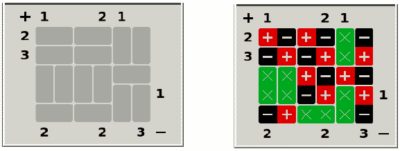

# 磁铁拼图|回溯-9

> 原文:[https://www.geeksforgeeks.org/magnet-puzzle-backtracking-9/](https://www.geeksforgeeks.org/magnet-puzzle-backtracking-9/)

拼图游戏“磁铁”包括将一组多米诺骨牌形状的磁铁(或驻极体或其他极化物体)放置在棋盘上的一组槽中，以满足一组约束。例如，左边的谜题有右边显示的解答:

每个槽要么包含一个空白条目(用“x”表示)，要么包含一个有正负两端的“磁铁”。左侧和顶部的数字显示了特定行或列中“+”方块的数量。右边和底部显示了特定行或列中的“-”号数量。在一端或两端没有数字的行和列在符号“+”或“-”的数量上不受限制，这取决于哪个数字不存在。除了满足这些数字约束外，解谜还必须满足以下约束:两个正交接触的正方形不能有相同的符号(对角连接的正方形不受约束)。

顶部[]、底部[]、左侧[]、右侧[]数组分别表示沿顶部(+)、底部(-)、左侧(+)和右侧(-)边缘的+或–计数。值-1 表示任意数量的+号和–号。同样给定的矩阵规则[][]包含任意一个 T、B、L 或 R 字符。对于板上的垂直插槽，T 表示其顶端，B 表示底端。对于板中的水平槽，L 表示左端，R 表示右端。

示例:

```
Input : M = 5, N = 6
        top[] = { 1, -1, -1, 2, 1, -1 }
        bottom[] = { 2, -1, -1, 2, -1, 3 }
        left[] = { 2, 3, -1, -1, -1 }
        right[] = { -1, -1, -1, 1, -1 }
        rules[][] = { { L, R, L, R, T, T },
                      { L, R, L, R, B, B },
                      { T, T, T, T, L, R },
                      { B, B, B, B, T, T },
                      { L, R, L, R, B, B }};
Output : + - + - X - 
         - + - + X + 
         X X + - + - 
         X X - + X + 
         - + X X X - 

Input : M = 4, N = 3
        top[] = { 2, -1, -1 }
        bottom[] = { -1, -1, 2 }
        left[] = { -1, -1, 2, -1 }
        right[] = { 0, -1, -1, -1 }
        rules[][] = { { T, T, T },
                      { B, B, B },
                      { T, L, R },
                      { B, L, R } };
Output : + X +
         – X –
        + – +
        – + –

```

我们可以使用[回溯](https://www.geeksforgeeks.org/backtracking-algorithms/)来解决这个问题。

```
# Write Python3 code here
M = 5
N = 6
top = [ 1, -1, -1, 2, 1, -1 ]
bottom = [ 2, -1, -1, 2, -1, 3 ]
left = [ 2, 3, -1, -1, -1 ]
right = [ -1, -1, -1, 1, -1 ]

rules = [["L","R","L","R","T","T" ],
                      [ "L","R","L","R","B","B" ],
                      [ "T","T","T","T","L","R" ],
                      [ "B","B","B","B","T","T" ],
                      [ "L","R","L","R","B","B" ]];

def canPutPatternHorizontally(rules,i,j,pat):

    if j-1>=0 and rules[i][j-1] == pat[0]:
        return False
    elif i-1>=0 and rules[i-1][j] == pat[0]:
        return False
    elif i-1>=0 and rules[i-1][j+1] == pat[1]:
        return False
    elif j+2 < len(rules[0]) and rules[i][j+2] == pat[1]:
        return False

    return True

def canPutPatternVertically(rules,i,j,pat):

    if j-1>=0 and rules[i][j-1] == pat[0]:
        return False
    elif i-1>=0 and rules[i-1][j] == pat[0]:
        return False
    elif j+1 < len(rules[0]) and rules[i][j+1] == pat[0]:
        return False

    return True

def doTheStuff(rules,i,j):

    if rules[i][j] == "L" or rules[i][j] == "R":

        #        option 1 +-
        if canPutPatternHorizontally(rules,i,j,"+-"):
            rules[i][j] = "+"
            rules[i][j+1] = "-"

            solveMagnets(rules,i,j)
        #        option 2 -+

        #        option 3 xx

def checkConstraints(rules):

    pCountH = [0 for i in range(len(rules))]
    nCountH = [0 for i in range(len(rules))]
    for row in range(len(rules)):
        for col in range(len(rules[0])):
            ch = rules[row][col]
            if ch == "+":
                pCountH[row] += 1
            elif ch == "-":
                nCountH[row] += 1

    pCountV = [0 for i in range(len(rules[0]))]
    nCountV = [0 for i in range(len(rules[0]))]
    for col in range(len(rules[0])):
        for row in range(len(rules)):
            ch = rules[row][col]
            if ch == "+":
                pCountV[col] += 1
            elif ch == "-":
                nCountV[col] += 1

    for row in range(len(rules)):
        if left[row] != -1:
            if pCountH[row] != left[row]:
                return False
        if right[row] != -1:
            if nCountH[row] != right[row]:
                return False

    for col in range(len(rules[0])):
        if top[col] != -1:
            if pCountV[col] != top[col]:
                return False
        if bottom[col] != -1:
            if nCountV[col] != bottom[col]:
                return False
        #            
        #  if (top[col] != -1 and pCountH[col] != top[col]) or (bottom[col] != -1 and nCountH[col] != bottom[col]) :
        #      return False

    return True

def solveMagnets(rules,i,j):

    if i == len(rules) and j == 0:

        # check the constraint before printing
        if checkConstraints(rules):
            print(rules)
    elif j >= len(rules[0]):

        solveMagnets(rules,i+1,0)

    # normal cases
    else:

        if rules[i][j] == "L":

            #  option 1 +-
            if canPutPatternHorizontally(rules,i,j,"+-"):
                rules[i][j] = "+"
                rules[i][j+1] = "-"

                solveMagnets(rules,i,j+2)

                rules[i][j] = "L"
                rules[i][j+1] = "R"

            # option 2 -+
            if canPutPatternHorizontally(rules,i,j,"-+"):
                rules[i][j] = "-"
                rules[i][j+1] = "+"

                solveMagnets(rules,i,j+2)

                rules[i][j] = "L"
                rules[i][j+1] = "R"

            # option 3 xx
            if True or canPutPatternHorizontally(rules,i,j,"xx"):
                rules[i][j] = "x"
                rules[i][j+1] = "x"

                solveMagnets(rules,i,j+2)

                rules[i][j] = "L"
                rules[i][j+1] = "R"

        #        vertical check
        elif rules[i][j] == "T":

            #        option 1 +-
            if canPutPatternVertically(rules,i,j,"+-"):
                rules[i][j] = "+"
                rules[i+1][j] = "-"

                solveMagnets(rules,i,j+1)

                rules[i][j] = "T"
                rules[i+1][j] = "B"

            #        option 2 -+
            if canPutPatternVertically(rules,i,j,"-+"):
                rules[i][j] = "-"
                rules[i+1][j] = "+"

                solveMagnets(rules,i,j+1)

                rules[i][j] = "T"
                rules[i+1][j] = "B"

            #        option 3 xx

            if True or canPutPatternVertically(rules,i,j,"xx"):
                rules[i][j] = "x"
                rules[i+1][j] = "x"

                solveMagnets(rules,i,j+1)

                rules[i][j] = "T"
                rules[i+1][j] = "B"

        else:
            solveMagnets(rules,i,j+1)

# Driver code         
solveMagnets(rules,0,0)
```

**来源:**[https://people . eecs . Berkeley . edu/~ hilfingr/programming-contest/f 2012-contest . pdf](https://people.eecs.berkeley.edu/~hilfingr/programming-contest/f2012-contest.pdf)

本文由 **Anuj Chauhan (anuj0503)** 投稿。如果你喜欢 GeeksforGeeks 并想投稿，你也可以使用[contribute.geeksforgeeks.org](http://www.contribute.geeksforgeeks.org)写一篇文章或者把你的文章邮寄到 contribute@geeksforgeeks.org。看到你的文章出现在极客博客主页上，帮助其他极客。

如果你发现任何不正确的地方，或者你想分享更多关于上面讨论的话题的信息，请写评论。