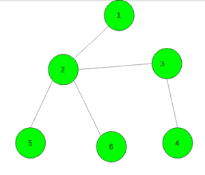

# 做一棵树，n 个顶点，d 个直径，最多顶点度数 k

> 原文:[https://www . geeksforgeeks . org/make-a-n 顶点-d-直径-最多顶点度数-k/](https://www.geeksforgeeks.org/make-a-tree-with-n-vertices-d-diameter-and-at-most-vertex-degree-k/)

给定三个整数 **N** 、 **D** 和 **K** 。任务是检查是否有可能做出一棵恰好有 **N** 个顶点、 **D** 个直径(任意两个顶点之间最长路径的边数)的树，每个顶点的度数最多必须为 **K** 。如果可能，打印所有可能的边缘，否则打印**否**。

**示例:**

> **输入:** N = 6，D = 3，K = 4
> **输出:**
> 1 2
> 2 3
> 3 4
> 5 2
> 6 2
> 
> 
> 
> **输入:** N = 6，D = 2，K = 4
> T3】输出: N0

**方法:**我们用以下算法构造树:如果(d>n–1)，则打印“否”并终止程序。否则，让我们保持长度为 n 的数组 deg，它将代表顶点的度数。
第一步是构造树的直径。让第一个(d + 1)个顶点构成它。

让我们在答案中添加 d 条边，并增加这些边对应的顶点的度数，如果某个顶点的度数大于 k，则打印“否”并终止程序。

第二步(也是最后一步)是将剩余的(n–d–1)个顶点连接到树上。如果顶点的度数小于 k，我们就称它为自由顶点。另外，让我们保留一些数据结构中形成直径的所有自由顶点，这允许我们取与任何其他顶点距离最小最大的顶点，并移除这些顶点。例如，可以通过一组对(dist <sub>v</sub> ，v)来完成，其中 dist <sub>v</sub> 是从顶点 v 到任何其他顶点的最大距离。现在我们把从顶点(d + 1) (0 索引)开始的所有顶点加到顶点 n？1、让当前顶点为 u，一个可以得到与任意其他顶点距离最小最大的顶点，让它为 v，现在增加顶点 u 和 v 的度数，加上它们之间的边，如果 v 还是自由的，就返回到数据结构中，否则去掉。顶点 u 也是如此(很明显，它到任何其他顶点的最大距离将等于(dist <sub>v</sub> + 1)。

如果在任何一步，我们的数据结构将是空的，或者最小最大距离将等于 d，答案是“否”。否则，我们可以打印答案。

下面是上述方法的实现:

## C++

```
// C++ implementation of the approach
#include <bits/stdc++.h>
using namespace std;

// Function to Make a tree with n vertices, d as it's
// diameter and degree of each vertex is at most k
void Make_tree(int n, int d, int k)
{
    // If diameter > n - 1
    // impossible to build tree
    if (d > n - 1) {
        cout << "No";
        return;
    }

    // To store the degree of each vertex
    vector<int> deg(n);

    // To store the edge between vertices
    vector<pair<int, int> > ans;

    // To store maximum distance among
    // all the paths from a vertex
    set<pair<int, int> > q;

    // Make diameter of tree equals to d
    for (int i = 0; i < d; ++i) {
        ++deg[i];
        ++deg[i + 1];
        if (deg[i] > k || deg[i + 1] > k) {
            cout << "NO" << endl;
            return;
        }

        // Add an edge between them
        ans.push_back(make_pair(i, i + 1));
    }

    // Store maximum distance of each vertex
    // from other vertices
    for (int i = 1; i < d; ++i)
        q.insert(make_pair(max(i, d - i), i));

    // For next (n - d - 1) edges
    for (int i = d + 1; i < n; ++i) {

        // If the vertex already has the degree k
        while (!q.empty() && deg[q.begin()->second] == k)
            q.erase(q.begin());

        // If not possible
        if (q.empty() || q.begin()->first == d) {
            cout << "No";
            return;
        }

        // Increase the degree of vertices
        ++deg[i];
        ++deg[q.begin()->second];

        // Add an edge between them
        ans.push_back(make_pair(i, q.begin()->second));

        // Store the maximum distance of this vertex
        // from other vertices
        q.insert(make_pair(q.begin()->first + 1, i));
    }

    // Print all the edges of the built tree
    for (int i = 0; i < n - 1; ++i)
        cout << ans[i].first + 1 << " "
             << ans[i].second + 1 << endl;
}

// Driver code
int main()
{
    int n = 6, d = 3, k = 4;
    Make_tree(n, d, k);

    return 0;
}
```

## 蟒蛇 3

```
# Python3 implementation of the approach

# Function to Make a tree with n vertices, d as it's
# diameter and degree of each vertex is at most k
def Make_tree(n, d, k):

    # If diameter > n - 1
    # impossible to build tree
    if (d > n - 1):
        print("No")
        return

    # To store the degree of each vertex
    deg = [0]*(n)

    # To store the edge between vertices
    ans = []

    # To store maximum distance among
    #all the paths from a vertex
    q = {}

    # Make diameter of tree equals to d
    for i in range(d):
        deg[i] += 1
        deg[i + 1] += 1
        if (deg[i] > k or deg[i + 1] > k):
            print("NO")
            return

        # Add an edge between them
        ans.append((i, i + 1))

    # Store maximum distance of each vertex
    # from other vertices
    for i in range(1, d):
        q[(max(i, d - i), i)] = 1

    # For next (n - d - 1) edges
    for i in range(d + 1, n):
        arr = list(q.keys())

        # If the vertex already has the degree k
        while (len(q) > 0 and deg[arr[0][1]] == k):
            del q[arr[0]]

        # If not possible
        if (len(q) == 0 or arr[0][0] == d):
            print ("No")
            return

        # Increase the degree of vertices
        deg[i] += 1
        deg[arr[0][1]] += 1

        # Add an edge between them
        ans.append((i, arr[0][1]))

        # Store the maximum distance of this vertex
        # from other vertices
        q[(arr[0][0] + 1, i)] = 1

    # Prall the edges of the built tree
    for i in range(n - 1):
        print(ans[i][0] + 1, ans[i][1]+ 1)

# Driver code
if __name__ == '__main__':
    n, d, k = 6, 3, 4
    Make_tree(n, d, k)

    # This code is contributed by mohit kumar 29.
```

## java 描述语言

```
<script>

// Javascript implementation of the approach

// Function to Make a tree with n vertices,
// d as it's diameter and degree of each
// vertex is at most k
function Make_tree(n, d, k)
{

    // If diameter > n - 1
    // impossible to build tree
    if (d > n - 1)
    {
        document.write("No");
        return;
    }

    // To store the degree of each vertex
    let deg = new Array(n);
    for(let i = 0; i < n; i++)
    {
        deg[i] = 0;
    }

    // To store the edge between vertices
    let ans = [];

    // To store maximum distance among
    // all the paths from a vertex
    let q = new Set();

    // Make diameter of tree equals to d
    for(let i = 0; i < d; ++i)
    {
        ++deg[i];
        ++deg[i + 1];

        if (deg[i] > k || deg[i + 1] > k)
        {
            document.write("NO<br>");
            return;
        }

        // Add an edge between them
        ans.push([i, i + 1]);
    }

    // Store maximum distance of each vertex
    // from other vertices
    for(let i = 1; i < d; ++i)
        q.add([Math.max(i, d - i), i]);

    // For next (n - d - 1) edges
    for(let i = d + 1; i < n; ++i)
    {
         let arr = Array.from(q);

        // If the vertex already has the degree k
        while (q.size != 0 && deg[arr[0][1]] == k)
            q.delete(arr[0]);

        // If not possible
        if (q.size == 0 || arr[0][0] == d)
        {
            document.write("No<br>")
            return;
        }

        // Increase the degree of vertices
        ++deg[i];
        ++deg[arr[0][1]];

        // Add an edge between them
        ans.push([i, arr[0][1]]);

        // Store the maximum distance of this
        // vertex from other vertices
        q.add([arr[0][0] + 1, i]);
    }

    // Print all the edges of the built tree
    for(let i = 0; i < n - 1; ++i)
        document.write((ans[i][0] + 1) + " " +
                       (ans[i][1] + 1) + "<br>");
}

// Driver code
let n = 6, d = 3, k = 4;
Make_tree(n, d, k);

// This code is contributed by unknown2108

</script>
```

**Output:** 

```
1 2
2 3
3 4
5 2
6 2
```