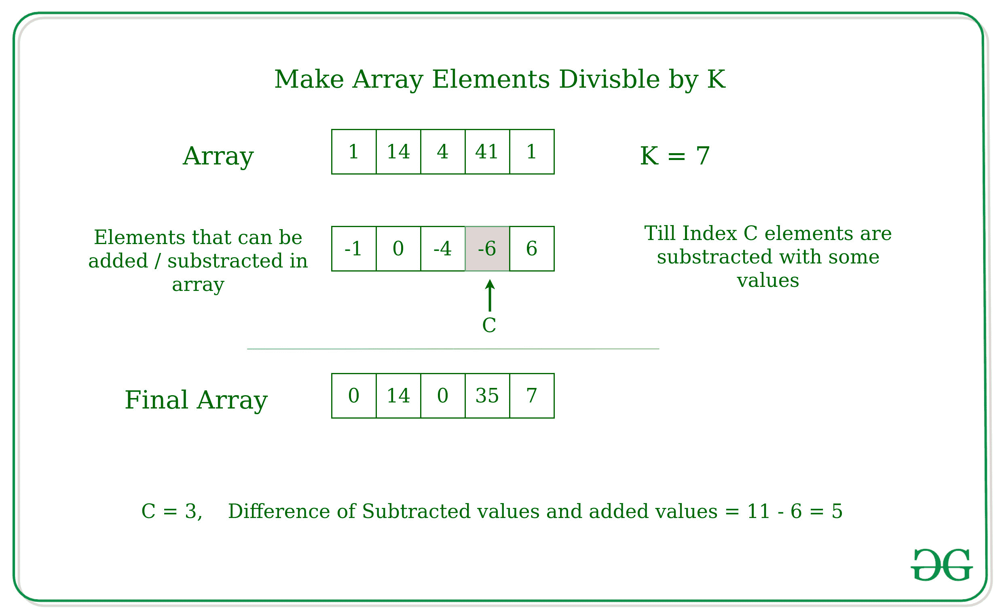

# 让所有数组元素都能被数字 K 整除

> 原文:[https://www . geesforgeks . org/make-all-array-elements-可被数字 k 整除/](https://www.geeksforgeeks.org/make-all-array-elements-divisible-by-a-number-k/)

给定一个数组 **arr[]** 和一个数字 **K** ，任务是让数组的所有元素都被 K 整除，要让元素被 K 整除，可以执行以下操作:

*   选择数组中的任意索引 C。
*   您可以从任何数字中减去任何值，直到索引 C，并且您可以将任何值添加到索引 C 之后出现的任何元素中
*   上述操作所需的唯一条件是，在索引 C 之前减去的值的总和可以添加到索引 C 之后的元素中

打印索引 C 的值和减去的数字与索引 C 后增加的数字的差。
**示例:**

> **输入:** arr[] = {1，14，4，41，1}，K = 7
> **输出:** C = 3，差= 5
> **解释:**
> 请参考下文解释。
> **输入:** arr[] = {1，10，19}，K=9
> **输出:** C = 2，差= 2

**说明:**



**进场:**

*   创建两个辅助数组 arr1[]和 arr2[]。
*   第一个数组 arr1[]存储元素的值，该值可以从每个元素中减去，使其在 arr[]中可被 K 整除。
*   第二个数组 arr2[]存储元素的值，该值可以相加使元素可被 k 整除。
*   然后迭代 C 的可能值，并找到一个索引，在该索引中，从 arr1[]到该索引的减数值之和大于或等于 arr2[]中 C 之后的索引加数值之和。

以下是上述方法的实现:

## C++

```
// C++ implementation to make
// the array elements divisible by K
#include <bits/stdc++.h>
using namespace std;

// Function to make array divisible
pair<int,int> makeDivisble(int arr[], int n, int k)
{

    vector<int>b1;
    vector<int>b2;
    int c, suml, sumr, index, rem;

    // For each element of array
    // how much number to be subtracted
    // to make it divisible by k
    for (int i = 0; i < n; i++)
        b1.push_back(arr[i] % k);

    // For each element of array
    // how much number to be added
    // to make it divisible by K
    for (int j = 0; j < n; j++)
        if ((arr[j] % k) != 0)
            b2.push_back(k - (arr[j] % k));
        else
            b2.push_back(0);

    c = 0;
    float mini = INT_MAX;
    suml = 0;
    sumr = 0;
    index = -1;

    // Calculate minimum difference
    for (int c = 0; c < n; c++)
    {
        suml = accumulate(b1.begin(),b1.begin() + c + 1, 0);
        sumr = accumulate(b2.begin() + c + 1 , b2.end(), 0);
        if (suml >= sumr)
        {
            rem = suml - sumr;
            if (rem < mini)
            {
                mini = rem;
                index = c;
            }
        }
    }

    return make_pair(index, mini);

}

// Driver Code
int main() {
    int arr[] = {1, 14, 4, 41, 1};
    int k = 7;
    int n=sizeof(arr)/sizeof(arr[0]);

    pair<int ,int>ans;
    ans = makeDivisble(arr, n, k);
    cout << ans.first << " " << ans.second;

    return 0;
}

// This code is contributed by Atul_kumar_Shrivastava
```

## 蟒蛇 3

```
# Python implementation to make
# the array elements divisible by K

# Function to make array divisible
def makeDivisble(arr, k):
    n = len(arr)
    b1 =[]
    b2 =[]

    # For each element of array
    # how much number to be subtracted
    # to make it divisible by k
    for i in range (n):
        b1.append(arr[i]% k)

    # For each element of array
    # how much number to be added
    # to make it divisible by K
    for j in range(n):
        if ((arr[j]% k)!= 0):
            b2.append(k-(arr[j]% k))
        else:
            b2.append(0)
    c = 0
    mini = float('inf')
    suml = 0
    sumr = 0
    index = -1

    # Calculate minimum difference
    for c in range(0, n+1, 1):
        suml = sum(b1[ : c + 1])
        sumr = sum(b2)
        if suml>= sumr:
            rem = suml-sumr
            if rem<mini:
                mini = rem
                index = c
    return index, mini

# Driver Code
if __name__ == "__main__":
    arr = [1, 14, 4, 41, 1]
    k = 7
    index, diff = makeDivisble(arr, k)
    print(index, diff)
```

**Output:** 

```
3 5
```

**时间复杂度:** O(N^2)
**辅助空间** : O(N)