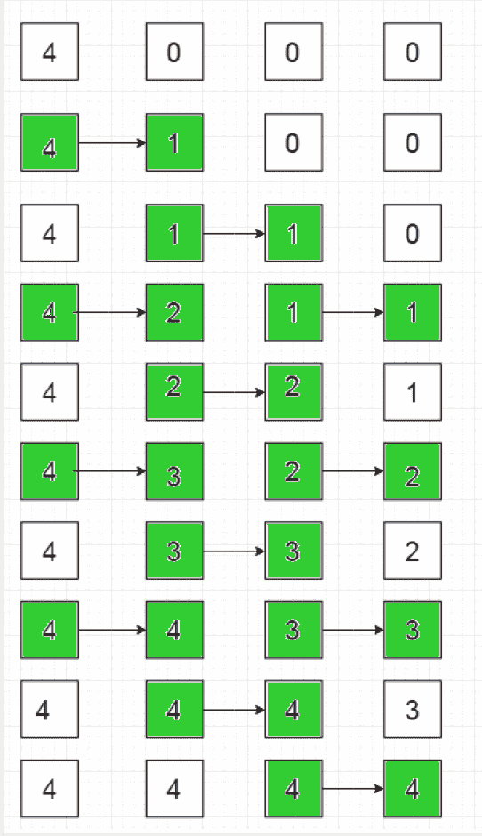

# 在最小步长内使数组元素相等

> 原文:[https://www . geesforgeks . org/make-array-elements-最小步长相等/](https://www.geeksforgeeks.org/make-array-elements-equal-in-minimum-steps/)

给定一个由 **N** 个元素组成的数组，其中第一个元素为非零正数 **M** ，其余 N–1 个元素为 0，任务是计算使整个数组相等所需的最小步数，同时遵守以下规则:
1。当且仅当 **i-1 <sup>第</sup>** 元素严格大于第
2 元素时， **i <sup>第</sup>T8】元素可以增加一。如果第**I**元素增加 1，则第 **i+1 <sup>第</sup>T21 元素不能同时增加。(即连续元素不能同时增加)
3。多个元素可以在一个步骤中同时递增。
**举例:****** 

> 输入:N = 3，M = 4
> 输出:8
> 说明:
> 数组为 4 0 0
> 在 **4** 中，索引 1 处的 steps 元素增加，所以数组变为 **{4，4，0}** 。在接下来的 4 个步骤中，索引 3 处的元素增加，因此数组变为 **{4，4，4}**
> 因此，需要 4 + 4 = **8** 操作来使所有数组元素相等
> 输入:N = 4，M = 4
> 输出:9
> **解释** :
> 步骤如下图所示
> 参考下面的流程图。



**方法:**
为了最大化每一步的增量数，创建更多数量的不平衡(数组[i] >数组[i+1])、
步骤 **1** ，元素 0 >元素 1 所以元素 1 增加，
步骤 **2** ，元素 1 >元素 2 所以元素 2 增加 1
步骤 **3** ， 元素 0 >元素 1 和元素 2 >元素 3 所以元素 1 & 3 增加 1
步长 **4** ，元素 1 >元素 2 元素 3 >元素 4 所以元素 2 & 4 增加
步长 **5** ，元素 0 >元素 1； 要素 2 >要素 3；要素 4 >要素 5；所以元素 1、3、& 5 递增。
以此类推……
考虑以下数组，
5 0 0 0 0 0
1)**5 1**0 0 0 0 0
2)5**1 1**0 0 0
3)**5 2 1**0
4)5**2 1 1**0
5)**5 3 2 1**6)5**3 2【T38 5**4 4 3 3**2
9)**5 5 4 3**
10)5**5 5 4**3
11)5 5**5 5 4**5
12)5 5 5**5**4
13)5 5 5**5**T60】注意，不平衡后 在步骤 1 中，元素 1 增加到 1，在步骤 2 中，元素 2 增加到 1，在步骤 3 中，元素 3 增加到 1，因此在步骤 n-1 中，第 n-1 <sup>个</sup>元素将变成 1。之后，第 n-1 <sup>个</sup>元素在交替的步骤中增加 1，直到它达到元素 0 的值。然后整个数组变得相等。
所以最后一个元素后面的图案是
**(0，0，0..，0)** 直到第(N–4)<sup>个</sup>元素变为 1，即 **n-4 步**
，之后，
**(0，0，1，1，2，2，3，4，4，…M–1，M–1，M)** ，即 **2*m + 1 步**。
所以最终结果变成**(N–3)+2 * M**
有几个角落的情况需要处理，即。当 **N = 1** 时，数组只有一个元素，所以需要的步数= 0。当 **N = 2** 时，所需步数等于 M** 

## C++

```
// C++ program to make the array elements equal in minimum steps

#include <bits/stdc++.h>
using namespace std;

// Returns the minimum steps required to make an array of N
// elements equal, where the first array element equals M
int steps(int N, int M)
{
    // Corner Case 1: When N = 1
    if (N == 1)
        return 0;

    // Corner Case 2: When N = 2
    else if (N == 2) // corner case 2
        return M;

    return 2 * M + (N - 3);
}

// Driver Code
int main()
{
    int N = 4, M = 4;
    cout << steps(N, M);
    return 0;
}
```

## Java 语言(一种计算机语言，尤用于创建网站)

```
// Java program to make the array elements
// equal in minimum steps

import java.io.*;

class GFG {

    // Returns the minimum steps required
    // to make an array of N elements equal,
    // where the first array element equals M
    static int steps(int N, int M)
    {
        // Corner Case 1: When N = 1
        if (N == 1)
            return 0;

        // Corner Case 2: When N = 2
        else if (N == 2) // corner case 2
            return M;

        return 2 * M + (N - 3);
    }

    // Driver Code
    public static void main (String[] args)
    {
        int N = 4, M = 4;
        System.out.print( steps(N, M));
    }
}

// This code is contributed by anuj_67.
```

## 蟒蛇 3

```
# Python program to make
# the array elements equal
# in minimum steps

# Returns the minimum steps
# required to make an array
# of N elements equal, where
# the first array element
# equals M
def steps(N, M):

    # Corner Case 1: When N = 1
    if (N == 1):
        return 0

    # Corner Case 2: When N = 2
    elif(N == 2):
        return M

    return 2 * M + (N - 3)

# Driver Code
N = 4
M = 4
print(steps(N,M))

# This code is contributed
# by Shivi_Aggarwal.
```

## C#

```
// C# program to make the array
// elements equal in minimum steps
using System;

class GFG
{

    // Returns the minimum steps
    // required to make an array
    // of N elements equal, where
    // the first array element
    // equals M
    static int steps(int N, int M)
    {
        // Corner Case 1: When N = 1
        if (N == 1)
             return 0;

        // Corner Case 2: When N = 2
        else if (N == 2) // corner case 2
            return M;

        return 2 * M + (N - 3);
    }

    // Driver Code
    public static void Main ()
    {
        int N = 4, M = 4;
        Console.WriteLine(steps(N, M));
    }
}

// This code is contributed by anuj_67.
```

## 服务器端编程语言（Professional Hypertext Preprocessor 的缩写）

```
<?php
// PHP program to make the array
// elements equal in minimum steps

// Returns the minimum steps required
// to make an array of N elements equal,
// where the first array element equals M
function steps($N, $M)
{
    // Corner Case 1: When N = 1
    if ($N == 1)
        return 0;

    // Corner Case 2: When N = 2
    else if ($N == 2) // corner case 2
        return $M;

    return 2 * $M + ($N - 3);
}

// Driver Code
$N = 4;
$M = 4;
echo steps($N, $M);

// This code is contributed by ajit
?>
```

## java 描述语言

```
<script>
    // Javascript program to make the array
    // elements equal in minimum steps

    // Returns the minimum steps
    // required to make an array
    // of N elements equal, where
    // the first array element
    // equals M
    function steps(N, M)
    {
        // Corner Case 1: When N = 1
        if (N == 1)
             return 0;

        // Corner Case 2: When N = 2
        else if (N == 2) // corner case 2
            return M;

        return 2 * M + (N - 3);
    }

    let N = 4, M = 4;
      document.write(steps(N, M));

   // This code is contributed by suresh07.
</script>
```

**Output:** 

```
9
```