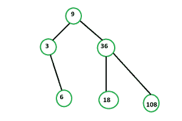

# 打造二叉查找树

> 原文:[https://www.geeksforgeeks.org/make-binary-search-tree/](https://www.geeksforgeeks.org/make-binary-search-tree/)

给定一个大小为 **N** 的数组 **arr[]** 。任务是找出是否可能用给定的元素数组制作二叉查找树，使得由公共边连接的任意两个顶点的[最大公约数](https://www.geeksforgeeks.org/c-program-find-gcd-hcf-two-numbers/)为 **> 1** 。如果可能，则打印**是**否则打印**否**。
**示例:**

> **输入:** arr[] = {3，6，9，18，36，108 }
> T3】输出:是
> 
> 
> 
> 这是给定数组的可能二叉查找树之一。
> **输入:** arr[] = {2，17}
> **输出:**否

**方法:**让 **DP(l，r，根)**成为一个 DP，决定是否有可能从子段【l】组装一棵扎根于根的树..r]。
很容易看出计算它需要从【l】中提取这样的根<sub>左</sub>..根–1]和从[根+1]开始的根<sub>右</sub>..右]这样:

*   gcd(一根<sub>根</sub>，一根<sub>根</sub> ) > 1
*   gcd(a <sub>根</sub>，a <sub>根</sub> ) > 1
*   DP(l，根-1，根<sub>左</sub> ) = 1
*   DP(根+1，r，根<sub>右</sub> ) = 1

这可以在 O(r–l)中完成，前提是我们给定了[l]的所有子段的所有 DP(x，y，z)值..r]。考虑到总共有 O(n <sup>3</sup> )个 DP 状态，最后的复杂度就是 O(n <sup>4</sup> )了，太多了。
让我们把 DP 变成 DPnew(l，r，state)，状态可以是 0 也可以是 1。立即发现，DP(l，r，root)是从 DPnew(l，root-1，1)和 DPnew(root+1，r，0)继承而来的。现在我们有了 O(n <sup>2</sup> 状态，但同时所有的转换都是以线性时间进行的。因此最终的复杂性是 O(n <sup>3</sup> ，这足以通过。
以下是上述方法的实施:

## C++

```
// C++ implementation of the approach
#include <bits/stdc++.h>
using namespace std;

// Maximum number of vertices
#define N 705

// To store is it possible at
// particular pace or not
int dp[N][N][2];

// Return 1 if from l to r, it is possible with
// the given state
int possibleWithState(int l, int r, int state, int a[])
{
    // Base condition
    if (l > r)
        return 1;

    // If it is already calculated
    if (dp[l][r][state] != -1)
        return dp[l][r][state];

    // Choose the root
    int root;
    if (state == 1)
        root = a[r + 1];
    else
        root = a[l - 1];

    // Traverse in range l to r
    for (int i = l; i <= r; i++) {

        // If gcd is greater than one
        // check for both sides
        if (__gcd(a[i], root) > 1) {
            int x = possibleWithState(l, i - 1, 1, a);
            if (x != 1)
                continue;
            int y = possibleWithState(i + 1, r, 0, a);
            if (x == 1 && y == 1)
                return dp[l][r][state] = 1;
        }
    }

    // If not possible
    return dp[l][r][state] = 0;
}

// Function that return true if it is possible
// to make Binary Search Tree
bool isPossible(int a[], int n)
{
    memset(dp, -1, sizeof dp);

    // Sort the given array
    sort(a, a + n);

    // Check it is possible rooted at i
    for (int i = 0; i < n; i++)

        // Check at both sides
        if (possibleWithState(0, i - 1, 1, a)
            && possibleWithState(i + 1, n - 1, 0, a)) {
            return true;
        }

    return false;
}

// Driver code
int main()
{
    int a[] = { 3, 6, 9, 18, 36, 108 };
    int n = sizeof(a) / sizeof(a[0]);

    if (isPossible(a, n))
        cout << "Yes";
    else
        cout << "No";

    return 0;
}
```

## Java 语言(一种计算机语言，尤用于创建网站)

```
// Java implementation of the approach
import java.util.*;
class GFG
{

static int __gcd(int a, int b)
{

    // Everything divides 0
    if (a == 0)
        return b;
    if (b == 0)
        return a;

    // base case
    if (a == b)
        return a;

    // a is greater
    if (a > b)
        return __gcd(a - b, b);
    return __gcd(a, b-a);
}

// Maximum number of vertices
static final int N = 705;

// To store is it possible at
// particular pace or not
static int dp[][][] = new int[N][N][2];

// Return 1 if from l to r, it is
// possible with the given state
static int possibleWithState(int l, int r,
                        int state, int a[])
{
    // Base condition
    if (l > r)
        return 1;

    // If it is already calculated
    if (dp[l][r][state] != -1)
        return dp[l][r][state];

    // Choose the root
    int root;
    if (state == 1)
        root = a[r + 1];
    else
        root = a[l - 1];

    // Traverse in range l to r
    for (int i = l; i <= r; i++)
    {

        // If gcd is greater than one
        // check for both sides
        if (__gcd(a[i], root) > 1)
        {
            int x = possibleWithState(l, i - 1, 1, a);
            if (x != 1)
                continue;

            int y = possibleWithState(i + 1, r, 0, a);

            if (x == 1 && y == 1)
                return dp[l][r][state] = 1;
        }
    }

    // If not possible
    return dp[l][r][state] = 0;
}

// Function that return true if it is possible
// to make Binary Search Tree
static boolean isPossible(int a[], int n)
{
    for(int i = 0; i < dp.length; i++)
        for(int j = 0; j < dp[i].length; j++)
            for(int k = 0; k < dp[i][j].length; k++)
                dp[i][j][k]=-1;

    // Sort the given array
    Arrays.sort(a);

    // Check it is possible rooted at i
    for (int i = 0; i < n; i++)

        // Check at both sides
        if (possibleWithState(0, i - 1, 1, a) != 0 &&
            possibleWithState(i + 1, n - 1, 0, a) != 0)
        {
            return true;
        }

    return false;
}

// Driver code
public static void main(String args[])
{
    int a[] = { 3, 6, 9, 18, 36, 108 };
    int n = a.length;

    if (isPossible(a, n))
        System.out.println("Yes");
    else
        System.out.println("No");

}
}

// This code is contributed by
// Arnab Kundu
```

## 蟒蛇 3

```
# Python3 implementation of the approach
import math

# Maximum number of vertices
N = 705

# To store is it possible at
# particular pace or not
dp = [[[-1 for z in range(2)]
           for x in range(N)]
           for y in range(N)]

# Return 1 if from l to r, it is
# possible with the given state
def possibleWithState(l, r, state, a):

    # Base condition
    if (l > r):
        return 1

    # If it is already calculated
    if (dp[l][r][state] != -1):
        return dp[l][r][state]

    # Choose the root
    root = 0
    if (state == 1) :
        root = a[r + 1]
    else:
        root = a[l - 1]

    # Traverse in range l to r
    for i in range(l, r + 1):

        # If gcd is greater than one
        # check for both sides
        if (math.gcd(a[i], root) > 1):
            x = possibleWithState(l, i - 1, 1, a)
            if (x != 1):
                continue
            y = possibleWithState(i + 1, r, 0, a)
            if (x == 1 and y == 1) :
                return 1

    # If not possible
    return 0

# Function that return true if it is
# possible to make Binary Search Tree
def isPossible(a, n):

    # Sort the given array
    a.sort()

    # Check it is possible rooted at i
    for i in range(n):

        # Check at both sides
        if (possibleWithState(0, i - 1, 1, a) and
            possibleWithState(i + 1, n - 1, 0, a)):
            return True

    return False

# Driver Code
if __name__ == '__main__':
    a = [3, 6, 9, 18, 36, 108]
    n = len(a)
    if (isPossible(a, n)):
        print("Yes")
    else:
        print("No")

# This code is contributed by
# Shubham Singh(SHUBHAMSINGH10)
```

## C#

```
// C# implementation of the approach
using System;

class GFG
{

static int __gcd(int a, int b)
{

    // Everything divides 0
    if (a == 0)
        return b;
    if (b == 0)
        return a;

    // base case
    if (a == b)
        return a;

    // a is greater
    if (a > b)
        return __gcd(a - b, b);
    return __gcd(a, b-a);
}

// Maximum number of vertices
static int N = 705;

// To store is it possible at
// particular pace or not
static int [,,]dp = new int[N, N, 2];

// Return 1 if from l to r, it is
// possible with the given state
static int possibleWithState(int l, int r,
                        int state, int []a)
{
    // Base condition
    if (l > r)
        return 1;

    // If it is already calculated
    if (dp[l, r, state] != -1)
        return dp[l, r, state];

    // Choose the root
    int root;
    if (state == 1)
        root = a[r + 1];
    else
        root = a[l - 1];

    // Traverse in range l to r
    for (int i = l; i <= r; i++)
    {

        // If gcd is greater than one
        // check for both sides
        if (__gcd(a[i], root) > 1)
        {
            int x = possibleWithState(l, i - 1, 1, a);
            if (x != 1)
                continue;

            int y = possibleWithState(i + 1, r, 0, a);

            if (x == 1 && y == 1)
                return dp[l,r,state] = 1;
        }
    }

    // If not possible
    return dp[l,r,state] = 0;
}

// Function that return true
// if it is possible to make
// Binary Search Tree
static bool isPossible(int []a, int n)
{
    for(int i = 0; i < dp.GetLength(0); i++)
        for(int j = 0; j < dp.GetLength(1); j++)
            for(int k = 0; k < dp.GetLength(2); k++)
                dp[i, j, k]=-1;

    // Sort the given array
    Array.Sort(a);

    // Check it is possible rooted at i
    for (int i = 0; i < n; i++)

        // Check at both sides
        if (possibleWithState(0, i - 1, 1, a) != 0 &&
            possibleWithState(i + 1, n - 1, 0, a) != 0)
        {
            return true;
        }

    return false;
}

// Driver code
public static void Main(String []args)
{
    int []a = { 3, 6, 9, 18, 36, 108 };
    int n = a.Length;

    if (isPossible(a, n))
        Console.WriteLine("Yes");
    else
        Console.WriteLine("No");

}
}

// This code is contributed by 29AjayKumar
```

## java 描述语言

```
<script>

// Javascript implementation of the approach

function __gcd(a, b)
{

    // Everything divides 0
    if (a == 0)
        return b;
    if (b == 0)
        return a;

    // base case
    if (a == b)
        return a;

    // a is greater
    if (a > b)
        return __gcd(a - b, b);
    return __gcd(a, b-a);
}

// Maximum number of vertices
var N = 705;

// To store is it possible at
// particular pace or not
var dp = Array.from(Array(N), ()=>Array(N));
for(var i = 0; i<N; i++)
{
    for(var j = 0; j<N; j++)
    {
        dp[i][j] = new Array(2).fill(-1);
    }
}

// Return 1 if from l to r, it is
// possible with the given state
function possibleWithState(l, r, state,a)
{
    // Base condition
    if (l > r)
        return 1;

    // If it is already calculated
    if (dp[l][r][state] != -1)
        return dp[l][r][state];

    // Choose the root
    var root;
    if (state == 1)
        root = a[r + 1];
    else
        root = a[l - 1];

    // Traverse in range l to r
    for (var i = l; i <= r; i++)
    {

        // If gcd is greater than one
        // check for both sides
        if (__gcd(a[i], root) > 1)
        {
            var x = possibleWithState(l, i - 1, 1, a);
            if (x != 1)
                continue;

            var y = possibleWithState(i + 1, r, 0, a);

            if (x == 1 && y == 1)
                return dp[l][r][state] = 1;
        }
    }

    // If not possible
    return dp[l][r][state] = 0;
}

// Function that return true
// if it is possible to make
// Binary Search Tree
function isPossible(a, n)
{

    // Sort the given array
    a.sort();

    // Check it is possible rooted at i
    for (var i = 0; i < n; i++)

        // Check at both sides
        if (possibleWithState(0, i - 1, 1, a) != 0 &&
            possibleWithState(i + 1, n - 1, 0, a) != 0)
        {
            return true;
        }

    return false;
}

// Driver code
var a = [3, 6, 9, 18, 36, 108];
var n = a.length;
if (isPossible(a, n))
    document.write("Yes");
else
    document.write("No");

// This code is contributed by itsok.
</script>
```

**Output:** 

```
Yes
```