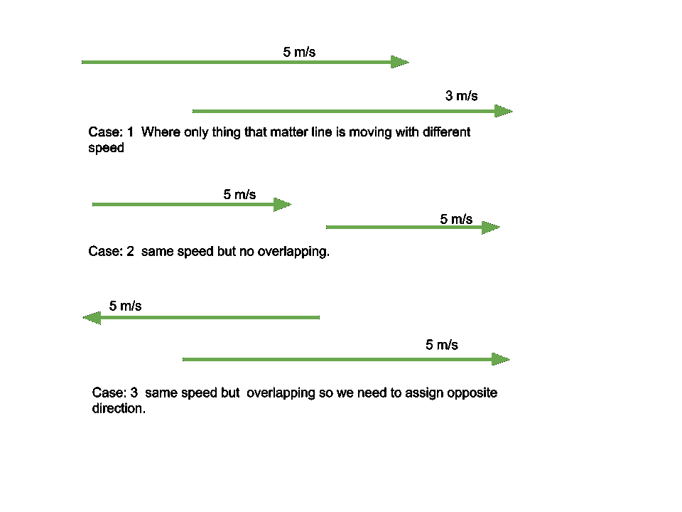

# 通过指定方向使给定的线段不重叠

> 原文:[https://www . geesforgeks . org/make-given-segments-非重叠-通过分配方向/](https://www.geeksforgeeks.org/make-given-segments-non-overlapping-by-assigning-directions/)

给定由形式为 **{L，R，V}** 的 **N** 段组成的[阵列](https://www.geeksforgeeks.org/introduction-to-arrays/)**arr【】【】【】【】T3】，其中，**【L，R】**表示在任何方向上具有速度 **V** 的段，任务是检查是否可以将方向指定为向左或向右，以使它们在很长一段时间后不与**相交**。**

**示例:**

> **输入:** arr[][] = {{5，7，2}，{4，6，1}，{1，5，2}，{6，5，1}}
> **输出:**是
> **解释:**将左方向分配给第一和第二段，将右方向分配给第三和第四段。
> 
> **输入:** arr[][] = {{1，2，3}}
> **输出:**是

**方法:**给定的问题可以基于以下观察来解决:

*   **<u>情况 1</u> :两段速度不同时:**
    *   想法是给两个线段指定相同的方向。
    *   因此，在很长一段时间后，这些线段将永远不会相交或重叠。有可能在这段时间里，在某个地方这些片段重叠了。然后，最终一段将超越另一段。
*   **<u>情况 2</u> :当两段速度相同，但 t = 0 时不相交:**
    *   这个想法是给两个线段指定相同的运动方向。
    *   由于它们的相对位置不会因为相同的速度和相同的方向而改变，所以在无限时间后，它们的相对位置将保持不变，不会重叠。
*   **<u>情况 3</u> :当两段速度相同，且初始重合/相交时。**
    *   这个想法是给它们指定相反的运动方向。

下面的例子说明了上述所有情况:



根据以上观察，想法是[为所有的](https://www.geeksforgeeks.org/graph-and-its-representations/)[重叠线段](https://www.geeksforgeeks.org/maximum-number-of-elements-without-overlapping-in-a-line/)创建一个图形，并检查创建的[图形是否是二分的](https://www.geeksforgeeks.org/bipartite-graph/)。如果创建的图是二分图，那么可以将方向分配给所有的线段，使得它们在很长一段时间后不会相交。因此，打印**“是”**。否则，打印**“否”**。
按照以下步骤解决问题:

*   [从给定的数组中生成所有可能的不同元素对](https://www.geeksforgeeks.org/find-all-pairs-possible-from-the-given-array/) **arr[][]** 。如果任意一对线段 **(arr[i]，arr[j])** 重叠，则在它们之间添加一条无向边 **(i，j)** 。
*   [检查给定的图对于范围**【0，N-1】**内所有可能的节点是否是二分图](https://www.geeksforgeeks.org/bipartite-graph/)。如果发现属实，则打印**“是”**。否则，打印**“否”**。

下面是上述方法的实现:

## C++

```
// C++ program for the above approach

#include <bits/stdc++.h>
using namespace std;

// Stores the details of the Segment
struct Node {
    int L, R, V;
};

// Function to check whether the
// graph is bipartite or not
bool check(vector<int> Adj[], int Src,
           int N, bool visited[])
{
    int color[N] = { 0 };

    // Mark source node as visited
    visited[Src] = true;

    queue<int> q;

    // Push the source vertex in queue
    q.push(Src);

    while (!q.empty()) {

        // Get the front of the queue
        int u = q.front();
        q.pop();

        // Assign the color
        // to the popped node
        int Col = color[u];

        // Traverse the adjacency
        // list of the node u
        for (int x : Adj[u]) {

            // If any node is visited &
            // a different colors has been
            // assigned, then return false
            if (visited[x] == true
                && color[x] == Col) {
                return false;
            }

            else if (visited[x] == false) {

                // Set visited[x]
                visited[x] = true;

                // Push the node x
                // into the queue
                q.push(x);

                // Update color of node
                color[x] = 1 - Col;
            }
        }
    }

    // If the graph is bipartite
    return true;
}

// Function to add an edge
// between the nodes u and v
void addEdge(vector<int> Adj[],
             int u, int v)
{
    Adj[u].push_back(v);
    Adj[v].push_back(u);
}

// Function to check if the assignment
// of direction can be possible to all
// the segments, such that they do not
// intersect after a long period of time
void isPossible(struct Node Arr[], int N)
{
    // Stores the adjacency list
    // of the created graph
    vector<int> Adj[N];

    // Generate all possible pairs
    for (int i = 0; i < N - 1; i++) {

        for (int j = i + 1; j < N; j++) {

            // If segments do not overlap
            if (Arr[i].R < Arr[j].L
                || Arr[i].L > Arr[j].R) {
                continue;
            }

            // Otherwise, the segments overlap
            else {

                if (Arr[i].V == Arr[j].V) {

                    // If both segments have
                    // same speed, then add an edge
                    addEdge(Adj, i, j);
                }
            }
        }
    }

    // Keep the track of visited nodes
    bool visited[N] = { false };

    // Iterate for all possible nodes
    for (int i = 0; i < N; i++) {

        if (visited[i] == false
            && Adj[i].size() > 0) {

            // Check whether graph is
            // bipartite or not
            if (check(Adj, i, N, visited)
                == false) {

                cout << "No";
                return;
            }
        }
    }

    // If the graph is bipartite
    cout << "Yes";
}

// Driver Code
int main()
{
    struct Node arr[] = {
        { 5, 7, 2 }, { 4, 6, 1 },
        { 1, 5, 2 }, { 6, 5, 1 }
    };
    int N = sizeof(arr) / sizeof(arr[0]);

    isPossible(arr, N);

    return 0;
}
```

## Java 语言(一种计算机语言，尤用于创建网站)

```
// Java program for the above approach
import java.io.*;
import java.lang.*;
import java.util.*;

class GFG{

// Stores the details of the Segment
static class Node
{
    int L, R, V;

    Node(int L, int R, int V)
    {
        this.L = L;
        this.R = R;
        this.V = V;
    }
}

// Function to check whether the
// graph is bipartite or not
static boolean check(ArrayList<Integer> Adj[], int Src,
                     int N, boolean visited[])
{
    int color[] = new int[N];

    // Mark source node as visited
    visited[Src] = true;

    ArrayDeque<Integer> q = new ArrayDeque<>();

    // Push the source vertex in queue
    q.addLast(Src);

    while (!q.isEmpty())
    {

        // Get the front of the queue
        int u = q.removeFirst();

        // Assign the color
        // to the popped node
        int Col = color[u];

        // Traverse the adjacency
        // list of the node u
        for(int x : Adj[u])
        {

            // If any node is visited &
            // a different colors has been
            // assigned, then return false
            if (visited[x] == true && color[x] == Col)
            {
                return false;
            }

            else if (visited[x] == false)
            {

                // Set visited[x]
                visited[x] = true;

                // Push the node x
                // into the queue
                q.addLast(x);

                // Update color of node
                color[x] = 1 - Col;
            }
        }
    }

    // If the graph is bipartite
    return true;
}

// Function to add an edge
// between the nodes u and v
static void addEdge(ArrayList<Integer> Adj[], int u,
                                              int v)
{
    Adj[u].add(v);
    Adj[v].add(u);
}

// Function to check if the assignment
// of direction can be possible to all
// the segments, such that they do not
// intersect after a long period of time
static void isPossible(Node Arr[], int N)
{

    // Stores the adjacency list
    // of the created graph
    @SuppressWarnings("unchecked")
    ArrayList<Integer> [] Adj = (ArrayList<Integer>[])new ArrayList[N];

    // Initialize
    for(int i = 0; i < N; i++)
        Adj[i] = new ArrayList<>();

    // Generate all possible pairs
    for(int i = 0; i < N - 1; i++)
    {
        for(int j = i + 1; j < N; j++)
        {

            // If segments do not overlap
            if (Arr[i].R < Arr[j].L ||
                Arr[i].L > Arr[j].R)
            {
                continue;
            }

            // Otherwise, the segments overlap
            else
            {
                if (Arr[i].V == Arr[j].V)
                {

                    // If both segments have
                    // same speed, then add an edge
                    addEdge(Adj, i, j);
                }
            }
        }
    }

    // Keep the track of visited nodes
    boolean visited[] = new boolean[N];

    // Iterate for all possible nodes
    for(int i = 0; i < N; i++)
    {
        if (visited[i] == false && Adj[i].size() > 0)
        {

            // Check whether graph is
            // bipartite or not
            if (check(Adj, i, N, visited) == false)
            {

                System.out.println("No");
                return;
            }
        }
    }

    // If the graph is bipartite
    System.out.println("Yes");
}

// Driver Code
public static void main(String[] args)
{
    Node arr[] = { new Node(5, 7, 2), new Node(4, 6, 1),
                   new Node(1, 5, 2), new Node(6, 5, 1) };

    int N = arr.length;

    isPossible(arr, N);
}
}

// This code is contributed by Kingash
```

## 蟒蛇 3

```
# Python3 program for the above approach
from collections import deque

# Function to check whether the
# graph is bipartite or not
def check(Adj, Src, N, visited):

    color = [0] * N

    # Mark source node as visited
    visited = [True] * Src
    q = deque()

    # Push the source vertex in queue
    q.append(Src)

    while (len(q) > 0):

        # Get the front of the queue
        u = q.popleft()
        # q.pop()

        # Assign the color
        # to the popped node
        Col = color[u]

        # Traverse the adjacency
        # list of the node u
        for x in Adj[u]:

            # If any node is visited &
            # a different colors has been
            # assigned, then return false
            if (visited[x] == True and
                color[x] == Col):
                return False

            elif (visited[x] == False):

                # Set visited[x]
                visited[x] = True

                # Push the node x
                # into the queue
                q.append(x)

                # Update color of node
                color[x] = 1 - Col

    # If the graph is bipartite
    return True

# Function to add an edge
# between the nodes u and v
def addEdge(Adj, u, v):

    Adj[u].append(v)
    Adj[v].append(u)
    return Adj

# Function to check if the assignment
# of direction can be possible to all
# the segments, such that they do not
# intersect after a long period of time
def isPossible(Arr, N):

    # Stores the adjacency list
    # of the created graph
    Adj = [[] for i in range(N)]

    # Generate all possible pairs
    for i in range(N - 1):
        for j in range(i + 1, N):

            # If segments do not overlap
            if (Arr[i][0] < Arr[j][1] or
                Arr[i][1] > Arr[j][0]):
                continue

            # Otherwise, the segments overlap
            else:

                if (Arr[i][2] == Arr[j][2]):

                    # If both segments have
                    # same speed, then add an edge
                    Adj = addEdge(Adj, i, j)

    # Keep the track of visited nodes
    visited = [False] * N

    # Iterate for all possible nodes
    for i in range(N):
        if (visited[i] == False and len(Adj[i]) > 0):

            # Check whether graph is
            # bipartite or not
            if (check(Adj, i, N, visited) == False):
                print ("No")
                return

    # If the graph is bipartite
    print ("Yes")

# Driver Code
if __name__ == '__main__':

    arr = [ [ 5, 7, 2 ], [ 4, 6, 1 ],
            [ 1, 5, 2 ], [ 6, 5, 1 ] ]
    N = len(arr)

    isPossible(arr, N)

# This code is contributed by mohit kumar 29
```

## C#

```
// C# program for the above approach
using System;
using System.Collections.Generic;

class GFG{

// Stores the details of the Segment
class Node
{
    public int L, R, V;
};

static Node newNode(int L, int R, int V)
{
    Node temp = new Node();
    temp.L = L;
    temp.R = R;
    temp.V = V;
    return temp;
}

// Function to check whether the
// graph is bipartite or not
static bool check(List<int> []Adj, int Src,
                     int N, bool []visited)
{
    int []color = new int[N];

    // Mark source node as visited
    visited[Src] = true;

    Queue<int> q = new Queue<int>();

    // Push the source vertex in queue
    q.Enqueue(Src);

    while (q.Count > 0)
    {

        // Get the front of the queue
        int u = q.Peek();
        q.Dequeue();

        // Assign the color
        // to the popped node
        int Col = color[u];

        // Traverse the adjacency
        // list of the node u
        foreach (int x in Adj[u])
        {

            // If any node is visited &
            // a different colors has been
            // assigned, then return false
            if (visited[x] == true &&
                  color[x] == Col)
            {
                return false;
            }

            else if (visited[x] == false)
            {

                // Set visited[x]
                visited[x] = true;

                // Push the node x
                // into the queue
                q.Enqueue(x);

                // Update color of node
                color[x] = 1 - Col;
            }
        }
    }

    // If the graph is bipartite
    return true;
}

// Function to add an edge
// between the nodes u and v
static void addEdge(List<int> []Adj, int u, int v)
{
    Adj[u].Add(v);
    Adj[v].Add(u);
}

// Function to check if the assignment
// of direction can be possible to all
// the segments, such that they do not
// intersect after a long period of time
static void isPossible(Node []Arr, int N)
{

    // Stores the adjacency list
    // of the created graph
    List<int> [] Adj = new List<int>[N];

    // Initialize
    for(int i = 0; i < N; i++)
        Adj[i] = new List<int>();

    // Generate all possible pairs
    for(int i = 0; i < N - 1; i++)
    {
        for(int j = i + 1; j < N; j++)
        {

            // If segments do not overlap
            if (Arr[i].R < Arr[j].L ||
                Arr[i].L > Arr[j].R)
            {
                continue;
            }

            // Otherwise, the segments overlap
            else
            {
                if (Arr[i].V == Arr[j].V)
                {

                    // If both segments have
                    // same speed, then add an edge
                    addEdge(Adj, i, j);
                }
            }
        }
    }

    // Keep the track of visited nodes
    bool []visited = new bool[N];

    // Iterate for all possible nodes
    for(int i = 0; i < N; i++)
    {
        if (visited[i] == false && Adj[i].Count > 0)
        {

            // Check whether graph is
            // bipartite or not
            if (check(Adj, i, N, visited) == false)
            {
                Console.Write("No");
                return;
            }
        }
    }

    // If the graph is bipartite
    Console.Write("Yes");
}

// Driver Code
public static void Main()
{
    Node []arr = { newNode(5, 7, 2), newNode(4, 6, 1),
                   newNode(1, 5, 2), newNode(6, 5, 1) };

    int N = arr.Length;

    isPossible(arr, N);
}
}

// This code is contributed by SURENDRA_GANGWAR
```

## java 描述语言

```
<script>

// JavaScript program for the above approach

// Stores the details of the Segment
class Node
{
    constructor(L,R,V)
    {
        this.L = L;
        this.R = R;
        this.V = V;
    }
}

// Function to check whether the
// graph is bipartite or not
function check(Adj,Src,N,visited)
{
    let color = new Array(N);

    // Mark source node as visited
    visited[Src] = true;

    let q = [];

    // Push the source vertex in queue
    q.push(Src);

    while (q.length!=0)
    {

        // Get the front of the queue
        let u = q.shift();

        // Assign the color
        // to the popped node
        let Col = color[u];

        // Traverse the adjacency
        // list of the node u
        for(let x=0;x< Adj[u].length;x++)
        {

            // If any node is visited &
            // a different colors has been
            // assigned, then return false
            if (visited[Adj[u][x]] == true && color[Adj[u][x]] == Col)
            {
                return false;
            }

            else if (visited[Adj[u][x]] == false)
            {

                // Set visited[x]
                visited[Adj[u][x]] = true;

                // Push the node x
                // into the queue
                q.push(Adj[u][x]);

                // Update color of node
                color[Adj[u][x]] = 1 - Col;
            }
        }
    }

    // If the graph is bipartite
    return true;
}

// Function to add an edge
// between the nodes u and v
function addEdge(Adj,u,v)
{
    Adj[u].push(v);
    Adj[v].push(u);
}

// Function to check if the assignment
// of direction can be possible to all
// the segments, such that they do not
// intersect after a long period of time
function isPossible(Arr,N)
{
    // Stores the adjacency list
    // of the created graph

    let Adj = new Array(N);

    // Initialize
    for(let i = 0; i < N; i++)
        Adj[i] = [];

    // Generate all possible pairs
    for(let i = 0; i < N - 1; i++)
    {
        for(let j = i + 1; j < N; j++)
        {

            // If segments do not overlap
            if (Arr[i].R < Arr[j].L ||
                Arr[i].L > Arr[j].R)
            {
                continue;
            }

            // Otherwise, the segments overlap
            else
            {
                if (Arr[i].V == Arr[j].V)
                {

                    // If both segments have
                    // same speed, then add an edge
                    addEdge(Adj, i, j);
                }
            }
        }
    }

    // Keep the track of visited nodes
    let visited = new Array(N);
    for(let i=0;i<N;i++)
        visited[i]=false;

    // Iterate for all possible nodes
    for(let i = 0; i < N; i++)
    {
        if (visited[i] == false && Adj[i].length > 0)
        {

            // Check whether graph is
            // bipartite or not
            if (check(Adj, i, N, visited) == false)
            {

                document.write("No<bR>");
                return;
            }
        }
    }

    // If the graph is bipartite
    document.write("Yes<br>");
}

// Driver Code
let arr=[new Node(5, 7, 2), new Node(4, 6, 1),
                   new Node(1, 5, 2), new Node(6, 5, 1)];
let N = arr.length;
isPossible(arr, N);

// This code is contributed by patel2127

</script>
```

**Output:** 

```
Yes
```

***时间复杂度:**O(N<sup>2</sup>)*
***辅助空间:** O(N <sup>2</sup> )*