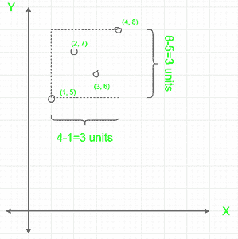

# 将数组中的 N 对作为(X，Y)坐标点，并将其包含在最小面积矩形内

> 原文:[https://www . geesforgeks . org/make-n-pairs-from-array-as-x-y-coordinate-point-in-a-mini-area-rectangle/](https://www.geeksforgeeks.org/make-n-pairs-from-array-as-x-y-coordinate-point-that-are-enclosed-inside-a-minimum-area-rectangle/)

给定一个数字 **N** ，以及一个大小为 **2N** 的[数组](https://www.geeksforgeeks.org/array-data-structure/)**A【】**，任务是制作 **N** 对这些数组元素，并将它们放置在 **X-Y** 坐标平面上，使它们被包围在最小面积矩形内(边平行于 **X-** 轴和 **Y-** 轴)，并打印矩形的面积。

**示例:**

> **输入:** N = 4，A = {1，4，2，5，3，6，7，8}
> **输出:** 9
> **说明:**制作 N 对以获得最小矩形面积的一种可能方法是{(1，5)，(2，7)，(3，6)，(4，8)}
> 最小面积矩形如下图所示:
> 
> 
> 
> 注意:可能有其他方法来制作 N 对，使得面积保持最小，但是最小面积保持 9。
> 
> **输入** : N = 3，A = {1，3，1，1，2，1}
> 输出: 0

**接近:**左下角在 **(X <sub>1</sub> 、Y <sub>1</sub> )** 和右上角在( **X <sub>2</sub> 、Y <sub>2</sub> )** 的矩形面积为**(X<sub>2</sub>–X<sub>1</sub>)*(Y<sub>2</sub>–Y**因此，任务可以表示为将数组 **A** 划分为两个 **N 大小的分区**比如 **X** 和 **Y** ，使得**(最大(X)–最小(X)) *(最大(Y)–最小(Y))** 最小化。这里， **X** 代表副的 **X 坐标**， **Y** 代表 **Y 坐标。******

**排序后 **A** 最小为**A<sub>1</sub>T5】，最大为 **A <sub>2N</sub>** <sub>。</sub>现在可以有以下两种情况:****

*   ****A<sub>1</sub>T3】和**A<sub>2N</sub>T7】都存在于同一个分区中，比如说 **X** 。矩形的面积为**(A<sub>2N</sub>–A<sub>1</sub>)*(最大(Y)–最小(Y))。**那么任务就是最小化**最大值(Y)–最小值(Y)。**同样，如果 **i** 是 **Min(Y)** 的指数， **j** 是**Max(Y)**的指数，那么**j–I>= N–1**，因为 **Y** 中必须至少有 **N** 元素。因此，对于 **Y** (除非 **A <sub>1</sub>** 和 **A <sub>2N</sub>** ，因为它们已经被采用)来说，使用尺寸为 **N** 的片段是最佳的，******
*   **A<sub>1</sub>T3**A<sub>2N</sub>T7】存在于不同分区。对于这种情况，最好使用大小为 **N** 的前缀和大小为 **N** 的后缀作为分区，即将第一个 **N** 元素放在一个分区中，最后一个 **N** 元素放在另一个分区中。****

按照以下步骤解决问题:

*   初始化一个变量，比如说**和**来存储矩形的最小面积。
*   [将数组 **A[]** 按升序排序。](https://www.geeksforgeeks.org/c-program-to-sort-an-array-in-ascending-order/)
*   **对于第一种情况**:
    *   将**和**更新为**(A[N–1]–A[0])*(A[2 * N–1]–A[N])。**
*   **对于第二种情况**:
    *   [使用变量 **i** : 在范围](https://www.geeksforgeeks.org/range-based-loop-c/)**【1，N-1】**中迭代
        *   将 **ans** 更新为 **ans** 和**的最小值(A[2 * N–1]–A[0])*(A[I+N–1]–A[I])。**
*   最后，返回 **ans。**

下面是上述代码的实现:

## C++

```
// C++ program for tha above approach

#include <bits/stdc++.h>
using namespace std;

// Function to make N pairs of coordinates such that they
// are enclosed in a minimum area rectangle with sides
// parallel to the X and Y axes
int minimumRectangleArea(int A[], int N)
{
    // A variable to store the answer
    int ans;

    sort(A, A + 2 * N);

    // For the case where the maximum
    // and minimum are in different partitions
    ans = (A[N - 1] - A[0]) * (A[2 * N - 1] - A[N]);

    // For the case where the maximum and
    // minimum are in the same partition
    for (int i = 1; i < N; i++)
        ans = min(ans, (A[2 * N - 1] - A[0])
                           * (A[i + N - 1] - A[i]));

    // Return the answer
    return ans;
}

// Driver code
int main()
{
    // Given Input
    int A[] = { 2, 4, 1, 5, 3, 6, 7, 8 };
    int N = sizeof(A) / sizeof(A[0]);
    N /= 2;

    // Function call
    cout << minimumRectangleArea(A, N) << endl;
    return 0;
}
```

## Java 语言(一种计算机语言，尤用于创建网站)

```
// Java program for the above approach
import java.io.*;
import java.util.Arrays;

class GFG{

// Function to make N pairs of coordinates
// such that they are enclosed in a minimum
// area rectangle with sides parallel to
// the X and Y axes
public static int minimumRectangleArea(int A[], int N)
{

    // A variable to store the answer
    int ans;

    Arrays.sort(A);

    // For the case where the maximum
    // and minimum are in different partitions
    ans = (A[N - 1] - A[0]) * (A[2 * N - 1] - A[N]);

    // For the case where the maximum and
    // minimum are in the same partition
    for(int i = 1; i < N; i++)
        ans = Math.min(ans, (A[2 * N - 1] - A[0]) *
                            (A[i + N - 1] - A[i]));

    // Return the answer
    return ans;
}

// Driver code
public static void main(String[] args)
{

    // Given Input
    int A[] = { 2, 4, 1, 5, 3, 6, 7, 8 };
    int N = A.length;
    N = (int)N / 2;

    // Function call
    System.out.println(minimumRectangleArea(A, N));
}
}

// This code is contributed by lokeshpotta20
```

## 蟒蛇 3

```
# Python3 program for tha above approach

# Function to make N pairs of coordinates
# such that they are enclosed in a minimum
# area rectangle with sides parallel to the
# X and Y axes
def minimumRectangleArea(A, N):

    # A variable to store the answer
    ans = 0

    A.sort()

    # For the case where the maximum
    # and minimum are in different partitions
    ans = (A[N - 1] - A[0]) * (A[2 * N - 1] - A[N])

    # For the case where the maximum and
    # minimum are in the same partition
    for i in range(1, N, 1):
        ans = min(ans, (A[2 * N - 1] - A[0]) *
                       (A[i + N - 1] - A[i]))

    # Return the answer
    return ans

# Driver code
if __name__ == '__main__':

    # Given Input
    A = [ 2, 4, 1, 5, 3, 6, 7, 8 ]
    N = len(A)
    N //= 2

    # Function call
    print(minimumRectangleArea(A, N))

# This code is contributed by ipg2016107
```

## C#

```
// C# program for the above approach
using System;

class GFG{

// Function to make N pairs of coordinates
// such that they are enclosed in a minimum
// area rectangle with sides parallel to
// the X and Y axes
public static int minimumRectangleArea(int []A, int N)
{

    // A variable to store the answer
    int ans;

    Array.Sort(A);

    // For the case where the maximum
    // and minimum are in different partitions
    ans = (A[N - 1] - A[0]) * (A[2 * N - 1] - A[N]);

    // For the case where the maximum and
    // minimum are in the same partition
    for(int i = 1; i < N; i++)
        ans = Math.Min(ans, (A[2 * N - 1] - A[0]) *
                            (A[i + N - 1] - A[i]));

    // Return the answer
    return ans;
}

// Driver code
public static void Main(String[] args)
{

    // Given Input
    int []A = { 2, 4, 1, 5, 3, 6, 7, 8 };
    int N = A.Length;
    N = (int)N / 2;

    // Function call
    Console.Write(minimumRectangleArea(A, N));
}
}

// This code is contributed by shivanisinghss2110
```

## java 描述语言

```
<script>

// JavaScript program for tha above approach

// Function to make N pairs of coordinates such that they
// are enclosed in a minimum area rectangle with sides
// parallel to the X and Y axes
function minimumRectangleArea(A, N) {
// A variable to store the answer
    let ans;

    A.sort();

    // For the case where the maximum
    // and minimum are in different partitions
    ans = (A[N - 1] - A[0]) * (A[2 * N - 1] - A[N]);

    // For the case where the maximum and
    // minimum are in the same partition
    for (let i = 1; i < N; i++)
        ans = Math.min(ans, (A[2 * N - 1] - A[0])
            * (A[i + N - 1] - A[i]));

    // Return the answer
    return ans;
}

// Driver code

// Given Input
let A = [2, 4, 1, 5, 3, 6, 7, 8];
let N = A.length
N = Math.floor(N / 2);

// Function call
document.write(minimumRectangleArea(A, N) + "<br>");

</script>
```

**Output**

```
9
```

***时间复杂度:** O(NLogN)*
***辅助空间:** O(1)*