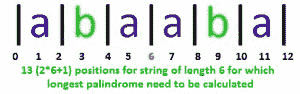
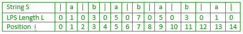
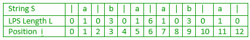
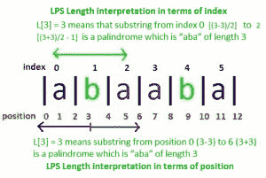

# Manacher 算法–线性时间最长回文子串–第 1 部分

> 原文:[https://www . geesforgeks . org/manachers-算法-线性-时间-最长-回文-子串-part-1/](https://www.geeksforgeeks.org/manachers-algorithm-linear-time-longest-palindromic-substring-part-1/)

给定一个字符串，找出最长的子字符串，即回文。

*   如果给定的字符串是“forgeeksskeegfor”，那么输出应该是“geeksskeeg”
*   如果给定的字符串是“abaaba”，输出应该是“abaaba”
*   如果给定的字符串是“abababa”，输出应该是“abababa”
*   如果给定的字符串是“abcbbababc ba”，输出应该是“abcbbabba”

我们已经在[第 1 集](https://www.geeksforgeeks.org/longest-palindrome-substring-set-1/)和[第 2 集](https://www.geeksforgeeks.org/longest-palindromic-substring-set-2/)讨论了天真【O(n 3 】和二次【O(n 2 】接近。
在本文中，我们将讨论 [Manacher 的算法](https://en.wikipedia.org/wiki/Longest_palindromic_substring#Manacher.27s_algorithm)，该算法在线性时间内找到最长的回文子串。
寻找回文的一种方法([集合 2](https://www.geeksforgeeks.org/longest-palindromic-substring-set-2/) )是从字符串的中心开始，逐个比较两个方向的字符。如果两边(中间左右)对应的字符匹配，那么就会组成回文。
我们来考虑一下字符串“abababa”。
这里字符串的中心是第 4 个字符(索引为 3) b .如果我们匹配中心左右的字符，所有字符都匹配，所以字符串“abababa”是回文。

这里，中心位置不仅是实际的字符串位置，也可以是两个字符之间的位置。
考虑偶数长度的字符串“abaaba”。该字符串是回文，分别位于第 3 个和第 4 个字符 a 和 a 之间。

要找到长度为 N 的字符串的最长回文子串，一种方法是取每个可能的 2*N + 1 个中心(N 个字符位置，两个字符位置之间的 N-1 和左右两端的 2 个位置)，在每个 2*N+ 1 个中心进行左右方向的字符匹配，并跟踪 LPS。这种方法需要 O(N^2 时间，这就是我们在第二集做的。

让我们考虑两个字符串“abababa”和“abaaba”，如下所示:

在这两根弦中，中心位置的左右两侧(第一根弦中的位置 7 和第二根弦中的位置 6)是对称的。为什么呢？因为整个字符串是围绕中心位置的回文。
如果我们需要从左到右计算每 2*N+1 个位置的最长回文子串，那么回文的对称特性可以帮助避免一些不必要的计算(即字符比较)。如果有一个长度为 L 的回文以 P 的任意位置为中心，那么我们可能不需要比较 P+1 位置左右两边的所有字符。我们已经在 P 点之前的位置计算了 LPS，它们可以帮助避免 P 点之后的一些比较。
在稍后的时间点使用先前位置的信息使得 Manacher 的算法是线性的。在[集 2](https://www.geeksforgeeks.org/longest-palindromic-substring-set-2/) 中，没有重复使用以前的信息，所以这是二次的。

Manacher 的算法可能被认为很难理解，所以这里我们将尽可能详细地讨论它。它的某些部分可能需要多次阅读才能正确理解。

我们来看看弦乐“阿巴巴巴”。在上面的第三个图中，显示了 15 个中心位置。我们需要计算每个位置最长回文串的长度。

*   在位置 0，根本没有 LPS(左侧没有字符可以比较)，所以 LPS 的长度将是 0。
*   在位置 1，LPS 是 a，所以 LPS 的长度将是 1。
*   在位置 2，根本没有 LPS(左右字符 a 和 b 不匹配)，所以 LPS 的长度将为 0。
*   在位置 3，LPS 是 aba，所以 LPS 的长度将是 3。
*   在位置 4，根本没有 LPS(左右字符 b 和 a 不匹配)，所以 LPS 的长度将为 0。
*   在位置 5，LPS 是亚的斯亚贝巴，所以 LPS 的长度将是 5。

……等等

我们将所有这些回文长度存储在一个数组中，比如 L。然后字符串 S 和 LPS 长度 L 如下所示:

同样，字符串“abaababa”的 LPS 长度 L 将看起来像:

在 LPS 阵列 L 中:

*   奇数位置(实际字符位置)的 LPS 长度值将是奇数并且大于或等于 1 (1 将来自中心字符本身，如果它的左侧和右侧没有其他匹配)
*   偶数位置(两个字符之间的位置，最左边和最右边的位置)的 LPS 长度值将是偶数并且大于或等于 0(当左边和右边没有匹配时，将出现 0)

**字符串的位置和索引在这里是两回事。对于长度为 N 的给定字符串 S，索引将从 0 到 N-1(总共 N 个索引)，位置将从 0 到 2*N(总共 2*N+1 个位置)。**

LPS 长度值可以用两种方式来解释，一是根据索引，二是根据位置。位置 I 处的 LPS 值 d(L[I]= d)表明:

*   从位置 i-d 到 i+d 的子串是长度为 d 的回文(根据位置)
*   从索引(i-d)/2 到[(I+d)/2–1]的子串是长度为 d(就索引而言)的回文

例如在字符串“abaaba”中，L[3] = 3 表示从位置 0 (3-3)到 6 (3+3)的子串是长度为 3 的“aba”的回文，它还表示从索引 0 [(3-3)/2]到 2[(3+3)/2–1]的子串是长度为 3 的“aba”的回文。

现在的主要任务是高效计算 LPS 阵列。一旦这个数组被计算出来，字符串的长度值将集中在具有最大长度值的位置。
我们将在[第二部分](https://www.geeksforgeeks.org/manachers-algorithm-linear-time-longest-palindromic-substring-part-2/)中看到。

本文由**阿努拉格·辛格**供稿。如果你发现任何不正确的地方，或者你想分享更多关于上面讨论的话题的信息，请写评论。