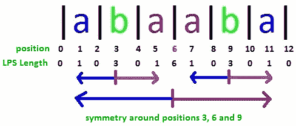
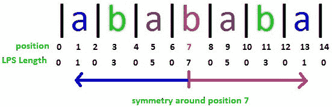
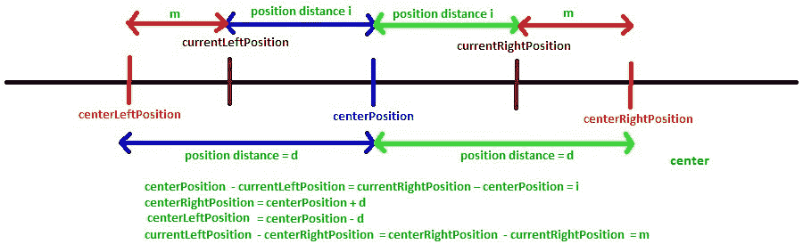
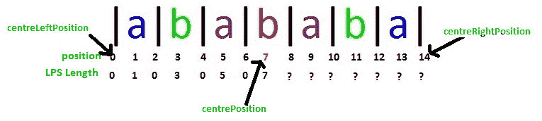
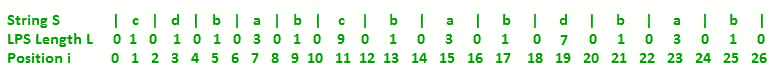
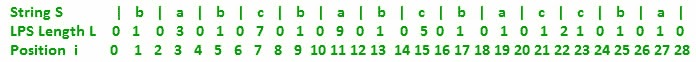

# Manacher 算法–线性时间最长回文子串–第 2 部分

> 原文:[https://www . geesforgeks . org/manachers-算法-线性-时间-最长-回文-子串-part-2/](https://www.geeksforgeeks.org/manachers-algorithm-linear-time-longest-palindromic-substring-part-2/)

在 [Manacher 的算法–第 1 部分](https://www.geeksforgeeks.org/manachers-algorithm-linear-time-longest-palindromic-substring-part-1/)中，我们学习了一些基础知识和 LPS 长度数组。
下面我们来看看如何高效计算 LPS 长度数组。

为了有效地计算 LPS 数组，我们需要了解任何位置的 LPS 长度如何与任何先前已经计算的位置的 LPS 长度值相关。
对于字符串“abaaba”，我们看到如下内容:

```
                    
```

如果我们看看位置 3:

*   位置 2 和位置 4 的 LPS 长度值相同
*   位置 1 和位置 5 的 LPS 长度值相同

我们从位置 0 开始从左到右计算 LPS 长度值，所以我们可以看到如果我们已经知道位置 1、2 和 3 的 LPS 长度值，那么我们可能不需要计算位置 4 和 5 的 LPS 长度，因为它们等于位置 3 左侧相应位置的 LPS 长度值。

如果我们看看位置 6:

*   位置 5 和位置 7 的 LPS 长度值相同
*   位置 4 和位置 8 的 LPS 长度值相同

………….等等。
如果我们已经知道位置 1、2、3、4、5 和 6 的 LPS 长度值，那么我们可能不需要计算位置 7、8、9、10 和 11 的 LPS 长度，因为它们等于位置 6 左侧相应位置的 LPS 长度值。
对于字符串“abababa”，我们看到如下内容:

```
                    
```

如果我们已经知道位置 1、2、3、4、5、6 和 7 的 LPS 长度值，那么我们可能不需要计算位置 8、9、10、11、12 和 13 的 LPS 长度，因为它们等于位置 7 左侧相应位置的 LPS 长度值。

你能看出为什么 LPS 长度值在字符串“abaaba”中的位置 3、6、9 周围是对称的吗？那是因为在这些位置周围有一个回文子串。位置 7 周围的字符串“abababa”也是如此。
回文中心位置周围的 LPS 长度值总是对称的(相同)吗？
答案是否定的
看字符串“阿巴巴巴”中的位置 3 和 11。两个位置的 LPS 长度都是 3。紧邻的左右位置是对称的(值为 0)，但不是下一个。位置 1 和 5(位置 3 周围)不对称。类似地，位置 9 和 13(在位置 11 周围)是不对称的。

在这一点上，我们可以看到，如果一个字符串中有一个回文位于某个位置的中心，那么中心位置周围的 LPS 长度值可能是对称的，也可能不是对称的，这取决于某些情况。如果我们能识别出左右位置将围绕中心位置对称的情况，我们就不需要计算右位置的 LPS 长度，因为它将与左侧相应位置的 LPS 值完全相同，这是已知的。这一事实避免了在很少的位置进行线性预测长度计算，这使得曼纳歇算法是线性的。

在左右位置围绕中心位置不对称的情况下，我们比较左右两侧的字符来寻找回文，但这里算法也试图避免一定数量的比较。我们很快就会看到所有这些场景。

让我们引入几个术语来进一步讨论:
[](https://media.geeksforgeeks.org/wp-content/uploads/ltlp3.jpg)

*   **中心位置**–这是计算 LPS 长度的位置，假设中心位置的 LPS 长度为 d(即 L[中心位置] = d)
*   **中心右位置**–这是中心位置的右侧和远离中心位置的 d 位置(即**中心右位置=中心位置+ d** )
*   **中心位置**–这是离开中心位置和 d 位置的位置(即**中心位置=中心位置–d**)
*   **当前位置**–这是中心位置右侧的位置，LPS 长度未知，需要计算
*   **当前位置**–这是中心位置左侧的位置，对应当前位置
    T3】中心位置–当前位置=当前位置–中心位置 T5**当前位置= 2*中心位置–当前位置**
*   **I-左回文**–回文 I 位于中心位置的左侧，即当前位置
*   **I-右回文**–回文 I 位于中心位置的右侧，即当前位置
*   **中心回文**–回文在中心位置

当我们在中心位置时，已知 LPS 长度，那么我们也知道小于中心位置的所有位置的 LPS 长度。假设中心位置的 LPS 长度为 d，即
L[中心位置] = d

意思是位置“centerPosition-d”到“centerPosition+d”之间的子串是回文。
现在我们进一步计算大于中心位置的位置的 LPS 长度。
假设我们在当前位置(>中心位置)，我们需要找到 LPS 长度。
为此，我们看一下已经计算好的当前位置的 LPS 长度。

如果当前位置的 LPS 长度小于“中心右侧位置–当前位置”，则当前位置的 LPS 长度将等于当前位置的 LPS 长度。所以
L【当前位置】= L【当前位置】如果 L【当前位置】<居中右位置–当前位置。这是**案例 1** 。

让我们考虑以下字符串“abababa”的场景:

```
                          (click to see it clearly)
                    
```

我们计算了位置 7 之前的 LPS 长度，其中 L[7] = 7，如果我们将位置 7 视为中心位置，则中心位置将为 0，中心右侧位置将为 14。
现在我们需要计算中心位置右边其他位置的 LPS 长度。

对于 currentRightPosition = 8，currentLeftPosition 为 6，L[currentLeftPosition] = 0
也是居中右位置–current rightposition = 14–8 = 6
这里适用情况 1，因此 L[current rightposition]= L[8]= 0
情况 1 适用于位置 10 和 12，因此，
L[10]= L[4]= 0
L[12]= L[2]= 0

如果我们看位置 9，那么:
当前位置= 9
当前位置= 2*中心位置–当前位置= 2 * 7–9 = 5
中心右侧位置–当前位置= 14–9 = 5

这里 L[currentLeftPosition]= centright position–currentRightPosition，所以案例 1 在这里不适用。还要注意的是，中右位置是字符串的最末端位置。这意味着中心回文是输入字符串的后缀。在这种情况下，L[CurrentRightPosition]= L[CurrentLiftPosition]。这是**情况 2** 。

情况 2 适用于位置 9、11、13 和 14，因此:
L[9]= L[5]= 5
L[11]= L[3]= 3
L[13]= L[1]= 1
L[14]= L[0]= 0

案例 1 和案例 2 到底发生了什么？这只是利用回文对称性质，没有任何字符匹配，它是寻找新位置的 LPS 长度。

当一个长度较大的回文包含一个长度较小的回文，位于其自身中心的左侧，那么基于对称性质，将会有另一个同样较小的回文位于较大回文中心的右侧。如果左边较小的回文不是较大回文的前缀，则**情况 1** 适用，如果是前缀且较大的回文是输入字符串本身的后缀，则**情况 2** 适用。

*我放在当前中心右侧的最长回文(i-right 回文)与我放在当前中心左侧的最长回文(i-left 回文)一样长，如果 i-left 回文完全包含在当前中心周围的最长回文(中心回文)中，并且 i-left 回文不是中心回文的前缀( **Case 1** )或(即当 i-left 回文是的前缀时*

在案例 1 和案例 2 中，I-右回文不能比对应的 I-左回文扩展更多(你能想象为什么它不能扩展更多吗？)，所以 I-右回文的 LPS 长度和 I-左回文的 LPS 长度完全一样。

这里 i-left 和 i-right 回文都完全包含在中心回文中(即 L[currentLeftPosition] <= centerRightPosition – currentRightPosition)
现在如果 i-left 回文不是中心回文的前缀(L[current left position]<center right position–current right position)，这意味着 i-left 回文无法向上扩展到位置 centerLeftPosition。

如果我们看下面，中心位置= 11，那么

```
                          (click to see it clearly)
                    
```

中心位置将是 11–9 = 2，中心右侧位置将是 11 + 9 = 20
如果我们取 currentRightPosition = 15，它的 currentLeftPosition 是 7。情况 1 适用于此，因此 L[15] = 3。第 7 位的 i-left 回文是“bab”，完全包含在第 11 位的中心回文中(即“dbabcbabd”)。我们可以看到，I-右回文(15 位)不能比 I-左回文(7 位)扩展更多。

如果有扩展的可能，左回文本可以扩展得更多。但不存在 I-左回文是中心回文前缀的可能性。所以由于对称性，I-右回文和 I-左回文是完全一样的，不能再扩展了。这使得在情况 1 中，L[current rightposition]= L[current left position]。

现在，如果我们考虑中心位置= 19，那么中心位置= 12，中心右位置= 26
如果我们取当前位置= 23，它的当前位置是 15。情况 2 适用于此，因此 L[23] = 3。第 15 位的 i-left 回文是“bab”，完全包含在第 19 位的中心回文(即“babdbab”)中。案例二中，i-left 回文是中心回文的前缀，i-right 回文不能扩展超过 i-left 回文的长度，因为中心回文是输入字符串的后缀，所以没有更多的字符可以比较和扩展。这使得情况 2 中的 L[current rightposition]= L[current left position]。

**情况 1:**L[当前位置]= L[当前位置]适用于以下情况:

*   I-左回文完全包含在中心回文中
*   左回文不是中心回文的前缀

当
L【当前位置】<中心右侧位置–当前位置时，上述两个条件都满足

**情况 2:**L[当前位置]= L[当前位置]适用于以下情况:

*   I-左回文是中心回文的前缀(表示完全包含也)
*   中间回文是输入字符串的后缀

当
L【当前位置】=中右位置–当前位置(对于 1 <sup>st</sup> 条件)和
中右位置= 2*N 时，满足上述条件，其中 N 是输入字符串长度 N(对于 2 <sup>和</sup>条件)。

**情况 3:**L[当前位置]>= L[当前位置]适用于以下情况:

*   I-左回文是中心回文的前缀(因此 I-左回文完全包含在中心回文中)
*   中间回文不是输入字符串的后缀

当
L【当前位置】=中右位置–当前位置(对于 1 <sup>st</sup> 条件)和
中右位置< 2*N 时，满足上述条件，其中 N 是输入字符串长度 N(对于 2 <sup>和</sup>条件)。
在这种情况下，有 I-右回文扩展的可能，所以 I-右回文长度至少和 I-左回文长度一样长。

**案例 4:** L【当前位置】> =中右位置–当前位置适用于以下情况:

*   左回文不完全包含在中心回文中

当
L【当前位置】>中右位置-当前位置
时，满足上述条件，此时，i-right 回文长度至少与(中右位置-当前位置)一样长，并且有 i-right 回文扩展的可能。

在下图中，

```
                          (click to see it clearly)
                    
```

如果我们取中心位置 7，那么情况 3 适用于 currentRightPosition 11，因为 currentLeftPosition 3 的 I-左回文是中心回文的前缀，I-右回文不是输入字符串的后缀，所以这里 L[11] = 9，大于 I-左回文长度 L[3] = 3。在这种情况下，保证 L[11]将至少为 3，因此在实现中，我们 1 <sup>st</sup> 设置 L[11] = 3，然后我们尝试通过比较从距离 4 开始的左侧和右侧的字符来扩展它(截至距离 3，已经知道字符将匹配)。

如果我们取中心位置 11，那么情况 4 适用于当前位置 15，因为 L[当前位置] = L[7] = 7 >中心右侧位置–当前位置= 20–15 = 5。在这种情况下，保证 L[15]将至少为 5，因此在实现中，我们 1 <sup>st</sup> 设置 L[15] = 5，然后我们尝试通过比较从距离 5 开始的左侧和右侧的字符来扩展它(截至距离 5，已经知道字符将匹配)。

现在剩下要讨论的一点是，当我们在一个中心位置工作，计算不同右位置的 LPS 长度时，如何知道下一个中心位置是什么。如果以当前位置为中心的回文扩展到中心右位置之外，我们将中心位置更改为当前位置。

在这里，我们看到了四种不同的情况，一个位置的 LPS 长度将如何取决于前一个位置的 LPS 长度。
在[第 3 部分](https://www.geeksforgeeks.org/manachers-algorithm-linear-time-longest-palindromic-substring-part-3-2/)中，我们已经讨论了它的代码实现，我们也以不同的方式研究了这四种情况并实现了它们。

本文由**阿努拉格·辛格**供稿。如果您发现任何不正确的地方，或者您想分享更多关于上面讨论的主题的信息，请写评论