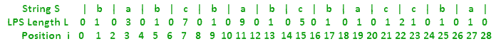

# Manacher 算法–线性时间最长回文子串–第 3 部分

> 原文:[https://www . geesforgeks . org/manachers-算法-线性-时间-最长-回文-子串-part-3-2/](https://www.geeksforgeeks.org/manachers-algorithm-linear-time-longest-palindromic-substring-part-3-2/)

在 Manacher 的算法[第 1 部分](https://www.geeksforgeeks.org/manachers-algorithm-linear-time-longest-palindromic-substring-part-1/)和[第 2 部分](https://www.geeksforgeeks.org/manachers-algorithm-linear-time-longest-palindromic-substring-part-2/)中，我们通过一些基础知识，了解了 LPS 长度数组以及如何基于四种情况高效地计算它。这里我们将实现相同的。
我们已经看到，案例 1 和案例 2 中不需要新的字符比较。在案例 3 和案例 4 中，需要进行必要的新比较。
下图中，



如果我们需要一个比较，我们将只比较实际的字符，这些字符位于“奇数”位置，如 1、3、5、7 等。
偶数位置不代表字符串中的字符，因此不会对偶数位置进行比较。
如果不同奇数位置的两个字符匹配，那么它们将使 LPS 长度增加 2。
根据如何处理偶数和奇数位置，有许多方法可以实现这一点。一种方法是创建一个新的字符串 1 <sup>st</sup> ，在这里我们在所有偶数位置插入一些唯一的字符(比如# $等)，然后运行算法(以避免不同的偶数和奇数位置处理方式)。另一种方法是对给定的字符串本身进行处理，但是这里的偶数和奇数位置应该适当处理。
这里我们从给定的字符串本身开始。当需要展开和需要人物比较时，我们会在左右位置逐一展开。当发现奇数位置时，将进行比较，并且 LPS 长度将增加 1。当找到偶数位置时，没有进行比较，并且 LPS 长度将增加 1(因此总体而言，左侧和右侧的一个奇数和一个偶数位置将增加 LPS 长度 2)。

## C

```
// A C program to implement Manacher’s Algorithm
#include <stdio.h>
#include <string.h>

char text[100];
void findLongestPalindromicString()
{
    int N = strlen(text);
    if(N == 0)
        return;
    N = 2*N + 1; //Position count
    int L[N]; //LPS Length Array
    L[0] = 0;
    L[1] = 1;
    int C = 1; //centerPosition
    int R = 2; //centerRightPosition
    int i = 0; //currentRightPosition
    int iMirror; //currentLeftPosition
    int expand = -1;
    int diff = -1;
    int maxLPSLength = 0;
    int maxLPSCenterPosition = 0;
    int start = -1;
    int end = -1;

    //Uncomment it to print LPS Length array
    //printf("%d %d ", L[0], L[1]);
    for (i = 2; i < N; i++)
    {
        //get currentLeftPosition iMirror for currentRightPosition i
        iMirror = 2*C-i;
        //Reset expand - means no expansion required
        expand = 0;
        diff = R - i;
        //If currentRightPosition i is within centerRightPosition R
        if(diff >= 0)
        {
            if(L[iMirror] < diff) // Case 1
                L[i] = L[iMirror];
            else if(L[iMirror] == diff && R == N-1) // Case 2
                L[i] = L[iMirror];
            else if(L[iMirror] == diff && R < N-1) // Case 3
            {
                    L[i] = L[iMirror];
                    expand = 1; // expansion required
            }
            else if(L[iMirror] > diff) // Case 4
            {
                L[i] = diff;
                expand = 1; // expansion required
            }
        }
        else
        {
            L[i] = 0;
            expand = 1; // expansion required
        }

        if (expand == 1)
        {
            //Attempt to expand palindrome centered at currentRightPosition i
            //Here for odd positions, we compare characters and
            //if match then increment LPS Length by ONE
            //If even position, we just increment LPS by ONE without
            //any character comparison
            while (((i + L[i]) < N && (i - L[i]) > 0) &&
                ( ((i + L[i] + 1) % 2 == 0) ||
                (text[(i + L[i] + 1)/2] == text[(i-L[i]-1)/2] )))
            {
                L[i]++;
            }
        }

        if(L[i] > maxLPSLength) // Track maxLPSLength
        {
            maxLPSLength = L[i];
            maxLPSCenterPosition = i;
        }

        // If palindrome centered at currentRightPosition i
        // expand beyond centerRightPosition R,
        // adjust centerPosition C based on expanded palindrome.
        if (i + L[i] > R)
        {
            C = i;
            R = i + L[i];
        }
        //Uncomment it to print LPS Length array
        //printf("%d ", L[i]);
    }
    //printf("\n");
    start = (maxLPSCenterPosition - maxLPSLength)/2;
    end = start + maxLPSLength - 1;
    //printf("start: %d end: %d\n", start, end);
    printf("LPS of string is %s : ", text);
    for(i=start; i<=end; i++)
        printf("%c", text[i]);
    printf("\n");
}

int main(int argc, char *argv[])
{

    strcpy(text, "babcbabcbaccba");
    findLongestPalindromicString();

    strcpy(text, "abaaba");
    findLongestPalindromicString();

    strcpy(text, "abababa");
    findLongestPalindromicString();

    strcpy(text, "abcbabcbabcba");
    findLongestPalindromicString();

    strcpy(text, "forgeeksskeegfor");
    findLongestPalindromicString();

    strcpy(text, "caba");
    findLongestPalindromicString();

    strcpy(text, "abacdfgdcaba");
    findLongestPalindromicString();

    strcpy(text, "abacdfgdcabba");
    findLongestPalindromicString();

    strcpy(text, "abacdedcaba");
    findLongestPalindromicString();

    return 0;
}
```

## Java 语言(一种计算机语言，尤用于创建网站)

```
// A Java program to implement Manacher’s Algorithm
import java.lang.*;

class GFG{

public static void findLongestPalindromicString(
                   String text)
{
    int N = text.length();
    if(N == 0)
        return;

    // Position count
    N = 2 * N + 1;

    // LPS Length Array
    int []L = new int [N];
    L[0] = 0;
    L[1] = 1;

    // centerPosition
    int C = 1;

    // centerRightPosition
    int R = 2;

    // currentRightPosition
    int i = 0;

    // currentLeftPosition
    int iMirror;
    int expand = -1;
    int diff = -1;
    int maxLPSLength = 0;
    int maxLPSCenterPosition = 0;
    int start = -1;
    int end = -1;

    // Uncomment it to print LPS Length array
    // printf("%d %d ", L[0], L[1]);
    for (i = 2; i < N; i++)
    {
        // Get currentLeftPosition iMirror
        // for currentRightPosition i
        iMirror = 2 * C - i;

        // Reset expand - means no
        // expansion required
        expand = 0;
        diff = R - i;

        // If currentRightPosition i is
        // within centerRightPosition R
        if(diff >= 0)
        {

            // Case 1
            if(L[iMirror] < diff)
                L[i] = L[iMirror];

            // Case 2
            else if(L[iMirror] == diff && R == N - 1)
                L[i] = L[iMirror];

            // Case 3
            else if(L[iMirror] == diff && R < N - 1)
            {
                    L[i] = L[iMirror];

                     // Expansion required
                    expand = 1;
            }

            // Case 4
            else if(L[iMirror] > diff)
            {
                L[i] = diff;

                // Expansion required
                expand = 1;
            }
        }
        else
        {
            L[i] = 0;

            // Expansion required
            expand = 1;
        }

        if (expand == 1)
        {

            // Attempt to expand palindrome centered
            // at currentRightPosition i. Here for odd
            // positions, we compare characters and
            // if match then increment LPS Length by ONE
            // If even position, we just increment LPS
            // by ONE without any character comparison
            try
            {
                while (((i + L[i]) < N &&
                        (i - L[i]) > 0) &&
                      (((i + L[i] + 1) % 2 == 0) ||
                       (text.charAt((i + L[i] + 1) / 2) ==
                        text.charAt((i - L[i] - 1) / 2))))
                {
                    L[i]++;
                }
            }
            catch (Exception e)
            {
                assert true;
            }
        }

        // Track maxLPSLength
        if(L[i] > maxLPSLength)
        {
            maxLPSLength = L[i];
            maxLPSCenterPosition = i;
        }

        // If palindrome centered at
        // currentRightPosition i expand
        // beyond centerRightPosition R,
        // adjust centerPosition C based
        // on expanded palindrome.
        if (i + L[i] > R)
        {
            C = i;
            R = i + L[i];
        }

        //Uncomment it to print LPS Length array
        //System.out.print("%d ", L[i]);
    }

    start = (maxLPSCenterPosition -
             maxLPSLength) / 2;
    end = start + maxLPSLength - 1;

    //System.out.print("start: %d end: %d\n",
    //                  start, end);
    System.out.print("LPS of string is " +
                      text + " : ");

    for(i = start; i <= end; i++)
        System.out.print(text.charAt(i));
    System.out.println();
}

// Driver code
public static void main(String []args)
{
    String text1="babcbabcbaccba";
    findLongestPalindromicString(text1);

    String text2="abaaba";
    findLongestPalindromicString(text2);

    String text3= "abababa";
    findLongestPalindromicString(text3);

    String text4="abcbabcbabcba";
    findLongestPalindromicString(text4);

    String text5="forgeeksskeegfor";
    findLongestPalindromicString(text5);

    String text6="caba";
    findLongestPalindromicString(text6);

    String text7="abacdfgdcaba";
    findLongestPalindromicString(text7);

    String text8="abacdfgdcabba";
    findLongestPalindromicString(text8);

    String text9="abacdedcaba";
    findLongestPalindromicString(text9);
}
}

// This code is contributed by SoumikMondal
```

## 计算机编程语言

```
# Python program to implement Manacher's Algorithm

def findLongestPalindromicString(text):
    N = len(text)
    if N == 0:
        return
    N = 2*N+1    # Position count
    L = [0] * N
    L[0] = 0
    L[1] = 1
    C = 1     # centerPosition
    R = 2     # centerRightPosition
    i = 0    # currentRightPosition
    iMirror = 0     # currentLeftPosition
    maxLPSLength = 0
    maxLPSCenterPosition = 0
    start = -1
    end = -1
    diff = -1

    # Uncomment it to print LPS Length array
    # printf("%d %d ", L[0], L[1]);
    for i in xrange(2,N):

        # get currentLeftPosition iMirror for currentRightPosition i
        iMirror = 2*C-i
        L[i] = 0
        diff = R - i
        # If currentRightPosition i is within centerRightPosition R
        if diff > 0:
            L[i] = min(L[iMirror], diff)

        # Attempt to expand palindrome centered at currentRightPosition i
        # Here for odd positions, we compare characters and
        # if match then increment LPS Length by ONE
        # If even position, we just increment LPS by ONE without
        # any character comparison
        try:
            while ((i+L[i]) < N and (i-L[i]) > 0) and \
                    (((i+L[i]+1) % 2 == 0) or \
                    (text[(i+L[i]+1)/2] == text[(i-L[i]-1)/2])):
                L[i]+=1
        except Exception as e:
            pass

        if L[i] > maxLPSLength:        # Track maxLPSLength
            maxLPSLength = L[i]
            maxLPSCenterPosition = i

        # If palindrome centered at currentRightPosition i
        # expand beyond centerRightPosition R,
        # adjust centerPosition C based on expanded palindrome.
        if i + L[i] > R:
            C = i
            R = i + L[i]

    # Uncomment it to print LPS Length array
    # printf("%d ", L[i]);
    start = (maxLPSCenterPosition - maxLPSLength) / 2
    end = start + maxLPSLength - 1
    print "LPS of string is " + text + " : ",
    print text[start:end+1],
    print "\n",

# Driver program
text1 = "babcbabcbaccba"
findLongestPalindromicString(text1)

text2 = "abaaba"
findLongestPalindromicString(text2)

text3 = "abababa"
findLongestPalindromicString(text3)

text4 = "abcbabcbabcba"
findLongestPalindromicString(text4)

text5 = "forgeeksskeegfor"
findLongestPalindromicString(text5)

text6 = "caba"
findLongestPalindromicString(text6)

text7 = "abacdfgdcaba"
findLongestPalindromicString(text7)

text8 = "abacdfgdcabba"
findLongestPalindromicString(text8)

text9 = "abacdedcaba"
findLongestPalindromicString(text9)

# This code is contributed by BHAVYA JAIN
```

## C#

```
// A C# program to implement Manacher’s Algorithm
using System;
using System.Diagnostics;
public class GFG
{

public static void findLongestPalindromicString(
                   String text)
{
    int N = text.Length;
    if(N == 0)
        return;

    // Position count
    N = 2 * N + 1;

    // LPS Length Array
    int []L = new int [N];
    L[0] = 0;
    L[1] = 1;

    // centerPosition
    int C = 1;

    // centerRightPosition
    int R = 2;

    // currentRightPosition
    int i = 0;

    // currentLeftPosition
    int iMirror;
    int expand = -1;
    int diff = -1;
    int maxLPSLength = 0;
    int maxLPSCenterPosition = 0;
    int start = -1;
    int end = -1;

    // Uncomment it to print LPS Length array
    // printf("%d %d ", L[0], L[1]);
    for (i = 2; i < N; i++)
    {
        // Get currentLeftPosition iMirror
        // for currentRightPosition i
        iMirror = 2 * C - i;

        // Reset expand - means no
        // expansion required
        expand = 0;
        diff = R - i;

        // If currentRightPosition i is
        // within centerRightPosition R
        if(diff >= 0)
        {

            // Case 1
            if(L[iMirror] < diff)
                L[i] = L[iMirror];

            // Case 2
            else if(L[iMirror] == diff && R == N - 1)
                L[i] = L[iMirror];

            // Case 3
            else if(L[iMirror] == diff && R < N - 1)
            {
                    L[i] = L[iMirror];

                     // Expansion required
                    expand = 1;
            }

            // Case 4
            else if(L[iMirror] > diff)
            {
                L[i] = diff;

                // Expansion required
                expand = 1;
            }
        }
        else
        {
            L[i] = 0;

            // Expansion required
            expand = 1;
        }

        if (expand == 1)
        {

            // Attempt to expand palindrome centered
            // at currentRightPosition i. Here for odd
            // positions, we compare characters and
            // if match then increment LPS Length by ONE
            // If even position, we just increment LPS
            // by ONE without any character comparison
            try
            {
                while (((i + L[i]) < N &&
                        (i - L[i]) > 0) &&
                      (((i + L[i] + 1) % 2 == 0) ||
                       (text[(i + L[i] + 1) / 2] ==
                        text[(i - L[i] - 1) / 2])))
                {
                    L[i]++;
                }
            }
            catch (Exception)
            {
                Debug.Assert(true);
            }
        }

        // Track maxLPSLength
        if(L[i] > maxLPSLength)
        {
            maxLPSLength = L[i];
            maxLPSCenterPosition = i;
        }

        // If palindrome centered at
        // currentRightPosition i expand
        // beyond centerRightPosition R,
        // adjust centerPosition C based
        // on expanded palindrome.
        if (i + L[i] > R)
        {
            C = i;
            R = i + L[i];
        }

        //Uncomment it to print LPS Length array
        //System.out.print("%d ", L[i]);
    }

    start = (maxLPSCenterPosition -
             maxLPSLength) / 2;
    end = start + maxLPSLength - 1;

    //System.out.print("start: %d end: %d\n",
    //                  start, end);
    Console.Write("LPS of string is " +
                      text + " : ");

    for(i = start; i <= end; i++)
        Console.Write(text[i]);
    Console.WriteLine();
}

// Driver code
static public void Main ()
{

    String text1 = "babcbabcbaccba";
    findLongestPalindromicString(text1);

    String text2 = "abaaba";
    findLongestPalindromicString(text2);

    String text3 = "abababa";
    findLongestPalindromicString(text3);

    String text4 = "abcbabcbabcba";
    findLongestPalindromicString(text4);

    String text5 = "forgeeksskeegfor";
    findLongestPalindromicString(text5);

    String text6 = "caba";
    findLongestPalindromicString(text6);

    String text7 = "abacdfgdcaba";
    findLongestPalindromicString(text7);

    String text8 = "abacdfgdcabba";
    findLongestPalindromicString(text8);

    String text9 = "abacdedcaba";
    findLongestPalindromicString(text9);
}
}

// This code is contributed by Dharanendra L V.
```

## java 描述语言

```
<script>
// A Javascript program to implement Manacher’s Algorithm

function findLongestPalindromicString(text)
{
    let N = text.length;
    if(N == 0)
        return;

    // Position count
    N = 2 * N + 1;

    // LPS Length Array
    let L = new Array(N);
    L[0] = 0;
    L[1] = 1;

    // centerPosition
    let C = 1;

    // centerRightPosition
    let R = 2;

    // currentRightPosition
    let i = 0;

    // currentLeftPosition
    let iMirror;
    let expand = -1;
    let diff = -1;
    let maxLPSLength = 0;
    let maxLPSCenterPosition = 0;
    let start = -1;
    let end = -1;

    // Uncomment it to print LPS Length array
    // printf("%d %d ", L[0], L[1]);
    for (i = 2; i < N; i++)
    {
        // Get currentLeftPosition iMirror
        // for currentRightPosition i
        iMirror = 2 * C - i;

        // Reset expand - means no
        // expansion required
        expand = 0;
        diff = R - i;

        // If currentRightPosition i is
        // within centerRightPosition R
        if(diff >= 0)
        {

            // Case 1
            if(L[iMirror] < diff)
                L[i] = L[iMirror];

            // Case 2
            else if(L[iMirror] == diff && R == N - 1)
                L[i] = L[iMirror];

            // Case 3
            else if(L[iMirror] == diff && R < N - 1)
            {
                    L[i] = L[iMirror];

                     // Expansion required
                    expand = 1;
            }

            // Case 4
            else if(L[iMirror] > diff)
            {
                L[i] = diff;

                // Expansion required
                expand = 1;
            }
        }
        else
        {
            L[i] = 0;

            // Expansion required
            expand = 1;
        }

        if (expand == 1)
        {

            // Attempt to expand palindrome centered
            // at currentRightPosition i. Here for odd
            // positions, we compare characters and
            // if match then increment LPS Length by ONE
            // If even position, we just increment LPS
            // by ONE without any character comparison

                while (((i + L[i]) < N &&
                        (i - L[i]) > 0) &&
                      (((i + L[i] + 1) % 2 == 0) ||
                       (text[Math.floor((i + L[i] + 1) / 2)] ==
                        text[Math.floor((i - L[i] - 1) / 2)])))
                {
                    L[i]++;
                }

        }

        // Track maxLPSLength
        if(L[i] > maxLPSLength)
        {
            maxLPSLength = L[i];
            maxLPSCenterPosition = i;
        }

        // If palindrome centered at
        // currentRightPosition i expand
        // beyond centerRightPosition R,
        // adjust centerPosition C based
        // on expanded palindrome.
        if (i + L[i] > R)
        {
            C = i;
            R = i + L[i];
        }

        //Uncomment it to print LPS Length array
        //System.out.print("%d ", L[i]);
    }

    start = (maxLPSCenterPosition -
             maxLPSLength) / 2;
    end = start + maxLPSLength - 1;

    //System.out.print("start: %d end: %d\n",
    //                  start, end);
    document.write("LPS of string is " +
                      text + " : ");

    for(i = start; i <= end; i++)
        document.write(text[i]);
    document.write("<br>");
}

// Driver code

let text1="babcbabcbaccba";
findLongestPalindromicString(text1);

let text2="abaaba";
findLongestPalindromicString(text2);

let text3= "abababa";
findLongestPalindromicString(text3);

let text4="abcbabcbabcba";
findLongestPalindromicString(text4);

let text5="forgeeksskeegfor";
findLongestPalindromicString(text5);

let text6="caba";
findLongestPalindromicString(text6);

let text7="abacdfgdcaba";
findLongestPalindromicString(text7);

let text8="abacdfgdcabba";
findLongestPalindromicString(text8);

let text9="abacdedcaba";
findLongestPalindromicString(text9);

// This code is contributed by unknown2108
</script>
```

输出:

```
LPS of string is babcbabcbaccba : abcbabcba
LPS of string is abaaba : abaaba
LPS of string is abababa : abababa
LPS of string is abcbabcbabcba : abcbabcbabcba
LPS of string is forgeeksskeegfor : geeksskeeg
LPS of string is caba : aba
LPS of string is abacdfgdcaba : aba
LPS of string is abacdfgdcabba : abba
LPS of string is abacdedcaba : abacdedcaba
```

这是基于[第 2 部分](https://www.geeksforgeeks.org/manachers-algorithm-linear-time-longest-palindromic-substring-part-2/)讨论的四种情况的实现。在[第 4 部分](https://www.geeksforgeeks.org/manachers-algorithm-linear-time-longest-palindromic-substring-part-4/)中，我们已经讨论了看待这四种情况的不同方式以及其他一些方法。
本文由**阿努拉格·辛格**供稿。如果您发现任何不正确的地方，请写评论，或者您想分享更多关于上面讨论的主题的信息