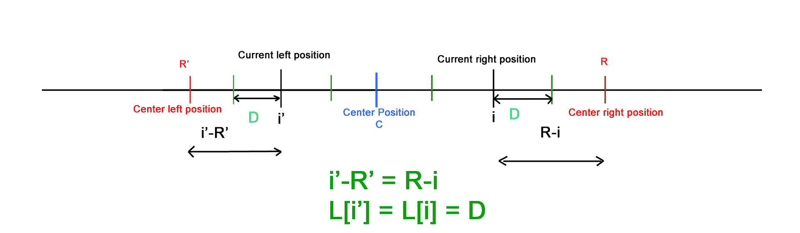

# Manacher 算法–线性时间最长回文子串–第 4 部分

> 原文:[https://www . geesforgeks . org/manachers-算法-线性-时间-最长-回文-子串-part-4/](https://www.geeksforgeeks.org/manachers-algorithm-linear-time-longest-palindromic-substring-part-4/)

在 Manacher 的算法[第 1 部分](https://www.geeksforgeeks.org/manachers-algorithm-linear-time-longest-palindromic-substring-part-1/)和[第 2 部分](https://www.geeksforgeeks.org/manachers-algorithm-linear-time-longest-palindromic-substring-part-2/)中，我们通过一些基础知识，了解了 LPS 长度数组以及如何基于四种情况高效地计算它。在[第 3 部分](https://www.geeksforgeeks.org/manachers-algorithm-linear-time-longest-palindromic-substring-part-3-2/)中，我们实现了相同的内容。
这里我们将再次回顾这四种情况，并尝试以不同的方式看待它并实现它。
这四种情况都取决于当前位置(L[iMirror])的 LPS 长度值和(中右位置–当前位置)即(R–I)的值。这两个信息是已知的，这有助于我们重用以前可用的信息，避免不必要的字符比较。



*如果我们查看所有四种情况，我们会看到我们 1 <sup>st</sup> 设置最小的**L【iMirror】**和 **R-i** 到**L【I】**，然后我们尝试扩展回文在任何情况下都可以扩展。*
以上观察可能看起来更直观，更容易理解和实现，假设一个人了解 LPS 长度数组、位置、索引、对称性等属性。

## C++

```
// A C program to implement Manacher’s Algorithm
#include <stdio.h>
#include <string.h>

char text[100];
int min(int a, int b)
{
    int res = a;
    if(b < a)
        res = b;
    return res;
}

void findLongestPalindromicString()
{
    int N = strlen(text);
    if(N == 0)
        return;
    N = 2*N + 1; //Position count
    int L[N]; //LPS Length Array
    L[0] = 0;
    L[1] = 1;
    int C = 1; //centerPosition
    int R = 2; //centerRightPosition
    int i = 0; //currentRightPosition
    int iMirror; //currentLeftPosition
    int maxLPSLength = 0;
    int maxLPSCenterPosition = 0;
    int start = -1;
    int end = -1;
    int diff = -1;

    //Uncomment it to print LPS Length array
    //printf("%d %d ", L[0], L[1]);
    for (i = 2; i < N; i++)
    {
        //get currentLeftPosition iMirror for currentRightPosition i
        iMirror = 2*C-i;
        L[i] = 0;
        diff = R - i;
        //If currentRightPosition i is within centerRightPosition R
        if(diff > 0)
            L[i] = min(L[iMirror], diff);

        //Attempt to expand palindrome centered at currentRightPosition i
        //Here for odd positions, we compare characters and
        //if match then increment LPS Length by ONE
        //If even position, we just increment LPS by ONE without
        //any character comparison
        while ( ((i + L[i]) < N && (i - L[i]) > 0) &&
            ( ((i + L[i] + 1) % 2 == 0) ||
            (text[(i + L[i] + 1)/2] == text[(i - L[i] - 1)/2] )))
        {
            L[i]++;
        }

        if(L[i] > maxLPSLength) // Track maxLPSLength
        {
            maxLPSLength = L[i];
            maxLPSCenterPosition = i;
        }

        //If palindrome centered at currentRightPosition i
        //expand beyond centerRightPosition R,
        //adjust centerPosition C based on expanded palindrome.
        if (i + L[i] > R)
        {
            C = i;
            R = i + L[i];
        }
        //Uncomment it to print LPS Length array
        //printf("%d ", L[i]);
    }
    //printf("\n");
    start = (maxLPSCenterPosition - maxLPSLength)/2;
    end = start + maxLPSLength - 1;
    printf("LPS of string is %s : ", text);
    for(i=start; i<=end; i++)
        printf("%c", text[i]);
    printf("\n");
}

int main(int argc, char *argv[])
{

    strcpy(text, "babcbabcbaccba");
    findLongestPalindromicString();

    strcpy(text, "abaaba");
    findLongestPalindromicString();

    strcpy(text, "abababa");
    findLongestPalindromicString();

    strcpy(text, "abcbabcbabcba");
    findLongestPalindromicString();

    strcpy(text, "forgeeksskeegfor");
    findLongestPalindromicString();

    strcpy(text, "caba");
    findLongestPalindromicString();

    strcpy(text, "abacdfgdcaba");
    findLongestPalindromicString();

    strcpy(text, "abacdfgdcabba");
    findLongestPalindromicString();

    strcpy(text, "abacdedcaba");
    findLongestPalindromicString();

    return 0;
}
```

## Java 语言(一种计算机语言，尤用于创建网站)

```
// Java program to implement Manacher's Algorithm
import java.util.*;

class GFG
{
    static void findLongestPalindromicString(String text)
    {
        int N = text.length();
        if (N == 0)
            return;
        N = 2 * N + 1; // Position count
        int[] L = new int[N + 1]; // LPS Length Array
        L[0] = 0;
        L[1] = 1;
        int C = 1; // centerPosition
        int R = 2; // centerRightPosition
        int i = 0; // currentRightPosition
        int iMirror; // currentLeftPosition
        int maxLPSLength = 0;
        int maxLPSCenterPosition = 0;
        int start = -1;
        int end = -1;
        int diff = -1;

        // Uncomment it to print LPS Length array
        // printf("%d %d ", L[0], L[1]);
        for (i = 2; i < N; i++)
        {

            // get currentLeftPosition iMirror
            // for currentRightPosition i
            iMirror = 2 * C - i;
            L[i] = 0;
            diff = R - i;

            // If currentRightPosition i is within
            // centerRightPosition R
            if (diff > 0)
                L[i] = Math.min(L[iMirror], diff);

            // Attempt to expand palindrome centered at
            // currentRightPosition i. Here for odd positions,
            // we compare characters and if match then
            // increment LPS Length by ONE. If even position,
            // we just increment LPS by ONE without
            // any character comparison
            while (((i + L[i]) + 1 < N && (i - L[i]) > 0) &&
                               (((i + L[i] + 1) % 2 == 0) ||
                         (text.charAt((i + L[i] + 1) / 2) ==
                          text.charAt((i - L[i] - 1) / 2))))
            {
                L[i]++;
            }

            if (L[i] > maxLPSLength) // Track maxLPSLength
            {
                maxLPSLength = L[i];
                maxLPSCenterPosition = i;
            }

            // If palindrome centered at currentRightPosition i
            // expand beyond centerRightPosition R,
            // adjust centerPosition C based on expanded palindrome.
            if (i + L[i] > R)
            {
                C = i;
                R = i + L[i];
            }

            // Uncomment it to print LPS Length array
            // printf("%d ", L[i]);
        }

        start = (maxLPSCenterPosition - maxLPSLength) / 2;
        end = start + maxLPSLength - 1;
        System.out.printf("LPS of string is %s : ", text);
        for (i = start; i <= end; i++)
            System.out.print(text.charAt(i));
        System.out.println();
    }

    // Driver Code
    public static void main(String[] args)
    {
        String text = "babcbabcbaccba";
        findLongestPalindromicString(text);

        text = "abaaba";
        findLongestPalindromicString(text);

        text = "abababa";
        findLongestPalindromicString(text);

        text = "abcbabcbabcba";
        findLongestPalindromicString(text);

        text = "forgeeksskeegfor";
        findLongestPalindromicString(text);

        text = "caba";
        findLongestPalindromicString(text);

        text = "abacdfgdcaba";
        findLongestPalindromicString(text);

        text = "abacdfgdcabba";
        findLongestPalindromicString(text);

        text = "abacdedcaba";
        findLongestPalindromicString(text);
    }
}

// This code is contributed by
// sanjeev2552
```

## 计算机编程语言

```
# Python program to implement Manacher's Algorithm

def findLongestPalindromicString(text):
    N = len(text)
    if N == 0:
        return
    N = 2*N+1    # Position count
    L = [0] * N
    L[0] = 0
    L[1] = 1
    C = 1     # centerPosition
    R = 2     # centerRightPosition
    i = 0    # currentRightPosition
    iMirror = 0     # currentLeftPosition
    maxLPSLength = 0
    maxLPSCenterPosition = 0
    start = -1
    end = -1
    diff = -1

    # Uncomment it to print LPS Length array
    # printf("%d %d ", L[0], L[1]);
    for i in xrange(2,N):

        # get currentLeftPosition iMirror for currentRightPosition i
        iMirror = 2*C-i
        L[i] = 0
        diff = R - i
        # If currentRightPosition i is within centerRightPosition R
        if diff > 0:
            L[i] = min(L[iMirror], diff)

        # Attempt to expand palindrome centered at currentRightPosition i
        # Here for odd positions, we compare characters and
        # if match then increment LPS Length by ONE
        # If even position, we just increment LPS by ONE without
        # any character comparison
        try:
            while ((i + L[i]) < N and (i - L[i]) > 0) and \
                    (((i + L[i] + 1) % 2 == 0) or \
                    (text[(i + L[i] + 1) / 2] == text[(i - L[i] - 1) / 2])):
                L[i]+=1
        except Exception as e:
            pass

        if L[i] > maxLPSLength:        # Track maxLPSLength
            maxLPSLength = L[i]
            maxLPSCenterPosition = i

        # If palindrome centered at currentRightPosition i
        # expand beyond centerRightPosition R,
        # adjust centerPosition C based on expanded palindrome.
        if i + L[i] > R:
            C = i
            R = i + L[i]

    # Uncomment it to print LPS Length array
    # printf("%d ", L[i]);
    start = (maxLPSCenterPosition - maxLPSLength) / 2
    end = start + maxLPSLength - 1
    print "LPS of string is " + text + " : ",
    print text[start:end+1],
    print "\n",

# Driver program
text1 = "babcbabcbaccba"
findLongestPalindromicString(text1)

text2 = "abaaba"
findLongestPalindromicString(text2)

text3 = "abababa"
findLongestPalindromicString(text3)

text4 = "abcbabcbabcba"
findLongestPalindromicString(text4)

text5 = "forgeeksskeegfor"
findLongestPalindromicString(text5)

text6 = "caba"
findLongestPalindromicString(text6)

text7 = "abacdfgdcaba"
findLongestPalindromicString(text7)

text8 = "abacdfgdcabba"
findLongestPalindromicString(text8)

text9 = "abacdedcaba"
findLongestPalindromicString(text9)

# This code is contributed by BHAVYA JAIN
```

## C#

```
// C# program to implement Manacher's Algorithm
using System;

class GFG
{
    static void findLongestPalindromicString(String text)
    {
        int N = text.Length;
        if (N == 0)
            return;
        N = 2 * N + 1; // Position count
        int[] L = new int[N + 1]; // LPS Length Array
        L[0] = 0;
        L[1] = 1;
        int C = 1; // centerPosition
        int R = 2; // centerRightPosition
        int i = 0; // currentRightPosition
        int iMirror; // currentLeftPosition
        int maxLPSLength = 0;
        int maxLPSCenterPosition = 0;
        int start = -1;
        int end = -1;
        int diff = -1;

        // Uncomment it to print LPS Length array
        // printf("%d %d ", L[0], L[1]);
        for (i = 2; i < N; i++)
        {

            // get currentLeftPosition iMirror
            // for currentRightPosition i
            iMirror = 2 * C - i;
            L[i] = 0;
            diff = R - i;

            // If currentRightPosition i is within
            // centerRightPosition R
            if (diff > 0)
                L[i] = Math.Min(L[iMirror], diff);

            // Attempt to expand palindrome centered at
            // currentRightPosition i. Here for odd positions,
            // we compare characters and if match then
            // increment LPS Length by ONE. If even position,
            // we just increment LPS by ONE without
            // any character comparison
            while (((i + L[i]) + 1 < N && (i - L[i]) > 0) &&
                               (((i + L[i] + 1) % 2 == 0) ||
                           (text[(i + L[i] + 1) / 2] ==
                            text[(i - L[i] - 1) / 2])))
            {
                L[i]++;
            }

            if (L[i] > maxLPSLength) // Track maxLPSLength
            {
                maxLPSLength = L[i];
                maxLPSCenterPosition = i;
            }

            // If palindrome centered at currentRightPosition i
            // expand beyond centerRightPosition R,
            // adjust centerPosition C based on expanded palindrome.
            if (i + L[i] > R)
            {
                C = i;
                R = i + L[i];
            }

            // Uncomment it to print LPS Length array
            // printf("%d ", L[i]);
        }

        start = (maxLPSCenterPosition - maxLPSLength) / 2;
        end = start + maxLPSLength - 1;
        Console.Write("LPS of string is {0} : ", text);
        for (i = start; i <= end; i++)
            Console.Write(text[i]);
        Console.WriteLine();
    }

    // Driver Code
    public static void Main(String[] args)
    {
        String text = "babcbabcbaccba";
        findLongestPalindromicString(text);

        text = "abaaba";
        findLongestPalindromicString(text);

        text = "abababa";
        findLongestPalindromicString(text);

        text = "abcbabcbabcba";
        findLongestPalindromicString(text);

        text = "forgeeksskeegfor";
        findLongestPalindromicString(text);

        text = "caba";
        findLongestPalindromicString(text);

        text = "abacdfgdcaba";
        findLongestPalindromicString(text);

        text = "abacdfgdcabba";
        findLongestPalindromicString(text);

        text = "abacdedcaba";
        findLongestPalindromicString(text);
    }
}

// This code is contributed by PrinciRaj1992
```

## java 描述语言

```
<script>
// Javascript program to implement Manacher's Algorithm

function findLongestPalindromicString(text)
{
    let N = text.length;
        if (N == 0)
            return;
        N = 2 * N + 1; // Position count
        let L = new Array(N + 1); // LPS Length Array
        L[0] = 0;
        L[1] = 1;
        let C = 1; // centerPosition
        let R = 2; // centerRightPosition
        let i = 0; // currentRightPosition
        let iMirror; // currentLeftPosition
        let maxLPSLength = 0;
        let maxLPSCenterPosition = 0;
        let start = -1;
        let end = -1;
        let diff = -1;

        // Uncomment it to print LPS Length array
        // printf("%d %d ", L[0], L[1]);
        for (i = 2; i < N; i++)
        {

            // get currentLeftPosition iMirror
            // for currentRightPosition i
            iMirror = 2 * C - i;
            L[i] = 0;
            diff = R - i;

            // If currentRightPosition i is within
            // centerRightPosition R
            if (diff > 0)
                L[i] = Math.min(L[iMirror], diff);

            // Attempt to expand palindrome centered at
            // currentRightPosition i. Here for odd positions,
            // we compare characters and if match then
            // increment LPS Length by ONE. If even position,
            // we just increment LPS by ONE without
            // any character comparison
            while (((i + L[i]) + 1 < N && (i - L[i]) > 0) &&
                               (((i + L[i] + 1) % 2 == 0) ||
                         (text[Math.floor((i + L[i] + 1) / 2)] ==
                          text[Math.floor((i - L[i] - 1) / 2)])))
            {
                L[i]++;
            }

            if (L[i] > maxLPSLength) // Track maxLPSLength
            {
                maxLPSLength = L[i];
                maxLPSCenterPosition = i;
            }

            // If palindrome centered at currentRightPosition i
            // expand beyond centerRightPosition R,
            // adjust centerPosition C based on expanded palindrome.
            if (i + L[i] > R)
            {
                C = i;
                R = i + L[i];
            }

            // Uncomment it to print LPS Length array
            // printf("%d ", L[i]);
        }

        start = (maxLPSCenterPosition - maxLPSLength) / 2;
        end = start + maxLPSLength - 1;
        document.write("LPS of string is "+text+" : ");
        for (i = start; i <= end; i++)
            document.write(text[i]);
        document.write("<br>");
}

// Driver Code

let text = "babcbabcbaccba";
findLongestPalindromicString(text);

text = "abaaba";
findLongestPalindromicString(text);

text = "abababa";
findLongestPalindromicString(text);

text = "abcbabcbabcba";
findLongestPalindromicString(text);

text = "forgeeksskeegfor";
findLongestPalindromicString(text);

text = "caba";
findLongestPalindromicString(text);

text = "abacdfgdcaba";
findLongestPalindromicString(text);

text = "abacdfgdcabba";
findLongestPalindromicString(text);

text = "abacdedcaba";
findLongestPalindromicString(text);

// This code is contributed by unknown2108
</script>
```

输出:

```
LPS of string is babcbabcbaccba : abcbabcba
LPS of string is abaaba : abaaba
LPS of string is abababa : abababa
LPS of string is abcbabcbabcba : abcbabcbabcba
LPS of string is forgeeksskeegfor : geeksskeeg
LPS of string is caba : aba
LPS of string is abacdfgdcaba : aba
LPS of string is abacdfgdcabba : abba
LPS of string is abacdedcaba : abacdedcaba
```

**其他方法**
我们在这里讨论了两种方法。一个在[第 3 部分](https://www.geeksforgeeks.org/manachers-algorithm-linear-time-longest-palindromic-substring-part-3-2/)中，另一个在当前文章中。在这两种方法中，我们都使用给定的字符串。在这里，当比较字符进行扩展时，我们必须不同地处理偶数和奇数位置(因为偶数位置不代表字符串中的任何字符)。
为了避免这种对偶数和奇数位置的不同处理，我们需要使偶数位置也代表某个字符(实际上所有偶数位置都应该代表同一个字符，因为它们在字符比较时必须匹配)。一种方法是通过修改给定字符串或创建给定字符串的新副本，在所有偶数位置设置一些字符。例如，如果输入字符串是“abcb”，如果我们在偶数位置添加#作为唯一字符，新字符串应该是“#a#b#c#b#”。
已经讨论过的两种方法可以稍加修改，以便在不需要对偶数和奇数位置进行不同处理的修改字符串上工作。
我们还可以在字符串的开头和结尾添加两个不同的字符(尚未在字符串中的任何位置的偶数和奇数位置使用)作为哨兵，以避免绑定检查。随着这些变化，字符串“abcb”将看起来像“^#a#b#c#b#{content}#x201d；^和$是哨兵。
这个实现可能看起来更干净，但需要更多内存。
我们在这里不实现这些，因为这是给定实现中的简单更改。
在普林斯顿大学的[最长回文子串第二部分](http://leetcode.com/2011/11/longest-palindromic-substring-part-ii.html)和 [Java 翻译](http://algs4.cs.princeton.edu/53substring/Manacher.java.html)中可以找到本文讨论的方法在修改后的字符串上的实现。
本文由**阿努拉格·辛格**供稿。如果您发现任何不正确的地方，请写评论，或者您想分享更多关于上面讨论的主题的信息