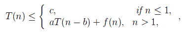

# 减法和征服循环的主定理

> 原文:[https://www . geesforgeks . org/master-定理-减法-征服-递归/](https://www.geeksforgeeks.org/master-theorem-subtract-conquer-recurrences/)

主定理用于确定具有递推关系的函数的大 0 上界，即可分解为子问题的函数。
**减法和征服循环的主定理** :
让 T(n)是定义在正 n 上的函数，如下所示:



对于一些常数 c，a>0，b>0，k>=0 和函数 f(n)。如果 f(n)是 O(n <sup>k</sup> ，那么
1。如果 a < 1，则 T(n) = O(n <sup>k</sup> )
2。如果 a=1，则 T(n) = O(n <sup>k+1</sup> )
3。如果 a > 1 那么 T(n)= O(n<sup>k</sup>a<sup>n/b</sup>)
**上述定理的证明(通过代换法)** :
从上述函数，我们得到:
T(n)= aT(n-b)+f(n)
T(n-b)= aT(n-2b)+f(n-b)
T(n-2b)= aT(T)
T(n-b)= a<sup>2</sup>T(n-3b)+af(n-2b)+f(n-b)
T(n)= a<sup>3</sup>T(n-3b)+a<sup>2</sup>f(n-2b)+af(n-b)+f(n)
T(n)=σ<sup>I = 0 至 n</sup>a<sup>I【T39</sup>

其中，
如果 a < 1，则σ<sup>I = 0 至 n/b</sup> a <sup>i</sup> = O(1)，T(n) = O(n <sup>k</sup> )
如果 a=1，则σ<sup>I = 0 至 n/b</sup> a <sup>i</sup> = O(n)，T(n) = O(n <sup>k+1</sup> )
如果

## C++

```
#include<stdio.h>
int fib(int n)
{
   if (n <= 1)
      return n;
   return fib(n-1) + fib(n-2);
}

int main ()
{
  int n = 9;
  printf("%d", fib(n));
  getchar();
  return 0;
}
```

## 蟒蛇 3

```
# Python3 code for the above approach
def fib(n):
    if (n <= 1):
        return n
    return fib(n - 1) + fib(n - 2)

# Driver code
n = 9
print(fib(n))

# This code is contributed
# by sahishelangia
```

## Java 语言(一种计算机语言，尤用于创建网站)

```
//Java code for above the approach.
class clg
{
 static int fib(int n)
{
if (n <= 1)
    return n;
return fib(n-1) + fib(n-2);
}
// Driver Code
public static void main (String[] args)
{
int n = 9;
System.out.println( fib(n));
}
}
// This code is contributed by Mukul Singh.
```

## C#

```
// C# code for above the approach.
using System;

class GFG
{
    static int fib(int n)
    {
        if (n <= 1)
            return n;
        return fib(n - 1) + fib(n - 2);
    }

    // Driver Code
    public static void Main(String[] args)
    {
        int n = 9;
        Console.WriteLine(fib(n));
    }
}

// This code has been contributed
// by Rajput-Ji
```

## 服务器端编程语言（Professional Hypertext Preprocessor 的缩写）

```
<?php
// PHP code for the above approach
function fib($n)
{
    if ($n <= 1)
        return $n;
    return fib($n - 1) +
           fib($n - 2);
}

// Driver Code
$n = 9;
echo fib($n);

// This code is contributed
// by Akanksha Rai
?>
```

## java 描述语言

```
<script>
    // Javascript code for above the approach.

    function fib(n)
    {
        if (n <= 1)
            return n;
        return fib(n - 1) + fib(n - 2);
    }

    let n = 9;
      document.write(fib(n));

</script>
```

**输出**T2】

```
34
```

**时间复杂度分析:**
递归函数可以定义为，T(n) = T(n-1) + T(n-2)

*   对于最坏的情况，让 t(n-1)≈t(n-2)
    t(n)= 2t(n-1)+c
    其中，f(n) = O(1)
    ∴ k=0，a=2，b = 1；
    T(n)= O(n<sup>0</sup>2<sup>n/1</sup>)
    = O(2<sup>n</sup>)

*   最佳情况下，让 t(n-2)≈t(n-1)
    t(n)= 2t(n-2)+c
    其中，f(n) = O(1)
    ∴ k=0，a=2，b = 2；
    T(n)= O(n<sup>0</sup>2<sup>n/2</sup>)
    = O(2<sup>n/2</sup>)

**更多示例**:

*   **example-1**:
    【t(n)= 3t(n-1)，n>【0】
    = c，n < =0
    土壤:a=3，b=1，f(n)= 0 so k = 0；
    自> 0，t(n)= o(n)<sup>k</sup>a<sup>n/b</sup>)
    t(n)= o(n)<sup>3<sup>n/1</sup></sup>
*   **例-2** :
    T(n) = T(n-1) + n(n-1)，如果 n > =2
    = 1，如果 n=1
    Sol:a=1，b=1，f(n)=n(n-1)所以 k = 2；
    由于 a=1，T(n)= O(n<sup>k+1</sup>)
    T(n)= O(n<sup>2+1</sup>)
    T(n)= O(n<sup>3</sup>)

*   **示例-3**:
    T(n)= 2T(n-1)–1，如果 n > 0
    = 1，如果 n < =0
    Sol:由于函数不是 **T(n) = aT(n-b) + f(n)**
    的形式，因此无法使用上述方法解决此复发问题

本文由**雅什辛拉**供稿。如果你喜欢 GeeksforGeeks 并想投稿，你也可以使用[write.geeksforgeeks.org](https://write.geeksforgeeks.org)写一篇文章或者把你的文章邮寄到 contribute@geeksforgeeks.org。看到你的文章出现在极客博客主页上，帮助其他极客。
如果你发现任何不正确的地方，或者你想分享更多关于上面讨论的话题的信息，请写评论。