# 数学|旋转体表面面积

> 原文:[https://www . geesforgeks . org/数学-旋转固体表面面积/](https://www.geeksforgeeks.org/mathematics-area-of-the-surface-of-solid-of-revolution/)

考虑纵坐标 x=a 和 x=b 之间的 x-y 平面中的一个平面 y=f(x)，如果这条曲线的某一部分围绕一个轴旋转，则生成一个旋转体。
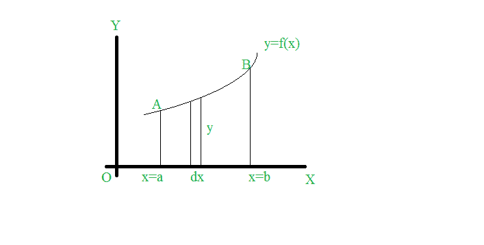

**我们可以通过各种方式计算出这次公转的面积，比如:**

1.  **Cartesian Form:**
    *   **通过围绕 x 轴旋转曲线的圆弧而形成的实体面积是-**
        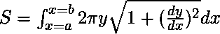
    *   **绕 y 轴旋转曲线的旋转面积为-**
        

2.  **Parametric Form: 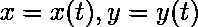**
    *   **关于 x 轴:**
        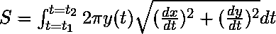
    *   **关于 y 轴:**
        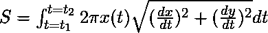
3.  **Polar Form: r=f(θ)**
    *   **关于 x 轴:初始线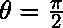** 
        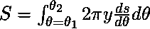
        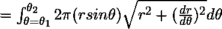
        这里用 f(θ)代替 r
    *   **关于 y 轴:**
        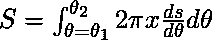
        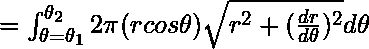
        这里用 f(θ)代替 r
4.  **About any axis or line L:  where PM is the perpendicular distance of a point P of the curve to the given axis.**
    *   **x 的界限:x = a 到 x = b**
        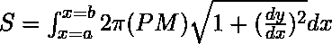
        这里 PM 是用 x 来表示的。
    *   **y 的界限:y = c 到 y = d**
        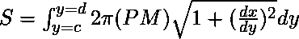
        这里 PM 是用 y 来表示的

    **例:**
    求抛物线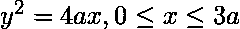绕 x 轴旋转产生的旋转体的面积。
    **解释:**
    现在给我们抛物线方程的笛卡尔形式，抛物线已经绕 x 轴旋转。因此，我们使用绕 x 轴旋转笛卡尔形式的公式，即:

    

    这里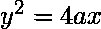。现在我们需要计算 dy/dx

    区分 w . r . t . x，我们得到:

    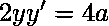

    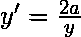

    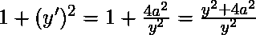

    使用

    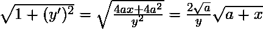

    现在我们得到了 x=0 到 x=3 的极限。将我们的计算值代入上述公式，我们得到:

    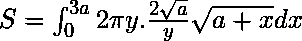

    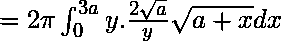

    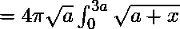

    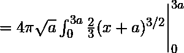

    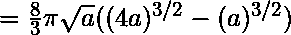

    

    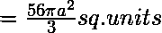