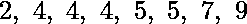
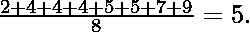
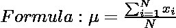
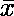
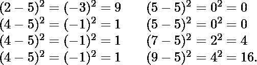
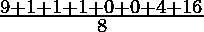
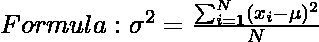
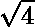

# 数学|均值、方差和标准差

> 原文:[https://www . geeksforgeeks . org/数学-均值-方差-标准差/](https://www.geeksforgeeks.org/mathematics-mean-variance-and-standard-deviation/)

**平均值**是给定数据集的平均值。让我们考虑下面的例子

这八个数据点的平均值为 5:

其中μ为平均值，x 1 ，x 2 ，x 3 …。，x i 都是元素。还要注意，平均值有时用表示

**方差**是所有数字和平均值的差的平方和。
偏差为上例。首先，计算每个数据点与平均值的偏差，并对每个结果进行平方:

方差=

= 4. 

其中μ是平均值，N 是元素总数或分布频率。

**标准差**是方差的平方根。这是衡量数据偏离平均值的程度。

标准偏差(以上数据)=  = 2

为什么数学家选择了一个平方然后求平方根来求偏差，为什么不简单取值之差呢？
一个原因是根据均值的定义，差之和变为 0。绝对差之和可能是一个选项，但是有了绝对差，就很难证明很多好的定理。【来源:[麻省理工学院视频讲座](https://www.youtube.com/watch?v=oI9fMUqgfxY#t=4589)1:19】

1.  如果输入中的所有条目都相同，则标准差的值为 0。
2.  如果我们在输入集中的所有值上加上(或减去)一个数字，比如 7，平均值就会增加(或减少)7，但标准偏差不会改变。
3.  如果我们将输入集中的所有值乘以数字 7，平均值和标准偏差都乘以 7。但是如果我们将所有输入值乘以一个负数，比如-7，平均值乘以-7，但是标准差乘以 7。
4.  标准偏差和方差是一个衡量数字分布的标准。虽然方差给你一个粗略的扩散概念，但标准差更具体，给你与平均值的精确距离。
5.  平均值、中位数和众数是数据(分组或不分组)中心趋势的量度。

以下问题是往年 GATE 考试
[的提问](https://www.geeksforgeeks.org/gate-gate-cs-2012-question-64/)

**参考文献:**
[【https://en.wikipedia.org/wiki/Standard_deviation】](https://en.wikipedia.org/wiki/Standard_deviation)
[http://staff . argyll . epsb . ca/jreed/math 30p/statistics/standard deviation . htm](http://staff.argyll.epsb.ca/jreed/math30p/statistics/standardDeviation.htm)

如果发现有不正确的地方，请写评论，或者想分享更多关于以上讨论话题的信息