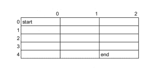

# 矩阵问题中路径数后面的数学

> 原文:[https://www . geesforgeks . org/数学-矩阵中路径数后面的问题/](https://www.geeksforgeeks.org/maths-behind-number-of-paths-in-matrix-problem/)

问题是计算从 m*n 矩阵的左上到右下的所有可能路径，并限制从每个单元格只能向右或向下移动。

首先阅读所述问题的各种可能的解决方案[这里](https://www.geeksforgeeks.org/count-possible-paths-top-left-bottom-right-nxm-matrix/)

现在对于最后一个解，计算路径数的组合公式给出为**m+n–2Cm–1**。让我们讨论一下那个公式背后的数学原理。

> 假设我们有一个 m*n 矩阵，那么根据这个问题，我们只能向右或向下移动。
> 
> 这里 **m = 5** 和 **n = 3** ，我们从 **(0，0)** (即开始)开始，到终点即 **(4，2)** 我们可以考虑任意一条路径假设我们选择
> **(0，0)—>(0，1)—>(0，2)—>(1，2)—>(2)即使我们走其他路，也需要相同数量的右下台阶。**

现在回忆一下数学中的组合。这就是我们没有字母而是有路径的地方。在这里，我们必须覆盖 n-1 + m-1 蜂窝长度到目的地。
还记得我们正在向下移动 m-1 步，向右移动 n-1 步。因此路径的数量本质上是**(m+n–2)！/(n–1)！*(m–1)！**无非就是**T4】m+n–2Cn–1T8】或者**T10】m+n–2Cm–1T14】。****