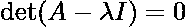
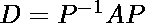
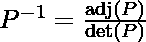

# 矩阵对角化

> 原文:[https://www.geeksforgeeks.org/matrix-diagonalization/](https://www.geeksforgeeks.org/matrix-diagonalization/)

先决条件:
[特征值和特征向量](https://www.geeksforgeeks.org/eigen-values-and-eigen-vectors/)

设 A 和 B 是 n 阶的两个矩阵，如果存在可逆矩阵 P，则 B 可以被认为与 A 相似

<center>

<center></center>

</center>

这就是所谓的**矩阵相似变换**。

**矩阵的对角化**定义为将任意矩阵 A 化为对角形式 D 的过程，根据相似变换，如果矩阵 A 与 D 有关，那么

<center>

<center></center>

</center>

矩阵 A 通过另一个矩阵 P**(P≡模态矩阵)**化为对角矩阵 D

> **模态矩阵:**是由特征向量组成的(n×n)矩阵。一般用在对角化和相似变换的过程中。

简单来说，就是取一个正方形矩阵，转换成一种特殊类型的矩阵，称为**对角矩阵的过程。**

**涉及的步骤**

```
Step 1 - Initialize the diagonal matrix D as:
```

<center>

<center>![D=\left[\begin{array}{ccc} \lambda_{1} & 0 & 0 \\ 0 & \lambda_{2} & 0 \\ 0 & 0 & \lambda_{3} \end{array}\right]](img/96e0c45de00d8a0a8fe94a8ac9fa6094.png "Rendered by QuickLaTeX.com")</center>

</center>

```
where λ<sub>1, λ2, λ3 -></sub> eigen values
```

```
Step 2 - Find the eigen values using the equation given below.
```

<center>

<center></center>

 </center>

```
where, 
A -> given 3x3 square matrix.
I -> identity matrix of size 3x3.
λ -> eigen value.
```

```
Step 3 - Compute the corresponding eigen vectors using the equation given below.
```

<center>

<center>![\begin{array}{l} A t, \lambda=i \\ {[A-\lambda I] X_{i}=0} \end{array}](img/9a9c6b90b8b3c665226dbce56ad51f39.png "Rendered by QuickLaTeX.com")</center>

</center>

```
where,
λ<sub>i -></sub> eigen value.
X<sub>i -></sub> corresponding eigen vector.
```

```
Step 4 - Create the modal matrix P.
```

<center>

<center>![P=\left[X_{0} X_{1} . . X_{n}\right]](img/217290c598359af28a560829419a87d0.png "Rendered by QuickLaTeX.com")</center>

```
Here, all the eigen vectors till Xi are filled column wise in matrix P. 
```

```
Step 5 - Find P-1 and then use equation given below to find diagonal matrix D.
```

<center>

<center></center>

</center>

**例题**

**问题陈述:**假设一个 3×3 的正方形矩阵 A 具有以下值:

<center>

<center>![A=\left[\begin{array}{ccc} 1 & 0 & -1 \\ 1 & 2 & 1 \\ 2 & 2 & 3 \end{array}\right]](img/604abb54df91ea57907043ebb8719f01.png "Rendered by QuickLaTeX.com")</center>

</center>

利用矩阵的对角化求 A 的对角矩阵 D。[ D = P <sup>-1</sup> AP ]

**分步求解:**

```
Step 1 - Initializing D as:
```

<center>

<center>![D=\left[\begin{array}{ccc} \lambda_{1} & 0 & 0 \\ 0 & \lambda_{2} & 0 \\ 0 & 0 & \lambda_{3} \end{array}\right]](img/96e0c45de00d8a0a8fe94a8ac9fa6094.png "Rendered by QuickLaTeX.com")</center>

</center>

```
Step 2 - Find the eigen values. (or possible values of λ)
```

<center>

<center></center>

</center>

<center>![\begin{array}{l} \Longrightarrow \operatorname{det}(A-\lambda I)=\operatorname{det}\left(\left[\begin{array}{ccc} 1-\lambda & 0 & -1 \\ 1 & 2-\lambda & 1 \\ 2 & 2 & 3-\lambda \end{array}\right]\right)=0 \\ \Longrightarrow\left(\lambda^{3}-6 \lambda^{2}+11 \lambda-6\right)=0 & \\ \Longrightarrow(\lambda-1)(\lambda-2)(\lambda-3)=0 \\ \Longrightarrow & \lambda=1,2,3 \end{array}](img/d8924da4522d9c265f01dfc051ddcf1e.png "Rendered by QuickLaTeX.com")</center>

```
Step 3 - Find the eigen vectors X1, X2, X3 corresponding to the eigen values λ = 1,2,3\. 
```

<center>![At $\lambda=1$ A - $(1) I$ $X_{1}=0$ $\Longrightarrow\left[\begin{array}{ccc}1-1 & 0 & -1 \\ 1 & 2-1 & 1 \\ 2 & 2 & 3-1\end{array}\right]\left[\begin{array}{l}x_{1} \\ x_{2} \\ x_{3}\end{array}\right]=\left[\begin{array}{l}0 \\ 0 \\ 0\end{array}\right]$ $\Longrightarrow\left[\begin{array}{ccc}0 & 0 & -1 \\ 1 & 1 & 1 \\ 2 & 2 & 2\end{array}\right]\left[\begin{array}{l}x_{1} \\ x_{2} \\ x_{3}\end{array}\right]=\left[\begin{array}{l}0 \\ 0 \\ 0\end{array}\right]$ On solving, we get the following equations: $x_{3}=0\left(x_{1}\right)$ $x_{1}+x_{2}=0 \Longrightarrow x_{2}=-x_{1}$ $\therefore X_{1}=\left[\begin{array}{c}x_{1} \\ -x_{1} \\ 0\left(x_{1}\right)\end{array}\right]$ $\Longrightarrow X_{1}=\left[\begin{array}{c}1 \\ -1 \\ 0\end{array}\right]$ Similarly, for $\lambda=2$ $X_{2}=\left[\begin{array}{c}-2 \\ 1 \\ 2\end{array}\right]$ and for $\lambda=3$ $X_{3}=\left[\begin{array}{c}1 \\ -1 \\ -2\end{array}\right]$](img/6e796597a7d23232cf54123df1bb8cc8.png "Rendered by QuickLaTeX.com")</center>

<center></center>

```
Step 5 - Creation of modal matrix P. (here, X1, X2, X3 are column vectors)
```

<center>![P=\left[X_{1} X_{2} X_{3}\right]=\left[\begin{array}{ccc} 1 & -2 & 1 \\ -1 & 1 & -1 \\ 0 & 2 & -2 \end{array}\right]](img/a56304856c9ca0f96bbe6132ea6cc980.png "Rendered by QuickLaTeX.com")</center>

```
Step 6 - Finding P-1 and then putting values in diagonalization of a matrix equation. [D = P<sup>-1AP]</sup>
```

> 我们进行**步骤 6** 以找出哪个特征值将取代在**步骤 1** 中创建的初始对角矩阵中的λ <sub>1</sub> 、λ <sub>2</sub> 和λ <sub>3</sub> 。

<center>![\begin{array}{l} \begin{array}{l} \quad P=\left[\begin{array}{ccc} 1 & -2 & 1 \\ -1 & 1 & -1 \\ 0 & 2 & -2 \end{array}\right] \\ \operatorname{det}(P)=(1)[(-2)(1)-(-1)(2)]-(-2)[(-2)(-1)-(0)(-1)]+(1)[(2)(-1)- \\ (0)(1)] \\ =[0+(4)+(-2)] \\ =2 \end{array}\\ \text { Since } \operatorname{det}(P) \neq 0 \Longrightarrow \text { Matrix } P \text { is invertible. } \end{array}](img/bf78967d8feac3a3f5f961b5cc4b47c8.png "Rendered by QuickLaTeX.com")</center>

> 参考文章:[矩阵的行列式](https://www.geeksforgeeks.org/determinant-of-a-matrix/) & [矩阵的逆](https://www.geeksforgeeks.org/adjoint-inverse-matrix/)

我们知道

<center></center>

在解决问题时，我们得到

<center>![P^{-1}=\frac{1}{2}\left[\begin{array}{ccc} 0 & -2 & 1 \\ -2 & -2 & 0 \\ -2 & -2 & -1 \end{array}\right]](img/f53260937e0ac2538bd97b4bb7dc34eb.png "Rendered by QuickLaTeX.com")</center>

把矩阵方程对角化，我们得到

<center>![\begin{array}{l} \quad D=P^{-1} A P \\ D=\frac{1}{2}\left[\begin{array}{ccc} 0 & -2 & 1 \\ -2 & -2 & 0 \\ -2 & -2 & -1 \end{array}\right]\left[\begin{array}{ccc} 1 & 0 & -1 \\ 1 & 2 & 1 \\ 2 & 2 & 3 \end{array}\right]\left[\begin{array}{ccc} 1 & -2 & 1 \\ -1 & 1 & -1 \\ 0 & 2 & -2 \end{array}\right] \\ D=\left[\begin{array}{lll} 1 & 0 & 0 \\ 0 & 2 & 0 \\ 0 & 0 & 3 \end{array}\right] \end{array}](img/35e62cbb9f7868d0b2d0b49ab410089c.png "Rendered by QuickLaTeX.com")</center>

 </center>