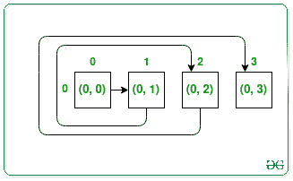
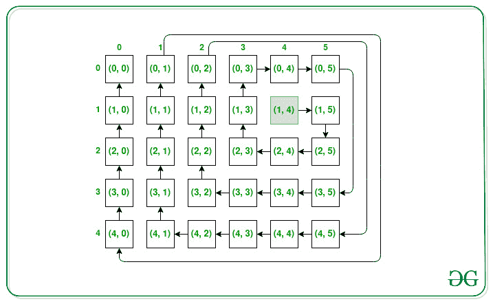

# 从给定坐标开始的矩阵螺旋遍历

> 原文:[https://www . geesforgeks . org/matrix-spiral-遍历-从给定坐标开始/](https://www.geeksforgeeks.org/matrix-spiral-traversal-starting-from-given-coordinates/)

给定[矩阵](https://www.geeksforgeeks.org/matrix/) **N** 和 **M、**的顺序和一个源位置( **X、Y** )，任务是在以**顺时针** **螺旋顺序(**(即东- >南- >西- >北)访问时，按**顺序找到矩阵的所有坐标。无论何时移出矩阵，继续在矩阵外行走，稍后返回矩阵。**

**示例:**

> **输入:** N = 1，M = 4，X = 0，Y = 0
> **输出:** {{0，0}，{0，1}，{0，2}，{0，3}}
> **解释:**
> 
> 
> 
> **输入:** N = 5，M = 6，X = 1，Y = 4
> **输出:** {{1，4}，{1，5}，{2，5}，{2，4}，{2，3}，{1，3}，{0，3}，{0，4}，{0，5}，{3，5}，{3，4}，{3，3}，{3，2}，{2，2}，{1，2}，{0
> 
> 

**方法:**给定的问题可以通过[从位置 **(X，Y)** 以**顺时针螺旋方向**](https://www.geeksforgeeks.org/print-a-given-matrix-in-spiral-form/) 遍历矩阵来解决，每当到达[矩阵](https://www.geeksforgeeks.org/matrix/)之外时，不要将坐标包含在解中，而是[继续](https://www.geeksforgeeks.org/continue-statement-cpp/)向外遍历再次到达矩阵内部。继续这一过程，直到基质的所有细胞都不包括在溶液或结果中。

下面是上述方法的实现:

## C++

```
// C++ program for the above approach

#include <bits/stdc++.h>
using namespace std;

// Function to turn one unit left
void turn_left(int& r, int& c)
{
    c -= 1;
}

// Function to turn one unit right
void turn_right(int& r, int& c)
{
    c += 1;
}

// Function to turn one unit up
void turn_up(int& r, int& c)
{
    r -= 1;
}

// Function to turn one unit down
void turn_down(int& r, int& c)
{
    r += 1;
}

// For checking whether a cell lies
// outside the matrix or not
bool is_outside(int row, int col,
                int r, int c)
{
    if (r >= row || c >= col
        || r < 0 || c < 0)
        return true;
    return false;
}

// Function to rotate in clockwise manner
void next_turn(char& previous_direction,
               int& r, int& c)
{
    if (previous_direction == 'u') {
        turn_right(r, c);
        previous_direction = 'r';
    }
    else if (previous_direction == 'r') {
        turn_down(r, c);
        previous_direction = 'd';
    }
    else if (previous_direction == 'd') {
        turn_left(r, c);
        previous_direction = 'l';
    }
    else if (previous_direction == 'l') {
        turn_up(r, c);
        previous_direction = 'u';
    }
}

// Function to move in the same direction
// as its prev_direction
void move_in_same_direction(
    char previous_direction,
    int& r, int& c)
{
    if (previous_direction == 'r')
        c++;
    else if (previous_direction == 'u')
        r--;
    else if (previous_direction == 'd')
        r++;
    else if (previous_direction == 'l')
        c--;
}

// Function to find the spiral order of
// of matrix according to given rules
vector<vector<int> > spiralMatrixIII(
    int rows, int cols, int r, int c)
{
    // For storing the co-ordinates
    vector<vector<int> > res;
    char previous_direction = 'r';

    // For keeping track of no of steps
    // to go without turn
    int turning_elements = 2;

    // Count is for counting total cells
    // put in the res
    int count = 0;

    // Current_count is for keeping track
    // of how many cells need to
    // traversed in the same direction
    int current_count = 0;

    // For keeping track the number
    // of turns we have made
    int turn_count = 0;
    int limit = rows * cols;

    while (count < limit) {

        // If the current cell is within
        // the board
        if (!is_outside(rows, cols, r, c)) {
            res.push_back({ r, c });
            count++;
        }
        current_count++;

        // After visiting turning elements
        // of cells we change our turn
        if (current_count == turning_elements) {

            // Changing our direction
            // we have to increase the
            // turn count
            turn_count++;

            // In Every 2nd turn increasing
            // the elements the turn visiting
            if (turn_count == 2)
                turning_elements++;

            // After every 3rd turn reset
            // the turn_count to 1
            else if (turn_count == 3) {
                turn_count = 1;
            }

            // Changing direction to next
            // direction based on the
            // previous direction
            next_turn(previous_direction, r, c);

            // Reset the current_count
            current_count = 1;
        }
        else {
            move_in_same_direction(
                previous_direction, r, c);
        }
    }

    // Return the traversal
    return res;
}

// Driver Code
int main()
{
    int N = 5, M = 6, X = 1, Y = 4;
    auto res = spiralMatrixIII(N, M, X, Y);

    // Display answer
    for (auto it : res) {
        cout << '(' << it[0] << ", "
             << it[1] << ')' << ' ';
    }
    return 0;
}
```

**Output:**(1, 4) (1, 5) (2, 5) (2, 4) (2, 3) (1, 3) (0, 3) (0, 4) (0, 5) (3, 5) (3, 4) (3, 3) (3, 2) (2, 2) (1, 2) (0, 2) (4, 5) (4, 4) (4, 3) (4, 2) (4, 1) (3, 1) (2, 1) (1, 1) (0, 1) (4, 0) (3, 0) (2, 0) (1, 0) (0, 0)  

***时间复杂度:**O(N<sup>2</sup>)*
***辅助空间:** O(1)*