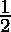
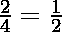
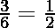
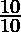
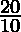
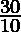

# 给定数组中唯一比率/分数对的最大计数

> 原文:[https://www . geeksforgeeks . org/给定数组中唯一比率分数对的最大计数/](https://www.geeksforgeeks.org/max-count-of-unique-ratio-fraction-pairs-in-given-arrays/)

给定两个数组 **num[]** 和 **den[]** ，分别表示分子和分母，任务是找到唯一分数的计数。

**示例:**

> **输入:** num[] = {1，2，3，4，5}，den[] = {2，4，6，1，11}
> **输出:** 3
> **解释:**
> 分数的最简单形式
> Frac[0]=>
> Frac[1]=>
> Frac[2]=>
> Frac[3]=>
> 
> 唯一分数的计数=> 3
> 
> **输入:** num[] = {10，20，30，50}，den[] = {10，10，10，10}
> **输出:** 4
> **解释:**
> 分数的最简单形式
> Frac[0]=>T11】Frac[1]=>T13】Frac[2]=>T15】Frac[3]
> 
> 唯一分数的计数=> 4

**方法:**想法是使用[哈希映射](https://www.geeksforgeeks.org/hashing-data-structure/)来找到唯一的分数。为了存储分数以使副本不存在，我们将每个[分数转换为其最低形式](https://www.geeksforgeeks.org/reduce-the-fraction-to-its-lowest-form/)。

下面是上述方法的实现:

## C++

```
// C++ implementation to find
// fractions in its lowest form

#include <bits/stdc++.h>

using namespace std;

// Recursive function to
// find gcd of a and b
int gcd(int a, int b)
{
    if (b == 0)
        return a;
    return gcd(b, a % b);
}

// Function to count the unique
// fractions in the given array
int countUniqueFractions(int num[],
                int den[], int N){

    // Hash-map to store the fractions
    // in its lowest form
    map<pair<int, int>, int> mp;

    // Loop to iterate over the
    // fractions and store is lowest
    // form in the hash-map
    for (int i = 0; i < N; i++) {
        int number, denom;

        // To find the Lowest form
        number = num[i] / gcd(num[i], den[i]);
        denom = den[i] / gcd(num[i], den[i]);
        mp[make_pair(number, denom)] += 1;
    }

    return mp.size();
}

// Driver code
int main()
{
    int N = 6;

    // Numerator Array
    int num[] = { 1, 40, 20, 5, 6, 7 };

    // Denominator Array
    int den[] = { 10, 40, 2, 5, 12, 14 };

    cout << countUniqueFractions(num, den, N);

    return 0;
}
```

## Java 语言(一种计算机语言，尤用于创建网站)

```
// Java implementation to find 
// fractions in its lowest form
import java.lang.*;
import java.util.*;

class GFG{

static class pair
{
    int x, y;
    pair(int x,int y)
    {
        this.x = x;
        this.y = y;
    }

    @Override
    public int hashCode()
    {
        return this.x;
    }

    @Override
    public boolean equals(Object obj)
    {

        // If both the object references are
        // referring to the same object.
        if(this == obj)
        return true;

        // It checks if the argument is of the
        // type pair by comparing the classes
        // of the passed argument and this object.
        // if(!(obj instanceof pair)) return
        // false; ---> avoid.
        if(obj == null ||
           obj.getClass() !=
          this.getClass())
            return false;

        // Type casting of the argument.
        pair geek = (pair) obj;

        // comparing the state of argument with
        // the state of 'this' Object.
        return (geek.x == this.x &&
                geek.y == this.y);
    }
}

// Recursive function to
// find gcd of a and b
static int gcd(int a, int b)
{
    if (b == 0)
        return a;

    return gcd(b, a % b);
}

// Function to count the unique
// fractions in the given array
static int countUniqueFractions(int num[],
                                int den[], int N)
{

    // Hash-map to store the fractions
    // in its lowest form
    Map<pair, Integer> mp = new HashMap<>();

    // Loop to iterate over the
    // fractions and store is lowest
    // form in the hash-map
    for(int i = 0; i < N; i++)
    {

        // To find the Lowest form
        int numer = num[i] / gcd(num[i], den[i]);
        int denom = den[i] / gcd(num[i], den[i]);
        pair tmp = new pair(numer, denom);
        mp.put(tmp, 1);
    }
    return mp.size();
}

// Driver Code
public static void main (String[] args)
{
    int N = 6;

    // Numerator Array
    int num[] = { 1, 40, 20, 5, 6, 7 };

    // Denominator Array
    int den[] = { 10, 40, 2, 5, 12, 14 };

    System.out.print(countUniqueFractions(num, den, N));
}
}

// This code is contributed by offbeat
```

## 蟒蛇 3

```
# Python3 implementation to find
# fractions in its lowest form
from collections import defaultdict

# Recursive function to
# find gcd of a and b
def gcd(a, b):

    if (b == 0):
        return a
    return gcd(b, a % b)

# Function to count the unique
# fractions in the given array
def countUniqueFractions(num, den, N):

    # Hash-map to store the fractions
    # in its lowest form
    mp = defaultdict(int)

    # Loop to iterate over the
    # fractions and store is lowest
    # form in the hash-map
    for i in range(N):

        # To find the Lowest form
        numer = num[i] // gcd(num[i], den[i])
        denom = den[i] // gcd(num[i], den[i])
        mp[(numer, denom)] += 1

    return len(mp)

# Driver code
if __name__ == "__main__":

    N = 6

    # Numerator Array
    num = [ 1, 40, 20, 5, 6, 7 ]

    # Denominator Array
    den = [ 10, 40, 2, 5, 12, 14 ]

    print(countUniqueFractions(num, den, N))

# This code is contributed by chitranayal
```

## java 描述语言

```
<script>

// Javascript implementation to find 
// fractions in its lowest form

// Recursive function to
// find gcd of a and b
function gcd(a,b)
{
    if (b == 0)
        return a;

    return gcd(b, a % b);
}

// Function to count the unique
// fractions in the given array
function countUniqueFractions(num,den,N)
{
    // Hash-map to store the fractions
    // in its lowest form
    let mp = new Map();

    // Loop to iterate over the
    // fractions and store is lowest
    // form in the hash-map
    for(let i = 0; i < N; i++)
    {

        // To find the Lowest form
        let numer = num[i] / gcd(num[i], den[i]);
        let denom = den[i] / gcd(num[i], den[i]);
        let tmp = [numer, denom];
        mp.set(tmp.toString(), 1);
    }
    return mp.size;
}
// Driver Code

let N = 6;
// Numerator Array
let num=[1, 40, 20, 5, 6, 7 ];
// Denominator Array
let den=[10, 40, 2, 5, 12, 14];
document.write(countUniqueFractions(num, den, N));

// This code is contributed by avanitrachhadiya2155
</script>
```

**Output:** 

```
4
```

**时间复杂度** : O(N*log(MAX))，其中 N 是数组的大小，MAX 是数组 num 和 den 中的最大个数。
**辅助空间** : O(N + log(MAX))