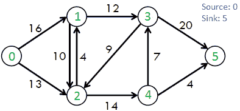
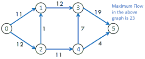
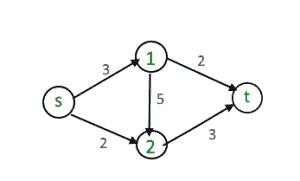
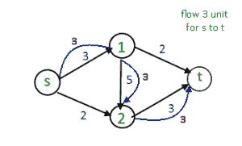
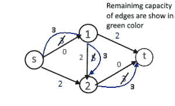
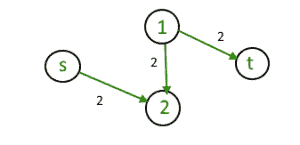
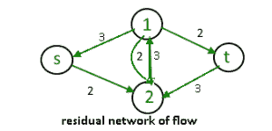

# 最大流量问题介绍

> 原文:[https://www . geesforgeks . org/max-flow-problem-introduction/](https://www.geeksforgeeks.org/max-flow-problem-introduction/)

最大流量问题涉及通过单源、单汇流量网络找到一个最大的可行流量。
我们举一个图像来说明上面的定义想说什么。
[](https://www.geeksforgeeks.org/wp-content/uploads/ford_fulkerson11.png)

每条边都标有容量，即它能承载的最大容量。目标是找出有多少东西可以从顶点 s(源)推到顶点 t(汇)。

。 [](http://www.geeksforgeeks.org/wp-content/uploads/ford_fulkerson2.png) 
最大流量可能是: **23**

以下是解决问题的不同方法:

**1。天真的贪婪算法方法(可能不会产生最优或正确的结果)**
最大流问题的贪婪方法是从全零流开始，贪婪地产生具有越来越高值的流。从一个到下一个的自然方式是在从 s 到 t 的某个路径上发送更多的流量
贪婪方法是如何找到最大流量的:

```
E number of edge 
f(e) flow of edge 
C(e) capacity of edge 

1) Initialize : max_flow = 0  
                f(e) = 0 for every edge 'e' in E 

2) Repeat search for an s-t path P while it exists.   
   a) Find if there is a path from s to t using BFS
      or DFS. A path exists if f(e) < C(e) for 
      every edge e on the path.
   b) If no path found, return max_flow.
   c) Else find minimum edge value for path P

      // Our flow is limited by least remaining
      // capacity edge on path P.
      (i) flow = min(C(e)- f(e)) for path P ]
             max_flow += flow
      (ii) For all edge e of path increment flow 
             f(e) += flow

3) Return max_flow 

```

注意，路径搜索只需要确定边 e 的子图中是否存在 f(e) < C(e)的 s-t 路径。这很容易用 BFS 或离散傅立叶变换在线性时间内完成。

[](http://media.geeksforgeeks.org/wp-content/uploads/image141.png) 
有一条从源(s)到汇(t)的路径【s - > 1 - > 2 - > t】有最大流量 3 个单位(路径显示为蓝色)
[](http://media.geeksforgeeks.org/wp-content/uploads/image15.png)
[](http://media.geeksforgeeks.org/wp-content/uploads/image16.png)
从图中去掉所有无用的边后看起来像
[](http://media.geeksforgeeks.org/wp-content/uploads/maximum.png) 
对于上图没有从源到汇的路径所以最大流量:3 个单位但是最大为了解决这个问题，我们使用剩余图。

**2。残差图**

这个想法是通过允许“撤销”操作来扩展天真的贪婪算法。例如，从该算法陷入上图的点开始，我们想要沿着边缘(s，2)再路由两个流动单元，然后沿着边缘(1，2)向后，撤销我们路由上一次迭代的 3 个单元中的 2 个，最后沿着边缘(1，t)
[](http://media.geeksforgeeks.org/wp-content/uploads/maximum1.png) 
向后边缘:(f(e))和向前边缘:(C(e)–f(e))

我们需要一种方式来正式指定允许的“撤销”操作。这激发了以下简单但重要的剩余网络定义。其思想是，给定一个图 G 和其中的一个流 f，我们形成一个新的流网络 G <sub>f</sub> ，该网络具有相同的 G 顶点集，并且 G 的每条边都有两条边。G 的一条边 e = (1，2)携带流 f(e)并且具有容量 C(e)(对于上图)生成 G <sub>f</sub> 的一条“前向边”，其容量 C(e)-f(e)(剩余的房间)和 G <sub>f【的一条“后向边”(2，1)源(s)-宿(t)路径，f(e) < C(e)用于所有边，如由朴素贪婪算法搜索的，对应于 G <sub>f</sub> 的 s-t 路径的特殊情况，其仅包括前向边。</sub>

剩余图的思想被用于福特-富尔克森算法和迪尼奇算法

**来源:**T2[http://theory.stanford.edu/~tim/w16/l/l1.pdf](http://theory.stanford.edu/~tim/w16/l/l1.pdf)

本文由 **[尼尚·辛格](https://practice.geeksforgeeks.org/user-profile.php?user=_code)** 供稿。如果你喜欢 GeeksforGeeks 并想投稿，你也可以使用[contribute.geeksforgeeks.org](http://www.contribute.geeksforgeeks.org)写一篇文章或者把你的文章邮寄到 contribute@geeksforgeeks.org。看到你的文章出现在极客博客主页上，帮助其他极客。

如果你发现任何不正确的地方，或者你想分享更多关于上面讨论的话题的信息，请写评论。