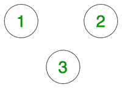
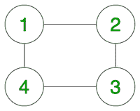
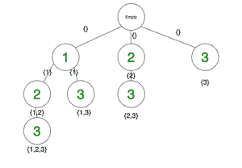

# 使用回溯从给定图中获得最大独立集

> 原文:[https://www . geesforgeks . org/极大独立集-从给定图-使用回溯/](https://www.geeksforgeeks.org/maximal-independent-set-from-a-given-graph-using-backtracking/)

给定一个具有 **V** 顶点和 **E** 边的**无向图**，任务是打印所有的**独立集**，并找到**最大独立集**。

> [**独立集**](https://www.geeksforgeeks.org/mathematics-independent-sets-covering-and-matching/) 是一组顶点，使得集合中的任意两个顶点之间没有直接的边。

> [**【最大独立集】**](https://www.geeksforgeeks.org/largest-independent-set-problem-dp-26/) 是具有最高顶点数的独立集。

**注:**给定图可以有多个独立和极大独立集。
**例:**

> **输入:**
> V = 3，E = 0
> 图形:
> 
> 
> 
> 示例 1 的图表
> 
> **输出:**
> { } { 1 } { 1 2 } { 1 2 3 } { 1 3 } { 2 } { 2 3 } { 3 }
> { 1 2 3 }
> **解释:**
> 第一行代表给定图形的所有可能的独立集。第二行具有给定图可能的最大独立集。
> **输入:**
> V = 4，E = 4
> 图形:
> 
> 
> 
> 示例 2 的图表
> 
> **输出:**
> { } { 1 } { 1 3 } { 2 } { 2 4 } { 3 } { 4 }
> { 1 3 } { 2 4 }

**进场:**
思路是用[回溯](http://www.geeksforgeeks.org/backtracking-algorithms/)解决问题。在每一步中，我们都需要检查当前节点是否与独立集中已经存在的任何节点有任何直接的边。如果没有，我们可以将其添加到我们的独立集合中，并对所有节点递归地重复相同的过程。

> **图解:**
> 递归树第一个例子:
> 
> 
> 
> 所有可能集合的回溯树
> 
> 在上面的回溯树中，我们将只选择那些在添加**安全节点**后产生的集合，以将该集合保持为独立的集合。

以下是上述方法的实现:

## 卡片打印处理机（Card Print Processor 的缩写）

```
// C++ Program to print the
// independent sets and
// maximal independent sets
// of the given graph

#include <bits/stdc++.h>
using namespace std;

// To store all the independent
// sets of the graph
set<set<int> > independentSets;

// To store all maximal independent
// sets in the graph
set<set<int> > maximalIndependentSets;

map<pair<int, int>, int> edges;
vector<int> vertices;

// Function to print all independent sets
void printAllIndependentSets()
{
    for (auto iter : independentSets) {
        cout << "{ ";
        for (auto iter2 : iter) {
            cout << iter2 << " ";
        }
        cout << "}";
    }
    cout << endl;
}

// Function to extract all
// maximal independent sets
void printMaximalIndependentSets()
{
    int maxCount = 0;
    int localCount = 0;
    for (auto iter : independentSets) {

        localCount = 0;
        for (auto iter2 : iter) {
            localCount++;
        }
        if (localCount > maxCount)
            maxCount = localCount;
    }
    for (auto iter : independentSets) {

        localCount = 0;
        set<int> tempMaximalSet;

        for (auto iter2 : iter) {
            localCount++;
            tempMaximalSet.insert(iter2);
        }
        if (localCount == maxCount)
            maximalIndependentSets
                .insert(tempMaximalSet);
    }
    for (auto iter : maximalIndependentSets) {
        cout << "{ ";
        for (auto iter2 : iter) {
            cout << iter2 << " ";
        }
        cout << "}";
    }
    cout << endl;
}

// Function to check if a
// node is safe node.
bool isSafeForIndependentSet(
    int vertex,
    set<int> tempSolutionSet)
{
    for (auto iter : tempSolutionSet) {
        if (edges[make_pair(iter, vertex)]) {
            return false;
        }
    }
    return true;
}

// Recursive function to find
// all independent sets
void findAllIndependentSets(
    int currV,
    int setSize,
    set<int> tempSolutionSet)
{
    for (int i = currV; i <= setSize; i++) {
        if (isSafeForIndependentSet(
                vertices[i - 1],
                tempSolutionSet)) {
            tempSolutionSet
                .insert(vertices[i - 1]);
            findAllIndependentSets(
                i + 1,
                setSize,
                tempSolutionSet);
            tempSolutionSet
                .erase(vertices[i - 1]);
        }
    }
    independentSets
        .insert(tempSolutionSet);
}

// Driver Program
int main()
{
    int V = 3, E = 0;

    for (int i = 1; i <= V; i++)
        vertices.push_back(i);

    vector<pair<int, int> > inputEdges;

    pair<int, int> edge;
    int x, y;
    for (int i = 0; i < E; i++) {
          cout<<i<<endl;
        edge.first = inputEdges[i].first;
        edge.second = inputEdges[i].second;
        edges[edge] = 1;
        int t = edge.first;
        edge.first = edge.second;
        edge.second = t;
        edges[edge] = 1;
    }

    set<int> tempSolutionSet;

    findAllIndependentSets(1,
                           V,
                           tempSolutionSet);

    printAllIndependentSets();

    printMaximalIndependentSets();

    return 0;
}
```

## 蟒蛇 3

```
# Python3 Program to print the
# independent sets and
# maximal independent sets
# of the given graph

# To store all the independent
# sets of the graph
independentSets=set()

# To store all maximal independent
# sets in the graph
maximalIndependentSets=set()

edges=dict()
vertices=[]

# Function to print all independent sets
def printAllIndependentSets():
    for itr in independentSets:
        print("{",end=" ")
        for itr2 in itr:
            print(itr2,end= " ")

        print("}",end='')

    print()

# Function to extract all
# maximal independent sets
def printMaximalIndependentSets():
    maxCount = 0;localCount = 0
    for itr in independentSets:
        localCount = 0
        for itr2 in itr:
            localCount+=1

        if (localCount > maxCount):
            maxCount = localCount

    for itr in independentSets:

        localCount = 0
        tempMaximalSet=set()

        for itr2 in itr:
            localCount+=1
            tempMaximalSet.add(itr2)

        if (localCount == maxCount):
            maximalIndependentSets.add(frozenset(tempMaximalSet))

    for itr in maximalIndependentSets :
        print("{",end=" ")
        for itr2 in itr:
            print(itr2,end=" ")

        print("}",end="")

    print()

# Function to check if a
# node is safe node.
def isSafeForIndependentSet(vertex, tempSolutionSet):
    for itr in tempSolutionSet:
        if (itr, vertex) in edges:
            return False

    return True

# Recursive function to find
# all independent sets
def findAllIndependentSets(currV, setSize, tempSolutionSet):
    for i in range(currV,setSize+1):
        if (isSafeForIndependentSet(vertices[i - 1], tempSolutionSet)) :
            tempSolutionSet.add(vertices[i - 1])
            findAllIndependentSets(i + 1, setSize, tempSolutionSet)
            tempSolutionSet.remove(vertices[i - 1])

    independentSets.add(frozenset(tempSolutionSet))

# Driver Program
if __name__ == '__main__':
    V = 3; E = 0

    for i in range(1,V+1):
        vertices.append(i)

    inputEdges=[]

    for i in range(E):
        edges[inputEdges[i]]=True
        edges[(inputEdges[i][1],inputEdges[i][0])]=True

    tempSolutionSet=set()

    findAllIndependentSets(1, V, tempSolutionSet)

    printAllIndependentSets()

    printMaximalIndependentSets()
```

**Output:** 

```
{ }{ 1 }{ 1 2 }{ 1 2 3 }{ 1 3 }{ 2 }{ 2 3 }{ 3 }
{ 1 2 3 }
```

**时间复杂度:** O(2 ^ N)

**辅助空间:** O(2 ^北)