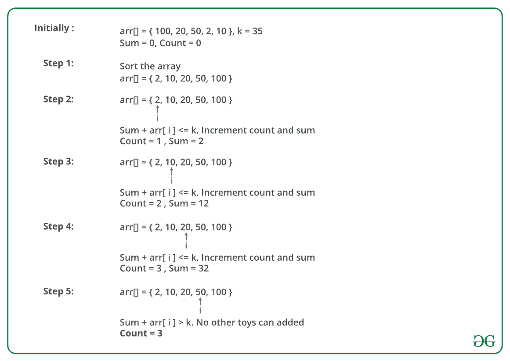

# 用 K

最大化可以购买的玩具数量

> 原文:[https://www . geeksforgeeks . org/最大化可购买玩具数量-金额-k/](https://www.geeksforgeeks.org/maximise-the-number-of-toys-that-can-be-purchased-with-amount-k/)

给定一个包含玩具成本的数组。给定一个整数 K，描述购买玩具的可用金额。写一个程序，找出一个人能用 k
**购买的最大玩具数量注**:一个人只能购买 1 个数量的特定玩具。

**示例:**

```
Input:  N = 10, K =  50
        cost = { 1, 12, 5, 111, 200, 1000, 10, 9, 12, 15 }
Output: 6
Explanation: Toys with amount 1, 5, 9, 10, 12, and 12 
can be purchased resulting in a total amount of 49\. Hence,
maximum number of toys is 6.

Input: N = 7, K = 50
       cost = { 1, 12, 5, 111, 200, 1000, 10 }
Output: 4 
```

解决这个问题的思路是先将*成本*数组按照升序排序。这将按成本递增的顺序排列玩具。现在迭代成本数组，继续计算成本的总和，直到总和小于或等于 k。最后，返回用于计算总和的玩具数量，该数量刚好小于或等于 k。

下图说明了上述方法:



下面是上述方法的实现:

## C++

```
// C++ Program to maximize the
// number of toys with K amount
#include <bits/stdc++.h>
using namespace std;

// This functions returns the required
// number of toys
int maximum_toys(int cost[], int N, int K)
{
    int count = 0, sum = 0;

    // sort the cost array
    sort(cost, cost + N);
    for (int i = 0; i < N; i++) {

        // Check if we can buy ith toy or not
        if (sum +cost[i] <= K)
        {
            sum = sum + cost[i];
            // Increment count
            count++;
        }
    }
    return count;
}

// Driver Code
int main()
{
    int K = 50;
    int cost[] = { 1, 12, 5, 111, 200, 1000, 10, 9, 12, 15 };
    int N = sizeof(cost) / sizeof(cost[0]);

    cout << maximum_toys(cost, N, K) << endl;
    return 0;
}
```

## Java 语言(一种计算机语言，尤用于创建网站)

```
// Java Program to maximize the
// number of toys with K amount
import java.io.*;
import java .util.*;

class GFG
{
// This functions returns
// the required number of toys
static int maximum_toys(int cost[],
                        int N, int K)
{
    int count = 0, sum = 0;

    // sort the cost array
    Arrays.sort(cost);
    for (int i = 0; i < N; i++)
    {

        // Check if we can buy ith toy or not
        if (sum +cost[i] <= K)
        {
            sum = sum + cost[i];
            // Increment count
            count++;
        }
    }
    return count;
}

// Driver Code
public static void main (String[] args)
{
int K = 50;
int cost[] = {1, 12, 5, 111, 200,
            1000, 10, 9, 12, 15};
int N = cost.length;

System.out.print( maximum_toys(cost, N, K));
}
}

// This code is contributed by anuj_67.
```

## 蟒蛇 3

```
# Python 3 Program to maximize the
# number of toys with K amount

# This functions returns the required
# number of toys
def maximum_toys(cost, N, K):
    count = 0
    sum = 0

    # sort the cost array
    cost.sort(reverse = False)
    for i in range(0, N, 1):

        # Check if we can buy ith toy or not
        if (sum+cost[i] <= K):
            sum = sum + cost[i]
            # Increment the count variable
            count += 1

    return count

# Driver Code
if __name__ == '__main__':
    K = 50
    cost = [1, 12, 5, 111, 200,
            1000, 10, 9, 12, 15]
    N = len(cost)

    print(maximum_toys(cost, N, K))

# This code is contributed by
# Sanjit_Prasad
```

## C#

```
// C# Program to maximize the
// number of toys with K amount
using System;

class GFG
{
// This functions returns
// the required number of toys
static int maximum_toys(int []cost,
                        int N, int K)
{
    int count = 0, sum = 0;

    // sort the cost array
    Array.Sort(cost);
    for (int i = 0; i < N; i++)
    {

        // Check if we can buy ith toy or not
        if (sum +cost[i] <= K)
        {
            sum = sum + cost[i];
            // Increment count
            count++;
        }
    }
    return count;
}

// Driver Code
public static void Main ()
{
int K = 50;
int []cost = {1, 12, 5, 111, 200,
            1000, 10, 9, 12, 15};
int N = cost.Length;

Console.Write( maximum_toys(cost, N, K));
}
}

// This code is contributed by anuj_67.
```

## 服务器端编程语言（Professional Hypertext Preprocessor 的缩写）

```
<?php
// PHP Program to maximize the
// number of toys with K amount

// This functions returns
// the required number of toys
function maximum_toys($cost, $N, $K)
{
    $count = 0; $sum = 0;

    // sort the cost array
        sort($cost);
    for ($i = 0; $i < $N; $i++)
    {

            // Check if we can buy ith toy or not
        if ($sum + $cost[$i] <= $K)
        {
            $sum = $sum + $cost[$i];
            // Increment the count variable
            $count++;
        }
    }
    return $count;
}

// Driver Code
$K = 50;
$cost = array(1, 12, 5, 111, 200,
            1000, 10, 9, 12, 15 );
$N = count($cost);

echo maximum_toys($cost, $N, $K),"\n";

// This code is contributed by anuj_67
?>
```

## java 描述语言

```
<script>
    // Javascript Program to maximize the
    // number of toys with K amount

    // This functions returns
    // the required number of toys
    function maximum_toys(cost, N, K)
    {
        let count = 0, sum = 0;

        // sort the cost array
        cost.sort(function(a, b){return a - b});
        for (let i = 0; i < N; i++)
        {

            // Check if we can buy ith toy or not
            if (sum +cost[i] <= K)
            {
                sum = sum + cost[i];
                // Increment count
                count++;
            }
        }
        return count;
    }

    let K = 50;
    let cost = [1, 12, 5, 111, 200, 1000, 10, 9, 12, 15];
    let N = cost.length;

    document.write(maximum_toys(cost, N, K));

</script>
```

**Output :** 

```
6
```

**时间复杂度:** O(N * logN)，其中 N 为成本数组的大小。