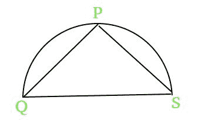

# 给定半径半圆的最大值

> 原文:[https://www . geeksforgeeks . org/给定半径半圆的最大值/](https://www.geeksforgeeks.org/maximize-a-value-for-a-semicircle-of-given-radius/)

给我们一个半径为 **R.** 的**半圆**我们可以取圆周上的任意一点，让它成为 **P.** 现在，从那个点 **P** 画两条直线到直径的两边。让线条为 **PQ** 和 **PS** 。
任务是为给定的 **R.**
找到表达式 **PS <sup>2</sup> + PQ** 的最大值



**例:**

```
Input : R = 1 
Output : 4.25  
(4*1^2 + 0.25) = 4.25

Input : R = 2
Output : 16.25 
(4 * 2^2 + 0.25)= 16.25
```

**设 F = PS^2 + PQ。我们知道 QS = 2R(半圆的直径)**
**- >** 我们也知道**三角形 PQS** 永远是**直角三角形**而不管点 P 在圆的圆周上的位置

```
1.)QS^2 = PQ^2 + PS^2 (Pythagorean Theorem)

2.) Adding and Subtracting PQ on the RHS
     QS^2 = PQ^2 + PS^2 + PQ - PQ

3.) Since QS = 2R
   4*R^2 + PQ - PQ^2 = PS^2 + PQ 
=> 4*R^2 + PQ - PQ^2 = F

4.) Using the concept of maxima and minima 
differentiating F with respect to PQ and equating 
it to 0 to get the point of maxima for F i.e.
   1 - 2 * PQ = 0
 => PQ = 0.5

5.) Now F will be maximum at F = 4*R^2 + 0.25 
```

## C++

```
// C++ program to find
// the maximum value of F
#include <bits/stdc++.h>
using namespace std;

// Function to find the
// maximum value of F
double maximumValueOfF (int R)
{
    // using the formula derived for
    // getting the maximum value of F
    return 4 * R * R + 0.25;    
}

// Drivers code
int main()
{
    int R = 3;
    printf("%.2f", maximumValueOfF(R));
    return 0;
}
```

## Java 语言（一种计算机语言，尤用于创建网站）

```
// JAVA program to find
// the maximum value of F
import java.io.*;

class GFG
{

    // Function to find the
    // maximum value of F
    static double maximumValueOfF (int R)
    {

        // using the formula derived for
        // getting the maximum value of F
        return 4 * R * R + 0.25;    
    }

    // Driver code
    public static void main (String[] args)
    {
        int R = 3;
        System.out.println(maximumValueOfF(R));
    }

}

// This code is contributed
// by anuj_67.
```

## 蟒蛇 3

```
# python program to find
# the maximum value of F

# Function to find the
# maximum value of F
def maximumValueOfF (R):

    # using the formula derived for
    # getting the maximum value of F
    return 4 * R * R + 0.25

# Drivers code
R = 3
print(maximumValueOfF(R))

# This code is contributed by Sam007.
```

## C#

```
// C# program to find the
// maximum value of F
using System;

class GFG
{

    // Function to find the
    // maximum value of F
    static double maximumValueOfF (int R)
    {

        // using the formula derived for
        // getting the maximum value of F
        return 4 * R * R + 0.25;    
    }

    // Driver code
    public static void Main ()
    {
        int R = 3;
        Console.WriteLine(maximumValueOfF(R));
    }

}

// This code is contributed by Sam007.
```

## 服务器端编程语言（Professional Hypertext Preprocessor 的缩写）

```
<?php
// PHP program to find the
// maximum value of F

// Function to find the
// maximum value of F
function maximumValueOfF ($R)
{

    // using the formula derived
    // for getting the maximum
    // value of F
    return 4 * $R * $R + 0.25;
}

// Drivers code
$R = 3;
echo maximumValueOfF($R);

// This code is contributed
// by anuj_67.
?>
```

## java 描述语言

```
<script>
// javascript program to find the
// maximum value of F

 // Function to find the
 // maximum value of F

 function maximumValueOfF(R) {

   // using the formula derived for
   // getting the maximum value of F

    return 4 * R * R + 0.25;    
  }

  // Driver code

  var R = 3;
  document.write(maximumValueOfF(R));

// This code is contributed by bunnyram19.
</script>
```

**Output :** 

```
36.25
```