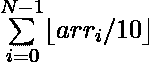

# 当每个元素除以 10

时，以 X 增量最大化数组和

> 原文:[https://www . geesforgeks . org/maximize-array-sum-by-x-increments-当每个元素被 10 除时/](https://www.geeksforgeeks.org/maximize-array-sum-by-x-increments-when-each-element-is-divided-by-10/)

给定一个由 **N** 个非负元素和一个整数 **X** 组成的数组 **arr[]** ，任务是使 **X** 递增，使得当每个元素除以 10 时数组和的值，即



最大化。打印的最大值


有可能。
**注意:**任何元素的值都不能超过 1000。
**示例:**

> **输入:** N = 4，X = 6，arr[] = {4，8，8，8}
> **输出:** 3
> **解释:**
> 通过分别递增 arr[1]、arr[2]和 arr[3]两次，将给定数组转换为{4，10，10，10}。
> 现在
> 
> 
> 
> 是 0 + 1 + 1 + 1 = 3。
> **输入:** N = 3，X = 122，arr[] = {3，11，14 }
> T4】输出: 15

**进场:**

1.  对于所有元素，计算将数字增加到下一个 10 的倍数所需的增量数，并将这些值存储在一个数组中，比如 **V** 。
2.  计算一个元素可以增加 10 的最大次数，并保持其值<= 1000 and add this value to a variable, say **增加**，该值被初始化为 0。
3.  对数组**和**进行排序，使其不递减。
4.  然后对于 **V** 中的每一个值，执行所需的移动，并将某个元素增加到下一个 10 的倍数，这将答案增加 1。
5.  这样做，同时执行的总移动不要超过 **X** 。
6.  在浏览完 **V** 的所有元素后，如果还有剩余的移动，则在**增量**和**(剩余移动)/10** 之间添加最小答案。

下面是上述方法的实现:

## C++

```
// C++ program for the above problem

#include <bits/stdc++.h>
using namespace std;

void maximizeval10(int a[],
                   int n, int k)
{
    // initialize variables
    int increments = 0;
    int ans = 0;
    vector<int> v;

    for (int i = 0; i < n; i++) {

        // add the current
        // contribution of the
        // element to the answer
        ans += (a[i] / 10);

        // if the value is
        // already maximum
        // then we can't change it
        if (a[i] == 1000)
            continue;

        else {
            // moves required to move
            // to the next multiple
            // of 10
            v.push_back(10 - a[i] % 10);

            // no of times we can
            // add 10 to this value
            // so that its value
            // does not exceed 1000.
            increments += (100
                           - ((a[i]) / 10)
                           - 1);
        }
    }

    // sort the array
    sort(v.begin(), v.end());

    int sum = 0;

    for (int i = 0; i < v.size();
         i++) {

        // adding the values to
        // increase the numbers
        // to the next multiple of 10
        sum += v[i];
        if (sum <= k) {

            // if the total moves
            // are less than X then
            // increase the answer
            ans++;
        }
        else

            // if the moves exceed
            // X then we cannot
            // increase numbers
            break;
    }

    // if there still remain
    // some moves
    if (sum < k) {

        // remaining moves
        int remaining = k - sum;

        // add minimum of increments and
        // remaining/10 to the
        // answer
        ans += min(increments,
                   remaining / 10);
    }

    // output the final answer
    cout << ans;
}

// Driver Code
int main()
{
    int N = 4;
    int X = 6;

    int A[N] = { 4, 8, 8, 8 };
    maximizeval10(A, N, X);

    return 0;
}
```

## Java 语言(一种计算机语言，尤用于创建网站)

```
// Java program for the above approach
import java.util.*;

class GFG{

public static void maximizeval10(int[] a, int n,
                                 int k)
{

    // Initialize variables
    int increments = 0;
    int ans = 0;
    Vector<Integer> v = new Vector<>();

    for(int i = 0; i < n; i++)
    {

        // Add the current
        // contribution of the
        // element to the answer
        ans += (a[i] / 10);

        // If the value is
        // already maximum
        // then we can't change it
        if (a[i] == 1000)
            continue;

        else
        {

            // Moves required to move
            // to the next multiple
            // of 10
            v.add(10 - a[i] % 10);

            // No of times we can
            // add 10 to this value
            // so that its value
            // does not exceed 1000.
            increments += (100 - ((a[i]) /
                           10) - 1);
        }
    }

    // Sort the array
    Collections.sort(v);

    int sum = 0;

    for(int i = 0; i < v.size(); i++)
    {

        // Adding the values to
        // increase the numbers
        // to the next multiple of 10
        sum += v.get(i);
        if (sum <= k)
        {

            // If the total moves
            // are less than X then
            // increase the answer
            ans++;
        }
        else

            // If the moves exceed
            // X then we cannot
            // increase numbers
            break;
    }

    // If there still remain
    // some moves
    if (sum < k)
    {

        // Remaining moves
        int remaining = k - sum;

        // Add minimum of increments and
        // remaining/10 to the
        // answer
        ans += Math.min(increments,
                        remaining / 10);
    }

    // Output the final answer
    System.out.print(ans);
}

// Driver code
public static void main(String[] args)
{
    int N = 4;
    int X = 6;
    int A[] = { 4, 8, 8, 8 };

    maximizeval10(A, N, X);
}
}

// This code is contributed by divyeshrabadiya07
```

## 蟒蛇 3

```
# Python3 program for the above problem
def maximizeval10(a, n, k):

    # Initialize variables
    increments = 0
    ans = 0
    v = []

    for i in range (n):

        # Add the current
        # contribution of the
        # element to the answer
        ans += (a[i] // 10)

        # If the value is already
        # maximum then we can't
        # change it
        if (a[i] == 1000):
            continue
        else:

            # Moves required to move
            # to the next multiple
            # of 10
            v.append(10 - a[i] % 10)

            # No of times we can
            # add 10 to this value
            # so that its value
            # does not exceed 1000.
            increments += (100 - ((a[i]) //
                                     10) - 1);

    # Sort the array
    v.sort()

    sum = 0
    for i in range(len(v)):

        # Adding the values to
        # increase the numbers
        # to the next multiple of 10
        sum += v[i]
        if (sum <= k):

            # If the total moves
            # are less than X then
            # increase the answer
            ans += 1

        else:

            # If the moves exceed
            # X then we cannot
            # increase numbers
            break

    # If there still remain
    # some moves
    if (sum < k):

        # Remaining moves
        remaining = k - sum

        # Add minimum of increments
        # and remaining/10 to the
        # answer
        ans += min(increments,
                   remaining // 10)

    # Output the final answer
    print(ans)

# Driver Code
if __name__ =="__main__":

    N = 4
    X = 6
    A = [ 4, 8, 8, 8 ]

    maximizeval10(A, N, X)

# This code is contributed by chitranayal
```

## C#

```
// C# program for the above approach
using System;
using System.Collections.Generic;
class GFG{

public static void maximizeval10(int[] a,
                                 int n,
                                 int k)
{
  // Initialize variables
  int increments = 0;
  int ans = 0;
  List<int> v = new List<int>();

  for(int i = 0; i < n; i++)
  {
    // Add the current
    // contribution of the
    // element to the answer
    ans += (a[i] / 10);

    // If the value is
    // already maximum
    // then we can't change it
    if (a[i] == 1000)
      continue;

    else
    {
      // Moves required to move
      // to the next multiple
      // of 10
      v.Add(10 - a[i] % 10);

      // No of times we can
      // add 10 to this value
      // so that its value
      // does not exceed 1000.
      increments += (100 - ((a[i]) /
                     10) - 1);
    }
  }

  // Sort the array
  v.Sort();

  int sum = 0;

  for(int i = 0; i < v.Count; i++)
  {
    // Adding the values to
    // increase the numbers
    // to the next multiple of 10
    sum += v[i];
    if (sum <= k)
    {
      // If the total moves
      // are less than X then
      // increase the answer
      ans++;
    }
    else

      // If the moves exceed
      // X then we cannot
      // increase numbers
      break;
  }

  // If there still remain
  // some moves
  if (sum < k)
  {
    // Remaining moves
    int remaining = k - sum;

    // Add minimum of increments and
    // remaining/10 to the
    // answer
    ans += Math.Min(increments,
                    remaining / 10);
  }

  // Output the readonly answer
  Console.Write(ans);
}

// Driver code
public static void Main(String[] args)
{
  int N = 4;
  int X = 6;
  int []A = {4, 8, 8, 8};
  maximizeval10(A, N, X);
}
}

// This code is contributed by shikhasingrajput
```

## java 描述语言

```
<script>
// Javascript program for the above approach

function maximizeval10(a,n,k)
{
    // Initialize variables
    let increments = 0;
    let ans = 0;
    let v = [];

    for(let i = 0; i < n; i++)
    {

        // Add the current
        // contribution of the
        // element to the answer
        ans += Math.floor(a[i] / 10);

        // If the value is
        // already maximum
        // then we can't change it
        if (a[i] == 1000)
            continue;

        else
        {

            // Moves required to move
            // to the next multiple
            // of 10
            v.push(10 - a[i] % 10);

            // No of times we can
            // add 10 to this value
            // so that its value
            // does not exceed 1000.
            increments += (100 - (Math.floor(a[i]) / 10) - 1);
        }
    }

    // Sort the array
    v.sort(function(a,b){return a-b;});

    let sum = 0;

    for(let i = 0; i < v.length; i++)
    {

        // Adding the values to
        // increase the numbers
        // to the next multiple of 10
        sum += v[i];
        if (sum <= k)
        {

            // If the total moves
            // are less than X then
            // increase the answer
            ans++;
        }
        else

            // If the moves exceed
            // X then we cannot
            // increase numbers
            break;
    }

    // If there still remain
    // some moves
    if (sum < k)
    {

        // Remaining moves
        let remaining = k - sum;

        // Add minimum of increments and
        // remaining/10 to the
        // answer
        ans += Math.min(increments,
                        Math.floor(remaining / 10));
    }

    // Output the final answer
    document.write(ans);       
}

// Driver code
let N = 4;
let X = 6;
let A=[4, 8, 8, 8];
maximizeval10(A, N, X);

// This code is contributed by avanitrachhadiya2155
</script>
```

**Output:** 

```
3
```

***时间复杂度:** O(N * log(N))*
***辅助空间复杂度:** O(N)*