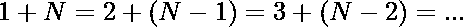
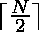

# 通过用它们的和替换对来最大化直到 N 的数字阵列中的相等数字的计数

> 原文:[https://www . geeksforgeeks . org/通过用它们的和替换对来最大化数字数组中的等数计数/](https://www.geeksforgeeks.org/maximize-count-of-equal-numbers-in-array-of-numbers-upto-n-by-replacing-pairs-with-their-sum/)

给定一个包含从 **1** 到 **N** 的自然数的[数组](https://www.geeksforgeeks.org/introduction-to-arrays/)**arr【】**，任务是在以下操作后找到可以相等的元素的最大数量:

1.  从数组中移除任意一对元素，并将它们的和插入到数组中。
2.  重复以上操作任意次数，以最大化相等元素的数量。

**示例:**

> **输入:** arr[] = {1，2，3，4}
> **输出:** 2
> **解释:**
> 我们可以执行以下操作:
> {1，2，3，4} - > {3，3，4} - > 2 个元素相等
> 
> **输入:** arr[] = {1 2 3 4 5 6}
> **输出:** 3
> **解释:**
> {1，2，3，4，5，6} - > {7，2，3，4，5} - > {7，7，3，4} - > {7，7，37} - > 3 个元素相等

**进场:**问题中重点观察到的是:

*   **如果 N 为偶数**，我们可以通过下式计算出相等元素的最大数量



*   **如果 N 为奇数**，我们可以通过


因此，答案永远是



下面是上述方法的实现:

## C++

```
// C++ implementation of
// the above approach

#include <bits/stdc++.h>
using namespace std;

// Function to count maximum number
// of array elements equal
int countEqual(int n)
{
    return (n + 1) / 2;
}

// Driver Code
int main()
{
    int arr[] = { 1, 2, 3, 4, 5, 6 };

    int n = sizeof(arr) / sizeof(arr[0]);

    // Function Call
    cout << countEqual(n);
    return 0;
}
```

## Java 语言(一种计算机语言，尤用于创建网站)

```
// Java implementation of
// the above approach
import java.io.*;

class GFG{

// Function to count maximum number
// of array elements equal
static int countEqual(int n)
{
    return (n + 1) / 2;
}

// Driver Code
public static void main (String[] args)
{
    int arr[] = { 1, 2, 3, 4, 5, 6 };

    int n = arr.length;

    // Function call
    System.out.println(countEqual(n));
}
}

// This code is contributed by AnkitRai01
```

## 蟒蛇 3

```
# Python3 implementation of
# the above approach

# Function to count maximum number
# of array elements equal
def countEqual(n):

    return (n + 1) // 2

# Driver Code
lst = [ 1, 2, 3, 4, 5, 6 ]
n = len(lst)

# Function call
print(countEqual(n))

# This code is contributed by vishu2908
```

## C#

```
// C# implementation of
// the above approach
using System;
class GFG{

// Function to count maximum number
// of array elements equal
static int countEqual(int n)
{
    return (n + 1) / 2;
}

// Driver Code
public static void Main(String[] args)
{
    int []arr = {1, 2, 3, 4, 5, 6};
    int n = arr.Length;

    // Function call
    Console.WriteLine(countEqual(n));
}
}

// This code is contributed by Rajput-Ji
```

## java 描述语言

```
<script>

// Javascript implementation of
// the above approach

// Function to count maximum number
// of array elements equal
function countEqual(n)
{
    return parseInt((n + 1) / 2);
}

// Driver Code
var arr = [ 1, 2, 3, 4, 5, 6 ];
var n = arr.length;

// Function Call
document.write( countEqual(n));

// This code is contributed by rrrtnx.
</script>
```

**Output:** 

```
3
```

**性能分析:**

*   **时间复杂度:** O(1)
*   **辅助空间:** O(1)