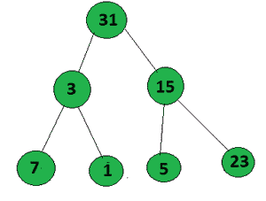

# 最大化二叉树根到叶路径中设置位的数量

> 原文:[https://www . geesforgeks . org/最大化二进制树中根到叶路径的位数/](https://www.geeksforgeeks.org/maximize-count-of-set-bits-in-a-root-to-leaf-path-in-a-binary-tree/)

给定一棵[二叉树](https://www.geeksforgeeks.org/binary-tree-data-structure/)，任务是找出所有根到叶路径的[节点值中设置位的总数，并打印其中的最大值。](https://www.geeksforgeeks.org/given-a-binary-tree-print-all-root-to-leaf-paths/)

**示例:**

> **输入:**
> 
> [](https://media.geeksforgeeks.org/wp-content/uploads/20200708224407/Untitled-300x227.png)
> 
> **输出:** 12
> **解释:**
> 路径 1:15(1111)->3(0011)->5(0101)= 8
> 路径 2:15(1111)->3(0011)->1(0001)= 7
> 路径 3: 15(01111)- > 7(00111)- >
> 
> **输入:**
> 
> [](https://media.geeksforgeeks.org/wp-content/uploads/20200709135802/Untitled-300x227.png)
> 
> **输出:** 13
> **说明:**
> 路径 1:31(11111)->3(00011)->7(00111)= 10
> 路径 2:31(11111)->3(00011)->1(00001)= 8
> 路径 3:31(11111)->15(0115)

**接近** :
按照以下步骤解决问题:

*   从根节点开始，递归遍历每个节点
*   [计算当前节点值中的设置位数](https://www.geeksforgeeks.org/count-set-bits-in-an-integer/)。
*   更新设置位的最大计数(存储在一个变量中，比如***【maxm】***)。
*   遍历它的左右子树。
*   完成树的所有节点遍历后，打印***【maxm】***的最终值作为答案。

下面是上述方法的实现:

## C++

```
// C++ Program to implement
// the above approach
#include <bits/stdc++.h>
using namespace std;
int maxm = 0;

// Node structure
struct Node {
    int val;

    // Pointers to left
    // and right child
    Node *left, *right;

    // Initialize constructor
    Node(int x)
    {
        val = x;
        left = NULL;
        right = NULL;
    }
};

// Function to find the maximum
// count of setbits in a root to leaf
void maxm_setbits(Node* root, int ans)
{
    // Check if root is not null
    if (!root)
        return;

    if (root->left == NULL
        && root->right == NULL) {

        ans += __builtin_popcount(root->val);

        // Update the maximum count
        // of setbits
        maxm = max(ans, maxm);

        return;
    }

    // Traverse left of binary tree
    maxm_setbits(root->left,
                ans + __builtin_popcount(
                        root->val));

    // Traverse right of the binary tree
    maxm_setbits(root->right,
                ans + __builtin_popcount(
                        root->val));
}

// Driver Code
int main()
{
    Node* root = new Node(15);
    root->left = new Node(3);
    root->right = new Node(7);
    root->left->left = new Node(5);
    root->left->right = new Node(1);
    root->right->left = new Node(31);
    root->right->right = new Node(9);

    maxm_setbits(root, 0);

    cout << maxm << endl;

    return 0;
}
```

## Java 语言(一种计算机语言，尤用于创建网站)

```
// Java Program to implement
// the above approach
import java.util.*;
class GFG{

static int maxm = 0;

// Node structure
static class Node
{
    int val;

    // Pointers to left
    // and right child
    Node left, right;

    // Initialize constructor
    Node(int x)
    {
        val = x;
        left = null;
        right = null;
    }
};

// Function to find the maximum
// count of setbits in a root to leaf
static void maxm_setbits(Node root, int ans)
{
    // Check if root is not null
    if (root == null)
        return;

    if (root.left == null &&
        root.right == null)
    {
        ans += Integer.bitCount(root.val);

        // Update the maximum count
        // of setbits
        maxm = Math.max(ans, maxm);

        return;
    }

    // Traverse left of binary tree
    maxm_setbits(root.left,
                ans + Integer.bitCount(
                        root.val));

    // Traverse right of the binary tree
    maxm_setbits(root.right,
                ans + Integer.bitCount(
                        root.val));
}

// Driver Code
public static void main(String[] args)
{
    Node root = new Node(15);
    root.left = new Node(3);
    root.right = new Node(7);
    root.left.left = new Node(5);
    root.left.right = new Node(1);
    root.right.left = new Node(31);
    root.right.right = new Node(9);

    maxm_setbits(root, 0);

    System.out.print(maxm +"\n");

}
}

// This code is contributed by Amit Katiyar
```

## 蟒蛇 3

```
# Python3 program to implement
# the above approach
maxm = 0

# Node class
class Node:

    # Initialise constructor
    def __init__(self, x):

        self.val = x
        self.left = None
        self.right = None

# Function to count the number of 1 in number
def count_1(n):

    count = 0
    while (n):
        count += n & 1
        n >>= 1

    return count

# Function to find the maximum
# count of setbits in a root to leaf
def maxm_setbits(root, ans):

    global maxm

    # Check if root is null
    if not root:
        return

    if (root.left == None and
        root.right == None):
        ans += count_1(root.val)

        # Update the maximum count
        # of setbits
        maxm = max(ans, maxm)
        return

    # Traverse left of binary tree
    maxm_setbits(root.left,
                 ans + count_1(root.val))

    # Traverse right of the binary tree
    maxm_setbits(root.right,
                 ans + count_1(root.val))

# Driver code
root = Node(15)
root.left = Node(3)
root.right = Node(7)
root.left.left = Node(5)
root.left.right = Node(1)
root.right.left = Node(31)
root.right.right = Node(9)

maxm_setbits(root, 0)

print(maxm)

# This code is contributed by Stuti Pathak
```

## C#

```
// C# program for the above approach
using System;
class GFG{

// Function to Sort a Bitonic array
// in constant space
static void sortArr(int []a, int n)
{
    int i, k;

    // Initialise the value of k
    k = (int)(Math.Log(n) / Math.Log(2));
    k = (int) Math.Pow(2, k);

    // In each iteration compare elements
    // k distance apart and swap if
    // they are not in order
    while (k > 0)
    {
        for(i = 0; i + k < n; i++)
            if (a[i] > a[i + k])
            {
                int tmp = a[i];
                a[i] = a[i + k];
                a[i + k] = tmp;
            }

        // k is reduced to half
        // after every iteration
        k = k / 2;
    }

    // Print the array elements
    for(i = 0; i < n; i++)
    {
        Console.Write(a[i] + " ");
    }
}

// Driver code
public static void Main(String[] args)
{

    // Given array []arr
    int []arr = { 5, 20, 30, 40, 36,
                  33, 25, 15, 10 };
    int n = arr.Length;

    // Function call
    sortArr(arr, n);
}
}

// This code is contributed by gauravrajput1
```

## java 描述语言

```
<script>

// JavaScript Program to implement
// the above approach
let maxm = 0;

// Node structure
class Node
{

    // Initialize constructor
    constructor(x)
    {
        this.val = x;
        this.left = null;
        this.right = null;
    }
}

var root;

// Function to find the maximum
// count of setbits in a root to leaf
function maxm_setbits(root, ans)
{

    // Check if root is not null
    if (!root)
        return;

    if (root.left == null &&
        root.right == null)
    {

        ans += (root.val).toString(2).split('').filter(
          y => y == '1').length;

        // Update the maximum count
        // of setbits
        maxm = Math.max(ans, maxm);

        return;
    }

    // Traverse left of binary tree
    maxm_setbits(root.left,
    ans + (root.val).toString(2).split('').filter(
     y => y == '1').length);

    // Traverse right of the binary tree
    maxm_setbits(root.right,
    ans + (root.val).toString(2).split('').filter(
      y => y == '1').length);
}

// Driver Code
root = new Node(15);
root.left = new Node(3);
root.right = new Node(7);
root.left.left = new Node(5);
root.left.right = new Node(1);
root.right.left = new Node(31);
root.right.right = new Node(9);

maxm_setbits(root, 0);

document.write(maxm);

// This code is contributed by Dharanendra L V.

</script>
```

**Output:** 

```
12
```

***时间复杂度:** O(N)，其中 N 表示节点数。*
***辅助空间:** O(1)*