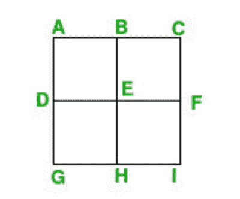
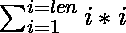

# 最大化坐标平面内 N 个任意点可以形成的唯一正方形的数量

> 原文:[https://www . geesforgeks . org/最大化坐标平面上任意 n 个点形成的唯一正方形的数量/](https://www.geeksforgeeks.org/maximize-count-of-unique-squares-that-can-be-formed-with-n-arbitrary-points-in-coordinate-plane/)

给定一个正整数 **N** ，任务是找出在坐标平面内任意点可以与 **N** 形成的唯一正方形的最大数量。

**注意:**任何两个不重叠的方块都被认为是唯一的。

**示例:**

> **输入:** N = 9
> **输出:** 5
> **解释:**
> 考虑下面由 N 个点组成的正方形:
> 
> [](https://media.geeksforgeeks.org/wp-content/cdn-uploads/20210910103130/max-unique-square.png)
> 
> ABEF 方块、BCFE 方块、DEHG 方块、efh 方块是大小为 1 的可能方块之一，它们彼此不重叠。
> ACIG 广场也是可能的 2 号广场之一。
> 
> **输入:**N = 6
> T3】输出: 2

**方法:**这个问题可以根据以下观察来解决:

*   观察[如果 **N 是一个完美的正方形**](https://www.geeksforgeeks.org/check-if-given-number-is-perfect-square-in-cpp/) 那么当 **sqrt(N)*sqrt(N)** 点组成一个 **sqrt(N)*sqrt(N)** 的网格时，将形成最大的正方形数，并且它们都是相等的空间。
*   但是当 **N 不是一个完美的正方形**时，那么它仍然形成一个网格但是具有最大的数量，这是一个值小于 **N** 的完美正方形。
*   剩余的坐标可以放在网格的边缘，这将导致最大可能的方块。

按照以下步骤解决问题:

1.  初始化一个变量，比如**和**，存储生成的方块数。
2.  求最大可能网格尺寸为 **sqrt(N)** 和所有可能形成的正方形的计数，直到长度 **len** 到变量 **ans** ，该变量可以通过计算。
3.  将 **N** 的值减**伦*伦**。
4.  如果 **N** 的值至少为**len**，那么所有其他的方块都可以通过将它们放置在另一簇点中来形成。求**步骤 2** 中计算的**透镜**的值的平方数。
5.  完成上述步骤后，打印**和**的值作为结果。

下面是上述方法的实现:

## C++

```
// C++ program for the above approach

#include <bits/stdc++.h>
using namespace std;

// Function to find the maximum number
// of unique squares that can be formed
// from the given N points
int maximumUniqueSquares(int N)
{
    // Stores the resultant count of
    // squares formed
    int ans = 0;

    // Base Case
    if (N < 4) {
        return 0;
    }

    // Subtract the maximum possible
    // grid size as sqrt(N)
    int len = (sqrt(double(N)));
    N -= len * len;

    // Find the total squares till now
    // for the maximum grid
    for (int i = 1; i < len; i++) {

        // A i*i grid contains (i-1)*(i-1)
        // + (i-2)*(i-2) + ... + 1*1 squares
        ans += i * i;
    }

    // When N >= len then more squares
    // will be counted
    if (N >= len) {
        N -= len;
        for (int i = 1; i < len; i++) {
            ans += i;
        }
    }

    for (int i = 1; i < N; i++) {
        ans += i;
    }

    // Return total count of squares
    return ans;
}

// Driver Code
int main()
{
    int N = 9;
    cout << maximumUniqueSquares(N);

    return 0;
}
```

## Java 语言(一种计算机语言，尤用于创建网站)

```
// Java program for the above approach
import java.io.*;

class GFG {

// Function to find the maximum number
// of unique squares that can be formed
// from the given N points
static int maximumUniqueSquares(int N)
{
    // Stores the resultant count of
    // squares formed
    int ans = 0;

    // Base Case
    if (N < 4) {
        return 0;
    }

    // Subtract the maximum possible
    // grid size as sqrt(N)
    int len = (int)(Math.sqrt(N));
    N -= len * len;

    // Find the total squares till now
    // for the maximum grid
    for (int i = 1; i < len; i++) {

        // A i*i grid contains (i-1)*(i-1)
        // + (i-2)*(i-2) + ... + 1*1 squares
        ans += i * i;
    }

    // When N >= len then more squares
    // will be counted
    if (N >= len) {
        N -= len;
        for (int i = 1; i < len; i++) {
            ans += i;
        }
    }

    for (int i = 1; i < N; i++) {
        ans += i;
    }

    // Return total count of squares
    return ans;
}

// Driver Code
public static void main (String[] args)
{
    int N = 9;
    System.out.println( maximumUniqueSquares(N));

}
}

// This code is contributed by shivanisinghss2110.
```

## 蟒蛇 3

```
# Python program for the above approach

# for math function
import math

# Function to find the maximum number
# of unique squares that can be formed
# from the given N points
def maximumUniqueSquares(N):

    # Stores the resultant count of
    # squares formed
    ans = 0

    # Base Case
    if N < 4:
        return 0

    # Subtract the maximum possible
    # grid size as sqrt(N)
    len = int(math.sqrt(N))

    N -= len * len

    # Find the total squares till now
    # for the maximum grid
    for i in range(1, len):

        # A i*i grid contains (i-1)*(i-1)
        # + (i-2)*(i-2) + ... + 1*1 squares
        ans += i * i

    # When N >= len then more squares
    # will be counted
    if (N >= len):
        N -= len
        for i in range(1, len):
            ans += i

    for i in range(1, N):
        ans += i

    # Return total count of squares
    return ans

# Driver Code
if __name__ == "__main__":
    N = 9
    print(maximumUniqueSquares(N))

    # This code is contributed by rakeshsahni
```

## C#

```
// C# program for the above approach
using System;

public class GFG
{

    // Function to find the maximum number
    // of unique squares that can be formed
    // from the given N points
    static int maximumUniqueSquares(int N)
    {

        // Stores the resultant count of
        // squares formed
        int ans = 0;

        // Base Case
        if (N < 4) {
            return 0;
        }

        // Subtract the maximum possible
        // grid size as sqrt(N)
        int len = (int)(Math.Sqrt(N));
        N -= len * len;

        // Find the total squares till now
        // for the maximum grid
        for (int i = 1; i < len; i++) {

            // A i*i grid contains (i-1)*(i-1)
            // + (i-2)*(i-2) + ... + 1*1 squares
            ans += i * i;
        }

        // When N >= len then more squares
        // will be counted
        if (N >= len) {
            N -= len;
            for (int i = 1; i < len; i++) {
                ans += i;
            }
        }

        for (int i = 1; i < N; i++) {
            ans += i;
        }

        // Return total count of squares
        return ans;
    }

    // Driver Code
    public static void Main (string[] args)
    {
        int N = 9;
        Console.WriteLine( maximumUniqueSquares(N));

    }
}

// This code is contributed by AnkThon
```

## java 描述语言

```
<script>

// Javascript program for the above approach

// Function to find the maximum number
// of unique squares that can be formed
// from the given N points
function maximumUniqueSquares(N)
{
    // Stores the resultant count of
    // squares formed
    var ans = 0;
    var i;

    // Base Case
    if (N < 4) {
        return 0;
    }

    // Subtract the maximum possible
    // grid size as sqrt(N)
    var len = Math.sqrt(N);
    N -= len * len;

    // Find the total squares till now
    // for the maximum grid
    for (i = 1; i < len; i++) {

        // A i*i grid contains (i-1)*(i-1)
        // + (i-2)*(i-2) + ... + 1*1 squares
        ans += i * i;
    }

    // When N >= len then more squares
    // will be counted
    if (N >= len) {
        N -= len;
        for (i = 1; i < len; i++) {
            ans += i;
        }
    }

    for (i = 1; i < N; i++) {
        ans += i;
    }

    // Return total count of squares
    return ans;
}

// Driver Code
    var N = 9;
    document.write(maximumUniqueSquares(N));

// This code is contributed by SURENDRA_GANGWAR.
</script>
```

**Output:** 

```
5
```

***时间复杂度:** O(sqrt(N))*
***辅助空间:** O(1)*