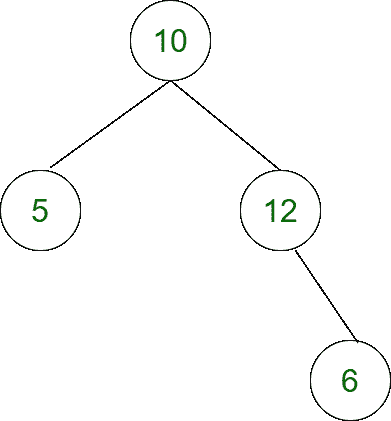

# 最大化给定根树中节点对之间的差异，使得一个节点是另一个节点的祖先

> 原文:[https://www . geesforgeks . org/给定根树中一对节点之间的差异最大化，这样一个节点就是另一个节点的祖先/](https://www.geeksforgeeks.org/maximize-difference-between-pair-of-nodes-in-a-given-rooted-tree-such-that-one-node-is-ancestor-of-another/)

给定一个由从 **0** 到**(N–1)**的 **N** 节点组成的[类属树](https://www.geeksforgeeks.org/generic-treesn-array-trees/)，其中[数组](https://www.geeksforgeeks.org/array-data-structure/)中**P【I】<sup>第</sup>T11】个【P】**表示 **i <sup>第</sup>个**节点父节点**(基于 1 的索引)**。每个 **i <sup>th</sup>** 节点都附加了一个权重，在数组**W【】**中给出。任务是找到一对节点 **(u，v)**，使得 **u** 是 **v** 的祖先，**W<sub>u</sub>–W<sub>v</sub>T39】最大化。**

**注:**阵中 **P[]** ， **-1** 表示根节点。如果有单个节点，则打印 **-1** 。

**示例:**

> **输入:** N = 4，W[] = {5，10，6，12}，P[] = {2，-1，4，2 }
> T3】输出:6
> T6】说明:有权重的树会是:
> 
> [](https://media.geeksforgeeks.org/wp-content/uploads/20210916155526/UntitledDiagramdrawio1.png)
> 
> 这里，权重为 12 的第 4 <sup>个</sup>节点和权重为 6 的第 3 <sup>个</sup>节点，差值为(12–6)= 6。
> 
> **输入:** N = 1，W = { 30 }，P = {-1 }
> T3】输出: -1

**方法:**利用 **N 元树上的[广度优先搜索](https://www.geeksforgeeks.org/breadth-first-search-or-bfs-for-a-graph/)为给定的树**标记祖先编号【P】**，然后利用 [DFS 遍历](https://www.geeksforgeeks.org/depth-first-traversal-for-a-graph/)找到最大差异 **maxDiff** ，通过将每个节点视为一个祖先，其对应的节点具有较少的编号祖先值，可以解决给定的问题。按照以下步骤解决问题:**

*   定义函数 **dfs(int src，int val，vector < int > & W)** ，并执行以下任务:
    *   将**访问的【src】**的值设置为**真**。
    *   [使用变量**邻居**迭代范围](https://www.geeksforgeeks.org/range-based-loop-c/)**【0，大小】**，其中**大小**是行**树【cur】**的大小，并执行以下任务:
        *   如果**拜访的【邻居】**为**假**且**祖先【邻居】**大于**祖先【src】**，则将 **maxDiff** 的值设置为 **maxDiff** 或**val–W【邻居-1】**的最大值。
        *   调用函数 **dfs(邻居，val，W)** 。
*   定义函数 **bfs(int src，int N)** 并执行以下任务:
    *   [将向量**访问的【N+1】**赋值为**假。**](https://www.geeksforgeeks.org/vector-assign-in-c-stl/)
    *   初始化队列 **q[]** 。
    *   将**ancestorNum【src】**的值设置为 **0** ，将**拜访【src】**的值设置为**真**。
    *   [将值 **src** 排入队列**q【】**。](https://www.geeksforgeeks.org/array-implementation-of-queue-simple/)
    *   [循环遍历](https://www.geeksforgeeks.org/c-c-while-loop-with-examples/)直到[队列 **q[]** 不为空](https://www.geeksforgeeks.org/data-structure-gq/queue-gq/)并执行以下任务:
        *   将变量 **cur** 初始化为队列 **q[]** 的[前元素，并从队列 **q[]中出列。**](https://www.geeksforgeeks.org/queuefront-queueback-c-stl/)
        *   [使用变量 **neighbor** 迭代范围](https://www.geeksforgeeks.org/range-based-loop-c/)**【0，大小】**其中 **size** 是行**树【cur】**的大小，如果**访问了【neighbor】**是 **false** ，则将它设置为 **true** 并将其排入队列**q【】**并设置**祖先【neighbor】**的值
*   [初始化向量](https://www.geeksforgeeks.org/initialize-a-vector-in-cpp-different-ways/) **树[][]，访问了[]** 和**祖先[]** 。
*   将变量 **maxDiff** 初始化为 **INT_MIN** 存储答案。
*   [将向量](https://www.geeksforgeeks.org/vector-resize-c-stl/) **树[][]** 的大小调整为 **(N + 1)** 。
*   [赋值向量**访问了【N+1】**值为**假**和**取消了【N+1】**值为 **0**](https://www.geeksforgeeks.org/vector-assign-in-c-stl/) 。
*   初始化变量 **src** 。
*   [使用变量 **i** 迭代范围](https://www.geeksforgeeks.org/range-based-loop-c/)**【0，N】**，如果**P【**I**为 **-1** ，则将 **src** 的值设置为 **i** 。否则，[将排 **i+1** 中的值 **P[** I **]** 和排 **P[** I **]** 中的值 **i + 1** 推入向量**树[][]**](https://www.geeksforgeeks.org/vector-of-vectors-in-c-stl-with-examples/) 。**
*   **调用[函数](https://www.geeksforgeeks.org/functions-in-c/) **bfs(src，N+1)** 进行广度优先搜索。**
*   **[赋值向量**访问了【N+1】**值**假**T5。](https://www.geeksforgeeks.org/vector-assign-in-c-stl/)**
*   **调用[函数](https://www.geeksforgeeks.org/functions-in-c/) **dfs(src，W[src]，W)** 进行深度优先搜索。**
*   **[使用变量 **i** 迭代范围](https://www.geeksforgeeks.org/range-based-loop-c/)**【0，N)** ，并执行以下步骤:

    *   如果 **i** 等于 **src** ，那么[继续](https://www.geeksforgeeks.org/continue-statement-cpp/)。否则，[赋值向量**访问【N+1】**，值**为假**](https://www.geeksforgeeks.org/vector-assign-in-c-stl/) 。
    *   调用[函数](https://www.geeksforgeeks.org/functions-in-c/) **dfs(i+1，W[i]，W)** 。** 
*   **执行上述步骤后，打印 **maxDiff** 的值作为答案。**

**下面是上述方法的实现:**

## **C++**

```
// C++ program for the above approach
#include <bits/stdc++.h>
using namespace std;

vector<vector<int> > tree;
vector<bool> visited;
vector<int> ancestorNum;

// Stores the maximum difference
int maxDiff = INT_MIN;

// DFS traversal for source node as src
void dfs(int src, int val, vector<int>& W)
{

    // Mark src node as visited
    visited[src] = true;

    // Traverse the tree
    for (auto neighbour : tree[src]) {

        // Check neighbour node is not
        // visited and ancestorNum should
        // be greater than the src node
        if (!visited[neighbour]
            && (ancestorNum[neighbour]
                > ancestorNum[src])) {

            // Update the maxDiff
            maxDiff = max(
                val - W[neighbour - 1],
                maxDiff);

            // Recurrence call for dfs
            dfs(neighbour, val, W);
        }
    }
}

// BFS traversal for source node as src
void bfs(int src, int N)
{
    // Initially mark all node as
    // not visited
    visited.assign(N, false);

    // Stores the nodes
    queue<int> q;

    // Initially for src node mark
    // ancestorNum as 0
    ancestorNum[src] = 0;

    // Mark src as visited
    visited[src] = true;

    // Push src node into the q
    q.push(src);

    // Traverse the queue q
    while (!q.empty()) {

        // Pop front element of the q
        int cur = q.front();
        q.pop();

        // Traverse the tree
        for (auto neighbour : tree[cur]) {

            // Check neighbour node is
            // already not visited
            if (!visited[neighbour]) {

                // Mark the neighbour
                // node as visited
                visited[neighbour] = true;

                // Push the neighbour
                // node into the q
                q.push(neighbour);

                // Update the neighbour
                // node ancestorNum
                ancestorNum[neighbour]
                    = ancestorNum[cur] + 1;
            }
        }
    }
}

// Function to find the the maximized
// difference between two pair of nodes
// in rooted tree such that one node
// is ancestor of another node
void maximumDiff(vector<int> W,
                 vector<int> P, int N)
{
    if (N == 1) {
        cout << "-1\n";
        return;
    }

    // Resize the tree
    tree.resize(N + 1);

    // Mark all the nodes as not visited
    visited.assign(N + 1, false);

    // Assign all the node values
    // for ancestorNum to 0
    ancestorNum.assign(N + 1, 0);

    // Stores the source node to traverse
    int src;

    for (int i = 0; i < N; i++) {

        // Check P[i] is -1
        if (P[i] == -1)

            // Update the source node src
            src = i;

        else {

            // Store the tree values
            tree[i + 1].push_back(P[i]);
            tree[P[i]].push_back(i + 1);
        }
    }

    // BFS from the source node src
    bfs(src, N + 1);

    // Mark all the nodes as not visited
    visited.assign(N + 1, false);

    // DFS Call for source node src
    dfs(src, W[src], W);

    // For every node call dfs function
    for (int i = 0; i < N; i++) {

        // Check i is root node
        if (i == src)
            continue;

        // Mark all the nodes as
        // not visited
        visited.assign(N + 1, false);

        // DFS Call for source
        // node as i+1
        dfs(i + 1, W[i], W);
    }

    // Print the maxDiff
    cout << maxDiff << endl;
}

// Driver Code
int main()
{
    vector<int> W = { 5, 10, 6, 12 };
    vector<int> P = { 2, -1, 4, 2 };
    int N = P.size();

    maximumDiff(W, P, N);

    return 0;
}
```

## **蟒蛇 3**

```
# Python 3 program for the above approach

tree = []
visited = []
ancestorNum = []

import sys

# Stores the maximum difference
maxDiff = -sys.maxsize - 1

# DFS traversal for source node as src
def dfs(src, val, W):
    global ancestorNum
    global visited
    global tree
    global maxDiff
    # Mark src node as visited
    visited[src] = True

    # Traverse the tree
    for neighbour in tree[src]:
        # Check neighbour node is not
        # visited and ancestorNum should
        # be greater than the src node
        if (visited[neighbour] == False and (ancestorNum[neighbour]> ancestorNum[src])):

            # Update the maxDiff
            maxDiff = max(val - W[neighbour - 1],maxDiff)

            # Recurrence call for dfs
            dfs(neighbour, val, W)

# BFS traversal for source node as src
def bfs(src,N):
    global ancestorNum
    global visited
    global tree
    # Initially mark all node as
    # not visited
    visited = [False for i in range(N)]

    # Stores the nodes
    q = []

    # Initially for src node mark
    # ancestorNum as 0
    ancestorNum[src] = 0

    # Mark src as visited
    visited[src] = True

    # Push src node into the q
    q.append(src)

    # Traverse the queue q
    while (len(q)>0):

        # Pop front element of the q
        cur = q[0]
        q = q[1:]

        # Traverse the tree
        for neighbour in tree[cur]:
            # Check neighbour node is
            # already not visited
            if (visited[neighbour]==False):

                # Mark the neighbour
                # node as visited
                visited[neighbour] = True

                # Push the neighbour
                # node into the q
                q.append(neighbour)

                # Update the neighbour
                # node ancestorNum
                ancestorNum[neighbour] = ancestorNum[cur] + 1

# Function to find the the maximized
# difference between two pair of nodes
# in rooted tree such that one node
# is ancestor of another node
def maximumDiff(W, P, N):
    global ancestorNum
    global visited
    global tree
    if (N == 1):
        print("-1")
        return

    # Resize the tree
    tree = [[] for i in range(N+1)]

    # Mark all the nodes as not visited
    visited = [False for i in range(N + 1)]

    # Assign all the node values
    # for ancestorNum to 0
    ancestorNum = [0 for i in range(N + 1)]

    # Stores the source node to traverse
    src = 0

    for i in range(N):
        # Check P[i] is -1
        if (P[i] == -1):
            # Update the source node src
            src = i

        else:

            # Store the tree values
            tree[i + 1].append(P[i])
            tree[P[i]].append(i + 1)

    # BFS from the source node src
    bfs(src, N + 1)

    # Mark all the nodes as not visited
    visited = [False for i in range(N+1)]

    # DFS Call for source node src
    dfs(src, W[src], W)

    # For every node call dfs function
    for i in range(N):
        # Check i is root node
        if (i == src):
            continue

        # Mark all the nodes as
        # not visited
        visited = [False for i in range(N+1)]

        # DFS Call for source
        # node as i+1
        dfs(i + 1, W[i], W)

    # Print the maxDiff
    print(maxDiff)

# Driver Code
if __name__ == '__main__':
    W = [5, 10, 6, 12]
    P = [2, -1, 4, 2]
    N = len(P)
    maximumDiff(W, P, N)

    # This code is contributed by SURENDRA_GANGWAR.
```

****Output:** 

```
6
```** 

*****时间复杂度:**O(N<sup>2</sup>)*
***辅助空间:** O(N)***