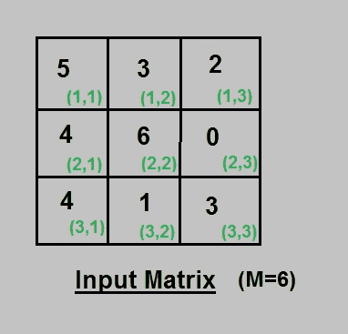
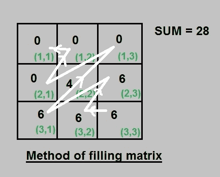

# 根据给定条件最大化矩阵

> 原文:[https://www . geeksforgeeks . org/maximize-matrix-每给定条件/](https://www.geeksforgeeks.org/maximize-matrix-per-given-condition/)

给你一个 N*N 的矩阵，其中矩阵的每个元素都在 0 到 m 的范围内，你可以对矩阵进行以下任意次数的运算:

*   选择任意两个连续的元素
*   其中一个增加 1，另一个减少 1

**注意:**应用上述操作后，元素应保持在 0 到 M 的范围内。
任务是找到下面所示表达式的最大值，如果需要，在矩阵上执行上述操作后可以获得该最大值:

```
res += (i+j)*A[i][j]

for 0 <= i, j <= N
```

**例:**

```
Input : A[][] = {1, 2,
                 5, 1}
        M = 5
Output : RESULT = 27
Matrix : 0 0
         4 5

Input : A[][] = {3, 4,
                 5, 4}
        M = 6
Output : RESULT = 43
Matrix : 0 4
         6 6
```

**算法:**
下面是做这个的分步算法:

1.  首先，计算给定矩阵所有元素的和为 sum。
2.  从最后一个元素即 A(n，n)开始，向后朝 A(0，0)反对角移动为 A(n，n)，A(n，n-1)，A(n-1，n)，A(n，n-2)，A(n-1，n-1)，A(n-2，n)…..
3.  用 M 填充矩阵的每个单元格，并更新每个元素的 SUM = SUM- M，直到 SUM < M。现在，如果 SUM 值大于零，则按顺序填充下一个位置的 SUM 值，其余所有位置都为零。
4.  最后你可以按照上面提到的公式计算结果。

**示例:**
输入矩阵:



应用上述算法后的解矩阵:



以下是上述思路的实现:

## C++

```
// CPP to maximize matrix result
#include<bits/stdc++.h>
using namespace std;
#define n 4

// utility function for maximize matrix result
int maxMatrix(int A[][n], int M)
{
    int sum = 0, res = 0;
    for ( int i=0; i<n ; i++)
        for ( int j=0; j<n; j++)
            sum += A[i][j];

    // diagonals below longest diagonal
    // starting from last element of matrix
    for (int j=n-1; j>0; j--)
    {
        for (int i=0; i<n-j; i++)
        {
            if (sum > M)
            {
                A[n-1-i][j+i] = M;
                sum -= M;
            }
            else
            {
                A[n-1-i][j+i] = sum;
                sum -= sum;
            }
        }
    } 

    // diagonals above longest diagonal
    for (int i=n-1; i>=0; i--)
    {
        for (int j=0; j<=i; j++)
         {
            if (sum > M)
            {
                A[i-j][j] = M;
                sum -= M;
            }
            else
            {
                A[i-j][j] = sum;
                sum -= sum;
            }
        }
    }

    // calculating result
    for (int i=0; i<n; i++)
    {
         for (int j=0; j<n;j++)
             res += (i+j+2) * A[i][j];
    }
    return res;
}

// driver program 
int main()
{
    int A[n][n] = { 1, 2, 3, 4,
                    5, 6, 7, 8,
                    9, 1, 1, 2,
                    3, 4, 5, 6};
    int m = 9;
    cout << maxMatrix(A, m);
    return 0;
}
```

## Java 语言(一种计算机语言，尤用于创建网站)

```
// Java to maximize matrix result

class GFG {

    static final int n = 4;

// utility function for maximize matrix result
    static int maxMatrix(int A[][], int M) {
        int sum = 0, res = 0;
        for (int i = 0; i < n; i++) {
            for (int j = 0; j < n; j++) {
                sum += A[i][j];
            }
        }

        // diagonals below longest diagonal
        // starting from last element of matrix
        for (int j = n - 1; j > 0; j--) {
            for (int i = 0; i < n - j; i++) {
                if (sum > M) {
                    A[n - 1 - i][j + i] = M;
                    sum -= M;
                } else {
                    A[n - 1 - i][j + i] = sum;
                    sum -= sum;
                }
            }
        }

        // diagonals above longest diagonal
        for (int i = n - 1; i >= 0; i--) {
            for (int j = 0; j <= i; j++) {
                if (sum > M) {
                    A[i - j][j] = M;
                    sum -= M;
                } else {
                    A[i - j][j] = sum;
                    sum -= sum;
                }
            }
        }

        // calculating result
        for (int i = 0; i < n; i++) {
            for (int j = 0; j < n; j++) {
                res += (i + j + 2) * A[i][j];
            }
        }
        return res;
    }

// driver program
    static public void main(String[] args) {
        int A[][] = {{1, 2, 3, 4},
        {5, 6, 7, 8},
        {9, 1, 1, 2},
        {3, 4, 5, 6}};
        int m = 9;
        System.out.println(maxMatrix(A, m));
    }
}

// This code is contributed by Rajput-Ji
```

## 蟒蛇 3

```
# Python to maximize matrix result
n = 4

# utility function for maximize
# matrix result
def maxMatrix(A, M):
    sum, res = 0, 0
    for i in range(n):
        for j in range(n):
            sum += A[i][j]

    # diagonals below longest diagonal
    # starting from last element of matrix
    for j in range(n - 1, 0, -1):
        for i in range(n - j):
            if (sum > M):
                A[n - 1 - i][j + i] = M
                sum -= M
            else:
                A[n - 1 - i][j + i] = sum
                sum -= sum

    # diagonals above longest diagonal
    for i in range(n - 1, -1, -1):
        for j in range(i + 1):
            if (sum > M):
                A[i - j][j] = M
                sum -= M
            else:
                A[i - j][j] = sum
                sum -= sum

    # calculating result
    for i in range(n):
        for j in range(n):
            res += (i + j + 2) * A[i][j]
    return res

# Driver Code
if __name__ == '__main__':
    A = [[1, 2, 3, 4],
         [5, 6, 7, 8],
         [9, 1, 1, 2],
         [3, 4, 5, 6]]
    m = 9
    print(maxMatrix(A, m))

# This code is contributed by 29AjayKumar
```

## C#

```

// C# to maximize matrix result
using System;
public class GFG {

    static readonly int n = 4;

// utility function for maximize matrix result
    static int maxMatrix(int [,]A, int M) {
        int sum = 0, res = 0;
        for (int i = 0; i < n; i++) {
            for (int j = 0; j < n; j++) {
                sum += A[i,j];
            }
        }

        // diagonals below longest diagonal
        // starting from last element of matrix
        for (int j = n - 1; j > 0; j--) {
            for (int i = 0; i < n - j; i++) {
                if (sum > M) {
                    A[n - 1 - i,j + i] = M;
                    sum -= M;
                } else {
                    A[n - 1 - i,j + i] = sum;
                    sum -= sum;
                }
            }
        }

        // diagonals above longest diagonal
        for (int i = n - 1; i >= 0; i--) {
            for (int j = 0; j <= i; j++) {
                if (sum > M) {
                    A[i - j,j] = M;
                    sum -= M;
                } else {
                    A[i - j,j] = sum;
                    sum -= sum;
                }
            }
        }

        // calculating result
        for (int i = 0; i < n; i++) {
            for (int j = 0; j < n; j++) {
                res += (i + j + 2) * A[i,j];
            }
        }
        return res;
    }

// driver program
    static public void Main() {
        int [,]A= {{1, 2, 3, 4},
        {5, 6, 7, 8},
        {9, 1, 1, 2},
        {3, 4, 5, 6}};
        int m = 9;
        Console.Write(maxMatrix(A, m));
    }
}

// This code is contributed by Rajput-Ji
```

## 服务器端编程语言（Professional Hypertext Preprocessor 的缩写）

```
<?php
// PHP to maximize matrix result

$n = 4;

// function for maximize
// matrix result
function maxMatrix($A, $M)
{
    global $n;
    $sum = 0; $res = 0;
    for ($i = 0; $i < $n ; $i++)
        for ($j = 0; $j < $n; $j++)
            $sum += $A[$i][$j];

    // diagonals below longest diagonal
    // starting from last element of matrix
    for ($j = $n - 1; $j > 0; $j--)
    {
        for ($i = 0; $i < $n - $j; $i++)
        {
            if ($sum > $M)
            {
                $A[$n - 1 - $i][$j + $i] = $M;
                $sum -= $M;
            }
            else
            {
                $A[$n - 1 - $i][$j + i] = $sum;
                $sum -= $sum;
            }
        }
    }

    // diagonals above longest diagonal
    for ($i = $n - 1; $i >= 0; $i--)
    {
        for ($j = 0; $j <= $i; $j++)
        {
            if ($sum > $M)
            {
                $A[$i - $j][$j] = $M;
                $sum -= $M;
            }
            else
            {
                $A[$i - $j][$j] = $sum;
                $sum -= $sum;
            }
        }
    }

    // calculating result
    for ($i = 0; $i < $n; $i++)
    {
        for ($j = 0; $j < $n; $j++)
            $res += ($i + $j + 2) *
                     $A[$i][$j];
    }
    return $res;
}

    // Driver Code
    $A = array(array(1, 2, 3, 4),
               array(5, 6, 7, 8),
               array(9, 1, 1, 2),
               array(3, 4, 5, 6));
    $m = 9;
    echo maxMatrix($A, $m);

// This code is contributed by anuj_67.
?>
```

## java 描述语言

```
<script>
    // Javascript to maximize matrix result

    let n = 4;

    // utility function for maximize matrix result
    function maxMatrix(A, M) {
        let sum = 0, res = 0;
        for (let i = 0; i < n; i++) {
            for (let j = 0; j < n; j++) {
                sum += A[i][j];
            }
        }

        // diagonals below longest diagonal
        // starting from last element of matrix
        for (let j = n - 1; j > 0; j--) {
            for (let i = 0; i < n - j; i++) {
                if (sum > M) {
                    A[n - 1 - i][j + i] = M;
                    sum -= M;
                } else {
                    A[n - 1 - i][j + i] = sum;
                    sum -= sum;
                }
            }
        }

        // diagonals above longest diagonal
        for (let i = n - 1; i >= 0; i--) {
            for (let j = 0; j <= i; j++) {
                if (sum > M) {
                    A[i - j][j] = M;
                    sum -= M;
                } else {
                    A[i - j][j] = sum;
                    sum -= sum;
                }
            }
        }

        // calculating result
        for (let i = 0; i < n; i++) {
            for (let j = 0; j < n; j++) {
                res += (i + j + 2) * A[i][j];
            }
        }
        return res;
    }

    let A = [[1, 2, 3, 4],
             [5, 6, 7, 8],
             [9, 1, 1, 2],
             [3, 4, 5, 6]];
    let m = 9;
    document.write(maxMatrix(A, m));

// This code is contributed by divyesh072019.
</script>
```

**输出:**

```
425
```

本文由[**Shivam Pradhan(anuj _ charm)**](https://www.facebook.com/anuj.charm)供稿。如果你喜欢 GeeksforGeeks 并想投稿，你也可以使用[write.geeksforgeeks.org](https://write.geeksforgeeks.org)写一篇文章或者把你的文章邮寄到 contribute@geeksforgeeks.org。看到你的文章出现在极客博客主页上，帮助其他极客。
如果发现有不正确的地方，或者想分享更多关于上述话题的信息，请写评论。