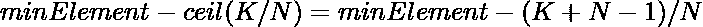

# 最大化最小可能数组元素，精确地减少 K

> 原文:[https://www . geeksforgeeks . org/maximum-minimum-array-element-by-just-k-reductions/](https://www.geeksforgeeks.org/maximize-minimum-array-element-possible-by-exactly-k-decrements/)

给定一个由 **N** 个整数和一个整数 **K** 组成的[数组](https://www.geeksforgeeks.org/introduction-to-arrays/)**arr【】【】**，任务是在精确递减数组元素 **K** 次后，最大化数组[最小元素](https://www.geeksforgeeks.org/program-find-minimum-maximum-element-array/)。

**示例:**

> ***输入:** arr[] = {* 2、4、4 *}，K = 3*
> ***输出:** 2*
> **解释:**
> 可能的方式之一是:
> 
> 1.  将 arr[2]减 1。数组修改为{2，4，3}。
> 2.  将 arr[1]减 1。数组修改为{2，3，3}。
> 3.  将 arr[2]减 1。数组修改为{2，3，2}。
> 
> 因此，可以获得的最小数组元素是 2，这是最大可能值。
> 
> ***输入:** arr[] = {* 10、10、10、10、10 *}，K = 10*
> ***输出:*** 8

**天真法:**解决给定问题最简单的方法是迭代范围**【1，K】**，在每次迭代中，[找到数组的最大元素](https://www.geeksforgeeks.org/c-program-find-largest-element-array/)，然后递减 **1** 。完成上述步骤后，打印阵列的[最小元素。](https://www.geeksforgeeks.org/program-find-minimum-maximum-element-array/)

***时间复杂度:** O(N * K)*
***辅助空间:** O(1)*

**高效方法:**上述问题也可以基于以下观察进行优化:

*   可以观察到，最优的方式是先将数组的所有值递减到 [](https://www.geeksforgeeks.org/program-find-minimum-maximum-element-array/) 数组的[最小元素](https://www.geeksforgeeks.org/program-find-minimum-maximum-element-array/)。
*   使所有元素等于最小元素所需的总移动量是数组的[和减去 **K** 乘以数组](https://www.geeksforgeeks.org/program-find-sum-elements-given-array/)的[最小元素。](https://www.geeksforgeeks.org/program-find-minimum-maximum-element-array/)
*   如果使所有元素等于最小元素所需的移动总数小于 **K** ，那么最小元素就是答案。
*   否则，最好从数组的每个元素开始递减 **1** ，直到 **K** 变为 **0** 。那么最小元素将等于。

按照以下步骤解决问题:

*   找到数组的最小元素**arr[]**，并将其存储在一个变量中，比如 **minElement** 。
*   初始化一个变量，将 **reqOperation** 设为 **0** 来存储使所有元素等于数组的 **minElement** 所需的移动总数。
*   [遍历数组](https://www.geeksforgeeks.org/c-program-to-traverse-an-array/) **arr[]** ，在每次迭代中，用数组的**当前元素**减去 **minElement** 来增加 **reqOperation** 。
*   如果**请求操作**大于 **K** ，则打印**元素**。否则，打印**最小元素–( K+N–1)/N**的值作为结果最小元素。

下面是上述方法的实现:

## C++

```
// C++ program for the above approach

#include <bits/stdc++.h>
using namespace std;

// Function to find the maximized
// minimum element of the array
// after performing given operation
// exactly K times
int minimumElement(int arr[], int N,
                   int K)
{
    // Stores the minimum element
    int minElement = arr[0];

    // Traverse the given array
    for (int i = 0; i < N; ++i) {

        // Update the minimum element
        minElement = min(minElement,
                         arr[i]);
    }

    // Stores the required operations
    // to make all elements equal to
    // the minimum element
    int reqOperations = 0;

    for (int i = 0; i < N; ++i) {

        // Update required operations
        reqOperations += arr[i] - minElement;
    }

    // If reqOperations < K
    if (reqOperations < K) {

        // Decrement the value of K
        // by reqOperations
        K -= reqOperations;

        // Update minElement
        minElement -= (K + N - 1) / N;
    }

    // Return minimum element
    return minElement;
}

// Driver Code
int main()
{

    int arr[] = { 10, 10, 10, 10 };
    int K = 7;
    int N = sizeof(arr) / sizeof(arr[0]);
    cout << minimumElement(arr, N, K);

    return 0;
}
```

## Java 语言(一种计算机语言，尤用于创建网站)

```
// Java program for the above approach
import java.io.*;
class GFG
{

    // Function to find the maximized
    // minimum element of the array
    // after performing given operation
    // exactly K times
    static int minimumElement(int arr[], int N, int K)
    {

        // Stores the minimum element
        int minElement = arr[0];

        // Traverse the given array
        for (int i = 0; i < N; ++i) {

            // Update the minimum element
            minElement = Math.min(minElement, arr[i]);
        }

        // Stores the required operations
        // to make all elements equal to
        // the minimum element
        int reqOperations = 0;

        for (int i = 0; i < N; ++i) {

            // Update required operations
            reqOperations += arr[i] - minElement;
        }

        // If reqOperations < K
        if (reqOperations < K) {

            // Decrement the value of K
            // by reqOperations
            K -= reqOperations;

            // Update minElement
            minElement -= (K + N - 1) / N;
        }

        // Return minimum element
        return minElement;
    }

    // Driver Code
    public static void main(String[] args)
    {
        int arr[] = { 10, 10, 10, 10 };
        int K = 7;
        int N = arr.length;
        System.out.println(minimumElement(arr, N, K));

    }
}

        // This code is contributed by Potta Lokesh
```

## 蟒蛇 3

```
# Python program for the above approach

# Function to find the maximized
# minimum element of the array
# after performing given operation
# exactly K times
def minimumElement(arr, N, K):

    # Stores the minimum element
    minElement = arr[0];

    # Traverse the given array
    for i in range(N):

        # Update the minimum element
        minElement = min(minElement, arr[i]);

    # Stores the required operations
    # to make all elements equal to
    # the minimum element
    reqOperations = 0;

    for i in range(N):

        # Update required operations
        reqOperations += arr[i] - minElement

    # If reqOperations < K
    if (reqOperations < K):

        # Decrement the value of K
        # by reqOperations
        K -= reqOperations;

        # Update minElement
        minElement -= (K + N - 1) // N;

    # Return minimum element
    return minElement;

# Driver Code
arr = [ 10, 10, 10, 10 ];
K = 7;
N = len(arr)

print(minimumElement(arr, N, K));

# This code is contributed by _saurabh_jaiswal
```

## C#

```
// C# program for the above approach
using System;
class GFG
{

    // Function to find the maximized
    // minimum element of the array
    // after performing given operation
    // exactly K times
    static int minimumElement(int []arr, int N, int K)
    {

        // Stores the minimum element
        int minElement = arr[0];

        // Traverse the given array
        for (int i = 0; i < N; ++i) {

            // Update the minimum element
            minElement = Math.Min(minElement, arr[i]);
        }

        // Stores the required operations
        // to make all elements equal to
        // the minimum element
        int reqOperations = 0;

        for (int i = 0; i < N; ++i) {

            // Update required operations
            reqOperations += arr[i] - minElement;
        }

        // If reqOperations < K
        if (reqOperations < K) {

            // Decrement the value of K
            // by reqOperations
            K -= reqOperations;

            // Update minElement
            minElement -= (K + N - 1) / N;
        }

        // Return minimum element
        return minElement;
    }

    // Driver Code
    public static void Main(string[] args)
    {
        int[] arr= { 10, 10, 10, 10 };
        int K = 7;
        int N = arr.Length;
        Console.Write(minimumElement(arr, N, K));

    }
}

// This code is contributed by ukasp.
```

## java 描述语言

```
<script>

// Javascript program for the above approach

// Function to find the maximized
// minimum element of the array
// after performing given operation
// exactly K times
function minimumElement(arr, N, K)
{

    // Stores the minimum element
    let minElement = arr[0];

    // Traverse the given array
    for(let i = 0; i < N; ++i)
    {

        // Update the minimum element
        minElement = Math.min(minElement,
            arr[i]);
    }

    // Stores the required operations
    // to make all elements equal to
    // the minimum element
    let reqOperations = 0;

    for(let i = 0; i < N; ++i)
    {

        // Update required operations
        reqOperations += arr[i] - minElement;
    }

    // If reqOperations < K
    if (reqOperations < K)
    {

        // Decrement the value of K
        // by reqOperations
        K -= reqOperations;

        // Update minElement
        minElement -= Math.floor((K + N - 1) / N);
    }

    // Return minimum element
    return minElement;
}

// Driver Code
let arr = [ 10, 10, 10, 10 ];
let K = 7;
let N = arr.length;

document.write(minimumElement(arr, N, K));

// This code is contributed by _saurabh_jaiswal

</script>
```

**Output:** 

```
8
```

***时间复杂度:**O(N)*
T5**辅助空间:** O(1)