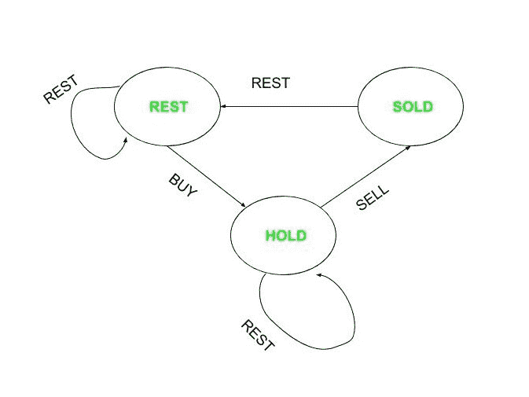

# 在休息状态下买卖股票利润最大化

> 原文:[https://www . geeksforgeeks . org/最大化剩余条件下的股票买卖利润/](https://www.geeksforgeeks.org/maximize-profit-in-buying-and-selling-stocks-with-rest-condition/)

一只股票每天的价格是以数组**arr【】****N**天给出的，任务是在股票必须卖出后才能再次买入，并且股票在卖出的第二天不能买入的条件下，寻找当年买卖股票所能获得的最大利润。(即至少休息一天)。

**示例:**

> **输入:** arr[] = {2，4，5，0，2}
> **输出:** 4
> **说明:**按成本 2 买入，按成本 4 卖出，利润= 2。按成本 0 买入，按成本 2 卖出，利润= 2。利润总额= 4。
> 
> **输入:** arr[] = {2，0，5，1，8}
> 输出: 8

**进场:**
考虑三种状态:**休息**、**保持**和**卖出**。

> **REST** 表示什么都不做。
> **HOLD** 表示持有股票(买了股票没有卖出)。
> **表示卖出股票后的状态。**

**要达到**休息**状态，什么都不要做。
要达到**保持**状态，购买股票。
要达到**卖出**状态，先卖出需要买入的股票。
通过上述动作，制作过渡图。**

****

**利用这个过渡图可以算出利润。
日**日<sup>日</sup>日**日:** 

*   ****休市【I】**表示在第 I 天休市所获得的最大利润，由于第 i <sup>日</sup>日是休市日，股票可能在第(i-1) <sup>日</sup>卖出，也可能没有卖出。 **rest[i]的值= max( rest[i-1]，已售[i-1])** 。**
*   ****hold【I】**表示在 i <sup>日</sup>买入或在 i <sup>日</sup>之前的某一天买入并在 i <sup>日</sup>休息所获得的最大利润。所以， **hold[i] = max( hold[i-1]，rest[i-1]+price[i])** 的值。**
*   ****已售【I】**表示在第日卖出【I】T2 的最大利润。股票一定是在某一天买入，然后在第一个<sup>日</sup>卖出。**因此卖出[i] =持有[i-1] +价格[i]** 。** 

**因此，最终的答案将是**

> **最高**卖出【n-1】**和**休息【n-1】**。**

**下面是上述方法的实现:**

## **C++**

```
// C++ program for the above problem
#include <bits/stdc++.h>
using namespace std;

int maxProfit(int prices[], int n)
{
    // If there is only one day
    // for buying and selling
    // no profit can be made
    if (n <= 1)
        return 0;

    // Array to store Maxprofit by
    // resting on given day
    int rest[n] = { 0 };

    // Array to store Maxprofit by
    // buying or resting on the
    // given day
    int hold[n] = { 0 };

    // Array to store Maxprofit by
    // selling on given day
    int sold[n] = { 0 };

    // Initially there will 0 profit
    rest[0] = 0;

    // Buying on 1st day results
    // in negative profit
    hold[0] = -prices[0];

    // zero profit since selling
    // before buying isn't possible
    sold[0] = 0;

    for (int i = 1; i < n; i++) {

        // max of profit on (i-1)th
        // day by resting and profit
        // on (i-1)th day by selling.
        rest[i] = max(rest[i - 1],
                      sold[i - 1]);

        // max of profit by resting
        // on ith day and
        // buying on ith day.
        hold[i] = max(hold[i - 1],
                      rest[i - 1]
                          - prices[i]);

        // max of profit by selling
        // on ith day
        sold[i] = hold[i - 1] + prices[i];
    }

    // maxprofit
    return max(rest[n - 1],
               sold[n - 1]);
}

// Driver Code
int main()
{
    int price[] = { 2, 4,
                    5, 0, 2 };
    int n = sizeof(price)
            / sizeof(price[0]);
    cout << maxProfit(price, n)
         << endl;
    return 0;
}
```

## **Java 语言(一种计算机语言，尤用于创建网站)**

```
// Java program for the above problem
class GFG{

static int maxProfit(int prices[], int n)
{

    // If there is only one day
    // for buying and selling
    // no profit can be made
    if (n <= 1)
        return 0;

    // Array to store Maxprofit by
    // resting on given day
    int rest[] = new int[n];

    // Array to store Maxprofit by
    // buying or resting on the
    // given day
    int hold[] = new int[9];

    // Array to store Maxprofit by
    // selling on given day
    int sold[] = new int[9];

    // Initially there will 0 profit
    rest[0] = 0;

    // Buying on 1st day results
    // in negative profit
    hold[0] = -prices[0];

    // Zero profit since selling
    // before buying isn't possible
    sold[0] = 0;

    for(int i = 1; i < n; i++)
    {

       // max of profit on (i-1)th
       // day by resting and profit
       // on (i-1)th day by selling.
       rest[i] = Math.max(rest[i - 1],
                          sold[i - 1]);

       // max of profit by resting
       // on ith day and
       // buying on ith day.
       hold[i] = Math.max(hold[i - 1],
                          rest[i - 1] -
                        prices[i]);

       // max of profit by selling
       // on ith day
       sold[i] = hold[i - 1] + prices[i];
    }

    // maxprofit
    return Math.max(rest[n - 1],
                    sold[n - 1]);
}

// Driver Code
public static void main(String[] args)
{
    int price[] = { 2, 4, 5, 0, 2 };
    int n = price.length;

    System.out.print(maxProfit(price, n) + "\n");
}
}

// This code is contributed by amal kumar choubey
```

## **蟒蛇 3**

```
# Python3 program for the above problem
def maxProfit(prices, n):

    # If there is only one day
    # for buying and selling
    # no profit can be made
    if (n <= 1):
        return 0

    # Array to store Maxprofit by
    # resting on given day
    rest = [0] * n

    # Array to store Maxprofit by
    # buying or resting on the
    # given day
    hold = [0] * n

    # Array to store Maxprofit by
    # selling on given day
    sold = [0] * n

    # Initially there will 0 profit
    rest[0] = 0

    # Buying on 1st day results
    # in negative profit
    hold[0] = -prices[0]

    # zero profit since selling
    # before buying isn't possible
    sold[0] = 0

    for i in range(1, n):

        # max of profit on (i-1)th
        # day by resting and profit
        # on (i-1)th day by selling.
        rest[i] = max(rest[i - 1],
                      sold[i - 1])

        # max of profit by resting
        # on ith day and
        # buying on ith day.
        hold[i] = max(hold[i - 1],
                      rest[i - 1] -
                    prices[i])

        # max of profit by selling
        # on ith day
        sold[i] = hold[i - 1] + prices[i]

    # maxprofit
    return max(rest[n - 1],
               sold[n - 1])

# Driver Code
price = [ 2, 4, 5, 0, 2 ]
n = len(price)

print(maxProfit(price, n))

# This code is contributed by avanitrachhadiya2155
```

## **C#**

```
// C# program for the above problem
using System;

class GFG{

static int maxProfit(int[] prices, int n)
{

    // If there is only one day
    // for buying and selling
    // no profit can be made
    if (n <= 1)
        return 0;

    // Array to store Maxprofit by
    // resting on given day
    int[] rest = new int[n];

    // Array to store Maxprofit by
    // buying or resting on the
    // given day
    int[] hold = new int[9];

    // Array to store Maxprofit by
    // selling on given day
    int[] sold = new int[9];

    // Initially there will 0 profit
    rest[0] = 0;

    // Buying on 1st day results
    // in negative profit
    hold[0] = -prices[0];

    // Zero profit since selling
    // before buying isn't possible
    sold[0] = 0;

    for(int i = 1; i < n; i++)
    {

        // max of profit on (i-1)th
        // day by resting and profit
        // on (i-1)th day by selling.
        rest[i] = Math.Max(rest[i - 1],
                           sold[i - 1]);

        // max of profit by resting
        // on ith day and
        // buying on ith day.
        hold[i] = Math.Max(hold[i - 1],
                           rest[i - 1] -
                         prices[i]);

        // max of profit by selling
        // on ith day
        sold[i] = hold[i - 1] + prices[i];
    }

    // maxprofit
    return Math.Max(rest[n - 1],
                    sold[n - 1]);
}

// Driver code
static void Main()
{
    int[] price = { 2, 4, 5, 0, 2 };
    int n = price.Length;

    Console.WriteLine(maxProfit(price, n));
}
}

// This code is contributed by divyeshrabadiya07
```

## **java 描述语言**

```
<script>

// JavaScript program for the above problem

function maxProfit( prices,  n)
{
    // If there is only one day
    // for buying and selling
    // no profit can be made
    if (n <= 1)
        return 0;

    // Array to store Maxprofit by
    // resting on given day
        let rest = [];
    for(let k = 0;k<n;k++)
         rest.push(0);

    // Array to store Maxprofit by
    // buying or resting on the
    // given day
        let hold = [];
    for(let k = 0;k<n;k++)
         hold.push(0);

    // Array to store Maxprofit by
    // selling on given day
    let sold = [];
    for(let k = 0;k<n;k++)
         sold.push(0);

    // Initially there will 0 profit
    rest[0] = 0;

    // Buying on 1st day results
    // in negative profit
    hold[0] = -prices[0];

    // zero profit since selling
    // before buying isn't possible
    sold[0] = 0;

    for (let i = 1; i < n; i++) {

        // max of profit on (i-1)th
        // day by resting and profit
        // on (i-1)th day by selling.
        rest[i] = Math.max(rest[i - 1],
                      sold[i - 1]);

        // max of profit by resting
        // on ith day and
        // buying on ith day.
        hold[i] = Math.max(hold[i - 1],
                      rest[i - 1]
                          - prices[i]);

        // max of profit by selling
        // on ith day
        sold[i] = hold[i - 1] + prices[i];
    }

    // maxprofit
    return Math.max(rest[n - 1],
               sold[n - 1]);
}

// Driver Code
let price = [ 2, 4,
                    5, 0, 2 ];
let n = price.length;
document.write( maxProfit(price, n),'<br>');

</script>
```

****Output:**

```
4
```** 

*****时间复杂度:**O(N)*
T5**辅助空间:** O(N)**