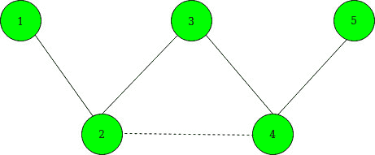
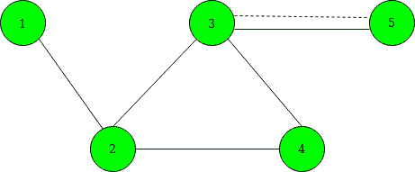

# 通过添加单条边最大化给定顶点之间的最短路径

> 原文:[https://www . geeksforgeeks . org/通过添加单条边来最大化给定顶点之间的最短路径/](https://www.geeksforgeeks.org/maximize-shortest-path-between-given-vertices-by-adding-a-single-edge/)

给定一个由 **N** 个节点和 **M** 个顶点组成的无向图。您还将获得一个 **K** 边，作为**所选的[]** 。通过在给定选定边的任意两个顶点之间添加单条边，最大化节点 **1** 到节点 **N** 之间最短路径长度的任务。
**注意:**可以在任意两个已经有边的选中顶点之间添加边。

> **输入:** N = 5，M = 4，K = 2，选定[] = {2，4}
> 下面是给定的图形:
> 
> 
> 
> **输出:** 3
> **说明:**
> 在添加 2 到 4 之间的边之前，最短路径变为:1–>2–>3–>4–>5。
> 添加 2 到 4 之间的边后，最短路径变为 1–>2–>4–>5。下图是添加边后的图形。由虚线表示。
> 
> 
> 
> **输入:** N = 5 M = 5 K = 3 选定[] = {1，3，5}
> 下面是给定的图形:
> 
> 
> 
> **输出:** 3
> **说明:**
> 我们可以在 3 到 5 之间添加一条边，因为它们之间已经有一条边了。因此，最短路径变为 1–>2–>3–>5。下图是添加边后的图形。由虚线表示。
> 
> 

**方法:**思路是使用[广度优先搜索](https://www.geeksforgeeks.org/breadth-first-search-or-bfs-for-a-graph/)找到顶点 **1** 和 **N** 到每个选中顶点的距离。对于选中的顶点 I，让 **x <sub>i</sub>** 表示到节点 1 的距离， **y <sub>i</sub>** 表示到节点 **N** 的距离。以下是步骤:

1.  保持一个 2D 矩阵(比如说**dist【2】[]**)有 **2** 行和 **N** 列。
2.  在第一行中，使用 BFS 遍历保持节点 **1** 和图中其他顶点之间的最短距离。
3.  在第二行中，使用 BFS 遍历保持节点 **N** 和图的其他顶点之间的最短距离。
4.  现在，从**选定的【】**中选择两个选定的顶点 **a** 和 **b** ，以最小化 min(xa + yb，ya + xb)的值。为此，请执行以下操作:
    *   创建一个向量对，并存储(x<sub>I</sub>–y<sub>I</sub>)的值及其各自选择的节点。
    *   [对以上向量对](https://www.geeksforgeeks.org/sorting-vector-of-pairs-in-c-set-1-sort-by-first-and-second/)进行排序。
    *   将**最佳初始化为 0** 和**最大初始化为-INF** 。
    *   现在遍历上面的向量对，对于每个选定的节点(比如 a)，将**最佳**的值更新为最大值(最佳，最大+ dist[1][a])，并将最大值更新为最大值(最大，dist[0][a])。
5.  经过以上操作**的最大值(dist[0][N-1]和 best + 1)** 给出了最短路径的最小值。

下面是上述方法的实现:

## C++

```
// C++ program for the above approach
#include <bits/stdc++.h>
using namespace std;
const int INF = 1e9 + 7;
int N, M;

// To store graph as adjacency list
vector<int> edges[200005];

// To store the shortest path
int dist[2][200000];

// Function that performs BFS Traversal
void bfs(int* dist, int s)
{
    int q[200000];

    // Fill initially each distance as INF
    fill(dist, dist + N, INF);
    int qh = 0, qt = 0;
    q[qh++] = s;
    dist[s] = 0;

    // Perform BFS
    while (qt < qh) {

        int x = q[qt++];

        // Traverse the current edges
        for (int y : edges[x]) {
            if (dist[y] == INF) {

                // Update the distance
                dist[y] = dist[x] + 1;

                // Insert in queue
                q[qh++] = y;
            }
        }
    }
}

// Function that maximizes the shortest
// path between source and destination
// vertex by adding a single edge between
// given selected nodes
void shortestPathCost(int selected[], int K)
{
    vector<pair<int, int> > data;

    // To update the shortest distance
    // between node 1 to other vertices
    bfs(dist[0], 0);

    // To update the shortest distance
    // between node N to other vertices
    bfs(dist[1], N - 1);

    for (int i = 0; i < K; i++) {

        // Store the values x[i] - y[i]
        data.emplace_back(dist[0][selected[i]]
                              - dist[1][selected[i]],
                          selected[i]);
    }

    // Sort all the vectors of pairs
    sort(data.begin(), data.end());
    int best = 0;
    int MAX = -INF;

    // Traverse data[]
    for (auto it : data) {
        int a = it.second;
        best = max(best,
                   MAX + dist[1][a]);

        // Maximize x[a] - y[b]
        MAX= max(MAX, dist[0][a]);
    }

    // Print minimum cost
    printf("%d\n", min(dist[0][N - 1], best + 1));
}

// Driver Code
int main()
{
    // Given nodes and edges
    N = 5, M = 4;
    int K = 2;
    int selected[] = { 1, 3 };

    // Sort the selected nodes
    sort(selected, selected + K);

    // Given edges
    edges[0].push_back(1);
    edges[1].push_back(0);
    edges[1].push_back(2);
    edges[2].push_back(1);
    edges[2].push_back(3);
    edges[3].push_back(2);
    edges[3].push_back(4);
    edges[4].push_back(3);

    // Function Call
    shortestPathCost(selected, K);
    return 0;
}
```

## Java 语言(一种计算机语言，尤用于创建网站)

```
// Java program for the above approach
import java.util.*;
import java.lang.*;

class GFG{

static int INF = (int)1e9 + 7;
static int N, M;

// To store graph as adjacency list
static ArrayList<ArrayList<Integer>> edges;

// To store the shortest path
static int[][] dist = new int[2][200000];

// Function that performs BFS Traversal
static void bfs(int[] dist, int s)
{
    int[] q = new int[200000];

    // Fill initially each distance as INF
    Arrays.fill(dist, INF);

    int qh = 0, qt = 0;
    q[qh++] = s;
    dist[s] = 0;

    // Perform BFS
    while (qt < qh)
    {
        int x = q[qt++];

        // Traverse the current edges
        for(Integer y : edges.get(x))
        {
            if (dist[y] == INF)
            {

                // Update the distance
                dist[y] = dist[x] + 1;

                // Insert in queue
                q[qh++] = y;
            }
        }
    }
}

// Function that maximizes the shortest
// path between source and destination
// vertex by adding a single edge between
// given selected nodes
static void shortestPathCost(int selected[], int K)
{
    ArrayList<int[]> data = new ArrayList<>();

    // To update the shortest distance
    // between node 1 to other vertices
    bfs(dist[0], 0);

    // To update the shortest distance
    // between node N to other vertices
    bfs(dist[1], N - 1);

    for(int i = 0; i < K; i++)
    {

        // Store the values x[i] - y[i]
        data.add(new int[]{dist[0][selected[i]] -
                           dist[1][selected[i]],
                                   selected[i]});
    }

    // Sort all the vectors of pairs
    Collections.sort(data, (a, b) -> a[0] - b[0]);
    int best = 0;
    int MAX = -INF;

    // Traverse data[]
    for(int[] it : data)
    {
        int a = it[1];
        best = Math.max(best,
                        MAX + dist[1][a]);

        // Maximize x[a] - y[b]
        MAX = Math.max(MAX, dist[0][a]);
    }

    // Print minimum cost
    System.out.println(Math.min(dist[0][N - 1],
                                     best + 1));
}

// Driver code
public static void main (String[] args)
{

    // Given nodes and edges
    N = 5; M = 4;
    int K = 2;
    int selected[] = { 1, 3 };

    // Sort the selected nodes
    Arrays.sort(selected);

    edges = new ArrayList<>();

    for(int i = 0; i < 200005; i++)
        edges.add(new ArrayList<Integer>());

    // Given edges
    edges.get(0).add(1);
    edges.get(1).add(0);
    edges.get(1).add(2);
    edges.get(2).add(1);
    edges.get(2).add(3);
    edges.get(3).add(2);
    edges.get(3).add(4);
    edges.get(4).add(3);

    // Function Call
    shortestPathCost(selected, K);
}
}

// This code is contributed by offbeat
```

## 蟒蛇 3

```
# Python3 program for the above approach

# Function that performs BFS Traversal
def bfs(x, s):
    global edges, dist
    q = [0 for i in range(200000)]

    # Fill initially each distance as INF
    # fill(dist, dist + N, INF)
    qh, qt = 0, 0
    q[qh] = s
    qh += 1
    dist[x][s] = 0

    # Perform BFS
    while (qt < qh):
        xx = q[qt]
        qt += 1

        # Traverse the current edges
        for y in edges[xx]:
            if (dist[x][y] == 10**18):

                # Update the distance
                dist[x][y] = dist[x][xx] + 1

                # Insert in queue
                q[qh] = y
                qh += 1

# Function that maximizes the shortest
# path between source and destination
# vertex by adding a single edge between
# given selected nodes
def shortestPathCost(selected, K):
    global dist, edges
    data = []

    # To update the shortest distance
    # between node 1 to other vertices
    bfs(0, 0)

    # To update the shortest distance
    # between node N to other vertices
    bfs(1, N - 1)
    for i in range(K):

        # Store the values x[i] - y[i]
        data.append([dist[0][selected[i]]- dist[1][selected[i]], selected[i]])

    # Sort all the vectors of pairs
    data = sorted(data)
    best = 0
    MAX = -10**18

    # Traverse data[]
    for it in data:
        a = it[1]
        best = max(best,MAX + dist[1][a])

        # Maximize x[a] - y[b]
        MAX= max(MAX, dist[0][a])

    # Print minimum cost
    print(min(dist[0][N - 1], best + 1))

# Driver Code
if __name__ == '__main__':

    # Given nodes and edges
    edges = [[] for i in range(5)]
    dist = [[10**18 for i in range(1000005)] for i in range(2)]
    N,M = 5, 4
    K = 2
    selected = [1, 3]

    # Sort the selected nodes
    selected = sorted(selected)

    # Given edges
    edges[0].append(1)
    edges[1].append(0)
    edges[1].append(2)
    edges[2].append(1)
    edges[2].append(3)
    edges[3].append(2)
    edges[3].append(4)
    edges[4].append(3)

    # Function Call
    shortestPathCost(selected, K)

    # This code is contributed by mohit kumar 29
```

## java 描述语言

```
<script>
// Javascript program for the above approach

let INF = 1e9 + 7;
let N, M;

// To store graph as adjacency list
let  edges=[];

// To store the shortest path
let dist=new Array(2);
for(let i=0;i<2;i++)
{
    dist[i]=new Array(200000);
    for(let j=0;j<200000;j++)
    {
        dist[i][j]=INF;
    }
}

// Function that performs BFS Traversal
function bfs(dist,s)
{
    let q = new Array(200000);

    // Fill initially each distance as INF

    let qh = 0, qt = 0;
    q[qh++] = s;
    dist[s] = 0;

    // Perform BFS
    while (qt < qh)
    {
        let x = q[qt++];

        // Traverse the current edges
        for(let y=0;y< edges[x].length;y++)
        {
            if (dist[edges[x][y]] == INF)
            {

                // Update the distance
                dist[edges[x][y]] = dist[x] + 1;

                // Insert in queue
                q[qh++] = edges[x][y];
            }
        }
    }
}

// Function that maximizes the shortest
// path between source and destination
// vertex by adding a single edge between
// given selected nodes   
function shortestPathCost(selected,K)
{
    let data = [];

    // To update the shortest distance
    // between node 1 to other vertices
    bfs(dist[0], 0);

    // To update the shortest distance
    // between node N to other vertices
    bfs(dist[1], N - 1);

    for(let i = 0; i < K; i++)
    {

        // Store the values x[i] - y[i]
        data.push([dist[0][selected[i]] -
                           dist[1][selected[i]],
                                   selected[i]]);
    }

    // Sort all the vectors of pairs
    data.sort(function(a, b){return a[0] - b[0];});
    let best = 0;
    let MAX = -INF;

    // Traverse data[]
    for(let it=0;it< data.length;it++)
    {
        let a = data[it][1];
        best = Math.max(best,
                        MAX + dist[1][a]);

        // Maximize x[a] - y[b]
        MAX = Math.max(MAX, dist[0][a]);
    }

    // Print minimum cost
    document.write(Math.min(dist[0][N - 1],
                                     best + 1));
}

// Driver code
// Given nodes and edges
    N = 5; M = 4;
    let K = 2;
    let selected = [ 1, 3 ];

    // Sort the selected nodes
    (selected).sort(function(a,b){return a-b;});

    edges = [];

    for(let i = 0; i < 200005; i++)
        edges.push([]);

    // Given edges
    edges[0].push(1);
    edges[1].push(0);
    edges[1].push(2);
    edges[2].push(1);
    edges[2].push(3);
    edges[3].push(2);
    edges[3].push(4);
    edges[4].push(3);

    // Function Call
    shortestPathCost(selected, K);

// This code is contributed by patel2127
</script>
```

**Output:** 

```
3
```

***时间复杂度:** O(N*log N + M)*
***辅助空间:** O(N)*