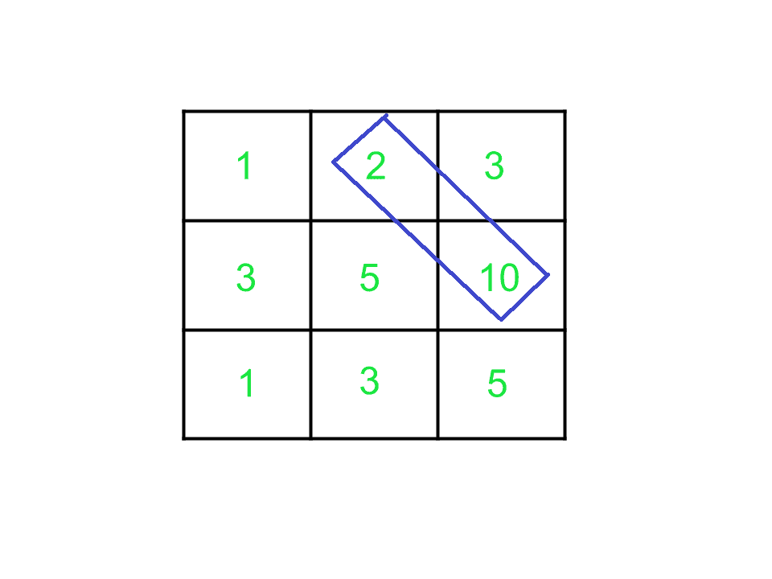

# 通过从给定矩阵的每个单元对角遍历来最大化总和

> 原文:[https://www . geeksforgeeks . org/通过从给定矩阵的每个单元对角遍历来最大化总和/](https://www.geeksforgeeks.org/maximize-sum-by-traversing-diagonally-from-each-cell-of-a-given-matrix/)

给定一个维度为 **N x N** 的 [2D 方阵](https://www.geeksforgeeks.org/multidimensional-arrays-c-cpp/)**arr【】【】【】**，任务是通过从任意单元格对角移动来寻找最大路径和，每个单元格必须只被访问一次，即从单元格 **(i，j)** 开始，玩家可以移动到单元格 **(i + 1，j + 1)** 。



**示例:**

> ***输入:**arr[][]= {*1，2，3}、{3，5，10}、{1 3 5}}
> ***输出:*** 12
> **说明:**
> 单元格(1，1)、(2，2)和(3，3)之和为 11。
> 单元格(1，2)、(2，3)和(1，3)之和为 3。
> 单元格(2，1)和(3，2)之和为 6。
> 单元格(3，1)的和为 1。
> 最大可能和为 12。
> 
> **输入:** arr[][] = {{1，1，1}，{1 1 1}，{1 1 1}}
> **输出:** 3

**方法:**解决这个问题的思路是[对角遍历矩阵](https://www.geeksforgeeks.org/print-matrix-diagonal-pattern/)寻找第一行和第一列元素，并在矩阵范围内对其对角元素求和。
按照以下步骤解决问题:

1.  初始化一个变量，用 **0** 表示**最大值**。
2.  从第一行和第一列选择每个单元格 **(i，j)** 。
3.  现在，从每个单元格开始，通过将 **i** 和 **j** 递增 **1** 来找到从该单元格开始的对角线总和，比如说**总和**。
4.  然后，将 max 更新为 **max(max，sum)** 。
5.  遍历后，打印 **max** 作为所需答案。

下面是上述方法的实现:

## C++

```
// C++ program for the above approach

#include <bits/stdc++.h>
using namespace std;

// Function to find the maximum sum
int MaximumSum(vector<vector<int> >& arr, int n)
{

    int ans = 0;

    // Loop to traverse through the
    // upper triangular matrix and
    // update the maximum sum to ans
    for (int i = 0; i < n; i++) {
        int x = 0, y = i, sum = 0;
        for (int j = i; j < n; j++) {
            sum += arr[x++][y++];
        }
        if (sum > ans)
            ans = sum;
    }

    // Traverse through the
    // lower triangular matrix
    for (int i = 1; i < n; i++) {

        int x = i, y = 0, sum = 0;

        for (int j = i; j < n; j++) {

            sum += arr[x++][y++];
        }
        if (sum > ans)
            ans = sum;
    }

    return ans;
}

// Driver Code
int main()
{

    // Given matrix
    vector<vector<int> > arr;
    arr = { { 1, 2, 3 },
            { 3, 5, 10 },
            { 1, 3, 5 } };

    // Given dimension
    int n = arr.size();

    cout << MaximumSum(arr, n);

    return 0;
}
```

## Java 语言(一种计算机语言，尤用于创建网站)

```
// Java program for the above approach
import java.util.*;
class GFG{

// Function to find the maximum sum
static int MaximumSum(int [][]arr, int n)
{

    int ans = 0;

    // Loop to traverse through the
    // upper triangular matrix and
    // update the maximum sum to ans
    for (int i = 0; i < n; i++)
    {
        int x = 0, y = i, sum = 0;
        for (int j = i; j < n; j++)
        {
            sum += arr[x++][y++];
        }
        if (sum > ans)
            ans = sum;
    }

    // Traverse through the
    // lower triangular matrix
    for (int i = 1; i < n; i++)
    {
        int x = i, y = 0, sum = 0;
        for (int j = i; j < n; j++)
        {
            sum += arr[x++][y++];
        }
        if (sum > ans)
            ans = sum;
    }
    return ans;
}

// Driver Code
public static void main(String[] args)
{

    // Given matrix
    int [][]arr = { { 1, 2, 3 },
            { 3, 5, 10 },
            { 1, 3, 5 } };

    // Given dimension
    int n = arr.length;
    System.out.print(MaximumSum(arr, n));
}
}

// This code is contributed by 29AjayKumar
```

## 蟒蛇 3

```
# Python3 program for the above approach

# Function to find the maximum sum
def MaximumSum(arr, n):
    ans = 0;

    # Loop to traverse through the
    # upper triangular matrix and
    # update the maximum sum to ans
    for i in range(n):
        x, y, sum = 0, i, 0
        for j in range(i, n):
            sum, x, y =sum + arr[x][y], x + 1, y + 1
        if (sum > ans):
            ans = sum

    # Traverse through the
    # lower triangular matrix
    for i in range(1, n):

        x, y, sum = i, 0, 0

        for j in range(i, n):

            sum, x, y =sum + arr[x][y], x + 1, y + 1
        if (sum > ans):
            ans = sum
    return ans

# Driver Code
if __name__ == '__main__':

    # Given matrix
    arr = [ [ 1, 2, 3],
            [ 3, 5, 10],
            [ 1, 3, 5 ]]

    # Given dimension
    n = len(arr)
    print (MaximumSum(arr, n))

    # This code is contributed by mohit kumar 29
```

## C#

```
// C# program for the above approach
using System;
class GFG{

  // Function to find the maximum sum
  static int MaximumSum(int [,]arr, int n)
  {
    int ans = 0;

    // Loop to traverse through the
    // upper triangular matrix and
    // update the maximum sum to ans
    for (int i = 0; i < n; i++)
    {
      int x = 0, y = i, sum = 0;
      for (int j = i; j < n; j++)
      {
        sum += arr[x++, y++];
      }
      if (sum > ans)
        ans = sum;
    }

    // Traverse through the
    // lower triangular matrix
    for (int i = 1; i < n; i++)
    {
      int x = i, y = 0, sum = 0;
      for (int j = i; j < n; j++)
      {
        sum += arr[x++, y++];
      }
      if (sum > ans)
        ans = sum;
    }
    return ans;
  }

  // Driver Code
  public static void Main(String[] args)
  {

    // Given matrix
    int [,]arr = { { 1, 2, 3 },
                  { 3, 5, 10 },
                  { 1, 3, 5 } };

    // Given dimension
    int n = arr.GetLength(0);
    Console.Write(MaximumSum(arr, n));
  }
}

// This code is contributed by shikhasingrajput
```

## java 描述语言

```
<script>

// Javascript program of the above approach

// Function to find the maximum sum
function MaximumSum(arr, n)
{

    let ans = 0;

    // Loop to traverse through the
    // upper triangular matrix and
    // update the maximum sum to ans
    for (let i = 0; i < n; i++)
    {
        let x = 0, y = i, sum = 0;
        for (let j = i; j < n; j++)
        {
            sum += arr[x++][y++];
        }
        if (sum > ans)
            ans = sum;
    }

    // Traverse through the
    // lower triangular matrix
    for (let i = 1; i < n; i++)
    {
        let x = i, y = 0, sum = 0;
        for (let j = i; j < n; j++)
        {
            sum += arr[x++][y++];
        }
        if (sum > ans)
            ans = sum;
    }
    return ans;
}

    // Driver Code

    // Given matrix
    let arr = [[ 1, 2, 3 ],
            [ 3, 5, 10 ],
            [ 1, 3, 5 ]];

    // Given dimension
    let n = arr.length;
    document.write(MaximumSum(arr, n));

</script>
```

**Output:** 

```
12
```

***时间复杂度:**O(N<sup>2</sup>)*
***辅助空间:** O(N <sup>2</sup> )*