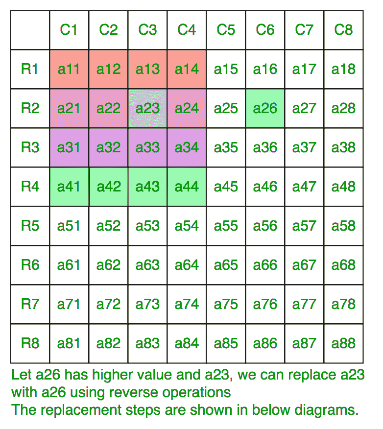
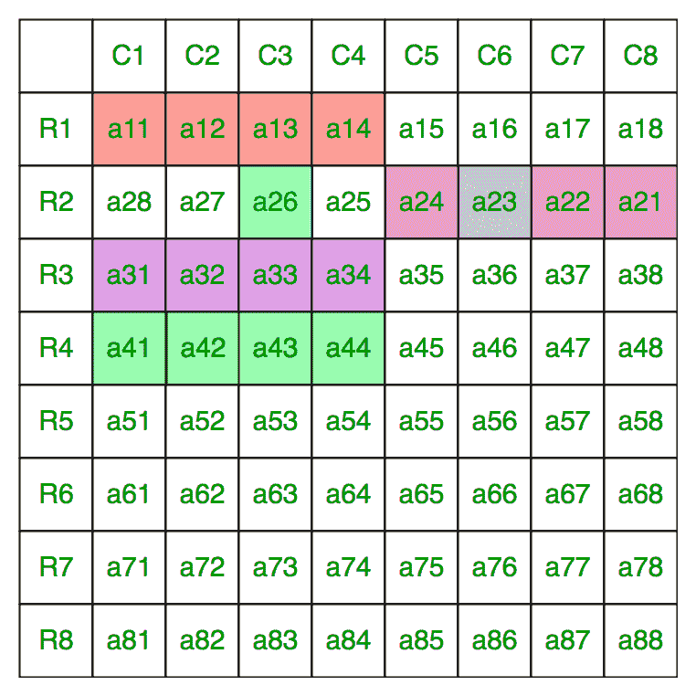
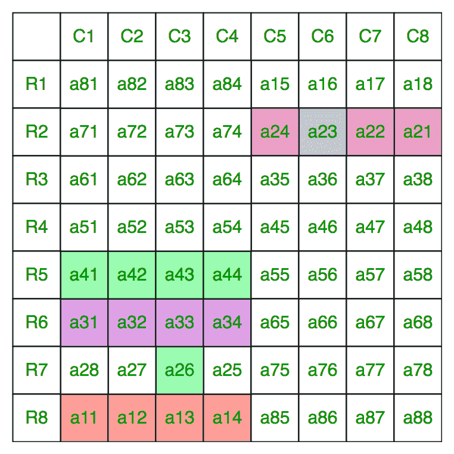
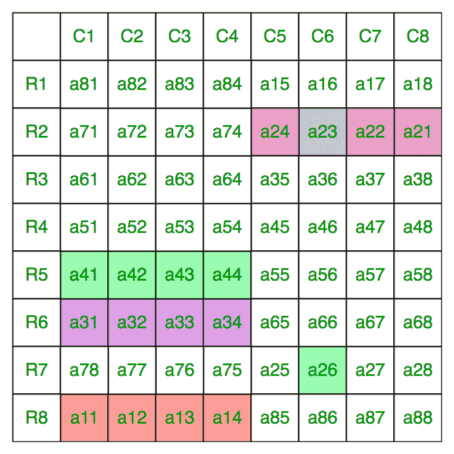
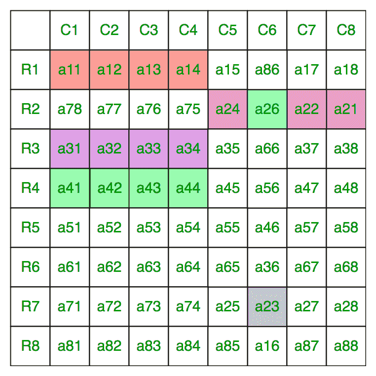
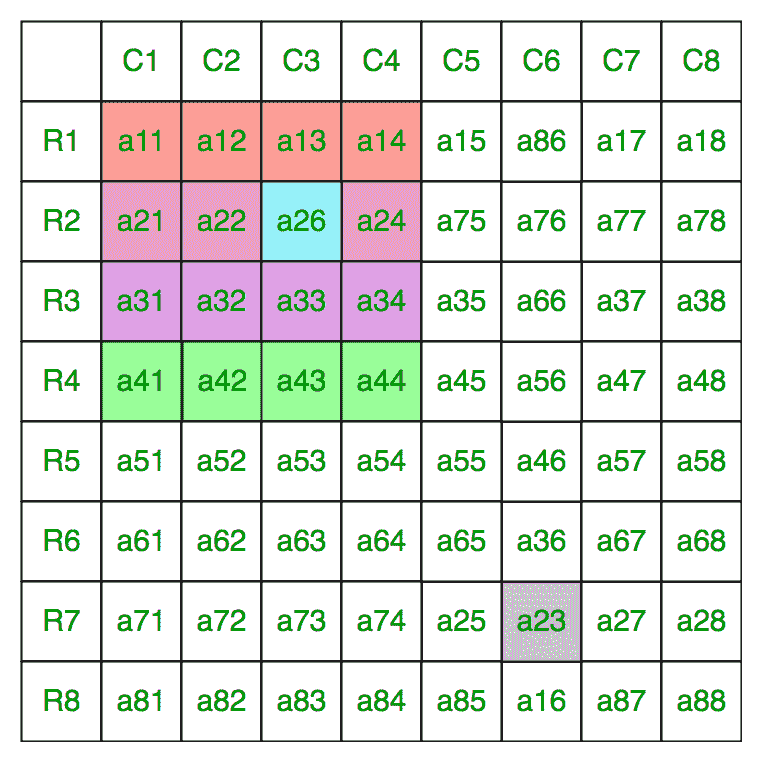

# 从给定的 2N×2N 矩阵中最大化 N×N 左上子矩阵的和

> 原文:[https://www . geesforgeks . org/maximum-sum-n-x-n-左上角-子矩阵-给定-2n-x-2n-矩阵/](https://www.geeksforgeeks.org/maximize-sum-n-x-n-upper-left-sub-matrix-given-2n-x-2n-matrix/)

给定一个**2N×2N**的整数矩阵。您可以按任何顺序反转任何行或列任何次数。任务是计算左上角 **N X N** 子矩阵的最大和，即子矩阵元素从(0，0)到(N–1，N–1)的和。
**例:**

```
Input : mat[][] = {
                    112, 42, 83, 119,
                    56, 125, 56, 49,
                    15, 78, 101, 43,
                    62, 98, 114, 108
                  }
Output : 414
Given matrix is of size 4 X 4, we need to maximize 
the sum of upper left 2 X 2 matrix i.e 
the sum of mat[0][0] + mat[0][1] + mat[1][0] + mat[1][1].
Following operations maximize the sum:
1\. Reverse the column 2,
112, 42, 114, 119,
56, 125, 101, 49,
15, 78, 56, 43,
62, 98, 83, 108

2\. Reverse row 0,
119, 114, 42, 112,
56, 125, 101, 49,
15, 78, 56, 43,
62, 98, 83, 108

Sum of upper-left matrix = 119 + 114 + 56 + 125 = 414.
```

要最大化左上角子矩阵的总和，请注意，对于左上角子矩阵的每个单元格，有四个候选单元格，这意味着左上角、右上角、左下角和右下角子矩阵中的相应单元格可以与之交换。
现在，对于每个单元格进行观察，无论它在哪里，我们都可以将其与左上角子矩阵中相应的候选值进行交换，而不会改变左上角子矩阵中其他单元格的顺序。该图显示了一个实例，其中 4 个候选值的最大值在右上角的子矩阵中。如果它在左下方或右下方的子矩阵中，我们可以首先反转一行或一列，将其放在右上方的子矩阵中，然后按照图中所示的相同操作顺序进行操作。
在这个矩阵中，假设一个 <sub>26</sub> 是 4 个候选的最大值，一个 <sub>23</sub> 必须与一个 <sub>26</sub> 交换，而不改变左上角子矩阵中单元格的顺序。



反转第 2 行，



反转第 2 列，



反转第 7 行，



反转第 6 列，



反转第 2 行，



以下是该方法的实现:

## C++

```
// C++ program to find maximum value of top N/2 x N/2
// matrix using row and column reverse operations
#include<bits/stdc++.h>
#define R 4
#define C 4
using namespace std;

int maxSum(int mat[R][C])
{
  int sum = 0;

  for (int i = 0; i < R/2; i++)
    for (int j = 0; j < C/2; j++)
    {
      int r1 = i;
      int r2 = R - i - 1;
      int c1 = j;
      int c2 = C - j - 1;

      // We can replace current cell [i, j]
      // with 4 cells without changing affecting
      // other elements.
      sum += max(max(mat[r1][c1], mat[r1][c2]),
                 max(mat[r2][c1], mat[r2][c2]));
    }

    return sum;
}

// Driven Program
int main()
{
  int mat[R][C] = {
                    112, 42, 83, 119,
                    56, 125, 56, 49,
                    15, 78, 101, 43,
                    62, 98, 114, 108
                  };

  cout << maxSum(mat) << endl;

  return 0;
}
```

## Java 语言(一种计算机语言，尤用于创建网站)

```
// Java program to find maximum value of top N/2 x N/2
// matrix using row and column reverse operations

class GFG {

    static int R = 4;
    static int C = 4;

    static int maxSum(int mat[][]) {
        int sum = 0;

        for (int i = 0; i < R / 2; i++) {
            for (int j = 0; j < C / 2; j++) {
                int r1 = i;
                int r2 = R - i - 1;
                int c1 = j;
                int c2 = C - j - 1;

                // We can replace current cell [i, j]
                // with 4 cells without changing affecting
                // other elements.
                sum += Math.max(Math.max(mat[r1][c1], mat[r1][c2]),
                        Math.max(mat[r2][c1], mat[r2][c2]));
            }
        }

        return sum;
    }

// Driven Program
    public static void main(String[] args) {
        int mat[][] = {
            {112, 42, 83, 119},
            {56, 125, 56, 49},
            {15, 78, 101, 43},
            {62, 98, 114, 108}
        };

        System.out.println(maxSum(mat));

    }
}
/* This Java code is contributed by Rajput-Ji*/
```

## 蟒蛇 3

```
# Python3 program to find the maximum value
# of top N/2 x N/2 matrix using row and
# column reverse operations
def maxSum(mat):

    Sum = 0
    for i in range(0, R // 2):
        for j in range(0, C // 2):

            r1, r2 = i, R - i - 1
            c1, c2 = j, C - j - 1

            # We can replace current cell [i, j]
            # with 4 cells without changing/affecting
            # other elements.
            Sum += max(max(mat[r1][c1], mat[r1][c2]),
                       max(mat[r2][c1], mat[r2][c2]))

    return Sum

# Driver Code
if __name__ == "__main__":

    R = C = 4
    mat = [[112, 42, 83, 119],
           [56, 125, 56, 49],
           [15, 78, 101, 43],
           [62, 98, 114, 108]]

    print(maxSum(mat))

# This code is contributed
# by Rituraj Jain
```

## C#

```
// C# program to find maximum value
// of top N/2 x N/2 matrix using row
// and column reverse operations
using System;

class GFG
{
static int R = 4;
static int C = 4;

static int maxSum(int[,] mat)
{
    int sum = 0;

    for (int i = 0; i < R / 2; i++)
    {
        for (int j = 0; j < C / 2; j++)
        {
            int r1 = i;
            int r2 = R - i - 1;
            int c1 = j;
            int c2 = C - j - 1;

            // We can replace current cell [i, j]
            // with 4 cells without changing affecting
            // other elements.
            sum += Math.Max(Math.Max(mat[r1,c1], mat[r1,c2]),
                            Math.Max(mat[r2,c1], mat[r2,c2]));
        }
    }
    return sum;
}

// Driven Code
public static void Main()
{
    int[,] mat =
    {
        {112, 42, 83, 119},
        {56, 125, 56, 49},
        {15, 78, 101, 43},
        {62, 98, 114, 108}
    };

    Console.Write(maxSum(mat));
}
}

// This code is contributed
// by ChitraNayal
```

## 服务器端编程语言（Professional Hypertext Preprocessor 的缩写）

```
<?php
// PHP program to find maximum value
// of top N/2 x N/2 matrix using row
// and column reverse operations

function maxSum($mat)
{
    $R = 4; $C = 4;
    $sum = 0;

    for ($i = 0; $i < $R / 2; $i++)
        for ($j = 0; $j < $C / 2; $j++)
        {
            $r1 = $i;
            $r2 = $R - $i - 1;
            $c1 = $j;
            $c2 = $C - $j - 1;

            // We can replace current cell [i, j]
            // with 4 cells without changing
            // affecting other elements.
            $sum += max(max($mat[$r1][$c1],
                            $mat[$r1][$c2]),
                        max($mat[$r2][$c1],
                            $mat[$r2][$c2]));
        }

        return $sum;
}

// Driver Code
$mat = array(array(112, 42, 83, 119),
             array(56, 125, 56, 49),
             array(15, 78, 101, 43),
             array(62, 98, 114, 108));

echo maxSum($mat) . "\n";

// This code is contributed
// by Mukul Singh
?>
```

## java 描述语言

```
<script>
// Javascript program to find maximum value of top N/2 x N/2
// matrix using row and column reverse operations

    let R = 4;
    let C = 4;

    function maxSum(mat)
    {
        let sum = 0;

        for (let i = 0; i < R / 2; i++) {
            for (let j = 0; j < C / 2; j++) {
                let r1 = i;
                let r2 = R - i - 1;
                let c1 = j;
                let c2 = C - j - 1;

                // We can replace current cell [i, j]
                // with 4 cells without changing affecting
                // other elements.
                sum += Math.max(Math.max(mat[r1][c1], mat[r1][c2]),
                        Math.max(mat[r2][c1], mat[r2][c2]));
            }
        }

        return sum;
    }
    // Driven Program
    let mat = [[112, 42, 83, 119],
           [56, 125, 56, 49],
           [15, 78, 101, 43],
           [62, 98, 114, 108]];
    document.write(maxSum(mat));

    // This code is contributed by avanitrachhadiya2155
</script>
```

**输出:**

```
414
```

**时间复杂度:** O(N <sup>2</sup> )。
本文由 [**Anuj Chauhan**](https://www.facebook.com/anuj0503) 供稿。如果你喜欢 GeeksforGeeks 并想投稿，你也可以使用[contribute.geeksforgeeks.org](http://www.contribute.geeksforgeeks.org)写一篇文章或者把你的文章邮寄到 contribute@geeksforgeeks.org。看到你的文章出现在极客博客主页上，帮助其他极客。
如果发现有不正确的地方，或者想分享更多关于上述话题的信息，请写评论。