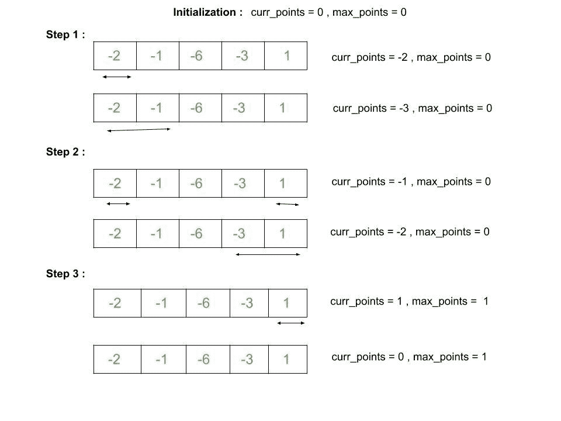

# 只取角元素最大化数组中 K 个元素的总和|集合 2

> 原文:[https://www . geeksforgeeks . org/maximum-Atmos-k-elements-in-array-by-take-only-corner-elements-set-2/](https://www.geeksforgeeks.org/maximize-sum-of-atmost-k-elements-in-array-by-taking-only-corner-elements-set-2/)

给定一个**数组 arr【】**和**一个整数 K** ，任务是通过只取角元素来找到并最大化数组中最多 K 个**元素的和。**

> 角元素是从数组开始或从数组结束的元素。

**示例:**

> **输入:** N = 8，arr[] = {6，-1，14，-15，2，1，2，-5}，K = 4
> **输出:** 19
> **说明:**
> 这里的最优选择是从头挑三张牌。之后如果我们想选下一张牌，我们的点数会减少。所以最大点数是 arr[0] + arr[1] + arr[2] = 19。
> 
> **输入:** N = 5，arr[] = {-2，-1，-6，-3，1}，K = 2
> **输出:** 1
> 这里最优选择是挑最后一张牌。所以最大可能点数是 arr[4] = 1。任何进一步的选择都会降低该值。

**天真方法:**
为了解决上面提到的问题，我们将使用 [**递归**](https://www.geeksforgeeks.org/recursion/) 。因为我们只能取一个开始或结束索引值，因此初始化两个变量，最多取 K 步，并返回所有可能组合的最大和。仅当最大和大于前一个和时才更新最大和，否则跳到下一个可能的组合。递归方法由于其重叠子问题和最优子结构性质而具有指数复杂性。

下面是上述方法的实现:

## C++

```
// C++ implementation to Maximize sum of atmost
// K elements in Array by taking only corner elements
#include <bits/stdc++.h>
using namespace std;

// Function to return maximum points
int maxPointCount(int arr[], int K, int start, int end,
                  int points, int max_points)
{
    if (K == 0) {
        return max_points;
    }
    // Pick the start index
    int points_start = points + arr[start];

    // Update maximum points if necessary
    max_points = max(max_points, points_start);

    // Pick the end index
    int points_end = points + arr[end];

    // Update maximum points if necessary
    max_points = max(max_points, points_end);

    // Recursive call to get max value
    return max(maxPointCount(arr, K - 1, start + 1, end,
                                points_start, max_points),
               maxPointCount(arr, K - 1, start, end - 1,
                                points_end, max_points));
}

// Driver code
int main()
{
    int arr[] = { -2, -1, -6, -3, 1 };
    int N = sizeof(arr) / sizeof(arr[0]);

    int K = 2;

    int points = 0;

    int max_points = 0;

    // beginning index
    int start = 0;

    // end index
    int end = N - 1;

    cout << maxPointCount(arr, K, start,
                end, points, max_points);

    return 0;
}
```

## Java 语言(一种计算机语言，尤用于创建网站)

```
// Java implementation to Maximize
// sum of atmost K elements in Array
// by taking only corner elements
import java.util.*;

class GFG{

// Function to return maximum points
static int maxPointCount(int arr[], int K,
                         int start, int end,
                         int points, int max_points)
{
    if (K == 0)
    {
        return max_points;
    }

    // Pick the start index
    int points_start = points + arr[start];

    // Update maximum points if necessary
    max_points = Math.max(max_points, points_start);

    // Pick the end index
    int points_end = points + arr[end];

    // Update maximum points if necessary
    max_points = Math.max(max_points, points_end);

    // Recursive call to get max value
    return Math.max(maxPointCount(arr, K - 1,
                                  start + 1, end,
                                  points_start, max_points),
                    maxPointCount(arr, K - 1,
                                  start, end - 1,
                                  points_end, max_points));
}

// Driver code
public static void main(String[] args)
{
    int arr[] = { -2, -1, -6, -3, 1 };
    int N = arr.length;
    int K = 2;
    int points = 0;
    int max_points = 0;

    // Beginning index
    int start = 0;

    // End index
    int end = N - 1;

    System.out.print(maxPointCount(arr, K, start,
                                   end, points,
                                   max_points));
}
}

// This code is contributed by Princi Singh
```

## 蟒蛇 3

```
# Python3 implementation to maximize sum
# of atmost K elements in array by taking
# only corner elements

# Function to return maximum points
def maxPointCount(arr, K, start, end,
                  points, max_points):

    if (K == 0):
        return max_points

    # Pick the start index
    points_start = points + arr[start]

    # Update maximum points if necessary
    max_points = max(max_points, points_start)

    # Pick the end index
    points_end = points + arr[end]

    # Update maximum points if necessary
    max_points = max(max_points, points_end)

    # Recursive call to get max value
    return max(maxPointCount(arr, K - 1, start + 1, end,
                             points_start, max_points),
               maxPointCount(arr, K - 1, start, end - 1,
                             points_end, max_points))

# Driver code
if __name__ == "__main__":

    arr = [ -2, -1, -6, -3, 1 ]
    N = len(arr)

    K = 2
    points = 0
    max_points = 0

    # Beginning index
    start = 0

    # end index
    end = N - 1

    print(maxPointCount(arr, K, start,
                        end, points,
                        max_points))

# This code is contributed by chitranayal
```

## C#

```
// C# implementation to Maximize
// sum of atmost K elements in Array
// by taking only corner elements
using System;

class GFG{

// Function to return maximum points
static int maxPointCount(int []arr, int K,
                         int start, int end,
                         int points, int max_points)
{
    if (K == 0)
    {
        return max_points;
    }

    // Pick the start index
    int points_start = points + arr[start];

    // Update maximum points if necessary
    max_points = Math.Max(max_points, points_start);

    // Pick the end index
    int points_end = points + arr[end];

    // Update maximum points if necessary
    max_points = Math.Max(max_points, points_end);

    // Recursive call to get max value
    return Math.Max(maxPointCount(arr, K - 1,
                                  start + 1, end,
                                  points_start, max_points),
                    maxPointCount(arr, K - 1,
                                  start, end - 1,
                                  points_end, max_points));
}

// Driver code
public static void Main(String[] args)
{
    int []arr = { -2, -1, -6, -3, 1 };
    int N = arr.Length;
    int K = 2;
    int points = 0;
    int max_points = 0;

    // Beginning index
    int start = 0;

    // End index
    int end = N - 1;

    Console.Write(maxPointCount(arr, K, start,
                                end, points,
                                max_points));
}
}

// This code is contributed by sapnasingh4991
```

## java 描述语言

```
<script>
// Javascript implementation to Maximize
// sum of atmost K elements in Array
// by taking only corner elements

// Function to return maximum points
function maxPointCount(arr,K,start,end,points,max_points)
{
    if (K == 0)
    {
        return max_points;
    }

    // Pick the start index
    let points_start = points + arr[start];

    // Update maximum points if necessary
    max_points = Math.max(max_points, points_start);

    // Pick the end index
    let points_end = points + arr[end];

    // Update maximum points if necessary
    max_points = Math.max(max_points, points_end);

    // Recursive call to get max value
    return Math.max(maxPointCount(arr, K - 1,
                                  start + 1, end,
                                  points_start, max_points),
                    maxPointCount(arr, K - 1,
                                  start, end - 1,
                                  points_end, max_points));
}

// Driver code
let arr=[-2, -1, -6, -3, 1];
let N = arr.length;
    let K = 2;
    let points = 0;
    let max_points = 0;

    // Beginning index
    let start = 0;

    // End index
    let end = N - 1;

    document.write(maxPointCount(arr, K, start,
                                   end, points,
                                   max_points));

// This code is contributed by avanitrachhadiya2155
</script>
```

**Output:** 

```
1
```

**高效方法:**
为了优化上述解决方案，我们将实施 [**滑动窗口概念**](https://www.geeksforgeeks.org/window-sliding-technique/) 。

*   最初，窗口大小为 0，因为我们没有从数组中选择任何元素。我们取双变量 *curr_points* 和 *max_points* 来表示当前点和最大点。
*   从头开始逐一考虑 K 个元素。因此，在每一步中，我们计算当前点，并在必要时更新最大点，在从数组中包含 K 个元素后，我们的滑动窗口大小变为 K，这是最大可能值。
*   在这之后的每一步中，我们从末端拾取元素，并从先前选择的窗口中移除最右边的元素和前 K 个元素。更新当前点数和最大点数。最后，窗口包含来自数组末尾的 K 张卡片。
*   最后，在每个步骤中，从前面选择的窗口中移除最左边的卡片，并从末端移除 K 个元素。更新当前点和最大点的值。最终，窗口大小将再次为 0。

让我们看看这个例子来更好地理解它，arr[] = {-2，-1，-6，-3，1}，K = 2



以下是上述方法的实现:

## C++

```
// C++ implementation to Maximize sum
// of atmost K elements in Array by taking
// only corner elements
#include <bits/stdc++.h>
using namespace std;

// Function to return maximum points
int maxPointCount(int arr[], int K, int size)
{
    // Initialization of current points
    // and max points so far
    int curr_points = 0;
    int max_points = 0;

    // Add elements from the beginning
    for (int i = 0; i < K; i++) {
        curr_points += arr[i];
        max_points = max(curr_points, max_points);
    }

    // Points to the end of array element
    int j = size - 1;

    // Add K elements from end of array
    for (int i = K - 1; i >= 0; i--) {
        curr_points = curr_points + arr[j] - arr[i];
        max_points = max(curr_points, max_points);

        // Decrement the value for j
        j--;
    }

    j = size - K;

    for (; j < size; j++) {
        curr_points = curr_points - arr[j];
        max_points = max(curr_points, max_points);
    }

    // Return the final result
    return max_points;
}

// Driver code
int main()
{
    int arr[] = { -2, -1, -6, -3, 1 };

    int N = sizeof(arr) / sizeof(arr[0]);

    int K = 2;

    cout << maxPointCount(arr, K, N);

    return 0;
}
```

## Java 语言(一种计算机语言，尤用于创建网站)

```
// Java implementation to maximize
// sum of atmost K elements in Array
// by taking only corner elements
import java.util.Scanner;
import java.util.Arrays;

class GFG{

// Function to return maximum points
public static int maxPointCount(int arr[],
                                int K,
                                int size)
{

    // Initialization of current points
    // and max points so far
    int curr_points = 0;
    int max_points = 0;

    // Add elements from the beginning
    for(int i = 0; i < K; i++)
    {
        curr_points += arr[i];
        max_points = Math.max(curr_points,
                              max_points);
    }

    // Points to the end of array element
    int j = size - 1;

    // Add K elements from end of array
    for(int i = K - 1; i >= 0; i--)
    {
        curr_points = curr_points +
                      arr[j] - arr[i];
        max_points = Math.max(curr_points,
                              max_points);

        // Decrement the value for j
        j--;
    }

    j = size - K;
    for(; j < size; j++)
    {
        curr_points = curr_points - arr[j];
        max_points = Math.max(curr_points,
                              max_points);
    }

    // Return the final result
    return max_points;
}

// Driver code
public static void main(String args[])
{
    int []arr = { -2, -1, -6, -3, 1 };
    int N = arr.length;
    int K = 2;

    System.out.print(maxPointCount(arr, K, N));
}
}

// This code is contributed by SoumikMondal
```

## 蟒蛇 3

```
# Python3 implementation to
# Maximize sum of atmost K
# elements in Array by taking
# only corner elements

# Function to return maximum
# points
def maxPointCount(arr, K, size):

    # Initialization of current
    # points and max points so far
    curr_points = 0;
    max_points = 0;

    # Add elements from
    # the beginning
    for i in range(K):

        curr_points += arr[i];
        max_points = max(curr_points,
                         max_points)   

    # Points to the end
    # of array element
    j = size - 1;

    # Add K elements from
    # end of array
    for i in range(K - 1, -1, -1):

        curr_points = (curr_points +
                       arr[j] - arr[i]);
        max_points = max(curr_points,
                         max_points);

        # Decrement the
        # value for j
        j -= 1;   

    for j in range(size - K, size):   
        curr_points = (curr_points -
                       arr[j]);
        max_points = max(curr_points,
                         max_points);   

    # Return the final result
    return max_points;   

# Driver code
if __name__ == "__main__":

    arr = [-2, -1, -6, -3, 1]
    N = len(arr)
    K = 2;   
    print(maxPointCount(arr,K,N))

# This code is contributed by rutvik_56
```

## C#

```
// C# implementation to maximize 
// sum of atmost K elements in Array 
// by taking only corner elements
using System;

class GFG{

// Function to return maximum points
static int maxPointCount(int[] arr, int K,
                         int size)
{

    // Initialization of current points 
    // and max points so far
    int curr_points = 0;
    int max_points = 0;

    // Add elements from the beginning
    for(int i = 0; i < K; i++) 
    {
        curr_points += arr[i];
        max_points = Math.Max(curr_points,
                               max_points);
    }

    // Points to the end of array element
    int j = size - 1;

    // Add K elements from end of array
    for(int i = K - 1; i >= 0; i--)
    {
        curr_points = curr_points + arr[j] -
                                    arr[i];
        max_points = Math.Max(curr_points,
                               max_points);

        // Decrement the value for j
        j--;
    }

    j = size - K;
    for(; j < size; j++)
    {
        curr_points = curr_points - arr[j];
        max_points = Math.Max(curr_points,
                               max_points);
    }

    // Return the final result
    return max_points;
}

// Driver code
static void Main()
{
    int[] arr = { -2, -1, -6, -3, 1 };
    int N = arr.Length;
    int K = 2;

    Console.WriteLine(maxPointCount(arr, K, N));
}
}

// This code is contributed by divyeshrabadiya07
```

## java 描述语言

```
<script>

// JavaScript implementation to maximize
// sum of atmost K elements in Array
// by taking only corner elements

// Function to return maximum points
function maxPointCount(arr,K,size)
{
    // Initialization of current points
    // and max points so far
    let curr_points = 0;
    let max_points = 0;

    // Add elements from the beginning
    for(let i = 0; i < K; i++)
    {
        curr_points += arr[i];
        max_points = Math.max(curr_points,
                              max_points);
    }

    // Points to the end of array element
    let j = size - 1;

    // Add K elements from end of array
    for(let i = K - 1; i >= 0; i--)
    {
        curr_points = curr_points +
                      arr[j] - arr[i];
        max_points = Math.max(curr_points,
                              max_points);

        // Decrement the value for j
        j--;
    }

    j = size - K;
    for(; j < size; j++)
    {
        curr_points = curr_points - arr[j];
        max_points = Math.max(curr_points,
                              max_points);
    }

    // Return the final result
    return max_points;
}

// Driver code

let arr=[ -2, -1, -6, -3, 1 ];
let N = arr.length;
let K = 2;
document.write(maxPointCount(arr, K, N));

// This code is contributed by rag2127

</script>
```

**Output:** 

```
1
```

**时间复杂度:**O(n)
T3】辅助空间: O(1)
**类似文章** : [只取角元素](https://www.geeksforgeeks.org/maximize-sum-of-k-elements-in-array-by-taking-only-corner-elements/)最大化数组中 K 元素的和