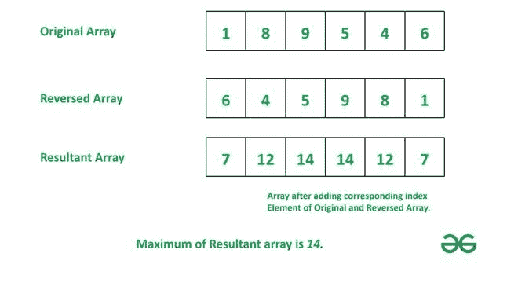

# 最大化给定数组及其反向数组对应索引处的元素和

> 原文:[https://www . geeksforgeeks . org/给定数组及其反转数组的最大对应元素和/](https://www.geeksforgeeks.org/maximize-sum-of-elements-at-corresponding-indices-of-given-array-and-its-reversed-array/)

给定一个包含 **N** 个整数的[数组](https://www.geeksforgeeks.org/introduction-to-arrays/)**arr【】**，任务是找到通过将原始数组和反向数组的相同索引处的元素相加而获得的最大和。

**示例:**

> ***输入*** **:** arr[]={ 1，8，9，5，4，6 }
> ***输出*** **:** 14
> **解释:**
> 原始数组:{ 1，8，9，5，4，6}
> 反向数组:{6，4，5，9，8，1}
> 添加对应的索引元素:
> { 1+6 }
> 
> ***输入:*** arr[]={-31，5，-1，7，-5}
> ***输出:*** 12

**天真的做法:**创建一个[反转数组](https://www.geeksforgeeks.org/reverse-an-array-in-java/)并在添加相应的索引元素后返回最大和。



**相加对应的反数组元素后的最大和**

下面是上述方法的实现

## C++

```
// C++ program for the above approach

#include <bits/stdc++.h>
using namespace std;

// Function  to find the maximum
// sum obtained by adding the
// elements at the same index of
// the original array and of
// the reversed array
int maximumSum(int arr[], int n)
{
    int c = 0;

    // Creating reversed array
    int reversed[n];

    for (int i = n - 1; i >= 0; i--)
        reversed = arr[i];

    int res = INT_MIN;

    // Adding corresponding
    // indexes of original
    // and reversed array
    for (int i = 0; i < n; i++) {
        res = std::max(res,
                       arr[i] + reversed[i]);
    }
    return res;
}

// Driver Code
int main()
{
    int arr[] = { 1, 8, 9, 5, 4, 6 };
    int n = sizeof(arr) / sizeof(arr[0]);

    cout << maximumSum(arr, n);
    return 0;
}
```

## Java 语言(一种计算机语言，尤用于创建网站)

```
/*package whatever //do not write package name here */
import java.io.*;

class GFG {

    // Function  to find the maximum
    // sum obtained by adding the
    // elements at the same index of
    // the original array and of
    // the reversed array
    static int maximumSum(int[] arr, int n)
    {
        int c = 0;

        // Creating reversed array
        int[] reversed = new int[n];

        for (int i = n - 1; i >= 0; i--)
            reversed = arr[i];

        int res = Integer.MIN_VALUE;

        // Adding corresponding
        // indexes of original
        // and reversed array
        for (int i = 0; i < n; i++) {
            res = Math.max(res, arr[i] + reversed[i]);
        }
        return res;
    }

    // Driver Code
    public static void main(String[] args)
    {
        int arr[] = { 1, 8, 9, 5, 4, 6 };
        int n = arr.length;
        System.out.println(maximumSum(arr, n));
    }
}

// This code is contributed by maddler.
```

## 蟒蛇 3

```
# Python 3 program for the above approach
import sys

# Function  to find the maximum
# sum obtained by adding the
# elements at the same index of
# the original array and of
# the reversed array
def maximumSum(arr, n):
    c = 0

    # Creating reversed array
    reversed = [0]*n

    for i in range(n - 1, -1, -1):
        reversed = arr[i]
        c += 1

    res = -sys.maxsize - 1

    # Adding corresponding
    # indexes of original
    # and reversed array
    for i in range(n):
        res = max(res,
                  arr[i] + reversed[i])

    return res

# Driver Code
if __name__ == "__main__":

    arr = [1, 8, 9, 5, 4, 6]
    n = len(arr)

    print(maximumSum(arr, n))

    # This code is contributed by ukasp.
```

## C#

```
/*package whatever //do not write package name here */

using System;
public class GFG {

    // Function to find the maximum
    // sum obtained by adding the
    // elements at the same index of
    // the original array and of
    // the reversed array
    static int maximumSum(int[] arr, int n) {
        int c = 0;

        // Creating reversed array
        int[] reversed = new int[n];

        for (int i = n - 1; i >= 0; i--)
            reversed = arr[i];

        int res = int.MinValue;

        // Adding corresponding
        // indexes of original
        // and reversed array
        for (int i = 0; i < n; i++) {
            res = Math.Max(res, arr[i] + reversed[i]);
        }
        return res;
    }

    // Driver Code
    public static void Main(String[] args) {
        int []arr = { 1, 8, 9, 5, 4, 6 };
        int n = arr.Length;
        Console.WriteLine(maximumSum(arr, n));
    }
}

// This code is contributed by gauravrajput1
```

## java 描述语言

```
<script>
// Function  to find the maximum
// sum obtained by adding the
// elements at the same index of
// the original array and of
// the reversed array
function maximumSum(arr, n) {
  let c = 0;

  // Creating reversed array
  let reversed = new Array(n);

  for (let i = n - 1; i >= 0; i--)
    reversed = arr[i];

  let res = Number.MIN_SAFE_INTEGER;

  // Adding corresponding
  // indexes of original
  // and reversed array
  for (let i = 0; i < n; i++) {
    res = Math.max(res, arr[i] + reversed[i]);
  }
  return res;
}

// Driver Code
let arr = [1, 8, 9, 5, 4, 6];
let n = arr.length;
document.write(maximumSum(arr, n));

// This code is contributed by saurabh_jaiswal.
</script>
```

**Output:** 

```
14
```

**时间复杂度:**O(N)
T3】辅助空间: O(N)

**有效途径:**这个问题可以使用[双指针算法](https://www.geeksforgeeks.org/two-pointers-technique/)来解决。因此，请按照以下步骤找到答案:

1.  创建指向数组中第一个元素的前指针和指向最后一个元素的后指针。
2.  现在运行一个循环，直到这两个指针相互交叉。在每次迭代中:
    *   添加前后指针指向的元素。这是原始数组和反转数组中相应元素的总和。
    *   前指针增加 1，后指针减少 1。
3.  循环结束后，返回得到的最大和。

下面是上述方法的实现

## C++

```
// C++ program for the above approach

#include <bits/stdc++.h>
using namespace std;

// Function  to find the maximum
// sum obtained by adding the
// elements at the same index of
// the original array and of
// the reversed array
int maximumSum(int arr[], int n)
{
    // Creating i as front pointer
    // and j as rear pointer
    int i = 0, j = n - 1;

    int max = INT_MIN;

    while (i <= j) {
        if (max < arr[i] + arr[j])
            max = arr[i] + arr[j];
        i++;
        j--;
    }

    // Returning the maximum value
    return max;
}

// Driver Code
int main()
{
    int arr[] = { 1, 8, 9, 5, 4, 6 };
    int n = sizeof(arr) / sizeof(arr[0]);

    cout << maximumSum(arr, n);
    return 0;
}
```

## Java 语言(一种计算机语言，尤用于创建网站)

```
// Java program for the above approach
import java.util.*;

public class GFG {

// Function  to find the maximum
// sum obtained by adding the
// elements at the same index of
// the original array and of
// the reversed array
static int maximumSum(int []arr, int n)
{

    // Creating i as front pointer
    // and j as rear pointer
    int i = 0, j = n - 1;

    int max = Integer.MIN_VALUE;

    while (i <= j) {
        if (max < arr[i] + arr[j])
            max = arr[i] + arr[j];
        i++;
        j--;
    }

    // Returning the maximum value
    return max;
}

// Driver Code
public static void main(String args[])
{
    int []arr = { 1, 8, 9, 5, 4, 6 };
    int n = arr.length;

    System.out.println(maximumSum(arr, n));
}
}

// This code is contributed by Samim Hossain Mondal.
```

## 蟒蛇 3

```
# python program for the above approach
INT_MIN = -2147483647 - 1

# Function to find the maximum
# sum obtained by adding the
# elements at the same index of
# the original array and of
# the reversed array
def maximumSum(arr, n):

        # Creating i as front pointer
        # and j as rear pointer
    i = 0
    j = n - 1

    max = INT_MIN

    while (i <= j):
        if (max < arr[i] + arr[j]):
            max = arr[i] + arr[j]

        i += 1
        j -= 1

        # Returning the maximum value
    return max

# Driver Code
if __name__ == "__main__":

    arr = [1, 8, 9, 5, 4, 6]
    n = len(arr)

    print(maximumSum(arr, n))

    # This code is contributed by rakeshsahni
```

## C#

```
// C# program for the above approach
using System;

class GFG
{

// Function  to find the maximum
// sum obtained by adding the
// elements at the same index of
// the original array and of
// the reversed array
static int maximumSum(int []arr, int n)
{

    // Creating i as front pointer
    // and j as rear pointer
    int i = 0, j = n - 1;

    int max = Int32.MinValue;

    while (i <= j) {
        if (max < arr[i] + arr[j])
            max = arr[i] + arr[j];
        i++;
        j--;
    }

    // Returning the maximum value
    return max;
}

// Driver Code
public static void Main()
{
    int []arr = { 1, 8, 9, 5, 4, 6 };
    int n = arr.Length;

    Console.Write(maximumSum(arr, n));
}
}

// This code is contributed by Samim Hossain Mondal.
```

## java 描述语言

```
<script>
// Javascript program for the above approach

// Function  to find the maximum
// sum obtained by adding the
// elements at the same index of
// the original array and of
// the reversed array
function maximumSum(arr, n)
{
    // Creating i as front pointer
    // and j as rear pointer
    let i = 0, j = n - 1;

    let max = Number.MIN_SAFE_INTEGER;

    while (i <= j) {
        if (max < arr[i] + arr[j])
            max = arr[i] + arr[j];
        i++;
        j--;
    }

    // Returning the maximum value
    return max;
}

// Driver Code
let arr = [ 1, 8, 9, 5, 4, 6 ];
let n = arr.length;

document.write(maximumSum(arr, n));

// This code is contributed by Samim Hossain Mondal.
</script>
```

**Output:** 

```
14
```

**时间复杂度:**O(N)
T3】辅助空间: O(1)。