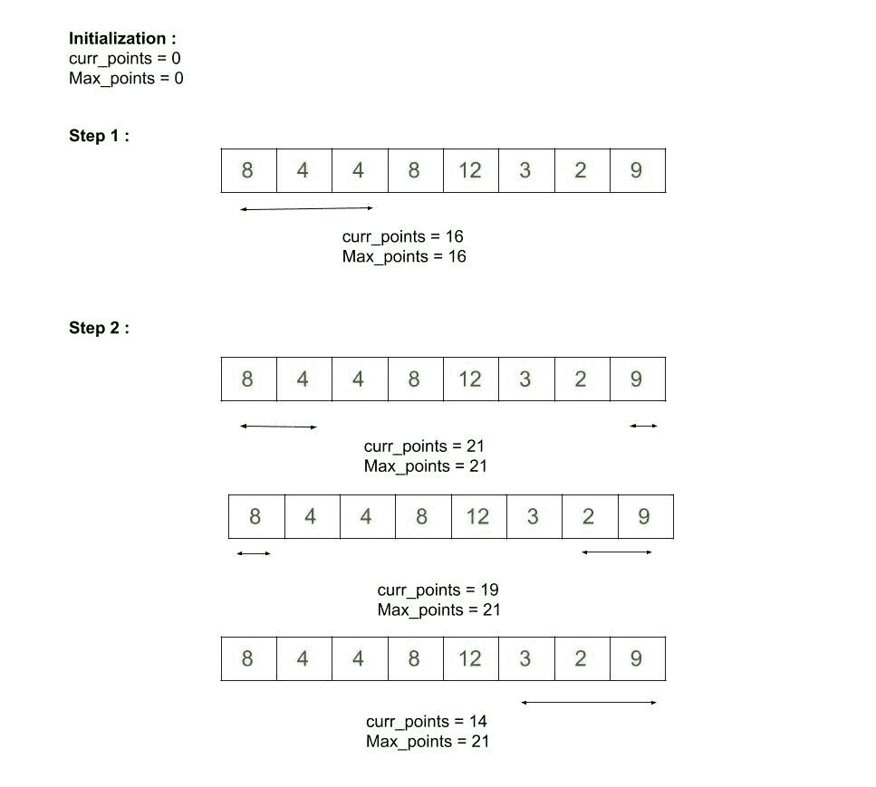

# 最大化数组中 K 个角元素的和

> 原文:[https://www . geeksforgeeks . org/通过仅取角元素来最大化数组中 k 个元素的总和/](https://www.geeksforgeeks.org/maximize-sum-of-k-elements-in-array-by-taking-only-corner-elements/)

给定一个**数组 arr[]** 和**一个整数 K** ，任务是通过只取角元素来找到数组中 K 个元素的最大和。

> 一个**角元素**是一个从数组开始或者从数组结束的元素。

**示例:**

> **输入:** arr[] = {8，4，4，8，12，3，2，9}，K = 3
> **输出:** 21
> **解释:**
> 最优策略是从数组 is 中挑选元素，从开头开始两个索引，从结尾开始一个索引。所有其他可能的选择将产生较少的总和。因此，arr[0] + arr[1] + arr[7] = 21。
> 
> **输入:** arr[] = {2，1，14，6，4，3}，K = 3
> **输出:** 17
> **解释:**
> 我们将通过从数组中选取前三个元素来获得最大和。因此，最佳选择是:arr[0] + arr[1] + arr[2] = 17

**天真方法:**想法是使用[递归](https://www.geeksforgeeks.org/recursion/)。因为我们只能取一个开始或结束的索引值，因此初始化两个变量，精确地采取 K 步，并返回所有可能组合中的最大和。递归方法由于其[重叠子问题](https://www.geeksforgeeks.org/overlapping-subproblems-property-in-dynamic-programming-dp-1/)和[最优子结构属性](https://www.geeksforgeeks.org/optimal-substructure-property-in-dynamic-programming-dp-2/)而具有指数复杂性。

下面是上述方法的实现:

## C++

```
// C++ program to maximize the sum of K elements
// in the array by taking only corner elements

#include <bits/stdc++.h>
using namespace std;

// Function to return maximum sum
int maxSum(int arr[], int K,
           int start, int end,
           int max_sum)
{
    // Base case
    if (K == 0)
        return max_sum;

    // Pick the start index
    int max_sum_start = max_sum
                        + arr[start];

    // Pick the end index
    int max_sum_end = max_sum + arr[end];

    // Recursive function call
    int ans = max(
        maxSum(arr, K - 1, start + 1,
               end, max_sum_start),
        maxSum(arr, K - 1, start,
               end - 1, max_sum_end));

    // Return the final answer
    return ans;
}

// Function to find the maximized sum
void maximizeSum(int arr[], int K, int n)
{
    int max_sum = 0;
    int start = 0;
    int end = n - 1;

    cout << maxSum(arr, K, start,
                   end, max_sum);
}

// Driver code
int main()
{
    int arr[] = { 8, 4, 4, 8, 12, 3, 2, 9 };
    int K = 3;
    int n = sizeof(arr) / sizeof(arr[0]);

    maximizeSum(arr, K, n);

    return 0;
}
```

## Java 语言(一种计算机语言，尤用于创建网站)

```
// Java program to maximize the sum of K elements
// in the array by taking only corner elements
import java.util.*;

class GFG{

// Function to return maximum sum
static int maxSum(int arr[], int K,
                  int start, int end,
                  int max_sum)
{
    // Base case
    if (K == 0)
        return max_sum;

    // Pick the start index
    int max_sum_start = max_sum + arr[start];

    // Pick the end index
    int max_sum_end = max_sum + arr[end];

    // Recursive function call
    int ans = Math.max(maxSum(arr, K - 1, start + 1,
                              end, max_sum_start),
                       maxSum(arr, K - 1, start,
                              end - 1, max_sum_end));

    // Return the final answer
    return ans;
}

// Function to find the maximized sum
static void maximizeSum(int arr[], int K, int n)
{
    int max_sum = 0;
    int start = 0;
    int end = n - 1;
    System.out.print(maxSum(arr, K, start,
                            end, max_sum));
}

// Driver code
public static void main(String[] args)
{
    int arr[] = { 8, 4, 4, 8, 12, 3, 2, 9 };
    int K = 3;
    int n = arr.length;
    maximizeSum(arr, K, n);
}
}

// This code is contributed by gauravrajput1
```

## 蟒蛇 3

```
# Python3 program to maximize the sum of K elements
# in the array by taking only corner elements

# Function to return maximum sum
def maxSum(arr, K, start, end, max_sum):

    # Base case
    if (K == 0):
        return max_sum

    # Pick the start index
    max_sum_start = max_sum + arr[start]

    # Pick the end index
    max_sum_end = max_sum + arr[end]

    # Recursive function call
    ans = max(maxSum(arr,  K - 1, start + 1,
                     end, max_sum_start),
          maxSum(arr, K - 1, start,
                     end - 1, max_sum_end))

    # Return the final answer
    return ans

# Function to find the maximized sum
def maximizeSum(arr, K, n):
    max_sum = 0
    start = 0
    end = n - 1

    print(maxSum(arr, K, start, end, max_sum))

# Driver code
if __name__ == '__main__':

    arr = [8, 4, 4, 8, 12, 3, 2, 9]
    K = 3
    n = len(arr)

    maximizeSum(arr, K, n)

# This code is contributed by Bhupendra_Singh
```

## C#

```
// C# program to maximize the sum of K elements
// in the array by taking only corner elements
using System;

 class GFG{

// Function to return maximum sum
static int maxSum(int []arr, int K,
                  int start, int end,
                  int max_sum)
{
    // Base case
    if (K == 0)
        return max_sum;

    // Pick the start index
    int max_sum_start = max_sum + arr[start];

    // Pick the end index
    int max_sum_end = max_sum + arr[end];

    // Recursive function call
    int ans = Math.Max(maxSum(arr, K - 1, start + 1,
                              end, max_sum_start),
                       maxSum(arr, K - 1, start,
                              end - 1, max_sum_end));

    // Return the readonly answer
    return ans;
}

// Function to find the maximized sum
static void maximizeSum(int []arr, int K, int n)
{
    int max_sum = 0;
    int start = 0;
    int end = n - 1;
    Console.Write(maxSum(arr, K, start,
                         end, max_sum));
}

// Driver code
public static void Main(String[] args)
{
    int []arr = { 8, 4, 4, 8, 12, 3, 2, 9 };
    int K = 3;
    int n = arr.Length;

    maximizeSum(arr, K, n);
}
}

// This code is contributed by sapnasingh4991
```

## java 描述语言

```
<script>

// Javascript program to maximize the sum of K elements
// in the array by taking only corner elements

// Function to return maximum sum
function maxSum(arr, K,
                  start, end,
                  max_sum)
{
    // Base case
    if (K == 0)
        return max_sum;

    // Pick the start index
    let max_sum_start = max_sum + arr[start];

    // Pick the end index
    let max_sum_end = max_sum + arr[end];

    // Recursive function call
    let ans = Math.max(maxSum(arr, K - 1, start + 1,
                              end, max_sum_start),
                       maxSum(arr, K - 1, start,
                              end - 1, max_sum_end));

    // Return the final answer
    return ans;
}

// Function to find the maximized sum
function maximizeSum(arr, K, n)
{
    let max_sum = 0;
    let start = 0;
    let end = n - 1;
    document.write(maxSum(arr, K, start,
                            end, max_sum));
}
// Driver Code

    let arr = [ 8, 4, 4, 8, 12, 3, 2, 9 ];
    let K = 3;
    let n = arr.length;
    maximizeSum(arr, K, n);

</script>
```

**Output:** 

```
21
```

时间复杂度:0(N)

辅助空间:O(N)

**高效方法:**为了更高效地解决问题，我们将实施[滑动窗口](https://www.geeksforgeeks.org/window-sliding-technique/)概念。

*   用 0、 *curr_points* 和 *max_points* 初始化两个整数，分别表示当前点和最大点。
*   现在，从头开始逐个迭代 K 个元素，形成大小为 K 的窗口，同时通过 *curr_points + arr[i]* 和 *max_points* 更新 *curr_points* 的值，值为 *curr_points* 。
*   之后，在每一步中，从数组的末尾取出一个元素，并从先前选择的窗口中移除最右边的元素，在该窗口中，窗口大小始终保持为 k。相应地更新 *curr_points* 和 max_points 的值。最后，我们从数组的末尾得到 K 个元素，max_points 包含需要返回的结果。

让我们看下面的图片来更好地理解它:

[](https://media.geeksforgeeks.org/wp-content/uploads/20200503005223/Sliding-window-approach-to-find-maximum-points.jpg)

**以下是上述方法的实现:**

## C++

```
// C++ program to maximize the sum of K elements
// in the array by taking only corner elements

#include <bits/stdc++.h>
using namespace std;

// Function to return maximum sum
int maxPointCount(int arr[], int K, int size)
{
    // Initialize variables
    int curr_points = 0;
    int max_points = 0;

    // Iterate over first K elements of array
    // and update the value for curr_points
    for (int i = 0; i < K; i++)
        curr_points += arr[i];

    // Update value for max_points
    max_points = curr_points;

    // j points to the end of the array
    int j = size - 1;

    for (int i = K - 1; i >= 0; i--) {

        curr_points = curr_points
                      + arr[j] - arr[i];
        max_points = max(curr_points,
                         max_points);
        j--;
    }

    // Return the final result
    return max_points;
}

// Driver code
int main()
{
    int arr[] = { 8, 4, 4, 8, 12, 3, 2, 9 };
    int K = 3;
    int n = sizeof(arr) / sizeof(arr[0]);

    cout << maxPointCount(arr, K, n);

    return 0;
}
```

## Java 语言(一种计算机语言，尤用于创建网站)

```
// Java program to maximize the sum
// of K elements in the array by
// taking only corner elements
import java.util.Scanner;
import java.util.Arrays;

class GFG{

// Function to return maximum sum
public static int maxPointCount(int arr[],
                                int K,
                                int size)
{

    // Initialize variables
    int curr_points = 0;
    int max_points = 0;

    // Iterate over first K elements
    // of array and update the value
    // for curr_points
    for(int i = 0; i < K; i++)
        curr_points += arr[i];

    // Update value for max_points
    max_points = curr_points;

    // j points to the end of the array
    int j = size - 1;

    for(int i = K - 1; i >= 0; i--)
    {
        curr_points = curr_points +
                      arr[j] - arr[i];
        max_points = Math.max(curr_points,
                              max_points);
        j--;
    }

    // Return the final result
    return max_points;
}

// Driver code
public static void main(String args[])
{
    int []arr = { 8, 4, 4, 8, 12, 3, 2, 9 };
    int K = 3;
    int n = arr.length;

    System.out.print( maxPointCount(arr, K, n));
}
}

// This code is contributed by SoumikMondal
```

## 蟒蛇 3

```
# Python3 program to maximize the sum
# of K elements in the array by taking
# only corner elements

# Function to return maximum sum
def maxPointCount(arr, K, size):

    # Initialize variables
    curr_points = 0
    max_points = 0

    # Iterate over first K elements
    # of array and update the value
    # for curr_points
    for i in range(K):
        curr_points += arr[i]

    # Update value for max_points
    max_points = curr_points

    # j points to the end of the array
    j = size - 1

    for i in range(K - 1, -1, -1):
        curr_points = (curr_points +
                       arr[j] - arr[i])
        max_points = max(curr_points,
                         max_points)
        j -= 1

    # Return the final result
    return max_points

# Driver code
if __name__ == "__main__":

    arr = [ 8, 4, 4, 8, 12, 3, 2, 9 ]
    K = 3
    n = len(arr)

    print(maxPointCount(arr, K, n))

# This code is contributed by chitranayal
```

## C#

```
// C# program to maximize the sum
// of K elements in the array by
// taking only corner elements
using System;
class GFG{

// Function to return maximum sum
public static int maxPointCount(int []arr,
                                int K,
                                int size)
{

    // Initialize variables
    int curr_points = 0;
    int max_points = 0;

    // Iterate over first K elements
    // of array and update the value
    // for curr_points
    for(int i = 0; i < K; i++)
        curr_points += arr[i];

    // Update value for max_points
    max_points = curr_points;

    // j points to the end of the array
    int j = size - 1;

    for(int i = K - 1; i >= 0; i--)
    {
        curr_points = curr_points +
                      arr[j] - arr[i];
        max_points = Math.Max(curr_points,
                              max_points);
        j--;
    }

    // Return the readonly result
    return max_points;
}

// Driver code
public static void Main(String []args)
{
    int []arr = { 8, 4, 4, 8, 12, 3, 2, 9 };
    int K = 3;
    int n = arr.Length;

    Console.Write( maxPointCount(arr, K, n));
}
}

// This code is contributed by sapnasingh4991
```

## java 描述语言

```
<script>

// JavaScript program to maximize the sum
// of K elements in the array by
// taking only corner elements

// Function to return maximum sum
function maxPointCount(arr,k,size)
{
    // Initialize variables
    let curr_points = 0;
    let max_points = 0;

    // Iterate over first K elements
    // of array and update the value
    // for curr_points
    for(let i = 0; i < K; i++)
        curr_points += arr[i];

    // Update value for max_points
    max_points = curr_points;

    // j points to the end of the array
    let j = size - 1;

    for(let i = K - 1; i >= 0; i--)
    {
        curr_points = curr_points +
                      arr[j] - arr[i];
        max_points = Math.max(curr_points,
                              max_points);
        j--;
    }

    // Return the final result
    return max_points;
}

// Driver code
let arr=[8, 4, 4, 8, 12, 3, 2, 9];
let K = 3;
let n = arr.length;
document.write( maxPointCount(arr, K, n));

// This code is contributed by avanitrachhadiya2155

</script>
```

**Output**

```
21
```

***时间复杂度:** O(N)* ，其中 N 是数组的大小。
***辅助空间复杂度:** O(1)* 。