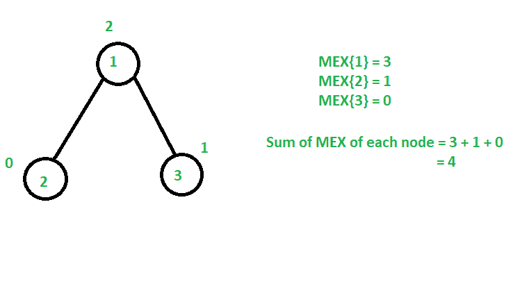
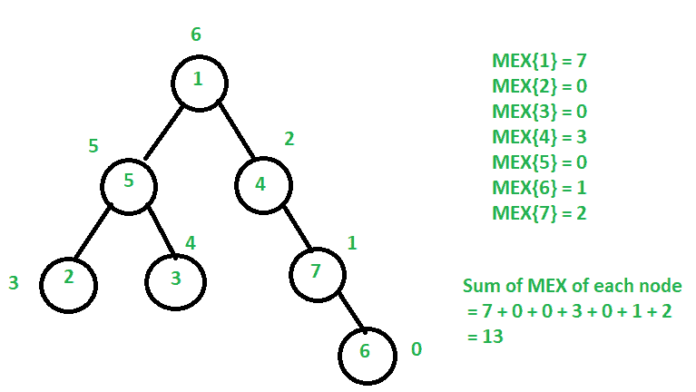

# 最大化 N 元树中每个节点的 MEX 值之和

> 原文:[https://www . geesforgeks . org/最大化 n 元树中每个节点的 mex 值总和/](https://www.geeksforgeeks.org/maximize-sum-of-mex-values-of-each-node-in-an-n-ary-tree/)

给定以 **1** 为根的 [N 元树](https://www.geeksforgeeks.org/generic-treesn-array-trees/) ，任务是以任意顺序将范围**【0，N–1】**中的值分配给每个节点，使得树中每个节点的 MEX 值之和最大化，并打印树中每个节点的最大可能 MEX 值之和**。**

> **节点 **V** 的 **MEX** 值定义为扎根于**节点 V** 的树中**最小缺失正数**。**

****示例:****

> ****输入:** N = 3，边[] = {{1，2}，{1，3 } }
> T3】输出:4
> T6】解释:**
> 
>  **[](https://media.geeksforgeeks.org/wp-content/uploads/20201102163924/treeMEX.png)
> 
> 为节点 2 赋值 0，为节点 3 赋值 1，为节点 1 赋值 2。
> 因此，所有节点的 MEX 的最大和= MEX{1} + MEX{2} + MEX{3} = 3 + 1 + 0 = 4。
> 
> **输入:** N = 7，边[] = {1，5}、{1，4}、{5，2}、{5，3}、{4，7}、{7，6}}
> **输出:** 13
> **解释:**
> 
> [](https://media.geeksforgeeks.org/wp-content/uploads/20201102165258/treeMEX.png)
> 
> 给节点 6 赋值 0，给节点 7 赋值 1，给节点 4 赋值 2，给节点 1 赋值 6，给节点 5 赋值 5，给节点 2 赋值 3，给节点 3 赋值 4。
> 因此，所有节点的 MEX 的最大和= MEX { 1 }+MEX { 2 }+MEX { 3 }+MEX { 4 }+MEX { 5 }+MEX { 6 }+MEX { 7 } = 7+0+0+3+0+1+0 = 13。**

****方法:**想法是对给定的 N 元树执行 [DFS 遍历，并为树中的每个](https://www.geeksforgeeks.org/dfs-n-ary-tree-acyclic-graph-represented-adjacency-list/)[子树](https://www.geeksforgeeks.org/sub-tree-nodes-tree-using-dfs/)找到 **MEX** 的和。按照以下步骤解决问题:**

*   **对以**节点 1** 为根的树执行[深度优先搜索(DFS)。](https://www.geeksforgeeks.org/dfs-traversal-of-a-tree-using-recursion/)**
*   **用 **0** 初始化变量 **mex** ，用 **1** 初始化变量 **size** 。**
*   **遍历当前**节点**的所有子节点，并执行以下操作:

    *   递归调用当前**节点**的子节点，并将所有子树中 MEX 的最大和存储在 **mex** 中。
    *   增加以当前**节点**为根的树的大小。** 
*   **按大小增加 **mex** 的值。**
*   **完成以上步骤后，打印 **mex** 的值作为答案。**

**下面是上述方法的实现:**

## **C++**

```
// C++ program for the above approach
#include <bits/stdc++.h>
using namespace std;

// Function to create an N-ary Tree
void makeTree(vector<int> tree[],
              pair<int, int> edges[],
              int N)
{
    // Traverse the edges
    for (int i = 0; i < N - 1; i++) {

        int u = edges[i].first;
        int v = edges[i].second;

        // Add edges
        tree[u].push_back(v);
    }
}

// Function to get the maximum sum
// of MEX values of tree rooted at 1
pair<int, int> dfs(int node,
                   vector<int> tree[])
{
    // Initialize mex
    int mex = 0;

    int size = 1;

    // Iterate through all children
    // of node
    for (int u : tree[node]) {

        // Recursively find maximum sum
        // of MEX values of each node
        // in tree rooted at u
        pair<int, int> temp = dfs(u, tree);

        // Store the maximum sum of MEX
        // of among all subtrees
        mex = max(mex, temp.first);

        // Increase the size of tree
        // rooted at current node
        size += temp.second;
    }

    // Resulting MEX for the current
    // node of the recursive call
    return { mex + size, size };
}

// Driver Code
int main()
{
    // Given N nodes
    int N = 7;

    // Given N-1 edges
    pair<int, int> edges[]
        = { { 1, 4 }, { 1, 5 }, { 5, 2 }, { 5, 3 }, { 4, 7 }, { 7, 6 } };

    // Stores the tree
    vector<int> tree[N + 1];

    // Generates the tree
    makeTree(tree, edges, N);

    // Returns maximum sum of MEX
    // values of each node
    cout << dfs(1, tree).first;

    return 0;
}
```

## **Java 语言(一种计算机语言，尤用于创建网站)**

```
// Java program for the above approach
import java.util.*;

class GFG{

static class pair
{
    int first, second;

    public pair(int first, int second)
    {
        this.first = first;
        this.second = second;
    }
}

// Function to create an N-ary Tree
static void makeTree(Vector<Integer> tree[],
                     pair edges[], int N)
{

    // Traverse the edges
    for(int i = 0; i < N - 1; i++)
    {
        int u = edges[i].first;
        int v = edges[i].second;

        // Add edges
        tree[u].add(v);
    }
}

// Function to get the maximum sum
// of MEX values of tree rooted at 1
static pair dfs(int node, Vector<Integer> tree[])
{

    // Initialize mex
    int mex = 0;

    int size = 1;

    // Iterate through all children
    // of node
    for(int u : tree[node])
    {

        // Recursively find maximum sum
        // of MEX values of each node
        // in tree rooted at u
        pair temp = dfs(u, tree);

        // Store the maximum sum of MEX
        // of among all subtrees
        mex = Math.max(mex, temp.first);

        // Increase the size of tree
        // rooted at current node
        size += temp.second;
    }

    // Resulting MEX for the current
    // node of the recursive call
    return new pair(mex + size, size);
}

// Driver Code
public static void main(String[] args)
{

    // Given N nodes
    int N = 7;

    // Given N-1 edges
    pair edges[] = { new pair(1, 4),
                     new pair(1, 5),
                     new pair(5, 2),
                     new pair(5, 3),
                     new pair(4, 7),
                     new pair(7, 6) };

    // Stores the tree
    @SuppressWarnings("unchecked")
    Vector<Integer>[] tree = new Vector[N + 1];
    for(int i = 0; i < tree.length; i++)
        tree[i] = new Vector<Integer>();

    // Generates the tree
    makeTree(tree, edges, N);

    // Returns maximum sum of MEX
    // values of each node
    System.out.print((dfs(1, tree).first));
}
}

// This code is contributed by Princi Singh
```

## **蟒蛇 3**

```
# Python3 program for the above approach

# Function to create an N-ary Tree
def makeTree(tree, edges, N):

    # Traverse the edges
    for i in range(N - 1):
        u = edges[i][0]
        v = edges[i][1]

        # Add edges
        tree[u].append(v)

    return tree

# Function to get the maximum sum
# of MEX values of tree rooted at 1
def dfs(node, tree):

    # Initialize mex
    mex = 0

    size = 1

    # Iterate through all children
    # of node
    for u in tree[node]:

        # Recursively find maximum sum
        # of MEX values of each node
        # in tree rooted at u
        temp = dfs(u, tree)

        # Store the maximum sum of MEX
        # of among all subtrees
        mex = max(mex, temp[0])

        # Increase the size of tree
        # rooted at current node
        size += temp[1]

    # Resulting MEX for the current
    # node of the recursive call
    return [mex + size, size]

# Driver Code
if __name__ == '__main__':

    # Given N nodes
    N = 7

    # Given N-1 edges
    edges = [ [ 1, 4 ], [ 1, 5 ],
              [ 5, 2 ], [ 5, 3 ],
              [ 4, 7 ], [ 7, 6 ] ]

    # Stores the tree
    tree = [[] for i in range(N + 1)]

    # Generates the tree
    tree = makeTree(tree, edges, N)

    # Returns maximum sum of MEX
    # values of each node
    print(dfs(1, tree)[0])

# This code is contributed by mohit kumar 29
```

## **C#**

```
// C# program for the above approach
using System;
using System.Collections.Generic;

class GFG{

public class pair
{
    public int first, second;

    public pair(int first, int second)
    {
        this.first = first;
        this.second = second;
    }
}

// Function to create an N-ary Tree
static void makeTree(List<int> []tree,
                     pair []edges, int N)
{

    // Traverse the edges
    for(int i = 0; i < N - 1; i++)
    {
        int u = edges[i].first;
        int v = edges[i].second;

        // Add edges
        tree[u].Add(v);
    }
}

// Function to get the maximum sum
// of MEX values of tree rooted at 1
static pair dfs(int node, List<int> []tree)
{

    // Initialize mex
    int mex = 0;

    int size = 1;

    // Iterate through all children
    // of node
    foreach(int u in tree[node])
    {

        // Recursively find maximum sum
        // of MEX values of each node
        // in tree rooted at u
        pair temp = dfs(u, tree);

        // Store the maximum sum of MEX
        // of among all subtrees
        mex = Math.Max(mex, temp.first);

        // Increase the size of tree
        // rooted at current node
        size += temp.second;
    }

    // Resulting MEX for the current
    // node of the recursive call
    return new pair(mex + size, size);
}

// Driver Code
public static void Main(String[] args)
{

    // Given N nodes
    int N = 7;

    // Given N-1 edges
    pair []edges = { new pair(1, 4),
                     new pair(1, 5),
                     new pair(5, 2),
                     new pair(5, 3),
                     new pair(4, 7),
                     new pair(7, 6) };

    // Stores the tree
    List<int>[] tree = new List<int>[N + 1];
    for(int i = 0; i < tree.Length; i++)
        tree[i] = new List<int>();

    // Generates the tree
    makeTree(tree, edges, N);

    // Returns maximum sum of MEX
    // values of each node
    Console.Write((dfs(1, tree).first));
}
}

// This code is contributed by Amit Katiyar
```

## **java 描述语言**

```
<script>

// JavaScript program for the above approach

// Function to create an N-ary Tree
function makeTree(tree, edges, N)
{
    // Traverse the edges
    for (var i = 0; i < N - 1; i++) {

        var u = edges[i][0];
        var v = edges[i][1];

        // Add edges
        tree[u].push(v);
    }
}

// Function to get the maximum sum
// of MEX values of tree rooted at 1
function dfs(node, tree)
{
    // Initialize mex
    var mex = 0;

    var size = 1;

    // Iterate through all children
    // of node
    tree[node].forEach(u => {

        // Recursively find maximum sum
        // of MEX values of each node
        // in tree rooted at u
        var temp = dfs(u, tree);

        // Store the maximum sum of MEX
        // of among all subtrees
        mex = Math.max(mex, temp[0]);

        // Increase the size of tree
        // rooted at current node
        size += temp[1];
    });

    // Resulting MEX for the current
    // node of the recursive call
    return [mex + size, size ];
}

// Driver Code

// Given N nodes
var N = 7;

// Given N-1 edges
var edges = [ [ 1, 4 ], [ 1, 5 ], [ 5, 2 ],
              [ 5, 3 ], [ 4, 7 ], [ 7, 6 ] ];

// Stores the tree
var tree = Array.from(Array(N+1), ()=> Array());

// Generates the tree
makeTree(tree, edges, N);

// Returns maximum sum of MEX
// values of each node
document.write( dfs(1, tree)[0]);

</script>
```

****Output:** 

```
13
```** 

*****时间复杂度:**O(N)*
T5**辅助空间:** O(1)**