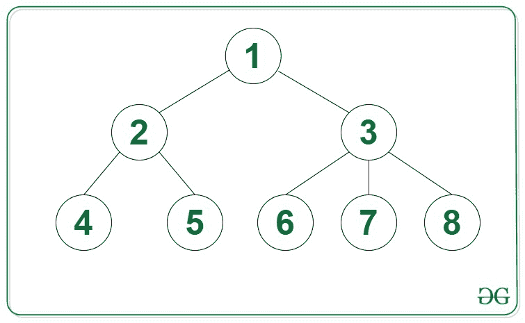

# 最大化 N 元树中从根到叶节点的路径总和

> 原文:[https://www . geeksforgeeks . org/最大化从根到树中叶节点的路径总和/](https://www.geeksforgeeks.org/maximize-sum-of-path-from-the-root-to-a-leaf-node-in-n-ary-tree/)

给定一个由 **N** 节点组成的[类属树](https://www.geeksforgeeks.org/generic-treesn-array-trees/)，任务是找到从根节点到叶节点的[路径的最大和。](https://www.geeksforgeeks.org/given-a-binary-tree-print-all-root-to-leaf-paths/)

**示例:**

> **输入:**
> 
> 
> 
> **输出:** 12
> **说明:**从根到每片叶子的路径和为:
> 对于节点 4: 1 - > 2 - > 4 = 7
> 对于节点 5: 1 - > 2 - > 5 = 8
> 对于节点 6: 1 - > 3 - > 6 = 10
> 对于节点 7: 1 - > 3 - > 7 = 11
> 
> 最大路径和是 12，即从根 1 到叶 8。

**方法:**给定的问题可以通过在给定的树上执行 [DFS 遍历来解决。其思想是通过跟踪每个路径中节点的值的总和来执行从给定类属树的根节点开始的 DFS 遍历，并且如果出现任何叶节点，则最大化在变量中获得的路径的当前总和的值，比如 **maxSum** 。](https://www.geeksforgeeks.org/dfs-traversal-of-a-tree-using-recursion/)

执行 [DFS 遍历](https://www.geeksforgeeks.org/depth-first-search-or-dfs-for-a-graph/)后，打印**最大和**的值作为结果最大和路径。

下面是上述方法的实现:

## C++

```
// C++ program for the above approach

#include <bits/stdc++.h>
using namespace std;

// Structure of a node in the tree
struct Node {
    int val;
    vector<Node*> child;
};

// Utility function to create a
// new node in the tree
Node* newNode(int key)
{
    Node* temp = new Node;
    temp->val = key;
    return temp;
}

// Recursive function to calculate the
// maximum sum in a path using DFS
void DFS(Node* root, int sum, int& ans)
{
    // If current node is a leaf node
    if (root->child.size() == 0) {
        ans = max(ans, sum);
        return;
    }

    // Traversing all children of
    // the current node
    for (int i = 0;
         i < root->child.size(); i++) {

        // Recursive call for all
        // the children nodes
        DFS(root->child[i],
            sum + root->child[i]->val, ans);
    }
}

// Driver Code
int main()
{
    // Given Generic Tree
    Node* root = newNode(1);
    (root->child).push_back(newNode(2));
    (root->child).push_back(newNode(3));
    (root->child[0]->child).push_back(newNode(4));
    (root->child[1]->child).push_back(newNode(6));
    (root->child[0]->child).push_back(newNode(5));
    (root->child[1])->child.push_back(newNode(7));
    (root->child[1]->child).push_back(newNode(8));

    // Stores the maximum sum of a path
    int maxSumPath = 0;

    // Function Call
    DFS(root, root->val, maxSumPath);

    cout << maxSumPath;

    return 0;
}
```

## Java 语言(一种计算机语言，尤用于创建网站)

```
// Java program for the above approach
import java.util.*;
public class Main
{

    // Stores the maximum sum of a path
    static int maxSumPath = 0;

    // Structure of a node in the tree
    static class Node {

        public int val;
        public Vector<Node> child;

        public Node(int key)
        {
            val = key;
            child = new Vector<Node>();
        }
    }

    // Utility function to create a
    // new node in the tree
    static Node newNode(int key)
    {
        Node temp = new Node(key);
        return temp;
    }

    // Recursive function to calculate the
    // maximum sum in a path using DFS
    static void DFS(Node root, int sum)
    {
        // If current node is a leaf node
        if (root.child.size() == 0) {
            maxSumPath = Math.max(maxSumPath, sum);
            return;
        }

        // Traversing all children of
        // the current node
        for (int i = 0; i < root.child.size(); i++) {

            // Recursive call for all
            // the children nodes
            DFS(root.child.get(i), sum + root.child.get(i).val);
        }
    }

    public static void main(String[] args) {
        // Given Generic Tree
        Node root = newNode(1);
        (root.child).add(newNode(2));
        (root.child).add(newNode(3));
        (root.child.get(0).child).add(newNode(4));
        (root.child.get(1).child).add(newNode(6));
        (root.child.get(0).child).add(newNode(5));
        (root.child.get(1)).child.add(newNode(7));
        (root.child.get(1).child).add(newNode(8));

        // Function Call
        DFS(root, root.val);

        System.out.print(maxSumPath);
    }
}

// This code is contributed by divyeshrabadiya07.
```

## 蟒蛇 3

```
# Python3 program for the above approach

# Stores the maximum sum of a path
maxSumPath = 0

# Structure of a node in the tree
class Node:
    def __init__(self, key):
        self.val = key
        self.child = []

# Utility function to create a
# new node in the tree
def newNode(key):
    temp = Node(key)
    return temp

# Recursive function to calculate the
# maximum sum in a path using DFS
def DFS(root, Sum):
    global maxSumPath
    # If current node is a leaf node
    if (len(root.child) == 0):
        maxSumPath = max(maxSumPath, Sum)
        return

    # Traversing all children of
    # the current node
    for i in range(len(root.child)):
        # Recursive call for all
        # the children nodes
        DFS(root.child[i], Sum + root.child[i].val)

# Given Generic Tree
root = newNode(1)
(root.child).append(newNode(2))
(root.child).append(newNode(3))
(root.child[0].child).append(newNode(4))
(root.child[1].child).append(newNode(6))
(root.child[0].child).append(newNode(5))
(root.child[1]).child.append(newNode(7))
(root.child[1].child).append(newNode(8))

# Function Call
DFS(root, root.val)

print(maxSumPath)

# This code is contributed by rameshtravel07.
```

## C#

```
// C# program for the above approach
using System;
using System.Collections;
using System.Collections.Generic;
class GFG {

    // Stores the maximum sum of a path
    static int maxSumPath = 0;

    // Structure of a node in the tree
    class Node {

        public int val;
        public List<Node> child;

        public Node(int key)
        {
            val = key;
            child = new List<Node>();
        }
    }

    // Utility function to create a
    // new node in the tree
    static Node newNode(int key)
    {
        Node temp = new Node(key);
        return temp;
    }

    // Recursive function to calculate the
    // maximum sum in a path using DFS
    static void DFS(Node root, int sum)
    {
        // If current node is a leaf node
        if (root.child.Count == 0) {
            maxSumPath = Math.Max(maxSumPath, sum);
            return;
        }

        // Traversing all children of
        // the current node
        for (int i = 0;
             i < root.child.Count; i++) {

            // Recursive call for all
            // the children nodes
            DFS(root.child[i],
                sum + root.child[i].val);
        }
    }

  static void Main() {
    // Given Generic Tree
    Node root = newNode(1);
    (root.child).Add(newNode(2));
    (root.child).Add(newNode(3));
    (root.child[0].child).Add(newNode(4));
    (root.child[1].child).Add(newNode(6));
    (root.child[0].child).Add(newNode(5));
    (root.child[1]).child.Add(newNode(7));
    (root.child[1].child).Add(newNode(8));

    // Function Call
    DFS(root, root.val);

    Console.Write(maxSumPath);
  }
}

// This code is contributed by mukesh07.
```

## java 描述语言

```
<script>
    // Javascript program for the above approach

    // Stores the maximum sum of a path
    let maxSumPath = 0;

    // Structure of a node in the tree
    class Node
    {
        constructor(key) {
           this.child = [];
           this.val = key;
        }
    }

    // Utility function to create a
    // new node in the tree
    function newNode(key)
    {
        let temp = new Node(key);
        return temp;
    }

    // Recursive function to calculate the
    // maximum sum in a path using DFS
    function DFS(root, sum)
    {
        // If current node is a leaf node
        if (root.child.length == 0) {
            maxSumPath = Math.max(maxSumPath, sum);
            return;
        }

        // Traversing all children of
        // the current node
        for (let i = 0; i < root.child.length; i++) {

            // Recursive call for all
            // the children nodes
            DFS(root.child[i],
                sum + root.child[i].val);
        }
    }

    // Given Generic Tree
    let root = newNode(1);
    (root.child).push(newNode(2));
    (root.child).push(newNode(3));
    (root.child[0].child).push(newNode(4));
    (root.child[1].child).push(newNode(6));
    (root.child[0].child).push(newNode(5));
    (root.child[1]).child.push(newNode(7));
    (root.child[1].child).push(newNode(8));

    // Function Call
    DFS(root, root.val);

    document.write(maxSumPath);

    // This code is contributed by decode2207.
</script>
```

**Output:** 

```
12
```

***时间复杂度:**O(N)*
T5**辅助空间:** O(1)