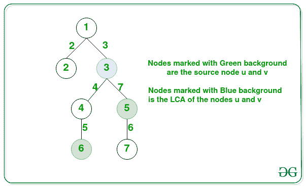

# 最大化从节点 u 和 v 的 LCA 到这些节点之一的路径总和

> 原文:[https://www . geeksforgeeks . org/最大化从节点的 lca 到这些节点之一的路径总和/](https://www.geeksforgeeks.org/maximize-sum-of-paths-from-lca-of-nodes-u-and-v-to-one-of-those-nodes/)

给定一个由 **N** 节点组成的[树和一个大小为**N–1**的](https://www.geeksforgeeks.org/generic-treesn-array-trees/)[数组](https://www.geeksforgeeks.org/introduction-to-arrays/) **边[]【3】**，使得对于**边[]** 中的每个 **{X，Y，W}** ，在节点 **X** 和节点 **Y** 之间存在一条边，权重为 **W** 和两个节点 **任务是找到从节点 **(u，v)** 的[最低共同祖先](https://www.geeksforgeeks.org/lowest-common-ancestor-binary-tree-set-1/) (LCA)到节点 **u** 和节点 **v** 的路径[边权重的最大和。](https://www.geeksforgeeks.org/maximum-weighted-edge-in-path-between-two-nodes-in-an-n-ary-tree-using-binary-lifting/)**

**示例:**

> **输入:** N = 7，边[][] = {{1，2，2}，{1，3，3}，{3，4，4}，{4，6，5}，{3，5，7}，{5，7，6}}，u = 6，v = 5
> **输出:** 9
> **解释:**
> 
> 
> 
> 从节点 3 到节点 5 的路径和是 7。
> 从节点 3 到节点 6 的路径和为 4 + 5 = 9。
> 因此，两条路径中的最大值为 9。
> 
> **输入:** N = 4，边[][] = {{1，2，3}，{2，3，4}，{3，4，5}，u = 1，v = 4
> T3】输出: 12

**方法:**利用 [**二元提升的概念找到**](https://www.geeksforgeeks.org/lca-in-a-tree-using-binary-lifting-technique/) 就可以解决给定的问题。按照以下步骤解决问题:

*   [根据给定的输入边](https://www.geeksforgeeks.org/construct-tree-from-ancestor-matrix/)创建树。
*   使用本文中讨论的方法，找到给定节点 **u** 和 **v** 的 **LCA** 。
*   执行[深度优先搜索](https://www.geeksforgeeks.org/depth-first-search-or-dfs-for-a-graph/)找到[路径和，即从 **LCA** 到节点 **u** 和节点 **v** 的路径](https://www.geeksforgeeks.org/find-distance-between-two-nodes-in-the-given-binary-tree-for-q-queries/)中边的权重之和，并存储在变量中，分别为 **maxPath1** 和 **maxPath2** 。
*   完成上述步骤后，打印**最大路径 1** 和**最大路径 2** 的最大值作为结果。

下面是上述方法的实现:

## C++

```
// C++ program for the above approach
#include <bits/stdc++.h>
#define ll long long int
using namespace std;
const ll N = 100001;
const ll M = log2(N) + 1;

// Keeps the track of 2^i ancestors
ll anc[N][M];

// Keeps the track of sum of path from
// 2^i ancestor to current node
ll val[N][M];

// Stores the depth for each node
ll depth[N];

// Function to build tree to find the
// LCA of the two nodes
void build(vector<pair<ll, ll> > tree[],
           ll x, ll p, ll w, ll d = 0)
{
    // Base Case
    anc[x][0] = p;
    val[x][0] = w;
    depth[x] = d;

    // Traverse the given edges[]
    for (int i = 1; i < M; i++) {
        anc[x][i] = anc[anc[x][i - 1]][i - 1];
        val[x][i]
            = val[anc[x][i - 1]][i - 1]
              + val[x][i - 1];
    }

    // Traverse the edges of node x
    for (auto i : tree[x]) {
        if (i.first != p) {

            // Recursive Call for building
            // the child node
            build(tree, i.first, x,
                  i.second, d + 1);
        }
    }
}

// Function to find LCA and calculate
// the maximum distance
ll findMaxPath(ll x, ll y)
{
    if (x == y)
        return 1;

    // Stores the path sum from LCA
    // to node x and y
    ll l = 0, r = 0;

    // If not on same depth, then
    // make the the same depth
    if (depth[x] != depth[y]) {

        // Find the difference
        ll dif = abs(depth[x] - depth[y]);
        if (depth[x] > depth[y])
            swap(x, y);

        for (int i = 0; i < M; i++) {

            if ((1ll << i) & (dif)) {

                // Lifting y to reach the
                // depth of node x
                r += val[y][i];

                // Value of weights path
                // traversed to r
                y = anc[y][i];
            }
        }
    }

    // If x == y the LCA is reached,
    if (x == y)
        return r + 1;

    // And the maximum distance
    for (int i = M - 1; i >= 0; i--) {
        if (anc[x][i] != anc[y][i]) {

            // Lifting both node x and y
            // to reach LCA
            l += val[x][i];
            r += val[y][i];
            x = anc[x][i];
            y = anc[y][i];
        }
    }
    l += val[x][0];
    r += val[y][0];

    // Return the maximum path sum
    return max(l, r);
}

// Driver Code
int main()
{
    // Given Tree
    ll N = 7;
    vector<pair<ll, ll> > tree[N + 1];

    tree[1].push_back({ 2, 2 });
    tree[2].push_back({ 1, 2 });
    tree[1].push_back({ 3, 3 });
    tree[2].push_back({ 1, 3 });
    tree[3].push_back({ 4, 4 });
    tree[4].push_back({ 3, 4 });
    tree[4].push_back({ 6, 5 });
    tree[6].push_back({ 4, 5 });
    tree[3].push_back({ 5, 7 });
    tree[5].push_back({ 3, 7 });
    tree[5].push_back({ 7, 6 });
    tree[7].push_back({ 5, 6 });

    // Building ancestor and val[] array
    build(tree, 1, 0, 0);
    ll u, v;
    u = 6, v = 5;

    // Function Call
    cout << findMaxPath(u, v);

    return 0;
}
```

## Java 语言(一种计算机语言，尤用于创建网站)

```
// Java program for the above approach
import java.util.*;

class GFG {
    static int N = 100001;
    static int M = (int) Math.log(N) + 1;

    static class pair {
        int first, second;

        public pair(int first, int second) {
            this.first = first;
            this.second = second;
        }
    }

    // Keeps the track of 2^i ancestors
    static int[][] anc = new int[N][M];

    // Keeps the track of sum of path from
    // 2^i ancestor to current node
    static int[][] val = new int[N][M];

    // Stores the depth for each node
    static int[] depth = new int[N];

    // Function to build tree to find the
    // LCA of the two nodes
    static void build(Vector<pair> tree[], int x, int p, int w, int d) {
        // Base Case
        anc[x][0] = p;
        val[x][0] = w;
        depth[x] = d;

        // Traverse the given edges[]
        for (int i = 1; i < M; i++) {
            anc[x][i] = anc[anc[x][i - 1]][i - 1];
            val[x][i] = val[anc[x][i - 1]][i - 1] + val[x][i - 1];
        }

        // Traverse the edges of node x
        for (pair i : tree[x]) {
            if (i.first != p) {

                // Recursive Call for building
                // the child node
                build(tree, i.first, x, i.second, d + 1);
            }
        }
    }

    // Function to find LCA and calculate
    // the maximum distance
    static int findMaxPath(int x, int y) {
        if (x == y)
            return 1;

        // Stores the path sum from LCA
        // to node x and y
        int l = 0, r = 0;

        // If not on same depth, then
        // make the the same depth
        if (depth[x] != depth[y]) {

            // Find the difference
            int dif = Math.abs(depth[x] - depth[y]);
            if (depth[x] > depth[y]) {
                int t = x;
                x = y;
                y = t;
            }

            for (int i = 0; i < M; i++) {

                if (((1L << i) & (dif)) != 0) {

                    // Lifting y to reach the
                    // depth of node x
                    r += val[y][i];

                    // Value of weights path
                    // traversed to r
                    y = anc[y][i];
                }
            }
        }

        // If x == y the LCA is reached,
        if (x == y)
            return r + 1;

        // And the maximum distance
        for (int i = M - 1; i >= 0; i--) {
            if (anc[x][i] != anc[y][i]) {

                // Lifting both node x and y
                // to reach LCA
                l += val[x][i];
                r += val[y][i];
                x = anc[x][i];
                y = anc[y][i];
            }
        }
        l += val[x][0];
        r += val[y][0];

        // Return the maximum path sum
        return Math.max(l, r);
    }

    // Driver Code
    public static void main(String[] args) {
        // Given Tree
        int N = 7;
        @SuppressWarnings("unchecked")
        Vector<pair>[] tree = new Vector[N + 1];
        for (int i = 0; i < tree.length; i++)
            tree[i] = new Vector<pair>();
        tree[1].add(new pair(2, 2));
        tree[2].add(new pair(1, 2));
        tree[1].add(new pair(3, 3));
        tree[2].add(new pair(1, 3));
        tree[3].add(new pair(4, 4));
        tree[4].add(new pair(3, 4));
        tree[4].add(new pair(6, 5));
        tree[6].add(new pair(4, 5));
        tree[3].add(new pair(5, 7));
        tree[5].add(new pair(3, 7));
        tree[5].add(new pair(7, 6));
        tree[7].add(new pair(5, 6));

        // Building ancestor and val[] array
        build(tree, 1, 0, 0, 0);

        int u = 6;
        int v = 5;

        // Function Call
        System.out.print(findMaxPath(u, v));

    }
}

// This code is contributed by umadevi9616
```

## C#

```
// C# program for the above approach
using System;
using System.Collections.Generic;

public class GFG {
    static int N = 100001;
    static int M = (int) Math.Log(N) + 1;

    public class pair {
        public int first, second;

        public pair(int first, int second) {
            this.first = first;
            this.second = second;
        }
    }

    // Keeps the track of 2^i ancestors
    static int[,] anc = new int[N,M];

    // Keeps the track of sum of path from
    // 2^i ancestor to current node
    static int[,] val = new int[N,M];

    // Stores the depth for each node
    static int[] depth = new int[N];

    // Function to build tree to find the
    // LCA of the two nodes
    static void build(List<pair> []tree, int x, int p, int w, int d) {
        // Base Case
        anc[x,0] = p;
        val[x,0] = w;
        depth[x] = d;

        // Traverse the given edges[]
        for (int i = 1; i < M; i++) {
            anc[x,i] = anc[anc[x,i - 1],i - 1];
            val[x,i] = val[anc[x,i - 1],i - 1] + val[x,i - 1];
        }

        // Traverse the edges of node x
        foreach (pair i in tree[x]) {
            if (i.first != p) {

                // Recursive Call for building
                // the child node
                build(tree, i.first, x, i.second, d + 1);
            }
        }
    }

    // Function to find LCA and calculate
    // the maximum distance
    static int findMaxPath(int x, int y) {
        if (x == y)
            return 1;

        // Stores the path sum from LCA
        // to node x and y
        int l = 0, r = 0;

        // If not on same depth, then
        // make the the same depth
        if (depth[x] != depth[y]) {

            // Find the difference
            int dif = Math.Abs(depth[x] - depth[y]);
            if (depth[x] > depth[y]) {
                int t = x;
                x = y;
                y = t;
            }

            for (int i = 0; i < M; i++) {

                if (((1L << i) & (dif)) != 0) {

                    // Lifting y to reach the
                    // depth of node x
                    r += val[y,i];

                    // Value of weights path
                    // traversed to r
                    y = anc[y,i];
                }
            }
        }

        // If x == y the LCA is reached,
        if (x == y)
            return r + 1;

        // And the maximum distance
        for (int i = M - 1; i >= 0; i--) {
            if (anc[x,i] != anc[y,i]) {

                // Lifting both node x and y
                // to reach LCA
                l += val[x,i];
                r += val[y,i];
                x = anc[x,i];
                y = anc[y,i];
            }
        }
        l += val[x,0];
        r += val[y,0];

        // Return the maximum path sum
        return Math.Max(l, r);
    }

    // Driver Code
    public static void Main(String[] args) {
        // Given Tree
        int N = 7;

        List<pair>[] tree = new List<pair>[N + 1];
        for (int i = 0; i < tree.Length; i++)
            tree[i] = new List<pair>();
        tree[1].Add(new pair(2, 2));
        tree[2].Add(new pair(1, 2));
        tree[1].Add(new pair(3, 3));
        tree[2].Add(new pair(1, 3));
        tree[3].Add(new pair(4, 4));
        tree[4].Add(new pair(3, 4));
        tree[4].Add(new pair(6, 5));
        tree[6].Add(new pair(4, 5));
        tree[3].Add(new pair(5, 7));
        tree[5].Add(new pair(3, 7));
        tree[5].Add(new pair(7, 6));
        tree[7].Add(new pair(5, 6));

        // Building ancestor and val[] array
        build(tree, 1, 0, 0, 0);

        int u = 6;
        int v = 5;

        // Function Call
        Console.Write(findMaxPath(u, v));

    }
}

// This code is contributed by umadevi9616
```

## java 描述语言

```
<script>
// javascript program for the above approach
    var N = 100001;
    var M = parseInt( Math.log(N)) + 1;

     class pair {

        constructor(first , second) {
            this.first = first;
            this.second = second;
        }
    }

    // Keeps the track of 2^i ancestors
     var anc = Array(N).fill().map(()=>Array(M).fill(0));

    // Keeps the track of sum of path from
    // 2^i ancestor to current node
     var val = Array(N).fill().map(()=>Array(M).fill(0));

    // Stores the depth for each node
     var depth = Array(N).fill(0);

    // Function to build tree to find the
    // LCA of the two nodes
    function build( tree , x , p , w , d) {
        // Base Case
        anc[x][0] = p;
        val[x][0] = w;
        depth[x] = d;

        // Traverse the given edges
        for (var i = 1; i < M; i++) {
            anc[x][i] = anc[anc[x][i - 1]][i - 1];
            val[x][i] = val[anc[x][i - 1]][i - 1] + val[x][i - 1];
        }

        // Traverse the edges of node x
        for (i of tree[x]) {
            if (i.first != p) {

                // Recursive Call for building
                // the child node
                build(tree, i.first, x, i.second, d + 1);
            }
        }
    }

    // Function to find LCA and calculate
    // the maximum distance
    function findMaxPath(x , y) {
        if (x == y)
            return 1;

        // Stores the path sum from LCA
        // to node x and y
        var l = 0, r = 0;

        // If not on same depth, then
        // make the the same depth
        if (depth[x] != depth[y]) {

            // Find the difference
            var dif = Math.abs(depth[x] - depth[y]);
            if (depth[x] > depth[y]) {
                var t = x;
                x = y;
                y = t;
            }

            for (i = 0; i < M; i++) {

                if (((1 << i) & (dif)) != 0) {

                    // Lifting y to reach the
                    // depth of node x
                    r += val[y][i];

                    // Value of weights path
                    // traversed to r
                    y = anc[y][i];
                }
            }
        }

        // If x == y the LCA is reached,
        if (x == y)
            return r + 1;

        // And the maximum distance
        for (i = M - 1; i >= 0; i--) {
            if (anc[x][i] != anc[y][i]) {

                // Lifting both node x and y
                // to reach LCA
                l += val[x][i];
                r += val[y][i];
                x = anc[x][i];
                y = anc[y][i];
            }
        }
        l += val[x][0];
        r += val[y][0];

        // Return the maximum path sum
        return Math.max(l, r);
    }

    // Driver Code

        // Given Tree
        var N = 7;

        var tree = Array(N + 1);
        for (i = 0; i < tree.length; i++)
            tree[i] = [];
        tree[1].push(new pair(2, 2));
        tree[2].push(new pair(1, 2));
        tree[1].push(new pair(3, 3));
        tree[2].push(new pair(1, 3));
        tree[3].push(new pair(4, 4));
        tree[4].push(new pair(3, 4));
        tree[4].push(new pair(6, 5));
        tree[6].push(new pair(4, 5));
        tree[3].push(new pair(5, 7));
        tree[5].push(new pair(3, 7));
        tree[5].push(new pair(7, 6));
        tree[7].push(new pair(5, 6));

        // Building ancestor and val array
        build(tree, 1, 0, 0, 0);

        var u = 6;
        var v = 5;

        // Function Call
        document.write(findMaxPath(u, v));

// This code is contributed by gauravrajput1
</script>
```

**Output:** 

```
9
```

***时间复杂度:** O(N*log(N))*
***辅助空间:** O(N*log(N))*