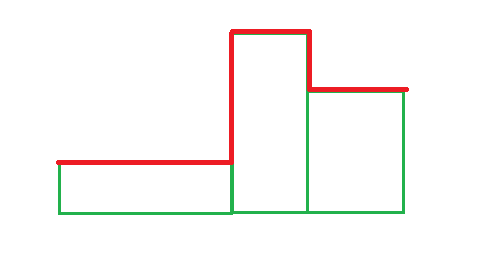
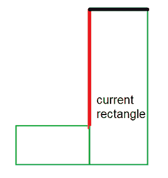

# 水平或垂直放置给定 N 个矩形形成的上边界长度最大化

> 原文:[https://www . geeksforgeeks . org/最大化水平或垂直放置给定 n 个矩形形成的上边界长度/](https://www.geeksforgeeks.org/maximize-the-length-of-upper-boundary-formed-by-placing-given-n-rectangles-horizontally-or-vertically/)

给定表示从 **1** 到 **N** 编号的 **N** 矩形的宽度和高度的成对、 **V[]** 向量，这些矩形被放置成与水平轴接触，并且按照数字顺序从左到右相邻。任务是找出水平或垂直放置每个矩形所形成的上边界的最大长度。



红线表示图的上边界

**示例:**

> **输入:** N = 5，V[] = {{2，5}，{3，8}，{1，10}，{7，14}，{2，5}}
> **输出:** 68
> **解释:**将第一个和第三个矩形垂直放置，其他所有矩形水平放置，得到上边界的最大长度。(5 + 6 + 3 + 7 + 10 + 13 + 7 + 12 + 5 = 68)
> 
> **输入:** N = 1，V[] = {{8，7}}
> **输出:** 8
> **说明:**将唯一的矩形水平放置，使上界长度变为 8。

**天真方法:**最简单的方法是使用[递归](https://www.geeksforgeeks.org/recursion/)通过水平或垂直放置每个矩形来尝试所有可能性。对于每个矩形，有两种选择:水平放置当前矩形或垂直放置当前矩形。打印所有可能性中的最大边界长度。

***时间复杂度:**O(2<sup>N</sup>)*
***辅助空间:** O(1)*

**高效方法:**优化上述方法，思路是使用[动态规划](https://www.geeksforgeeks.org/dynamic-programming/)，因为问题有[重叠子问题](https://www.geeksforgeeks.org/overlapping-subproblems-property-in-dynamic-programming-dp-1/)和[最优子结构属性](https://www.geeksforgeeks.org/optimal-substructure-property-in-dynamic-programming-dp-2/)。每个过渡状态都有两个选项:

1.  水平放置当前过渡状态的矩形
2.  将当前过渡状态的矩形垂直放置

现在，假设矩形水平放置，那么它在上边界贡献它的宽度。现在对于这个矩形，先前的状态矩形要么在水平位置，要么在垂直位置。如果前一个矩形处于水平位置或垂直位置，则通过减去两个矩形的边缘来计算当前矩形的左垂直边缘的贡献。



红线显示当前矩形垂直边缘的贡献，黑线显示当前矩形水平边缘在整个边界中的贡献。

让我们定义 **dp[i][0]** 为第一个 **i** 矩形的最大上边界，如果**带**矩形水平放置，定义 **dp[i][1]** 为第一个 **i** 矩形的最大上边界，如果**带**矩形垂直放置。过渡定义为:

> 设 height 1 = | V[I–1]。第二–V[I]。第二|和高度 2 = | V[I–1]。第一–V[I]。第二|
> 然后，**DP[I][0]= max(height 1+DP[I-1][0]，height2+dp[i-1][1])+V[i]。第一**
> 
> 设 vertical1 = |V[i]。第一个–V[I-1]。第二|和垂直 2 = | V[i]。第一–V[I–1]。首先|
> 然后**DP[I][1]= max(vertical 1+DP[I-1][0]，vertical2 + dp[i-1][1]) + V[i]。第二**

按照以下步骤解决问题:

*   初始化一个大小为 **N*2** 的[二维数组](https://www.geeksforgeeks.org/multidimensional-arrays-in-java/) **dp[][]** 。初始化 **dp[0][0] = V[0]。首先**和 **dp[0][1] = V[0]。第二**。
*   使用变量 **i** 遍历范围**【1，N】**，并遵循以下步骤:
    *   初始化变量**高度 1** =绝对差值**V【I-1】。第二**和**V【I】。第二**和**高度 2**= V【I-1】的**绝对差。首先**和**V【I】。第二**。同时将 **dp[i][0]** 的值更新为 **V[i]。首先**。
    *   将**最大值(DP[I-1][0]+高度 1，DP[I-1][1]+高度 2)** 加到 dp[i][0]的值上。
    *   将 **dp[i][1]** 初始化为 **V[i]。第二**。同时初始化变量**垂直 1**= V【I-1】的绝对差值**。首先**和**V【I】。首先**和**垂直 2**=**V【I-1】的绝对差。首先**和**V【I】。首先**。
    *   将最大值**(DP[I-1][0]+垂直 1，DP[I-1][1]+垂直 2)** 加到 **dp[i][1]** 的值上。
*   完成上述步骤后，打印 **max(dp[N-1][0]、dp[N-1][1])** 的值。

下面是上述方法的实现:

## C++

```
// C++ program for the above approach
#include <bits/stdc++.h>
using namespace std;

// Function to find maximum length of the upper
// boundary formed by placing each of the
// rectangles either horizontally or vertically
void maxBoundary(int N, vector<pair<int, int> > V)
{

    // Stores the intermediate
    // transition states
    int dp[N][2];
    memset(dp, 0, sizeof(dp));

    // Place the first rectangle
    // horizontally
    dp[0][0] = V[0].first;

    // Place the first rectangle
    // vertically
    dp[0][1] = V[0].second;

    for (int i = 1; i < N; i++) {

        // Place horizontally
        dp[i][0] = V[i].first;

        // Stores the difference in height of
        // current and previous rectangle
        int height1 = abs(V[i - 1].second - V[i].second);
        int height2 = abs(V[i - 1].first - V[i].second);

        // Take maximum out of two options
        dp[i][0] += max(height1 + dp[i - 1][0],
                        height2 + dp[i - 1][1]);

        // Place Vertically
        dp[i][1] = V[i].second;

        // Stores the difference in height of
        // current and previous rectangle
        int vertical1 = abs(V[i].first - V[i - 1].second);
        int vertical2 = abs(V[i].first - V[i - 1].first);

        // Take maximum out two options
        dp[i][1] += max(vertical1 + dp[i - 1][0],
                        vertical2 + dp[i - 1][1]);
    }

    // Print maximum of horizontal or vertical
    // alignment of the last rectangle
    cout << max(dp[N - 1][0], dp[N - 1][1]);
}

// Driver Code
int main()
{

    int N = 5;
    vector<pair<int, int> > V
        = { { 2, 5 }, { 3, 8 }, { 1, 10 }, { 7, 14 }, { 2, 5 } };

    maxBoundary(N, V);
    return 0;
}
```

## Java 语言(一种计算机语言，尤用于创建网站)

```
// Java program for the above approach
import java.util.Vector;

public class GFG {
    public static class pair {
        private int first;
        private int second;

        public pair(int first, int second)
        {
            this.first = first;
            this.second = second;
        }
    }
    // Function to find maximum length of the upper
    // boundary formed by placing each of the
    // rectangles either horizontally or vertically
    static void maxBoundary(int N, Vector<pair> V)
    {

        // Stores the intermediate
        // transition states
        int dp[][] = new int[N][2];

        // Place the first rectangle
        // horizontally
        dp[0][0] = V.get(0).first;

        // Place the first rectangle
        // vertically
        dp[0][1] = V.get(0).second;

        for (int i = 1; i < N; i++) {

            // Place horizontally
            dp[i][0] = V.get(i).first;

            // Stores the difference in height of
            // current and previous rectangle
            int height1 = Math.abs(V.get(i - 1).second
                                   - V.get(i).second);
            int height2 = Math.abs(V.get(i - 1).first
                                   - V.get(i).second);

            // Take maximum out of two options
            dp[i][0] += Math.max(height1 + dp[i - 1][0],
                                 height2 + dp[i - 1][1]);

            // Place Vertically
            dp[i][1] = V.get(i).second;

            // Stores the difference in height of
            // current and previous rectangle
            int vertical1 = Math.abs(V.get(i).first
                                     - V.get(i - 1).second);
            int vertical2 = Math.abs(V.get(i).first
                                     - V.get(i - 1).first);

            // Take maximum out two options
            dp[i][1] += Math.max(vertical1 + dp[i - 1][0],
                                 vertical2 + dp[i - 1][1]);
        }

        // Print maximum of horizontal or vertical
        // alignment of the last rectangle
        System.out.println(
            Math.max(dp[N - 1][0], dp[N - 1][1]));
    }

    // Driver code
    public static void main(String[] args)
    {
        int N = 5;

        Vector<pair> V = new Vector<>();
        V.add(new pair(2, 5));
        V.add(new pair(3, 8));
        V.add(new pair(1, 10));
        V.add(new pair(7, 14));
        V.add(new pair(2, 5));

        maxBoundary(N, V);
    }
}

// This code is contributed by abhinavjain194
```

## 蟒蛇 3

```
# Python 3 program for the above approach

# Function to find maximum length of the upper
# boundary formed by placing each of the
# rectangles either horizontally or vertically
def maxBoundary(N, V):

    # Stores the intermediate
    # transition states
    dp = [[0 for i in range(2)] for j in range(N)]

    # Place the first rectangle
    # horizontally
    dp[0][0] = V[0][0]

    # Place the first rectangle
    # vertically
    dp[0][1] = V[0][1]

    for i in range(1, N, 1):

        # Place horizontally
        dp[i][0] = V[i][0]

        # Stores the difference in height of
        # current and previous rectangle
        height1 = abs(V[i - 1][1] - V[i][1])
        height2 = abs(V[i - 1][0] - V[i][1])

        # Take maximum out of two options
        dp[i][0] += max(height1 + dp[i - 1][0], height2 + dp[i - 1][1])

        # Place Vertically
        dp[i][1] = V[i][1]

        # Stores the difference in height of
        # current and previous rectangle
        vertical1 = abs(V[i][0] - V[i - 1][1]);
        vertical2 = abs(V[i][0] - V[i - 1][1]);

        # Take maximum out two options
        dp[i][1] += max(vertical1 + dp[i - 1][0], vertical2 + dp[i - 1][1])

    # Print maximum of horizontal or vertical
    # alignment of the last rectangle
    print(max(dp[N - 1][0], dp[N - 1][1])-1)

# Driver Code
if __name__ == '__main__':
    N = 5
    V = [[2, 5],[3, 8],[1, 10],[7, 14],[2, 5]]
    maxBoundary(N, V)

    # This code is contributed by SURENDRA_GANGWAR.
```

## C#

```
// C# program for the above approach
using System;
using System.Collections.Generic;
class GFG {

    // Function to find maximum length of the upper
    // boundary formed by placing each of the
    // rectangles either horizontally or vertically
    static void maxBoundary(int N, List<Tuple<int,int>> V)
    {

        // Stores the intermediate
        // transition states
        int[,] dp = new int[N,2];

        // Place the first rectangle
        // horizontally
        dp[0,0] = V[0].Item1;

        // Place the first rectangle
        // vertically
        dp[0,1] = V[0].Item2;

        for (int i = 1; i < N; i++) {

            // Place horizontally
            dp[i,0] = V[i].Item1;

            // Stores the difference in height of
            // current and previous rectangle
            int height1 = Math.Abs(V[i - 1].Item2
                                   - V[i].Item2);
            int height2 = Math.Abs(V[i - 1].Item1
                                   - V[i].Item2);

            // Take maximum out of two options
            dp[i,0] += Math.Max(height1 + dp[i - 1,0],
                                 height2 + dp[i - 1,1]);

            // Place Vertically
            dp[i,1] = V[i].Item2;

            // Stores the difference in height of
            // current and previous rectangle
            int vertical1 = Math.Abs(V[i].Item1
                                     - V[i - 1].Item2);
            int vertical2 = Math.Abs(V[i].Item1
                                     - V[i - 1].Item1);

            // Take maximum out two options
            dp[i,1] += Math.Max(vertical1 + dp[i - 1,0],
                                 vertical2 + dp[i - 1,1]);
        }

        // Print maximum of horizontal or vertical
        // alignment of the last rectangle
        Console.WriteLine(Math.Max(dp[N - 1,0], dp[N - 1,1]));
    }

  static void Main()
  {
    int N = 5;

    List<Tuple<int,int>> V = new List<Tuple<int,int>>();
    V.Add(new Tuple<int,int>(2, 5));
    V.Add(new Tuple<int,int>(3, 8));
    V.Add(new Tuple<int,int>(1, 10));
    V.Add(new Tuple<int,int>(7, 14));
    V.Add(new Tuple<int,int>(2, 5));

    maxBoundary(N, V);
  }
}

// This code is contributed by divyeshrabadiya07.
```

## java 描述语言

```
<script>
// Javascript program for the above approach

// Function to find maximum length of the upper
// boundary formed by placing each of the
// rectangles either horizontally or vertically
function maxBoundary(N, V)
{

  // Stores the intermediate
  // transition states
  let dp = new Array(N).fill(0).map(() => new Array(2).fill(0));

  // Place the first rectangle
  // horizontally
  dp[0][0] = V[0][0];

  // Place the first rectangle
  // vertically
  dp[0][1] = V[0][1];

  for (let i = 1; i < N; i++)
  {

    // Place horizontally
    dp[i][0] = V[i][0];

    // Stores the difference in height of
    // current and previous rectangle
    let height1 = Math.abs(V[i - 1][1] - V[i][1]);
    let height2 = Math.abs(V[i - 1][0] - V[i][1]);

    // Take maximum out of two options
    dp[i][0] += Math.max(height1 + dp[i - 1][0], height2 + dp[i - 1][1]);

    // Place Vertically
    dp[i][1] = V[i][1];

    // Stores the difference in height of
    // current and previous rectangle
    let vertical1 = Math.abs(V[i][0] - V[i - 1][1]);
    let vertical2 = Math.abs(V[i][0] - V[i - 1][0]);

    // Take maximum out two options
    dp[i][1] += Math.max(vertical1 + dp[i - 1][0], vertical2 + dp[i - 1][1]);
  }

  // Print maximum of horizontal or vertical
  // alignment of the last rectangle
  document.write(Math.max(dp[N - 1][0], dp[N - 1][1]));
}

// Driver Code
let N = 5;
let V = [
  [2, 5],
  [3, 8],
  [1, 10],
  [7, 14],
  [2, 5],
];

maxBoundary(N, V);

// This code is contributed by gfgking.
</script>
```

**Output**

```
68
```

***时间复杂度:**O(N)*
T5**辅助空间:** O(N)