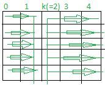

# 最大化矩阵第 k 列的和

> 原文:[https://www . geeksforgeeks . org/最大化矩阵的第 k 列总和/](https://www.geeksforgeeks.org/maximize-the-sum-of-kth-column-of-a-matrix/)

给定两个整数 **N** 和 **K** ，任务是最大化由范围**【1，N<sup>2</sup>**中的元素组成的 **N * N** [行排序矩阵](https://www.geeksforgeeks.org/row-wise-sorting-2d-array/)的 K <sup>第</sup>列的和。

**示例:**

> **输入:** N = 2，K = 2
> **输出:** {{1，3}，{2，4}}
> **解释:**可能的行排序矩阵是[{{1，2}，{3，4}}，{{1，3}，{2，4}}，{{1，4}，{2，3}}，{{3，4}，{1，2}，{{2，4}，{1，4}}，{{2，4}，{1，3}
> 因此，可能的输出之一是{{1，3}，{2，4}}。
> 
> ***输入:*** N *= 3，K = 2*
> **输出:** {{1，4，5}，{2，6，7}，{3，8，9}

**方法:**这里的思想是首先用范围**【1，N *(K–1)】**中的值填充矩阵中小于 **K <sup>第</sup>列的索引，然后用范围**【N *(K–1)+1，N<sup>2</sup>**中的值填充大于或等于 k <sup>第</sup>列的所有元素，如下图所示**

[](https://media.geeksforgeeks.org/wp-content/cdn-uploads/20200915092309/maximum-kth-column.png)

按照以下步骤解决问题:

1.  用范围**【1，N *(K–1)】中的值填充矩阵中小于 **K** 的所有列。**
2.  然后，用范围**【N *(K–1)+1，N * N】**中的值填充大于或等于 **K** 的矩阵列。
3.  最后，打印矩阵。

下面是上述方法的实现:

## C++

```
// C++ program to implement
// the above approach

#include <bits/stdc++.h>
using namespace std;

// Function to maximize the Kth column sum
int** findMatrix(int N, int K)
{

    // Store all the elements of the
    // resultant matrix of size N*N
    int** mat = (int**)malloc(
        N * sizeof(int*));

    for (int i = 0; i < N; ++i) {
        mat[i] = (int*)malloc(
            N * sizeof(int));
    }

    // Store value of each
    // elements of the matrix
    int element = 1;

    // Fill all the columns < K
    for (int i = 0; i < N; ++i) {

        for (int j = 0; j < K - 1; ++j) {
            mat[i][j] = element++;
        }
    }

    // Fill all the columns >= K
    for (int i = 0; i < N; ++i) {

        for (int j = K - 1; j < N; ++j) {
            mat[i][j] = element++;
        }
    }

    return mat;
}

// Function to print the matrix
void printMatrix(int** mat, int N)
{

    for (int i = 0; i < N; ++i) {
        for (int j = 0; j < N; ++j) {
            cout << mat[i][j] << " ";
        }
        cout << endl;
    }
}

// Driver Code
int main()
{

    int N = 3, K = 2;
    int** mat = findMatrix(N, K);

    printMatrix(mat, N);
}
```

## Java 语言(一种计算机语言，尤用于创建网站)

```
// Java program to implement
// the above approach
class GFG{

// Function to maximize the Kth column sum
static int [][]findMatrix(int N, int K)
{

    // Store all the elements of the
    // resultant matrix of size N*N
    int [][]mat = new int[N][N];

    // Store value of each
    // elements of the matrix
    int element = 1;

    // Fill all the columns < K
    for(int i = 0; i < N; ++i)
    {
        for(int j = 0; j < K - 1; ++j)
        {
            mat[i][j] = element++;
        }
    }

    // Fill all the columns >= K
    for(int i = 0; i < N; ++i)
    {
        for(int j = K - 1; j < N; ++j)
        {
            mat[i][j] = element++;
        }
    }
    return mat;
}

// Function to print the matrix
static void printMatrix(int [][]mat, int N)
{
    for(int i = 0; i < N; ++i)
    {
        for(int j = 0; j < N; ++j)
        {
            System.out.print(mat[i][j] + " ");
        }
        System.out.println();
    }
}

// Driver Code
public static void main(String[] args)
{
    int N = 3, K = 2;
    int [][]mat = findMatrix(N, K);

    printMatrix(mat, N);
}
}

// This code is contributed by Amit Katiyar
```

## 蟒蛇 3

```
# Python3 program to implement
# the above approach

# Function to maximize the Kth
# column sum
def findMatrix(N, K):

    # Store all the elements of the
    # resultant matrix of size N*N
    mat = [[0 for i in range(N)]
              for j in range(N)];

    # Store value of each
    # elements of the matrix
    element = 0;

    # Fill all the columns < K
    for i in range(0, N):
        for j in range(0, K - 1):
            element += 1;
            mat[i][j] = element;

    # Fill all the columns >= K
    for i in range(0, N):
        for j in range(K - 1, N):
            element += 1;
            mat[i][j] = element;

    return mat;

# Function to print the matrix
def printMatrix(mat, N):

    for i in range(0, N):
        for j in range(0, N):
            print(mat[i][j], end = " ");

        print();

# Driver Code
if __name__ == '__main__':

    N = 3; K = 2;
    mat = findMatrix(N, K);

    printMatrix(mat, N);

# This code is contributed by Amit Katiyar
```

## C#

```
// C# program to implement
// the above approach
using System;

class GFG{

// Function to maximize the Kth column sum
static int [,]findMatrix(int N, int K)
{

    // Store all the elements of the
    // resultant matrix of size N*N
    int [,]mat = new int[N, N];

    // Store value of each
    // elements of the matrix
    int element = 1;

    // Fill all the columns < K
    for(int i = 0; i < N; ++i)
    {
        for(int j = 0; j < K - 1; ++j)
        {
            mat[i, j] = element++;
        }
    }

    // Fill all the columns >= K
    for(int i = 0; i < N; ++i)
    {
        for(int j = K - 1; j < N; ++j)
        {
            mat[i, j] = element++;
        }
    }
    return mat;
}

// Function to print the matrix
static void printMatrix(int [,]mat, int N)
{
    for(int i = 0; i < N; ++i)
    {
        for(int j = 0; j < N; ++j)
        {
            Console.Write(mat[i, j] + " ");
        }
        Console.WriteLine();
    }
}

// Driver Code
public static void Main(String[] args)
{
    int N = 3, K = 2;
    int [,]mat = findMatrix(N, K);

    printMatrix(mat, N);
}
}

// This code is contributed by Amit Katiyar
```

## java 描述语言

```
<script>

// JavaScript program to implement
// the above approach

// Function to maximize the Kth column sum
function findMatrix(N, K)
{

    // Store all the elements of the
    // resultant matrix of size N*N
    let mat =  new Array(N);

    // Loop to create 2D array using 1D array
    for(var i = 0; i < mat.length; i++)
    {
        mat[i] = new Array(2);
    }

    // Store value of each
    // elements of the matrix
    let element = 1;

    // Fill all the columns < K
    for(let i = 0; i < N; ++i)
    {
        for(let j = 0; j < K - 1; ++j)
        {
            mat[i][j] = element++;
        }
    }

    // Fill all the columns >= K
    for(let i = 0; i < N; ++i)
    {
        for(let j = K - 1; j < N; ++j)
        {
            mat[i][j] = element++;
        }
    }
    return mat;
}

// Function to prlet the matrix
function prletMatrix(mat, N)
{
    for(let i = 0; i < N; ++i)
    {
        for(let j = 0; j < N; ++j)
        {
            document.write(mat[i][j] + " ");
        }
        document.write("<br/>");
    }
}

// Driver code
let N = 3, K = 2;
let mat = findMatrix(N, K);

prletMatrix(mat, N);

// This code is contributed by souravghosh0416

</script>
```

**Output:** 

```
1 4 5 
2 6 7 
3 8 9
```

***时间复杂度:**O(N<sup>2</sup>)*
***辅助空间:** O(N <sup>2</sup> )*